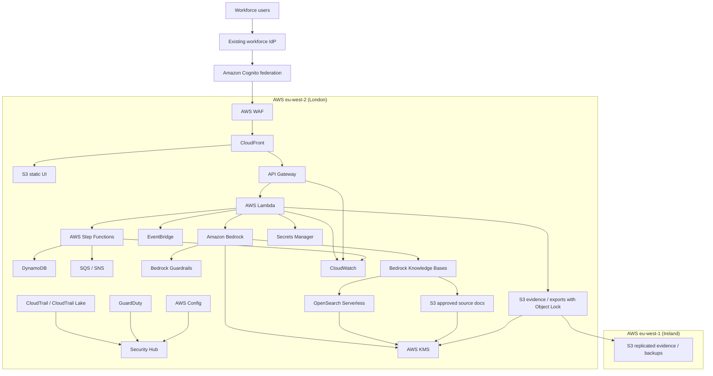

# AWS Technology Research: GenAI for UK Policing

> **Template Origin**: Official | **ArcKit Version**: 4.0.0 | **Command**: `$arckit-aws-research`

## Document Control

| Field | Value |
|-------|-------|
| **Document ID** | ARC-001-AWRS-v1.0 |
| **Document Type** | AWS Technology Research |
| **Project** | GenAI for UK Policing (Project 001) |
| **Classification** | OFFICIAL |
| **Status** | DRAFT |
| **Version** | 1.0 |
| **Created Date** | 2026-03-07 |
| **Last Modified** | 2026-03-07 |
| **Review Cycle** | Monthly |
| **Next Review Date** | 2026-04-06 |
| **Owner** | Enterprise Architect, GenAI for UK Policing |
| **Reviewed By** | PENDING |
| **Approved By** | PENDING |
| **Distribution** | Architecture Team, Security, Service Owner, Product Team, Data Protection, Delivery Team |

## Revision History

| Version | Date | Author | Changes | Approved By | Approval Date |
|---------|------|--------|---------|-------------|---------------|
| 1.0 | 2026-03-07 | ArcKit AI | Initial AWS technology research from `$arckit-aws-research` | PENDING | PENDING |

---

## Executive Summary

### Research Scope

This document maps the current GenAI for UK Policing requirements to AWS services, deployment
patterns, and control options using official AWS documentation and AWS Knowledge MCP sources.

**Requirements Analyzed**: 10 functional, 20 non-functional, 6 integration, 6 data requirements

**AWS Services Evaluated**: 22 AWS services across 5 categories

**Research Sources**: AWS Prescriptive Guidance, AWS service documentation, AWS Well-Architected
Framework, AWS pricing pages, AWS Security Hub documentation, AWS Public Sector guidance

**External AWS Documents Found in `external/`**: None beyond the placeholder README. This did not
block the research, but it limits the ability to tailor costs to an existing estate.

### Key Recommendations

| Requirement Category | Recommended AWS Service | Tier / Pattern | Monthly Estimate (USD) |
|---------------------|-------------------------|----------------|------------------------|
| AI / RAG | Amazon Bedrock, Bedrock Knowledge Bases, Bedrock Guardrails, Titan Text Embeddings V2 | On-Demand, in-region only | $1,550 |
| Application / workflow | Amazon API Gateway, AWS Lambda, AWS Step Functions, Amazon DynamoDB, Amazon EventBridge | Serverless event-driven | $265 |
| Search / content storage | Amazon OpenSearch Serverless, Amazon S3, S3 Object Lock | Serverless vector search | $740 |
| Identity / access | Amazon Cognito federated to workforce IdP, AWS IAM Identity Center for admin access | Federated, MFA-backed | $95 |
| Security / observability | Amazon CloudWatch, AWS CloudTrail, AWS Security Hub, Amazon GuardDuty, AWS Config, AWS WAF, AWS KMS, AWS Secrets Manager | Centralized security baseline | $250 |
| **Estimated pilot total** | **Combined platform** | **eu-west-2 primary, eu-west-1 DR storage / backup** | **$2,900 / month** |

**Cost basis**:

- The query-plane estimate scales the official AWS "highly scalable generative AI query engine"
  example from 8,000 to 25,000 daily interactions.
- The vector-store estimate uses the official OpenSearch Serverless sample minimum and the AWS
  solution estimate for Bedrock Knowledge Bases with OpenSearch Serverless backing storage.
- The estimate excludes enterprise support, workforce IdP licensing, SIEM licensing, Direct
  Connect, custom partner integrations, and force-specific onboarding effort.

### Architecture Pattern

**Recommended Pattern**: Serverless RAG with human-in-the-loop approval and immutable audit trail

**Reference Architecture**:

- AWS Prescriptive Guidance: Designing serverless AI architectures
- AWS Prescriptive Guidance: Knowledge bases for Amazon Bedrock
- AWS Prescriptive Guidance: Providing secure access to data and systems for generative AI

### UK Government Suitability

| Criteria | Status | Notes |
|----------|--------|-------|
| **UK Region Availability** | YES | Core services validated in `eu-west-2` (London) |
| **DR Region Option** | YES | Core services also available in `eu-west-1` (Ireland) |
| **G-Cloud Listing** | YES | Amazon Web Services appears on G-Cloud 14 (`RM1557.14`) via Digital Marketplace |
| **Data Classification** | CONDITIONAL | Architectural inference: suitable for OFFICIAL workloads and some OFFICIAL-SENSITIVE use with additional controls; SECRET workloads should not be placed on this public AWS design |
| **Data Residency** | CONDITIONAL | Keep steady-state inference and storage in London; avoid Bedrock cross-Region inference by default because AWS notes it can share data across Regions |
| **NCSC / assurance fit** | CONDITIONAL | AWS provides UK public sector security guidance and assurance material, but the programme still needs a force-specific assurance pack, DPIA, and legal review |

---

## Service Selection Summary

### Consolidated service map

| Category | Primary recommendation | Why it fits | Key requirements addressed |
|----------|------------------------|-------------|-----------------------------|
| AI / inference | Amazon Bedrock | Managed FM access without customer-managed model hosting; in-region model choice; supports Guardrails and Knowledge Bases | FR-002, FR-004, FR-005, NFR-P-001, NFR-A-003 |
| Retrieval / grounding | Bedrock Knowledge Bases + OpenSearch Serverless | Managed RAG workflow, citations, metadata filtering, incremental sync from S3 | FR-002, FR-004, FR-005, DR-001, DR-004 |
| Human approval | AWS Step Functions Standard | Long-running workflows with explicit wait states and human approval | FR-003, FR-006, FR-009 |
| API / business logic | API Gateway + Lambda | Low-ops, elastic scaling, versioned interfaces, strong auth and logging patterns | NFR-P-002, NFR-I-001, INT-002, INT-003 |
| Operational metadata | Amazon DynamoDB | Fast key-value access for workflow state, approvals, force profiles, quality signals | FR-007, FR-008, DR-002, DR-005 |
| Content / evidence store | Amazon S3 + S3 Object Lock | Durable object storage, lifecycle control, legal-hold friendly evidence packaging | NFR-C-002, NFR-C-004, INT-006 |
| Identity | Amazon Cognito federation + IAM Identity Center | Federated app auth plus recommended multi-account admin access pattern | INT-001, NFR-SEC-001, NFR-SEC-002 |
| Security baseline | Security Hub, GuardDuty, Config, WAF, KMS, Secrets Manager, CloudTrail, CloudWatch | Centralized posture, threat detection, immutable audit, managed secrets and keys | NFR-SEC-003 through NFR-SEC-005, INT-004 |

### Shortlisted service comparison

| Category | Service | Key features | Pricing model | Suitability |
|----------|---------|--------------|---------------|-------------|
| AI / RAG | Amazon Bedrock + Knowledge Bases + Guardrails | Managed RAG, citations, metadata filters, grounding checks, PII masking | Per token plus backing vector store | Best fit for phase 1 |
| AI / RAG alternative | Bedrock + custom retriever stack | More custom retrieval control, more engineering freedom | Token pricing plus custom runtime / vector store cost | Use only if KB limits become material |
| Vector store | OpenSearch Serverless | Auto-scaling vector search, encryption always on, high availability | OCU-hours plus storage | Best fit for uneven search workloads |
| Vector store alternative | Aurora PostgreSQL pgvector | SQL plus vectors, easier relational joins | DB instance / serverless capacity plus storage | Best if relational joins dominate |
| App runtime | API Gateway + Lambda + Step Functions | Fast pilot path, human approval, low ops | Request, duration, state transitions | Best fit for current scale |
| App runtime alternative | ECS on Fargate | Custom containers, long-running processes | vCPU, memory, storage duration | Keep for later specialist needs |
| App identity | Cognito federation | SAML / OIDC federation, JWTs, MFA support, app-ready auth | Active user and feature based | Best fit for custom app sign-in |
| Admin identity | IAM Identity Center | Centralized workforce access, temporary credentials, MFA | Included service pattern | Best fit for AWS account access |

### Recommended operating assumptions

- Primary Region: `eu-west-2` (London)
- DR Region: `eu-west-1` (Ireland) for replicated evidence, backups, and failover preparation
- Multi-account landing zone: `security`, `shared-services`, `dev`, `test`, `prod`
- No cross-Region inference in normal operation
- No fine-tuning on policing data in phase 1; use RAG rather than model customization
- Human approval remains mandatory for sensitive workflows

---

## AWS Services Analysis

### Category 1: AI / retrieval-augmented generation

**Requirements Addressed**: FR-002, FR-004, FR-005, FR-006, FR-009, NFR-P-001, NFR-C-001,
DR-001, DR-004

**Why This Category**: The core service objective is not free-form AI generation. It is bounded,
source-backed drafting and answering with provenance, uncertainty handling, and policy guardrails.

#### Recommended: Amazon Bedrock + Bedrock Knowledge Bases + Bedrock Guardrails

**Service Overview**:

- **Full Name**: Amazon Bedrock with Knowledge Bases and Guardrails
- **Category**: AI / RAG / Responsible AI controls
- **Documentation**:
  - `https://docs.aws.amazon.com/bedrock/latest/userguide/knowledge-base.html`
  - `https://docs.aws.amazon.com/bedrock/latest/userguide/guardrails.html`

**Why it fits the requirements**:

- Bedrock Knowledge Bases supports `Retrieve` and `RetrieveAndGenerate`, citations, source-backed
  answers, incremental sync, and metadata filtering.
- AWS documentation states that Knowledge Bases can include citations in generated responses and
  use source attribution to improve transparency and reduce hallucinations.
- Bedrock Guardrails provides content filters, denied topics, PII masking, contextual grounding
  checks, and automated reasoning checks.
- AWS security guidance explicitly recommends RAG over fine-tuning on sensitive data when tighter
  control, visibility, and data governance are required.

**Configuration for this project**:

- Inference model class:
  - `Amazon Nova Pro` for complex summarization and synthesis
  - `Amazon Nova Micro` or equivalent lower-cost model for lower-risk classification and prompt
    utilities where quality thresholds permit
- Retrieval:
  - Bedrock Knowledge Base over approved S3 source repositories
  - Metadata filters by force, workflow, document status, sensitivity band, and repository owner
- Guardrails:
  - Denied topics for prohibited policing uses
  - PII masking for prompts and outputs
  - Contextual grounding enabled for RAG answers
  - Prompt attack filtering enabled
- Data policy:
  - Disable cross-Region inference in production
  - No training or fine-tuning on operational policing content in phase 1

**Estimated Cost for This Project**:

| Resource | Configuration | Monthly Cost (USD) | Notes |
|----------|---------------|--------------------|-------|
| Bedrock inference | 25,000 daily interactions, scaled from AWS reference cost model | $1,520 | Based on the official AWS solution example that prices Nova Pro for 8,000 daily interactions |
| Bedrock embeddings | Titan Text Embeddings V2 for KB query-time embedding | $30 | Scaled from AWS sample cost of $9 for 8,000 daily queries |
| Guardrails | PII + denied topics + grounding checks | $0-100 | Highly workload-dependent; hold as contingency until prompt volumes are measured |
| **Total** |  | **$1,550-1,650** | |

**AWS Well-Architected Assessment**:

| Pillar | Rating | Notes |
|--------|--------|-------|
| **Operational Excellence** | Strong | Managed model access reduces operational burden; prompt, policy, and workflow assets still need version control |
| **Security** | Strong | Guardrails, KMS encryption, metadata filtering, private integrations, and no default cross-Region inference |
| **Reliability** | Medium-Strong | Multiple models can be substituted; fallback path still required when retrieval or model inference fails |
| **Performance Efficiency** | Strong | Managed inference, scalable retrieval, and model-right-sizing across workflow classes |
| **Cost Optimization** | Medium-Strong | Use lower-cost models for low-risk tasks, prompt minimization, and prompt caching where applicable |
| **Sustainability** | Strong | Managed serverless components reduce idle compute and overprovisioning |

**Integration Capabilities**:

- `Retrieve` API for bespoke review workflows
- `RetrieveAndGenerate` for source-backed answer paths
- SDK support for Python, JavaScript, Java, .NET, Go, and others
- Native use with Step Functions and Lambda-based orchestration

**UK Region Availability**:

- `Amazon Bedrock`: available in `eu-west-2`
- Knowledge Bases supported models include `Amazon Nova Lite`, `Amazon Nova Micro`,
  `Amazon Nova Pro`, and `Anthropic Claude 3.7 Sonnet` in `eu-west-2`
- Guardrails-supported models include `Amazon Nova Lite`, `Amazon Nova Micro`,
  `Amazon Nova Pro`, and `Anthropic Claude 3.7 Sonnet` in `eu-west-2`

#### Alternative: Bedrock Knowledge Bases with Aurora PostgreSQL pgvector

Use this if the retrieval layer must join directly to relational case metadata or if the team
already runs a strong PostgreSQL operational pattern. It is less attractive for the initial
policing pilot because Bedrock plus OpenSearch Serverless is simpler to operate and aligns better
to search-heavy workloads.

#### Comparison Matrix

| Criteria | Bedrock KB + OpenSearch Serverless | Bedrock KB + Aurora pgvector | Winner |
|----------|------------------------------------|-------------------------------|--------|
| RAG implementation speed | High | Medium | Bedrock + OpenSearch |
| Search / analytics capability | High | Medium | Bedrock + OpenSearch |
| Relational joins | Low | High | Aurora pgvector |
| Elastic scaling for uneven workloads | High | Medium | Bedrock + OpenSearch |
| Ops overhead | Low | Medium | Bedrock + OpenSearch |
| Best fit for current requirements | High | Medium | Bedrock + OpenSearch |

**Recommendation**: Bedrock Knowledge Bases backed by OpenSearch Serverless is the best fit for
phase 1 because the workload is search- and provenance-centric rather than relationally complex.

---

### Category 2: Application, orchestration, and workflow control

**Requirements Addressed**: FR-003, FR-006, FR-007, FR-008, FR-009, NFR-P-002, NFR-A-003,
NFR-I-001, INT-002, INT-003, INT-005, INT-006

#### Recommended: Amazon API Gateway + AWS Lambda + AWS Step Functions + Amazon DynamoDB + Amazon EventBridge

**Why this fits**:

- AWS prescriptive guidance for serverless AI architectures maps the event/interface layer to API
  Gateway and EventBridge, the processing layer to Lambda and Step Functions, and the output
  layer to DynamoDB and S3.
- Step Functions Standard workflows are explicitly suited to workflows that wait for human
  approval.
- Lambda keeps the application stateless and scales with request volume, which aligns with the
  forecast growth from 25,000 to 150,000 daily requests over three years.
- DynamoDB is appropriate for workflow state, approvals, provenance pointers, force profiles, and
  quality signal capture.

**Suggested decomposition**:

- `API Gateway`:
  - public or workforce-restricted API facade
  - route-level auth and throttling
  - versioned interfaces
- `Lambda`:
  - input validation
  - authorization context resolution
  - Bedrock request shaping
  - export packaging
- `Step Functions Standard`:
  - sensitive workflow approval
  - supervisory routing
  - retry / compensation logic
  - manual fallback handling
- `DynamoDB`:
  - workflow state
  - output metadata
  - force configuration
  - quality-signal events
- `EventBridge`:
  - operational events
  - alert fan-out
  - integration into downstream assurance services
- `SQS / SNS`:
  - asynchronous notification and durable event decoupling

**Estimated Cost for This Project**:

| Resource | Configuration | Monthly Cost (USD) | Notes |
|----------|---------------|--------------------|-------|
| API Gateway | 25,000 daily requests, regional HTTP / WebSocket mix | $120 | Scaled from AWS solution sample |
| Lambda | Stateless orchestration and policy functions | $65 | Scaled from AWS solution sample |
| Step Functions | Human approval and sensitive workflow routing | $20 | Based on standard workflow state transition pricing and expected modest execution volume |
| DynamoDB | workflow state, metadata, conversation / disposition history | $40 | Scaled from AWS solution sample |
| EventBridge / SQS / SNS | alerts, async eventing, approvals | $20 | Contingency estimate |
| **Total** |  | **$265** | |

**Alternative: ECS on Fargate**

Choose ECS on Fargate only when one or more of these conditions become true:

- custom containers or native dependencies make Lambda impractical
- session-heavy streaming and connection management become dominant
- prompt / policy services need long-running processes or sidecars

For the current requirement set, Fargate increases operational surface area without solving a
clear phase-1 problem.

#### Comparison Matrix

| Criteria | API Gateway + Lambda + Step Functions | ECS on Fargate + ALB / API | Winner |
|----------|---------------------------------------|-----------------------------|--------|
| Time to pilot | High | Medium | Serverless |
| Human approval orchestration | High | Medium | Serverless |
| Operational overhead | Low | Medium | Serverless |
| Long-running custom runtime support | Medium | High | Fargate |
| Fit to current throughput | High | High | Serverless |

**Recommendation**: Use the serverless stack first and reserve Fargate for future specialized
runtime needs.

---

### Category 3: Identity and access

**Requirements Addressed**: INT-001, NFR-SEC-001, NFR-SEC-002, FR-008, FR-009

#### Recommended: Amazon Cognito for application federation + AWS IAM Identity Center for AWS admin access

**Why this fits**:

- AWS Well-Architected and IAM guidance recommend a centralized identity provider pattern.
- AWS prescriptive guidance recommends IAM Identity Center for workforce access to AWS
  applications and multi-account environments.
- Amazon Cognito supports federation to enterprise identity providers using SAML and OIDC and
  gives the application JWT-based identity and policy enforcement.

**Pattern**:

- End-user application access:
  - existing workforce IdP remains authoritative
  - Cognito acts as the federation hub for the custom application
  - role and group claims flow into application policy
- AWS administrative access:
  - IAM Identity Center for operators, developers, and administrators
  - temporary credentials, MFA, and centralized assignment model

**Important control note**:

If programme policy prohibits introducing Cognito as an identity broker, the fallback is direct
OIDC / SAML integration at the edge, but this usually creates more custom integration effort and
less portable application identity handling.

#### Comparison Matrix

| Criteria | Cognito federation for app + IAM Identity Center for AWS | Direct IAM federation / edge-only auth | Winner |
|----------|-----------------------------------------------------------|----------------------------------------|--------|
| App-ready JWTs and claim handling | High | Medium | Cognito + IIC |
| Multi-account admin model | High | Medium | Cognito + IIC |
| Custom application integration effort | Medium | Higher | Cognito + IIC |
| Strict reuse of existing workforce auth | High | High | Tie |

**Recommendation**: Use Cognito for application sign-in and IAM Identity Center for AWS access,
with the existing workforce IdP remaining the identity source of truth.

---

### Category 4: Data, storage, provenance, and retention

**Requirements Addressed**: DR-001 through DR-006, NFR-C-002, NFR-C-004, NFR-S-002, INT-006

#### Recommended: Amazon OpenSearch Serverless + Amazon S3 + S3 Object Lock + Amazon Athena

**Why this fits**:

- OpenSearch Serverless provides a fully managed serverless vector search layer with automatic
  scaling, required encryption, and high availability.
- S3 is the right durable store for approved source documents, export packages, and immutable
  retained evidence bundles.
- AWS Well-Architected logging guidance recommends S3 for long retention and Athena for query.
- S3 Object Lock and versioning help satisfy tamper-evidence and legal-hold needs for retained
  exports and evidence packs.

**Data placement**:

- `S3`:
  - approved source documents
  - final human-approved export bundles
  - immutable evidence snapshots
  - lifecycle-managed archives
- `OpenSearch Serverless`:
  - vector index for approved retrieval corpus
- `DynamoDB`:
  - operational metadata and workflow records
- `Athena`:
  - query long-retention logs and evidence indexes in S3

**Estimated Cost for This Project**:

| Resource | Configuration | Monthly Cost (USD) | Notes |
|----------|---------------|--------------------|-------|
| OpenSearch Serverless | basic production vector configuration | $691 | From official AWS solution cost example |
| S3 and replication | documents, exports, retention, DR copy | $35 | Small relative to vector compute at pilot scale |
| Athena | audit and export query usage | $14 | Light investigative query load assumption |
| **Total** |  | **$740** | |

**Alternative**: Amazon Aurora PostgreSQL with pgvector is better when strong relational joins and
SQL-centric operational reporting are first-class requirements. It is not the better phase-1
choice for this policing workload.

---

### Category 5: Security, audit, and operational assurance

**Requirements Addressed**: NFR-SEC-003, NFR-SEC-004, NFR-SEC-005, NFR-C-001, NFR-C-002,
NFR-M-001, INT-004

#### Recommended baseline

- `AWS KMS` for customer-managed encryption keys
- `AWS Secrets Manager` for runtime secrets
- `Amazon CloudWatch` for logs, metrics, alerts, and traces
- `AWS CloudTrail` plus `CloudTrail Lake` for AWS control-plane audit and up to seven-year
  retention where needed
- `AWS Security Hub` for centralized posture and control findings
- `Amazon GuardDuty` for threat analytics
- `AWS Config` for configuration compliance and drift evidence
- `AWS WAF` for web protection at the edge and API layer
- Optional:
  - `Amazon Macie` for source-bucket sensitive data discovery
  - `Amazon Comprehend` for document redaction / PII detection in pre-ingestion pipelines
  - `Amazon Security Lake` if a central OCSF-aligned security data lake is already planned

**Why this fits**:

- AWS security guidance for GenAI RAG explicitly recommends defense in depth at ingestion,
  storage, retrieval, and inference time.
- The same guidance recommends OpenSearch, S3, Comprehend, Macie, and KMS as relevant controls
  around secure RAG.
- CloudTrail plus S3 or CloudTrail Lake aligns well to the requirement for long-lived auditability.
- AWS Well-Architected SEC04-BP01 recommends selecting log sources, centralizing them, and
  retaining between three months and seven years depending on obligations.

**Estimated Cost for This Project**:

| Resource | Configuration | Monthly Cost (USD) | Notes |
|----------|---------------|--------------------|-------|
| CloudWatch | logs, metrics, alarms, dashboards | $30 | Scaled from AWS solution sample |
| CloudTrail / CloudTrail Lake | AWS control-plane audit and query | $40 | Depends on event volume and query intensity |
| Security Hub + GuardDuty + Config | posture and threat analytics baseline | $140 | Directional pilot allowance |
| WAF / KMS / Secrets Manager | edge protection and cryptographic controls | $40 | Directional pilot allowance |
| **Total** |  | **$250** | |

#### Security Hub alignment

The recommended pattern aligns well to Security Hub CSPM and AWS Foundational Security Best
Practices, especially:

- `APIGateway.1` and `APIGateway.9`: execution and access logging enabled
- `APIGateway.4`: WAF associated to API surfaces
- `APIGateway.8`: authorization configured on all routes
- `CloudFront.3`: encryption in transit
- `CloudFront.5`: logging enabled
- `CloudFront.6`: WAF enabled
- organization-wide posture management through Security Hub, GuardDuty, Config, CloudTrail, and
  KMS-backed encryption patterns

---

## Architecture Pattern

### Recommended AWS reference pattern

**Pattern Name**: London-region serverless RAG with human approval and immutable audit

**Pattern Description**:

This pattern separates the user interface, orchestration, inference, and evidence layers so the
programme can scale from assistive drafting to more tightly controlled review workflows without
changing the core architecture. It favors managed services over customer-operated clusters and
preserves replacement options by keeping workflow logic, prompts, guardrails, and knowledge-source
management distinct.

The design is intentionally conservative for UK policing. It keeps steady-state processing in
`eu-west-2`, uses Bedrock in-region only, and treats `eu-west-1` as a storage and recovery target
rather than a normal inference path. This supports privacy and sovereignty expectations while still
providing a plausible route to the required RPO and RTO targets.

### Architecture Diagram

### Component Mapping

| Component | AWS Service | Purpose | Configuration |
|-----------|-------------|---------|---------------|
| Edge protection | AWS WAF | Protect UI and API surfaces | Managed rule sets plus policing-specific allow / deny lists |
| User experience | CloudFront + S3 | Deliver workforce UI | Private origin, HTTPS only |
| App authentication | Amazon Cognito | Federated application auth | SAML / OIDC to workforce IdP, MFA inherited from IdP |
| API | API Gateway | Versioned API front door | Regional endpoints, authorizers, throttling |
| Stateless logic | AWS Lambda | Validation, orchestration, Bedrock integration | Least-privilege functions with structured logging |
| Approval workflow | AWS Step Functions | Human review and compensating logic | Standard workflows for long-running approval states |
| Operational state | DynamoDB | Workflow state, force profile, review metadata | On-demand or autoscaled throughput |
| Event fan-out | EventBridge, SQS, SNS | Async operations and alerts | Decoupled delivery and retry |
| LLM / inference | Amazon Bedrock | Managed FM access | In-region models only for production |
| Safety controls | Bedrock Guardrails | PII, denied topics, grounding, prompt attack defense | Versioned guardrails per workflow class |
| Retrieval | Bedrock Knowledge Bases | Managed RAG pipeline | S3 sources, metadata filters, citations |
| Vector store | OpenSearch Serverless | Semantic search over approved corpus | Vector collection with KMS key and max OCU cap |
| Source store | S3 | Approved repositories and sync source | Versioning, lifecycle, replication where required |
| Evidence store | S3 + Object Lock | Immutable exports and retained evidence bundles | Legal hold and retention controls |
| Crypto | KMS | Encryption keys | Customer-managed keys by environment and data class |
| Secrets | Secrets Manager | Rotated credentials and config secrets | Automated rotation where supported |
| Telemetry | CloudWatch | Metrics, logs, alarms, dashboards | Structured log schema and workflow KPIs |
| Audit | CloudTrail / CloudTrail Lake | AWS API audit and long retention | Org trails and SQL query where needed |
| Security posture | Security Hub / GuardDuty / Config | Control findings and threat analytics | Centralized delegated admin model |

---

## Reliability, performance, and DR considerations

### Reliability

- Meet the `> 99.9%` availability target with multi-AZ managed services and no single self-managed
  compute tier.
- Use Step Functions retries and explicit compensation for integration failures.
- Provide manual fallback routes when generation, retrieval, or approval services are unavailable.
- Keep prompts, workflow policy, and force configuration versioned and independently deployable.

### Performance

- Start with Lambda plus API Gateway because the requirements are moderate for serverless:
  - `25,000` interactive requests per day average
  - `300` concurrent users
  - `20` transactions per second at pilot peak
- Control token cost and latency through:
  - model-right-sizing by workflow class
  - retrieval chunking and metadata filtering
  - prompt minimization
  - explicit no-answer behavior when evidence is weak

### Disaster recovery

- Primary workload Region: `eu-west-2`
- DR storage Region: `eu-west-1`
- Replicate:
  - evidence / export buckets
  - deployment artifacts
  - configuration snapshots
- Avoid normal-operation cross-Region inference because AWS documentation warns that cross-Region
  inference can share data across Regions
- Test failover procedures twice yearly to support the `< 15 minutes` RPO and `< 4 hours` RTO
  objective for critical metadata and evidence stores

---

## Well-Architected assessment

### Summary across the proposed stack

| Pillar | Design response |
|--------|-----------------|
| **Operational Excellence** | Managed services, versioned guardrails and prompts, centralized observability, documented approval pathways |
| **Security** | Federated identity, least privilege, KMS encryption, secrets isolation, WAF, Security Hub, GuardDuty, metadata filtering, immutable evidence storage |
| **Reliability** | Multi-AZ managed services, Step Functions retries and waits, safe degradation, cross-Region backup target |
| **Performance Efficiency** | Serverless scale-out, Bedrock model selection by workflow, OpenSearch vector search, token and context optimization |
| **Cost Optimization** | Use Bedrock on-demand for pilot, cap OpenSearch OCU use, right-size models, apply prompt minimization, consider batch / caching where appropriate |
| **Sustainability** | Prefer serverless managed services, avoid idle container fleets, use lifecycle policies and right-sized models |

### GenAI Lens alignment

The recommended pattern directly aligns with the AWS Well-Architected Generative AI Lens design
principles:

- Design for controlled autonomy
- Implement comprehensive observability
- Optimize resource efficiency
- Establish distributed resilience
- Standardize resource management
- Secure interaction boundaries

---

## Cost estimation and optimization

### Pilot cost estimate

| Cost Area | Estimated Cost (USD / month) | Main drivers |
|-----------|------------------------------|--------------|
| Bedrock inference and guardrails | $1,550 | Request volume, token count, model choice |
| Vector search and document storage | $740 | OpenSearch Serverless minimum OCU footprint |
| API, orchestration, metadata | $265 | API requests, Lambda duration, workflow state |
| Security and observability | $250 | Logging, posture checks, threat analytics |
| Identity and access | $95 | Cognito active users and federation pattern |
| **Total** | **$2,900** | |

### Cost optimization recommendations

1. Use `Nova Micro` or another lower-cost model for low-risk classification, extraction, and
   prompt utilities; reserve `Nova Pro` or stronger models for complex synthesis.
2. Keep Bedrock in on-demand mode for pilot and move to provisioned throughput only if the service
   shows sustained predictable demand.
3. Cap OpenSearch Serverless OCUs and monitor collection growth before scaling the vector store.
4. Reduce token spend through prompt minimization, metadata filtering, and narrow context windows.
5. Keep at least one pre-production environment on the OpenSearch dev-test serverless mode when
   high availability is not required.
6. Use S3 lifecycle rules for long-tail evidence and logs; keep only investigation-relevant data
   hot.
7. Prefer VPC endpoints over unnecessary NAT egress where the security model requires private
   connectivity.

### Commercial cautions

- OpenSearch Serverless minimum cost is meaningful even at pilot scale.
- Cross-force rollout can multiply prompt, log, and vector-store costs quickly if retrieval scope
  is not constrained.
- Workforce IdP licensing and any enterprise SIEM integration costs are out of scope here and can
  materially change the total operating cost.

---

## Implementation guidance

### Phase 1: Pilot baseline

- London-region-only deployment
- Bedrock Knowledge Bases over approved S3 repositories
- Lambda + Step Functions orchestration
- DynamoDB metadata model
- CloudTrail, CloudWatch, Security Hub, GuardDuty, Config enabled from day one
- Manual onboarding of forces with strict metadata filters and guarded workflow catalogue

### Phase 2: Scale-out

- Add force-specific onboarding automation
- Expand retrieval corpus and metadata governance
- Introduce evidence-pack automation for transparency and oversight
- Add controlled downstream exports to justice and oversight partners
- Consider Security Lake if the organization already needs a central OCSF-aligned security lake

### Phase 3: Advanced assurance

- Evaluate Bedrock automated reasoning where it is regionally and operationally acceptable
- Add Macie / Comprehend pre-ingestion controls for higher-risk content classes
- Benchmark whether some workloads should move from OpenSearch Serverless to Aurora pgvector or
  vice versa based on actual access patterns

---

## Risks and watchpoints carried into design

| Related Project Risk | AWS Design Response |
|----------------------|---------------------|
| `R-007` Lawful basis not sustained | Keep data use purpose-bound, in-region, metadata-filtered, and auditable; use RAG instead of fine-tuning on policing data |
| `R-009` Public trust damaged by output failure | Source-backed answers only, citations, no-answer pathways, supervisory review, immutable evidence bundles |
| `R-011` Integration fails provenance controls | Separate source content, generated content, and final approved outputs; preserve provenance links in DynamoDB and S3 |
| `R-012` Sensitive data exposed through orchestration gap | KMS everywhere, Secrets Manager, WAF, metadata filtering, PII masking, least-privilege Lambdas, centralized monitoring |
| `R-013` Autonomous high-impact use escapes scope | Step Functions approval gates and Bedrock Guardrails; no unbounded agent autonomy in phase 1 |

---

## Recommendation

Use a serverless AWS architecture centered on Amazon Bedrock, Bedrock Knowledge Bases, Bedrock
Guardrails, OpenSearch Serverless, API Gateway, Lambda, Step Functions, DynamoDB, S3, and a
Security Hub-driven control baseline. This is the best match for the current requirement set
because it is the lowest-ops path to source-bounded retrieval, human approval, evidential
traceability, and London-region deployment.

Do not begin with custom model hosting, fine-tuning on policing data, or container-heavy custom
retrieval infrastructure. Those are all viable later, but they weaken the current programme goals
of bounded scope, fast assurance, and strong auditability.

---

## External References

| Source | URL |
|--------|-----|
| Amazon Bedrock Knowledge Bases | https://docs.aws.amazon.com/bedrock/latest/userguide/knowledge-base.html |
| Bedrock Knowledge Bases supported Regions and models | https://docs.aws.amazon.com/bedrock/latest/userguide/knowledge-base-supported.html |
| Amazon Bedrock Guardrails | https://docs.aws.amazon.com/bedrock/latest/userguide/guardrails.html |
| Bedrock Guardrails supported Regions and models | https://docs.aws.amazon.com/bedrock/latest/userguide/guardrails-supported.html |
| Designing serverless AI architectures | https://docs.aws.amazon.com/prescriptive-guidance/latest/agentic-ai-serverless/designing-serverless-ai-architectures.html |
| Workforce identity management | https://docs.aws.amazon.com/prescriptive-guidance/latest/security-reference-architecture-identity-management/workforce-identity-management.html |
| Step Functions human approval tutorial | https://docs.aws.amazon.com/step-functions/latest/dg/tutorial-human-approval.html |
| OpenSearch Serverless | https://docs.aws.amazon.com/opensearch-service/latest/developerguide/serverless.html |
| Vector database options for RAG | https://docs.aws.amazon.com/prescriptive-guidance/latest/choosing-an-aws-vector-database-for-rag-use-cases/vector-db-options.html |
| Secure access to data and systems for generative AI | https://docs.aws.amazon.com/prescriptive-guidance/latest/security-reference-architecture-generative-ai/gen-ai-agents.html |
| AWS Well-Architected Generative AI Lens | https://docs.aws.amazon.com/wellarchitected/latest/generative-ai-lens/generative-ai-lens.html |
| AWS Well-Architected Generative AI design principles | https://docs.aws.amazon.com/wellarchitected/latest/generative-ai-lens/design-principles.html |
| SEC04-BP01 Configure service and application logging | https://docs.aws.amazon.com/wellarchitected/latest/framework/sec_detect_investigate_events_app_service_logging.html |
| AWS Foundational Security Best Practices standard | https://docs.aws.amazon.com/securityhub/latest/userguide/fsbp-standard.html |
| Amazon Bedrock pricing | https://aws.amazon.com/bedrock/pricing/ |
| AWS Fargate pricing | https://aws.amazon.com/fargate/pricing/ |
| Amazon API Gateway pricing | https://aws.amazon.com/api-gateway/pricing/ |
| AWS Step Functions pricing | https://aws.amazon.com/step-functions/pricing/ |
| Amazon OpenSearch Service pricing | https://aws.amazon.com/opensearch-service/pricing/ |
| AWS Security Hub pricing | https://aws.amazon.com/security-hub/pricing/ |
| CloudTrail pricing | https://aws.amazon.com/cloudtrail/pricing/ |
| Generative AI Application Builder on AWS cost guidance | https://docs.aws.amazon.com/solutions/latest/generative-ai-application-builder-on-aws/cost.html |
| Demystifying Amazon Bedrock pricing for a chatbot assistant | https://aws.amazon.com/blogs/machine-learning/demystifying-amazon-bedrock-pricing-for-a-chatbot-assistant/ |
| Optimizing costs of generative AI applications on AWS | https://aws.amazon.com/blogs/machine-learning/optimizing-costs-of-generative-ai-applications-on-aws/ |
| Amazon Cognito features | https://aws.amazon.com/cognito/features/ |
| Amazon Cognito SAML federation | https://docs.aws.amazon.com/cognito/latest/developerguide/cognito-user-pools-saml-idp.html |
| AWS Digital Marketplace supplier result | https://www.applytosupply.digitalmarketplace.service.gov.uk/g-cloud/suppliers/434195 |

---

**Generated by**: ArcKit `$arckit-aws-research` agent
**Generated on**: 2026-03-07
**ArcKit Version**: 4.0.0
**Project**: GenAI for UK Policing (Project 001)
**AI Model**: GPT-5 Codex
