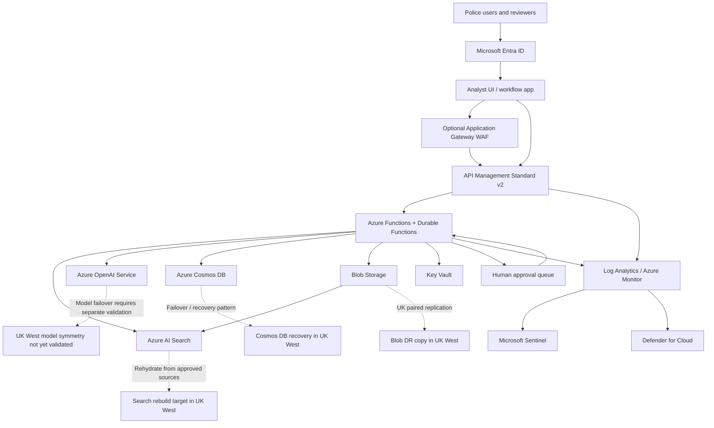

# Azure Technology Research: GenAI for UK Policing

> **Template Origin**: Official | **ArcKit Version**: 4.0.0 | **Command**: `$arckit-azure-research`

## Document Control

| Field | Value |
|-------|-------|
| **Document ID** | ARC-001-AZRS-v1.0 |
| **Document Type** | Azure Technology Research |
| **Project** | GenAI for UK Policing (Project 001) |
| **Classification** | OFFICIAL |
| **Status** | DRAFT |
| **Version** | 1.0 |
| **Created Date** | 2026-03-07 |
| **Last Modified** | 2026-03-07 |
| **Review Cycle** | Monthly |
| **Next Review Date** | 2026-04-06 |
| **Owner** | Enterprise Architect, GenAI for UK Policing |
| **Reviewed By** | PENDING |
| **Approved By** | PENDING |
| **Distribution** | Architecture Team, Security, Service Owner, Product Team, Data Protection, Delivery Team |

## Revision History

| Version | Date | Author | Changes | Approved By | Approval Date |
|---------|------|--------|---------|-------------|---------------|
| 1.0 | 2026-03-07 | ArcKit AI | Initial Azure technology research from `$arckit-azure-research` | PENDING | PENDING |

---

## Executive Summary

### Research Scope

This document maps the GenAI for UK Policing requirements to Azure services, deployment patterns,
and control options using official Microsoft documentation, Azure Architecture Center guidance,
Microsoft Learn MCP sources, and targeted Azure retail pricing checks.

**Requirements Analyzed**: 10 functional, 20 non-functional, 6 integration, 6 data requirements

**Azure Services Evaluated**: 16 Azure services across 5 categories

**Research Sources**: Microsoft Learn, Azure Architecture Center, Azure Well-Architected
Framework, Azure Security Benchmark documentation, Azure retail pricing API, Microsoft compliance
documentation

**External Azure Documents Found in `external/`**: None beyond the placeholder README. This did
not block the research, but it limits the ability to tailor estimates to an existing Microsoft
tenant, network topology, or public-sector commercial agreement.

### Key Recommendations

| Requirement Category | Recommended Azure Service | Tier / Pattern | Monthly Estimate (USD) |
|---------------------|---------------------------|----------------|------------------------|
| AI / model inference | Azure OpenAI Service, Azure AI Content Safety | Mixed regional model routing, classic RAG | $1,500 |
| Search / grounding / evidence | Azure AI Search, Azure Blob Storage immutable, Azure Cosmos DB | Classic RAG, selective semantic ranking, WORM evidence store | $870 |
| Application / workflow | Azure API Management, Azure Functions Flex Consumption, Durable Functions | Policy-enforced serverless orchestration | $760 |
| Identity / access | Microsoft Entra ID, managed identities, PIM | Federated workforce access, JIT admin | $60* |
| Security / observability | Azure Key Vault, Azure Monitor, Log Analytics, Defender for Cloud, Microsoft Sentinel, Azure Policy | Centralized security baseline | $420 |
| **Estimated pilot total** | **Combined platform** | **UK South primary, UK West data DR** | **$3,600 / month** |

`*` Assumes the programme reuses an existing workforce Entra tenant and existing licensing for the
majority of user-facing identity capabilities.

**Cost basis**:

- The estimate assumes the pilot requirement profile from the requirements pack:
  `25,000` requests per day average, `20 TPS` peak, `300` concurrent users, and a `5 second`
  p95 response target.
- Model cost assumes mixed routing:
  low-risk drafting and retrieval summarization on lower-cost Azure OpenAI deployments, with
  higher-value synthesis and escalation flows using `gpt-4o` in `UK South`.
- Azure AI Search cost assumes `2` `S1` units and selective use of semantic ranker rather than
  enabling semantic ranking on every query.
- The estimate excludes existing Microsoft 365 / Entra enterprise licensing, SOC staffing,
  enterprise support, case-management connectors, custom coprocessor applications, and
  force-specific onboarding effort.
- If the programme uses `gpt-4o` as the default model for all traffic, or semantic ranker on all
  queries, monthly cost can rise materially above this estimate.

### Architecture Pattern

**Recommended Pattern**: Secure PaaS classic RAG with a custom orchestrator, human approval, and
immutable audit trail

**Reference Architecture**:

- Azure Architecture Center: Design and develop a RAG solution
- Azure Architecture Center: Secure RAG architecture with an orchestrator
- Azure Architecture Center: Baseline Microsoft Foundry chat reference architecture
- Azure Architecture Center: API Management landing zone architecture

### UK Government Suitability

| Criteria | Status | Notes |
|----------|--------|-------|
| **UK Region Availability** | CONDITIONAL | `UK South` is validated for the core pattern. `Azure AI Search` features are available in `UK South`; `Azure OpenAI` model availability was confirmed for `UK South` but not equivalently validated in `UK West` for the same model set |
| **G-Cloud Listing** | YES | Microsoft documents Azure as in-scope for G-Cloud procurement under `RM1557.14`, typically consumed through Microsoft or reseller routes |
| **Data Classification** | CONDITIONAL | Strong fit for `OFFICIAL`. Some `OFFICIAL-SENSITIVE` use may be possible with added controls, force assurance, and procedural handling. This document does not recommend this public Azure design for `SECRET` workloads |
| **NCSC / G-Cloud Security Principles** | YES | Microsoft attests Azure against the UK NCSC cloud security principles and provides a UK OFFICIAL / UK NHS Azure Policy initiative; programme-specific assurance is still required |
| **UK Data Residency** | CONDITIONAL | Primary operational processing can remain in `UK South`, with UK-based storage replication. Full UK-only model failover requires additional validation because current model availability evidence is stronger for `UK South` than `UK West` |

---

## Service Selection Summary

### Consolidated service map

| Category | Primary recommendation | Why it fits | Key requirements addressed |
|----------|------------------------|-------------|-----------------------------|
| Model inference | Azure OpenAI Service | Managed LLM access with UK South regional availability, enterprise controls, and strong Azure integration | FR-002, FR-004, FR-005, NFR-P-001 |
| Retrieval / grounding | Azure AI Search | Hybrid search, vector search, metadata filters, semantic ranking, citations, and RAG-oriented retrieval patterns | FR-002, FR-004, FR-005, DR-001, DR-004 |
| Orchestration | Azure Functions with Durable Functions | Code-centric orchestration, approval waits, low ops, elastic scaling, and explicit workflow control | FR-003, FR-006, FR-009, NFR-P-002 |
| API facade | Azure API Management Standard v2 | Central policy enforcement, versioning, auth mediation, private connectivity options, and gateway logging | INT-001, INT-002, INT-003, NFR-SEC-003 |
| Workflow / audit state | Azure Cosmos DB | Flexible schema for workflow state, approvals, citations, and audit metadata | FR-007, FR-008, DR-002, DR-005 |
| Content / evidence store | Azure Blob Storage with immutable storage | Long retention, legal hold, time-based WORM, lifecycle management, and evidential integrity | NFR-C-002, NFR-C-004, INT-006 |
| Identity | Microsoft Entra ID and managed identities | Workforce federation, RBAC, PIM, Conditional Access, and secretless service authentication | NFR-SEC-001, NFR-SEC-002, INT-001 |
| Security baseline | Key Vault, Azure Monitor, Log Analytics, Defender for Cloud, Sentinel, Azure Policy | Centralized posture, logging, threat detection, configuration enforcement, and key management | NFR-SEC-003 through NFR-SEC-005, INT-004 |

### Shortlisted RAG options comparison

| Option | Key features | Pricing shape | Suitability |
|--------|--------------|---------------|-------------|
| **Custom classic RAG on Azure OpenAI + Azure AI Search** | Explicit retrieval control, metadata filtering, source citations, selective semantic ranking, human review insertion points | Token charges plus fixed AI Search units and optional semantic ranking fees | **Best fit for phase 1** |
| **Azure OpenAI On Your Data** | Simplified single-call pattern, integrated citations, lower application complexity | Token charges plus search backing costs | **Not recommended for new build** because Azure Architecture Center states this approach is deprecated and approaching retirement |
| **Agentic retrieval / Foundry agent-led retrieval** | Knowledge-base abstractions, richer planning, multi-step retrieval | Additional reasoning and retrieval token cost, preview-era moving parts | **Defer** until GA and assurance maturity improve |

### API gateway options comparison

| Option | Key features | Monthly price signal | Suitability |
|--------|--------------|----------------------|-------------|
| **API Management Standard v2** | Entra integration, private endpoint support, outbound VNet integration, production SLA | High fixed cost, around `$700` per unit-month in `UK South` retail pricing | **Recommended** for policing-grade control and network isolation |
| **API Management Basic v2** | Lower cost, Entra integration, production SLA | Lower fixed cost, but weaker network isolation options | Use only for lower-sensitivity pilots that do not require the stricter networking posture |
| **No API gateway** | Lowest cost, least complexity | Minimal direct Azure charge | Reject for this workload because it weakens policy enforcement, audit normalization, and interface governance |

### Critical Azure-specific observations

- Azure Architecture Center recommends a custom orchestrator for RAG when retrieval control and
  authorization filtering matter. That is the right fit for policing evidence, policy, and
  operational content.
- Azure Architecture Center explicitly states that Azure OpenAI On Your Data is deprecated and
  approaching retirement. It should not anchor the target architecture.
- Azure AI Search agentic retrieval is available, but it remains a less conservative choice for a
  policing phase 1 than classic RAG with explicit orchestration.
- Azure AI Content Safety groundedness detection is not currently documented as available in
  `UK South`. Current region references cite support in `Central US`, `East US`, `France Central`,
  and `Canada East`. The platform therefore should not depend on groundedness detection for UK-only
  production control.
- `Azure OpenAI` regional model availability evidence in Microsoft Learn confirms `gpt-4o`
  availability in `UK South`. Equivalent documentation for `UK West` was not identified for the
  same model set, so full like-for-like UK regional model failover remains a design risk.

---

## Azure Services Analysis

### Category 1: AI / grounded generation

**Requirements Addressed**: FR-002, FR-004, FR-005, FR-006, NFR-P-001, NFR-C-001, DR-001

**Why This Category**: The programme needs bounded, source-backed generation with explicit
provenance, strong human accountability, and policy-aware orchestration. It does not need an
unbounded chatbot architecture.

#### Recommended: Azure OpenAI Service + Azure AI Search

**Service Overview**:

- **Full Name**: Azure OpenAI Service with Azure AI Search
- **Category**: AI / RAG / retrieval
- **Documentation**:
  - `https://learn.microsoft.com/azure/ai-foundry/openai/concepts/models`
  - `https://learn.microsoft.com/azure/search/search-what-is-azure-search`
  - `https://learn.microsoft.com/azure/search/retrieval-augmented-generation-overview`

**Why it fits the requirements**:

- Azure AI Search supports full-text, vector, hybrid, and multimodal retrieval, and Microsoft
  positions it directly for grounded answers and RAG.
- The RAG guidance in Azure Architecture Center recommends an explicit orchestrator pattern in
  front of retrieval and model inference. That aligns with policing controls for user context,
  authorization filtering, approval gates, and evidential capture.
- Azure AI Search documents citations, grounding data, semantic ranking, and execution metadata as
  first-class parts of its RAG pattern.
- Azure OpenAI supports regional model deployment in `UK South`, which improves residency control
  compared with global-only model paths.

**Configuration for this project**:

- Use a **classic RAG** pattern rather than agentic retrieval for phase 1.
- Use **Azure AI Search** indexes over approved document sources only.
- Apply **metadata filters** for force, workflow, repository, document status, sensitivity band,
  and business owner.
- Use **lower-cost model routing** for low-risk drafting and triage tasks, and reserve `gpt-4o`
  for higher-value synthesis and escalation paths.
- Require application-layer citations and confidence presentation on every RAG answer.
- Block unsupported definitive answers when grounding is absent or confidence thresholds fail.

**Estimated Cost for This Project**:

| Resource | Configuration | Monthly Cost (USD) | Notes |
|----------|---------------|--------------------|-------|
| Azure OpenAI | Mixed routing across lower-cost regional deployments and `gpt-4o` escalation paths | $1,320 | Pilot assumption, not calculator-grade |
| Azure AI Content Safety | Text moderation and prompt attack checks on selected paths | $80 | Use selectively, not on every internal system step |
| Evaluation / test traffic | Non-production prompt and retrieval evaluation | $100 | Hold as engineering contingency |
| **Total** |  | **$1,500** | |

#### Alternative: Agentic retrieval / Foundry agent-led retrieval

This becomes more attractive if the programme later needs multi-step planning, tool use, or richer
knowledge-base abstractions. It is not the best phase 1 choice for policing because the assurance
case is weaker, the control path is less explicit, and the operational surface is still moving.

#### Alternative not recommended: Azure OpenAI On Your Data

Azure still documents this pattern in some tutorials, but Azure Architecture Center states that it
is deprecated and approaching retirement. For that reason, it should not be the target design for
this programme.

---

### Category 2: Application / workflow control

**Requirements Addressed**: FR-003, FR-006, FR-007, FR-009, INT-002, INT-003, NFR-P-002

**Why This Category**: The policing use case needs a strong policy choke point, auditable business
workflow, human approval waits, and low-operations scaling.

#### Recommended: Azure API Management Standard v2 + Azure Functions Flex Consumption + Durable Functions

**Service Overview**:

- **Full Name**: Azure API Management Standard v2 with Azure Functions
- **Category**: API / orchestration / workflow
- **Documentation**:
  - `https://learn.microsoft.com/azure/api-management/api-management-features`
  - `https://learn.microsoft.com/azure/api-management/v2-service-tiers-overview`
  - `https://learn.microsoft.com/azure/architecture/example-scenario/integration/app-gateway-internal-api-management-function`

**Why it fits the requirements**:

- API Management provides a single control point for authentication mediation, request validation,
  throttling, redaction, logging, and interface versioning.
- Standard v2 is the lowest APIM tier in the current portfolio that still supports the network
  posture needed for stronger production isolation.
- Functions plus Durable Functions gives code-centric workflow control, explicit state,
  long-running approval waits, and low idle cost.
- APIM now supports generative AI gateway logging, which strengthens prompt and token observability
  when the model endpoints are exposed through the gateway.

**Configuration for this project**:

- Put **all model and retrieval calls behind APIM**.
- Use **managed identities** for downstream Azure service access.
- Use **Durable Functions** for approval states, timeout handling, and escalation routing.
- Keep **request and response logging** in APIM tightly scoped and redacted to avoid creating a
  second uncontrolled sensitive-data store.
- If an external or cross-force web entry point is needed, front APIM with **Application Gateway
  WAF** or equivalent edge protection.

**Estimated Cost for This Project**:

| Resource | Configuration | Monthly Cost (USD) | Notes |
|----------|---------------|--------------------|-------|
| API Management | Standard v2, 1 unit | $700 | Based on Azure retail price feed for `UK South` |
| Azure Functions | Flex Consumption plus durable orchestration | $35 | Pilot-grade estimate |
| Eventing / notification overhead | Queues, events, incidental workflow messaging | $25 | Small allowance |
| **Total** |  | **$760** | |

#### Alternative: API Management Basic v2

This reduces cost materially, but it weakens the preferred network posture. It is defensible only
for a low-sensitivity pilot that does not require the same degree of private integration and
segmented backend access.

---

### Category 3: Search, data, and evidential storage

**Requirements Addressed**: DR-001 through DR-006, FR-005, FR-008, NFR-C-002, NFR-C-004, INT-006

**Why This Category**: The platform needs a clean separation between source repositories, retrieval
indexes, workflow metadata, and immutable evidence artifacts.

#### Recommended: Azure AI Search + Azure Blob Storage immutable + Azure Cosmos DB

**Service Overview**:

- **Full Name**: Azure AI Search, Azure Blob Storage, Azure Cosmos DB
- **Category**: Retrieval / storage / metadata
- **Documentation**:
  - `https://learn.microsoft.com/azure/search/search-region-support`
  - `https://learn.microsoft.com/azure/storage/blobs/immutable-storage-overview`
  - `https://learn.microsoft.com/azure/cosmos-db/how-to-setup-managed-identity`

**Why it fits the requirements**:

- Azure Blob immutable storage supports time-based retention and legal hold for WORM protection.
- Azure Blob Storage is a clean backing store for approved source packs, exported transcripts,
  evidential bundles, and long-term audit payloads.
- Azure Cosmos DB gives flexible schema support for workflow states, approval decisions, citation
  references, quality scores, and trace events without over-constraining the first release.
- Azure AI Search can be rebuilt from approved source stores, which is helpful for DR and
  defensible re-indexing.

**Configuration for this project**:

- Store approved source documents in **Blob Storage** with clear container separation by content
  domain and owning authority.
- Use **container-level or version-level immutability** for evidence export containers.
- Keep mutable workflow state in **Cosmos DB**, but treat the final approved evidence package as an
  immutable blob artifact.
- Retain the retrieval index as a **derived store**, not the system of record.

**Estimated Cost for This Project**:

| Resource | Configuration | Monthly Cost (USD) | Notes |
|----------|---------------|--------------------|-------|
| Azure AI Search | `S1`, 2 units | $540 | Based on Azure retail price feed for `UK South` |
| Semantic ranker | Selective use on high-value queries only | $150 | Avoid enabling on all traffic |
| Blob Storage | Hot + cool tiers, immutability for evidence exports | $60 | Pilot storage estimate |
| Cosmos DB | Small serverless / low autoscale profile | $120 | Scale up if stricter RPO drives multi-region design |
| **Total** |  | **$870** | |

#### Alternative: Azure SQL Database for workflow metadata

Azure SQL becomes more attractive if the workflow state needs stronger relational reporting,
strictly normalized schema, or deep joins with existing case-management data. For the early
policing pilot, Cosmos DB is the more flexible fit for rapidly changing orchestration metadata.

---

## Architecture Pattern

### Recommended Azure Reference Architecture

**Pattern Name**: Secure classic RAG with explicit orchestrator and immutable evidence capture

**Azure Architecture Center references**:

- `https://learn.microsoft.com/azure/architecture/ai-ml/guide/rag/rag-solution-design-and-evaluation-guide`
- `https://learn.microsoft.com/azure/architecture/ai-ml/guide/secure-multitenant-rag`
- `https://learn.microsoft.com/azure/architecture/ai-ml/architecture/baseline-microsoft-foundry-chat`
- `https://learn.microsoft.com/azure/architecture/example-scenario/integration/app-gateway-internal-api-management-function`

**Pattern description**:

The preferred Azure pattern is not a direct model call from a user interface. It is a controlled
orchestrator architecture in which the application sends user requests to an API layer, the
orchestrator applies policy and context filters, Azure AI Search retrieves approved grounding
material, and Azure OpenAI produces a source-backed response. Human approval remains outside the
model and is captured explicitly as a workflow step.

For evidential integrity, the source repository, the working metadata store, and the immutable
evidence export are separated. The search index is treated as derived and rebuildable. Logs,
approval events, and administrative changes are routed into centralized monitoring and security
tooling. This design fits the programme's lawfulness, traceability, and audit requirements better
than a simpler chat-centric architecture.

### Architecture Diagram

### Component Mapping

| Component | Azure Service | Purpose | Tier / Pattern |
|-----------|---------------|---------|----------------|
| User identity | Microsoft Entra ID | Workforce authentication, Conditional Access, RBAC | Existing tenant |
| API gateway | Azure API Management | Policy enforcement, routing, auth mediation, logging | Standard v2 |
| Orchestrator | Azure Functions / Durable Functions | Retrieval control, workflow logic, approvals | Flex Consumption |
| LLM inference | Azure OpenAI Service | Controlled generation and summarization | Regional deployment |
| Retrieval engine | Azure AI Search | Hybrid / vector retrieval and citations | Standard S1 |
| Mutable state | Azure Cosmos DB | Workflow, approvals, citation metadata | Serverless or small autoscale |
| Evidence store | Azure Blob Storage | Source packs, exports, immutable evidence bundles | Hot / cool with WORM |
| Secrets / keys | Azure Key Vault | Secrets, certificates, rotation | Standard |
| Monitoring | Azure Monitor / Log Analytics | Metrics, logs, dashboards, alerts | Pay-as-you-go |
| Threat detection | Defender for Cloud / Sentinel | Posture, API security, investigation | Pilot-enable targeted plans |

---

## Security & Compliance

### Azure Security Benchmark mapping

| ASB / MCSB Domain | Controls Implemented | Azure Services |
|-------------------|---------------------|----------------|
| **Network Security (NS)** | NS-1, NS-2, NS-6 | VNet integration, Private Link, disable public access where supported, Application Gateway WAF |
| **Identity Management (IM)** | IM-1, IM-3, IM-8 | Entra ID, managed identities, Key Vault-backed secrets, centralized auth |
| **Privileged Access (PA)** | PA-1, PA-7, PA-8 | Entra PIM, least-privilege RBAC, Customer Lockbox where applicable |
| **Data Protection (DP)** | DP-3, DP-4, DP-6, DP-7 | TLS, encryption at rest, Key Vault, certificate rotation, Blob immutability |
| **Asset Management (AM)** | AM-2 | Azure Policy to enforce approved services and configurations |
| **Logging & Threat Detection (LT)** | LT-1, LT-4 | Defender for APIs, Defender for Cloud, APIM gateway logs, Log Analytics, Sentinel |
| **Backup & Recovery (BR)** | BR-1 | APIM backup / restore, UK paired storage replication, rebuildable search indexes |

### Azure Well-Architected assessment

| Pillar | Rating | Notes |
|--------|--------|-------|
| **Reliability** | Strong with caveats | The data layer and evidence store can be made UK-resilient, but Azure OpenAI model parity across UK paired regions needs separate validation |
| **Security** | Strong | Private connectivity, Entra, managed identities, Key Vault, Defender, and immutable evidence storage align well to the risk profile |
| **Cost Optimization** | Medium-Strong | PaaS reduces ops burden, but APIM Standard v2 and semantic ranking add noticeable fixed / variable cost; routing discipline matters |
| **Operational Excellence** | Strong | Centralized policy, logs, monitor-based dashboards, and IaC are a good fit for a governed public-sector platform |
| **Performance Efficiency** | Strong | AI Search, Functions, and APIM can meet the pilot scale, provided search replicas and prompt sizes are managed carefully |

### UK Government security alignment

| Framework / Concern | Alignment | Notes |
|---------------------|-----------|-------|
| **UK G-Cloud** | YES | Microsoft documents Azure as in-scope for UK G-Cloud procurement |
| **NCSC cloud principles** | YES | Microsoft provides Azure UK assurance material and policy mappings |
| **UK OFFICIAL** | YES | Strong architectural fit when implemented with the controls in this document |
| **OFFICIAL-SENSITIVE handling caveat** | CONDITIONAL | Possible, but requires a stronger procedural, legal, and operational control pack; do not treat this as a blanket platform guarantee |
| **Cyber Essentials Plus** | YES | Microsoft documents Azure against the UK Cyber Essentials Plus scheme |
| **UK-only groundedness control** | NO | Current groundedness detection region availability does not make this a dependable UK-only production control |

### Security recommendations

- Use **Entra Conditional Access** and managed devices for all operational users.
- Use **PIM** for administrative roles and for high-trust support functions.
- Force **managed identity** for service-to-service authentication and disable local auth where the
  service supports it.
- Put **API Management** in front of all retrieval and model endpoints.
- Use **Blob immutability** for evidence exports and keep working copies separate from record copies.
- Enable **APIM gateway logs** and send them to **Log Analytics** with retention and redaction
  policies that match policing data governance.
- Enable **Defender for APIs** and **Defender for Cloud** for subscriptions in scope.

---

## Resilience and DR considerations

| Area | Recommended posture | Constraint / note |
|------|---------------------|-------------------|
| API layer | Rebuild APIM from IaC, back up configuration to storage | Active-active is possible but expensive for early phase |
| Orchestration | Recreate Functions from CI/CD and stateless deployment | Keep state externalized |
| Workflow metadata | Use Cosmos DB recovery pattern and periodic export | For strict `<15 minute` RPO, validate multi-region write or stronger autoscale profile |
| Evidence store | Use UK-paired replication and immutability policies | Blob is the cleanest DR story in this stack |
| Search index | Rehydrate from approved source store in secondary region | Treat AI Search as derived state |
| Model inference | Keep primary in `UK South` | Equivalent `UK West` model availability was not confirmed; full UK model failover is an open risk |

**Implication for requirements**:

The documented `<15 minute` RPO and `<4 hour` RTO are achievable for storage, workflow metadata,
and application components. The weakest point is model-region symmetry. If a strict UK-only failover
for the same Azure OpenAI model is mandatory, this must become a formal architectural checkpoint.

---

## Implementation Guidance

### Recommended delivery approach

1. Build the platform as **IaC-first** using Bicep or Terraform.
2. Treat **retrieval configuration**, prompt templates, guardrail settings, and approval rules as
   versioned assets in source control.
3. Route all model traffic through **API Management** for consistent policy enforcement.
4. Keep a strict split between:
   source repositories,
   mutable workflow data,
   derived search indexes,
   immutable evidence records.
5. Add **approval checkpoints** in Durable Functions rather than attempting to make the model
   self-approve sensitive outcomes.

### Delivery guardrails

- Do not rely on preview-only features for core evidential controls.
- Do not use Azure OpenAI On Your Data as the target architecture.
- Do not depend on groundedness detection for UK-only production assurance.
- Do not store unrestricted prompt / completion payloads in logs.
- Do not allow direct user access to model endpoints outside the governed API path.

### Official implementation samples and patterns

| Sample / pattern | Description | Link |
|------------------|-------------|------|
| Classic RAG architecture guidance | Microsoft Architecture Center guidance for orchestrated RAG | `https://learn.microsoft.com/azure/architecture/ai-ml/guide/rag/rag-solution-design-and-evaluation-guide` |
| Secure RAG with orchestrator | Security-oriented RAG pattern with explicit orchestration | `https://learn.microsoft.com/azure/architecture/ai-ml/guide/secure-multitenant-rag` |
| API Management landing zone | Secure API gateway baseline with App Gateway and observability | `https://learn.microsoft.com/azure/architecture/example-scenario/integration/app-gateway-internal-api-management-function` |
| Azure AI Search RAG overview | Retrieval mechanics, citations, and semantic features | `https://learn.microsoft.com/azure/search/retrieval-augmented-generation-overview` |

---

## Cost Estimate

### Monthly cost summary

| Category | Azure Service | Configuration | Monthly Cost (USD) |
|----------|---------------|---------------|--------------------|
| AI / inference | Azure OpenAI Service | Mixed routing, `UK South` regional deployment | $1,320 |
| AI safety | Azure AI Content Safety | Selected moderation and prompt checks | $80 |
| Retrieval | Azure AI Search | `S1`, 2 units | $540 |
| Retrieval enhancement | Semantic ranker | Selective use on higher-value queries | $150 |
| Evidence storage | Blob Storage | Hot / cool + immutable evidence containers | $60 |
| Workflow metadata | Cosmos DB | Small serverless / low autoscale | $120 |
| API / policy | API Management | Standard v2, 1 unit | $700 |
| Orchestration | Azure Functions | Flex Consumption / Durable Functions | $35 |
| Eventing overhead | Event-driven plumbing | Small allowance | $25 |
| Identity / admin | Entra / PIM overhead | Existing tenant assumed | $60 |
| Security / monitoring | Key Vault, Monitor, Log Analytics, Defender, Sentinel | Pilot baseline | $510 |
| **Total** | | | **$3,600** |

### 3-year TCO

| Year | Monthly | Annual | Cumulative | Notes |
|------|---------|--------|------------|-------|
| Year 1 | $3,600 | $43,200 | $43,200 | Pilot implementation and operation |
| Year 2 | $3,450 | $41,400 | $84,600 | Savings from routing discipline and storage lifecycle tuning |
| Year 3 | $3,350 | $40,200 | $124,800 | Matured operations, better model right-sizing |
| **Total** | | | **$124,800** | |

### Cost optimization recommendations

1. Use **semantic ranker selectively**, not on every search request.
2. Route low-risk tasks to **lower-cost regional models** and keep `gpt-4o` for higher-value
   synthesis.
3. Use **storage lifecycle rules** to move older evidence payloads from hot to cool or archive
   tiers.
4. Reuse **existing Entra and SOC investments** instead of duplicating licensing per pilot.
5. Scale **AI Search replicas** to real concurrency rather than sizing for theoretical peak from day
   one.

**Estimated Savings with Optimizations**: `$250-600 / month`, depending on model routing and
semantic ranker usage.

---

## UK Government Considerations

### G-Cloud procurement

**Azure on G-Cloud 14**:

- **Framework**: `RM1557.14`
- **Supplier route**: Microsoft Azure and reseller ecosystem
- **Commercial note**: Microsoft documents that the DTA21 public-sector agreement can lower actual
  pricing for eligible UK public-sector buyers

### Data residency

| Data Type | Storage Location | Replication | Notes |
|-----------|------------------|-------------|-------|
| Source repositories | UK South | UK West where policy permits | Keep authoritative content under owner control |
| Search index | UK South | Rebuild in UK West | Treat as derived state |
| Workflow metadata | UK South | Recovery / failover design in UK West | Validate tighter RPO needs separately |
| Evidence exports | UK South | UK paired replication | Use immutability for record copies |
| Security logs | UK South | Retention by workspace policy | Minimize payload sensitivity in logs |

### Classification position

This Azure design is a good architectural fit for `OFFICIAL`. For workloads that include more
sensitive operational material within the `OFFICIAL` handling regime, including material often
described as `OFFICIAL-SENSITIVE`, the platform can still be viable, but only with stronger
process, legal, personnel, data minimization, and access-review controls. This document does not
offer a platform-only assurance statement for that handling caveat.

---

## References

### Microsoft Learn and Azure Architecture Center

| Topic | Link |
|-------|------|
| Azure AI Search overview | `https://learn.microsoft.com/azure/search/search-what-is-azure-search` |
| Azure AI Search RAG overview | `https://learn.microsoft.com/azure/search/retrieval-augmented-generation-overview` |
| Azure AI Search region support | `https://learn.microsoft.com/azure/search/search-region-support` |
| Azure OpenAI model availability | `https://learn.microsoft.com/azure/ai-foundry/openai/concepts/models` |
| Azure OpenAI responsible AI overview | `https://learn.microsoft.com/azure/foundry/responsible-ai/openai/overview` |
| Azure OpenAI content filtering | `https://learn.microsoft.com/azure/ai-foundry/openai/concepts/content-filter` |
| Azure AI Content Safety groundedness | `https://learn.microsoft.com/azure/foundry/openai/concepts/content-filter-groundedness` |
| API Management tier comparison | `https://learn.microsoft.com/azure/api-management/api-management-features` |
| API Management v2 tiers | `https://learn.microsoft.com/azure/api-management/v2-service-tiers-overview` |
| API Management monitoring | `https://learn.microsoft.com/azure/api-management/monitor-api-management` |
| Blob immutable storage | `https://learn.microsoft.com/azure/storage/blobs/immutable-storage-overview` |
| Cosmos DB managed identity | `https://learn.microsoft.com/azure/cosmos-db/how-to-setup-managed-identity` |
| Secure RAG architecture guidance | `https://learn.microsoft.com/azure/architecture/ai-ml/guide/secure-multitenant-rag` |
| RAG solution design guide | `https://learn.microsoft.com/azure/architecture/ai-ml/guide/rag/rag-solution-design-and-evaluation-guide` |
| Baseline Foundry chat architecture | `https://learn.microsoft.com/azure/architecture/ai-ml/architecture/baseline-microsoft-foundry-chat` |
| Azure Well-Architected Framework | `https://learn.microsoft.com/azure/well-architected/what-is-well-architected-framework` |
| Azure Well-Architected pillars | `https://learn.microsoft.com/azure/well-architected/pillars` |
| API Management security baseline | `https://learn.microsoft.com/security/benchmark/azure/baselines/api-management-security-baseline` |
| Key Vault security baseline | `https://learn.microsoft.com/security/benchmark/azure/baselines/key-vault-security-baseline` |
| UK G-Cloud | `https://learn.microsoft.com/azure/compliance/offerings/offering-uk-g-cloud` |
| UK Cyber Essentials Plus | `https://learn.microsoft.com/azure/compliance/offerings/offering-uk-cyber-essentials-plus` |

### Pricing references

| Topic | Link |
|-------|------|
| Azure retail prices API | `https://prices.azure.com/api/retail/prices` |
| Azure API Management pricing | `https://azure.microsoft.com/pricing/details/api-management/` |
| Azure AI Search pricing | `https://azure.microsoft.com/pricing/details/search/` |

---

## Next Steps

### Immediate Actions

1. Validate the **Azure OpenAI failover posture** and decide whether strict UK-only model failover
   is mandatory.
2. Confirm whether the programme can **reuse an existing Entra tenant**, SOC tooling, and public
   sector commercial agreement.
3. Run a **proof-of-value** for classic RAG with citations, metadata filters, and approval
   workflows before committing to fuller build-out.
4. Make a formal decision on **semantic ranker usage policy**, because it materially affects cost.

### Integration with Other ArcKit Commands

- Run `$arckit-diagram` to create detailed Azure architecture diagrams
- Run `$arckit-secure` to validate the design against UK secure-by-design expectations
- Run `$arckit-devops` to define Azure delivery pipelines and environment promotion controls

## External References

| Document | Type | Source | Key Extractions | Path |
|----------|------|--------|-----------------|------|
| *None provided* | — | — | — | — |

---

**Generated by**: ArcKit `$arckit-azure-research` agent  
**Generated on**: 2026-03-07  
**ArcKit Version**: 4.0.0  
**Project**: GenAI for UK Policing (Project 001)  
**AI Model**: GPT-5 Codex  
**MCP Sources**: Microsoft Learn MCP Server (`https://learn.microsoft.com/api/mcp`)
