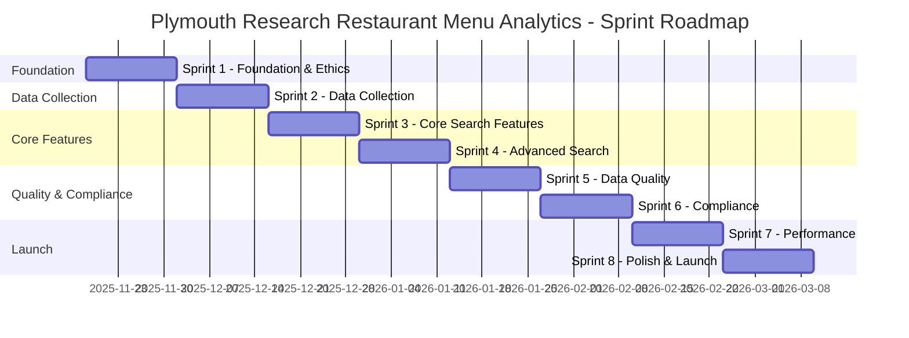

# Product Backlog: Plymouth Research Restaurant Menu Analytics

## Document Information

| Field | Value |
|-------|-------|
| **Document ID** | ARC-001-BACKLOG-v1.0 |
| **Project** | Plymouth Research Restaurant Menu Analytics (Project 001) |
| **Document Type** | Product Backlog |
| **Classification** | OFFICIAL |
| **Version** | 1.0 |
| **Status** | DRAFT |
| **Date** | 2025-11-15 |
| **Owner** | Research Director, Plymouth Research |

## Revision History

| Version | Date | Author | Changes |
|---------|------|--------|---------|
| 1.0 | 2025-11-15 | ArcKit AI | Initial backlog generation from `/arckit.backlog` command |

---

## Executive Summary

### Backlog Overview

This product backlog converts 69 requirements from `requirements.md` into prioritized, delivery-ready user stories organized into 8 two-week sprints (16 weeks total delivery timeline).

**Backlog Composition**:
- **6 Epics** (business requirements) representing strategic themes
- **15 User Stories** (functional requirements) in GDS "As a... I want... So that..." format
- **21 Technical Tasks** (non-functional requirements) for quality attributes
- **9 Data Stories** (data requirements) for database schema and infrastructure
- **2 Integration Stories** (integration requirements) for external systems

**Total Backlog Items**: 53 stories
**Total Story Points**: 161 points
**Sprint Velocity**: 20 points/sprint (assumed based on 2-person team)
**Delivery Timeline**: 8 sprints × 2 weeks = 16 weeks (4 months)

### Prioritization Approach

Multi-factor prioritization combining:
1. **MoSCoW**: MUST_HAVE (MVP critical) > SHOULD_HAVE (important) > COULD_HAVE (nice-to-have)
2. **Risk**: High-risk items early (ethical compliance, scraping infrastructure)
3. **Value**: Consumer-facing features prioritized for early user validation
4. **Dependencies**: Foundational items (database, scraping) before features

### Sprint Allocation Summary

| Sprint | Theme | Story Points | Key Deliverables |
|--------|-------|--------------|------------------|
| **Sprint 1** | Foundation & Ethics | 20 | Database schema, robots.txt compliance, scraping infrastructure |
| **Sprint 2** | Data Collection | 20 | Web scraping ETL, price/tag extraction, weekly refresh automation |
| **Sprint 3** | Core Search Features | 20 | Restaurant search, dietary filtering, menu display |
| **Sprint 4** | Advanced Search | 20 | Full-text search, price/cuisine filters, CSV export |
| **Sprint 5** | Data Quality & Monitoring | 20 | Quality dashboard, monitoring alerts, user feedback system |
| **Sprint 6** | Compliance & Opt-Out | 21 | GDPR compliance, opt-out mechanism, privacy policy |
| **Sprint 7** | Performance & Reliability | 20 | Performance optimization, caching, backup/recovery |
| **Sprint 8** | Polish & Launch Prep | 20 | Mobile responsiveness, accessibility, final testing |

### Sprint Delivery Roadmap



### Key Milestones

- **End of Sprint 2 (Week 4)**: First scraped menu data in database
- **End of Sprint 3 (Week 6)**: MVP search functionality testable by Research Analysts
- **End of Sprint 4 (Week 8)**: Full consumer-facing search experience complete
- **End of Sprint 6 (Week 12)**: GDPR compliance complete (DPIA, opt-out, privacy policy)
- **End of Sprint 8 (Week 16)**: Production launch ready

---

## Epics (Business Requirements)

### Epic 1: Data Quality Excellence (BR-001)

**Epic Statement**: As Plymouth Research, we need to establish data quality as our competitive differentiator by achieving 95%+ accuracy and completeness across all scraped menu data.

**Strategic Value**: Data quality is the foundation of credibility. Inaccurate menu data destroys user trust and organizational reputation.

**Stakeholders**: Research Director (SD-1), Research Analysts (SD-4), Plymouth Consumers (SD-5)

**Success Criteria**:
- 95% accuracy on manual validation samples (Goal G-1)
- <5% of menu items missing required fields (completeness)
- User feedback mechanism capturing data errors
- Monthly data quality reports to Research Director

**Related User Stories**: US-006 (Price Normalization), US-007 (Dietary Tags), US-014 (Data Quality Dashboard), TS-021 (User Feedback)

**Story Points**: 31 points across 6 stories

**Priority**: **MUST_HAVE** (Epic 1 is highest priority - all MUST_HAVE stories)

---

### Epic 2: Legal and Ethical Compliance (BR-002)

**Epic Statement**: As Plymouth Research, we need to operate within legal boundaries and ethical best practices to avoid legal action, ICO fines, or reputational damage from web scraping activities.

**Strategic Value**: Legal compliance is non-negotiable. A single violation could bankrupt the organization and destroy the Research Director's career.

**Stakeholders**: Legal/Compliance Advisor (SD-8), Research Director (SD-2), ICO (SD-9), Restaurant Owners (SD-6)

**Success Criteria**:
- 100% robots.txt compliance (Goal G-3)
- 100% rate limiting compliance (5-second delays)
- DPIA completed and approved (Goal G-8)
- Zero ICO fines or legal complaints (Outcome O-2)
- Opt-out mechanism with 48-hour SLA

**Related User Stories**: US-011 (Robots.txt Compliance), US-015 (Opt-Out Form), TS-001 to TS-005 (Compliance NFRs), DS-005 (Scraping Logs)

**Story Points**: 39 points across 9 stories

**Priority**: **MUST_HAVE** (Epic 2 is critical risk mitigation)

---

### Epic 3: Operational Sustainability (BR-003)

**Epic Statement**: As Plymouth Research, we need to build a cost-effective, maintainable platform that operates sustainably under £100/month without requiring excessive manual effort.

**Strategic Value**: Financial sustainability enables long-term operation. The platform must be "set and forget" for weekly data refreshes.

**Stakeholders**: Research Director (SD-2 - budget owner), Data Engineer (SD-3), Operations/IT (SD-10)

**Success Criteria**:
- Operational costs <£100/month (Goal G-5): Currently £16/month per Wardley Map
- Weekly automated scraping refresh requiring zero manual intervention
- 99% dashboard uptime (Goal G-13)
- Monitoring alerts detect issues within 10 minutes

**Related User Stories**: US-013 (Weekly Refresh), US-014 (Monitoring Dashboard), TS-013 to TS-015 (Availability NFRs), TS-018 (Monitoring)

**Story Points**: 26 points across 6 stories

**Priority**: **MUST_HAVE** (Epic 3 enables organizational viability)

---

### Epic 4: User Adoption and Satisfaction (BR-004)

**Epic Statement**: As Plymouth Research, we need to deliver a delightful user experience that drives consumer adoption, validates our public value proposition, and attracts media attention.

**Strategic Value**: User adoption validates the Research Director's strategic vision and generates word-of-mouth growth. Positive user experience attracts media coverage.

**Stakeholders**: Plymouth Consumers (SD-5), Food Writers/Journalists (SD-7), Research Analysts (SD-4)

**Success Criteria**:
- Search response time <500ms (Goal G-4)
- Mobile-responsive dashboard (>50% traffic expected on mobile)
- CSV export for analysts/journalists
- Positive user feedback and media citations

**Related User Stories**: US-001 to US-010 (all search and display features), TS-020 (Mobile Responsive), TS-021 (Accessibility)

**Story Points**: 41 points across 12 stories

**Priority**: **MUST_HAVE** for MVP, with some **SHOULD_HAVE** enhancements

---

### Epic 5: Platform Scalability (BR-005)

**Epic Statement**: As Plymouth Research, we need to architect the platform to scale from 150 restaurants to 1,500+ restaurants and potentially expand to other UK cities without major rewrites.

**Strategic Value**: Scalability supports future expansion opportunities and demonstrates engineering maturity. Future commercial opportunities (paid API, consulting) depend on proven scale.

**Stakeholders**: Research Director (SD-1 - expansion vision), Data Engineer (SD-3)

**Success Criteria**:
- Support 10X data growth (150 → 1,500 restaurants) with no architecture changes
- Horizontal scraper scaling via distributed task queue
- Database indexing maintains <500ms search with 100K menu items

**Related User Stories**: TS-016 (10X Growth Support), TS-017 (Horizontal Scaling)

**Story Points**: 8 points across 2 stories

**Priority**: **SHOULD_HAVE** (future-proofing, not critical to MVP)

---

### Epic 6: Plymouth Restaurant Coverage (BR-006)

**Epic Statement**: As Plymouth Research, we need to achieve comprehensive coverage of 150+ Plymouth restaurants to establish authority and deliver consumer value across all cuisines and price ranges.

**Strategic Value**: Coverage breadth is our differentiation vs. TripAdvisor/Google (neither aggregate menu data). 150+ restaurants represents critical mass for utility.

**Stakeholders**: Research Director (SD-1), Plymouth Consumers (SD-5), Restaurant Owners (SD-6)

**Success Criteria**:
- 150+ restaurants scraped by end of Sprint 2 (Goal G-2)
- Coverage across all cuisines (British, Italian, Chinese, Indian, Thai, etc.)
- Coverage across all price ranges (budget, mid-range, premium)
- Geographic coverage across all Plymouth postcodes

**Related User Stories**: US-011 (Web Scraping), US-012 (Cuisine Extraction), US-013 (Weekly Refresh), DS-001 (Restaurant Entity)

**Story Points**: 16 points across 4 stories

**Priority**: **MUST_HAVE** (Epic 6 delivers core value proposition)

---

## User Stories (Functional Requirements)

### US-001: Search Restaurants by Name

**Story**: As a Plymouth consumer, I want to search for restaurants by name so that I can quickly find a specific restaurant's menu.

**Persona**: Sarah (Health-Conscious Consumer), David (Research Analyst)

**Relates To**: FR-001, Epic 4 (User Adoption), Goal G-4 (Performance <500ms)

**Acceptance Criteria** (It's done when...):
- Restaurant name search returns results in <500ms (p95)
- Autocomplete suggestions appear after typing 2 characters
- Search is case-insensitive ("bella italia" matches "Bella Italia")
- Partial matches work ("Bella" matches "Bella Italia", "Bellissimo", etc.)
- Zero results display helpful message: "No restaurants found. Try a different search."

**Technical Notes**:
- PostgreSQL `ILIKE` query or full-text search (tsvector/tsquery)
- B-tree index on `restaurants.name`
- Sanitize input to prevent SQL injection

**Priority**: **MUST_HAVE**

**Story Points**: 3

**Sprint**: Sprint 3

**Dependencies**: DS-001 (Restaurant table must exist)

**Test Plan**:
- Unit test: Search for "Bella" returns all restaurants with "Bella" in name
- Performance test: 1,000 concurrent searches complete in <500ms (p95)
- Security test: SQL injection attempts blocked (e.g., "'; DROP TABLE restaurants;--")

---

### US-002: Filter by Dietary Tags

**Story**: As a health-conscious consumer with dietary restrictions (vegan, gluten-free), I want to filter menu items by dietary tags so that I can find safe and suitable meal options without manually checking every restaurant.

**Persona**: Sarah (vegan with gluten intolerance), Maria (restaurant owner wanting accurate representation)

**Relates To**: FR-002, Epic 4 (User Adoption), Epic 1 (Data Quality)

**Acceptance Criteria** (It's done when...):
- User can select one or more dietary tags: vegan, vegetarian, gluten-free, dairy-free, nut-free
- Multi-select uses AND logic: selecting "vegan" AND "gluten-free" shows only items tagged BOTH
- Zero results display: "No results found. Try removing some filters."
- Tags displayed as colored badges on menu items (e.g., green "Vegan" badge)
- Conservative tagging: items are ONLY tagged if restaurant explicitly labels them (never inferred)

**Technical Notes**:
- Many-to-many join: `menu_items → menu_item_dietary_tags → dietary_tags`
- GIN index on `menu_item_dietary_tags` for fast filtering
- AND logic: `HAVING COUNT(DISTINCT tag_id) = <number of selected tags>`

**Priority**: **MUST_HAVE** (core consumer value proposition)

**Story Points**: 5

**Sprint**: Sprint 3

**Dependencies**: US-007 (Dietary Tag Extraction), DS-004 (Dietary Tags schema)

**Test Plan**:
- Functional test: Select "vegan" and "gluten-free" → only items with BOTH tags appear
- Edge case test: Item with ambiguous text ("vegan option available") is NOT tagged as vegan
- Accuracy test: Manual validation of 50 tagged items confirms >90% accuracy

---

### US-003: Filter by Price Range

**Story**: As a budget-conscious student, I want to filter restaurants by average main course price so that I can find affordable meal options under £10.

**Persona**: James (Budget-Conscious Student)

**Relates To**: FR-003, Epic 4 (User Adoption)

**Acceptance Criteria** (It's done when...):
- User can select price ranges: Budget (<£10), Mid-Range (£10-20), Premium (£20+)
- Multi-select uses OR logic: selecting "Budget" OR "Mid-Range" shows restaurants matching EITHER
- Restaurants with no price data are excluded from results (conservative approach)
- Average price calculated from main course items only (not starters, desserts)
- Restaurants with <3 menu items flagged as "Insufficient data"

**Technical Notes**:
- Pre-calculate `avg_main_price` in `restaurants` table (updated during scraping)
- SQL query: `WHERE avg_main_price BETWEEN X AND Y`
- Category filtering: only include items where `category = 'Mains'`

**Priority**: **SHOULD_HAVE** (important for budget users, not critical to MVP)

**Story Points**: 3

**Sprint**: Sprint 4

**Dependencies**: US-006 (Price Normalization), DS-001 (Restaurant table with avg_main_price field)

**Test Plan**:
- Functional test: Select "Budget (<£10)" → only restaurants with avg_main_price <10.00 appear
- Edge case test: Restaurant with 2 menu items shows "Insufficient data" warning
- Data quality test: Manual validation confirms avg_main_price accurate for 20 sample restaurants

---

### US-004: View Full Restaurant Menu

**Story**: As a Plymouth consumer, I want to view a complete menu for a selected restaurant, organized by category (starters, mains, desserts), with prices and dietary tags displayed, so that I can make informed dining decisions.

**Persona**: Sarah (Health-Conscious Consumer), James (Budget-Conscious Student)

**Relates To**: FR-004, Epic 4 (User Adoption)

**Acceptance Criteria** (It's done when...):
- Clicking a restaurant in search results loads full menu on detail page
- Menu items grouped by category: Starters, Mains, Desserts, Drinks, Sides, Specials, Other
- Each item displays: name, description (if available), price (£X.XX format), dietary tags (colored badges)
- Items with no dietary tags show no badges (don't display "None" placeholder)
- Unknown category items appear in "Other" category at bottom

**Technical Notes**:
- Single database query with JOIN: `restaurants → menu_items → menu_item_dietary_tags → dietary_tags`
- Group by `category` in application code or SQL `ORDER BY category`
- Responsive layout (mobile-friendly)

**Priority**: **MUST_HAVE**

**Story Points**: 3

**Sprint**: Sprint 3

**Dependencies**: DS-001 (Restaurant table), DS-002 (Menu Items table), DS-003 (Categories), DS-004 (Dietary Tags)

**Test Plan**:
- Functional test: Load menu for "Bella Italia" → all items appear, grouped by category
- Display test: Item with dietary tags shows green "Vegan" and yellow "Gluten-Free" badges
- Mobile test: Menu displays correctly on iPhone SE (smallest common screen size)

---

### US-005: Display Source Attribution

**Story**: As a restaurant owner, I want my menu to be accurately attributed with a link back to my original website so that consumers know the data source and can visit my site for the most current information.

**Persona**: Maria (Restaurant Owner)

**Relates To**: FR-005, Epic 2 (Legal Compliance), Epic 1 (Data Quality)

**Acceptance Criteria** (It's done when...):
- Every restaurant menu displays source attribution: "Menu from: [restaurant-website.com]" (clickable link)
- Freshness timestamp shown: "Last updated: 3 days ago"
- Data >10 days old displays warning badge: "Data may be outdated"
- Broken URLs display: "Original source no longer available"
- Attribution visible on all views: search results, full menu, CSV export metadata

**Technical Notes**:
- `restaurants.website_url` and `restaurants.last_updated` fields
- Calculate freshness: `NOW() - last_updated` in days
- CSS styling for attribution footer and warning badge

**Priority**: **MUST_HAVE** (ethical and legal requirement)

**Story Points**: 2

**Sprint**: Sprint 3

**Dependencies**: DS-001 (Restaurant table with source_url, last_updated fields)

**Test Plan**:
- Display test: View restaurant menu → attribution link and timestamp appear
- Freshness test: Menu last updated 11 days ago → "Data may be outdated" warning appears
- CSV test: Exported CSV includes source_url in metadata header

---

### US-006: Normalize Prices to GBP Decimal Format

**Story**: As a data engineer, I want all scraped prices normalized to decimal GBP format (e.g., 12.50) so that I can accurately sort, filter, and compare prices across restaurants.

**Persona**: Data Engineer (SD-3)

**Relates To**: FR-006, Epic 1 (Data Quality), Goal G-1 (95% Accuracy)

**Acceptance Criteria** (It's done when...):
- Website displays "£12.50" → stored as 12.50 (NUMERIC)
- Website displays "£12.5" → normalized to 12.50 (trailing zero added)
- Website displays "12.50 GBP" → currency removed, stored as 12.50
- Text prices like "Twelve pounds fifty" → flagged as extraction failure (cannot parse reliably)
- Prices outside £0.50-£150 range → flagged for manual review (likely extraction errors)
- Prices with extra text ("£12.50 per person") → extract first valid price only

**Technical Notes**:
- Python regex extraction: `re.findall(r'£?(\d+\.\d{2})', price_string)`
- Validation: `0.50 <= price <= 150.00`
- Store as PostgreSQL `NUMERIC(10,2)` (exactly 2 decimal places)

**Priority**: **MUST_HAVE** (critical for data quality)

**Story Points**: 5

**Sprint**: Sprint 2

**Dependencies**: US-011 (Web Scraping), DS-002 (Menu Items table with price_gbp field)

**Test Plan**:
- Unit test: Parse "£12.5" → returns 12.50
- Unit test: Parse "Twelve pounds" → returns None (extraction failure)
- Edge case test: Parse "£250.00" → flagged for manual review (outlier)
- Data quality test: 95% of scraped prices successfully normalized without manual intervention

---

### US-007: Extract and Normalize Dietary Tags

**Story**: As a data engineer, I want to automatically extract dietary tags (vegan, gluten-free, etc.) from menu item names and descriptions using keyword matching so that consumers can filter by dietary needs.

**Persona**: Data Engineer (SD-3), Sarah (Health-Conscious Consumer)

**Relates To**: FR-007, Epic 1 (Data Quality), Goal G-1 (95% Accuracy)

**Acceptance Criteria** (It's done when...):
- Description contains "vegan", "plant-based", or "V" icon → tag as "vegan"
- Description contains "gluten free", "GF", or gluten-free icon → tag as "gluten-free"
- Description contains "suitable for vegetarians" → tag as "vegetarian"
- NO explicit dietary labels → NO tags applied (conservative approach - never infer)
- "Vegan option available" does NOT tag base item as vegan (only tag if item itself is vegan)
- Normalize spelling: "gluten free" = "gluten-free" = "GF"

**Technical Notes**:
- Python keyword matching with regex: `re.search(r'\b(vegan|plant-based|V)\b', description, re.IGNORECASE)`
- Controlled vocabulary: ['vegan', 'vegetarian', 'gluten-free', 'dairy-free', 'nut-free']
- Conservative: Only tag if confidence >90% (explicit label found)

**Priority**: **MUST_HAVE** (core consumer value)

**Story Points**: 5

**Sprint**: Sprint 2

**Dependencies**: DS-004 (Dietary Tags schema), US-011 (Web Scraping gets raw description)

**Test Plan**:
- Accuracy test: Manual validation of 50 tagged items → >90% accuracy
- Conservative test: Item with "vegan option available" is NOT tagged
- Normalization test: "GF" correctly normalized to "gluten-free" tag

---

### US-008: Full-Text Search Across Menu Items

**Story**: As a Plymouth consumer, I want to search for menu items by keyword (e.g., "fish chips", "carbonara") so that I can discover restaurants serving specific dishes across all menus.

**Persona**: Sarah (Health-Conscious Consumer), Emma (Food Journalist)

**Relates To**: FR-008, Epic 4 (User Adoption), Goal G-4 (Performance <500ms)

**Acceptance Criteria** (It's done when...):
- Search "fish chips" → menu items containing "fish" AND "chips" in name/description appear
- Results ranked by relevance: exact name match > partial match > description match
- Search for common misspelling ("spagetti") → suggest "Did you mean spaghetti?"
- Search is case-insensitive and ignores common words ("a", "the", "with")
- Search supports stemming: "roasted" matches "roast", "frying" matches "fried"

**Technical Notes**:
- PostgreSQL full-text search: `tsvector` column on `menu_items.name` and `description`
- GIN index on tsvector for fast search
- Use `ts_rank` for relevance ranking
- Spellcheck suggestions via `pg_trgm` extension (trigram similarity)

**Priority**: **MUST_HAVE**

**Story Points**: 5

**Sprint**: Sprint 4

**Dependencies**: DS-002 (Menu Items table), TS-012 (Database Query Performance - indexing)

**Test Plan**:
- Functional test: Search "fish chips" → 20+ menu items across 10 restaurants appear
- Relevance test: "Fish & Chips" item appears before "Battered Fish with Chips on the Side"
- Performance test: Full-text search completes in <500ms (p95) with 10,000 menu items

---

### US-009: Filter by Cuisine Type

**Story**: As a Plymouth consumer, I want to filter restaurants by cuisine type (Italian, Chinese, Indian, etc.) so that I can explore specific cuisines I'm interested in.

**Persona**: Sarah (Health-Conscious Consumer), James (Budget-Conscious Student)

**Relates To**: FR-009, Epic 4 (User Adoption), Epic 6 (Coverage)

**Acceptance Criteria** (It's done when...):
- User can select cuisine types: British, Italian, Chinese, Indian, Thai, Mediterranean, Japanese, Mexican, etc.
- Multi-select uses OR logic: selecting "Italian" OR "Chinese" shows restaurants matching EITHER
- Restaurants with `cuisine_type = NULL` excluded from results when any filter applied
- Cuisine types normalized: "Italian" (not "italian" or "ITALIAN")
- Fusion restaurants tagged with primary cuisine only initially (multi-cuisine in Phase 2)

**Technical Notes**:
- `restaurants.cuisine_type` VARCHAR(50) field
- SQL query: `WHERE cuisine_type IN ('Italian', 'Chinese')`
- Index on `cuisine_type` for fast filtering

**Priority**: **SHOULD_HAVE** (important for discovery, not critical to MVP)

**Story Points**: 3

**Sprint**: Sprint 4

**Dependencies**: US-012 (Cuisine Extraction), DS-001 (Restaurant table with cuisine_type field)

**Test Plan**:
- Functional test: Select "Italian" → only Italian restaurants appear
- Multi-select test: Select "Italian" OR "Chinese" → both cuisines appear
- Data quality test: Manual validation confirms 80%+ of cuisine tags are accurate

---

### US-010: Export Search Results to CSV

**Story**: As a research analyst or food journalist, I want to export current search results or the full restaurant/menu dataset to CSV so that I can perform external analysis in Excel, Google Sheets, or statistical tools.

**Persona**: David (Research Analyst), Emma (Food Journalist)

**Relates To**: FR-010, Epic 4 (User Adoption), UC-2

**Acceptance Criteria** (It's done when...):
- "Export to CSV" button downloads CSV file: `plymouth-menus-{date}.csv`
- CSV columns: restaurant_name, menu_item_name, price_gbp, category, dietary_tags, cuisine_type, last_updated, source_url
- CSV opens correctly in Excel with UTF-8 encoding, quoted fields, no formatting issues
- Large exports (>10,000 rows) prompt: "Large export (X rows). Confirm download?"
- CSV includes metadata header: `# Exported from Plymouth Research - https://plymouthresearch.uk - {date}`

**Technical Notes**:
- Python `csv.DictWriter` with RFC 4180 compliance
- UTF-8 encoding with BOM for Excel compatibility
- Escape special characters to prevent CSV injection attacks (no `=`, `+`, `-`, `@` prefixes)

**Priority**: **MUST_HAVE** (key feature for analysts/journalists)

**Story Points**: 3

**Sprint**: Sprint 4

**Dependencies**: US-001 to US-009 (search functionality must exist to export results)

**Test Plan**:
- Functional test: Export search results → CSV downloads with correct columns and data
- Excel test: Open CSV in Excel → all fields display correctly, no encoding issues
- Security test: Menu item with name `=SUM(1+1)` → escaped in CSV (no formula execution)
- Performance test: Export 10,000 rows completes in <30 seconds

---

### US-011: Automated Web Scraping with Robots.txt Compliance

**Story**: As a data engineer, I want an automated scraper that crawls restaurant websites to extract menu HTML while respecting robots.txt directives and rate limiting so that we collect menu data ethically and legally.

**Persona**: Data Engineer (SD-3), Legal/Compliance Advisor (SD-8)

**Relates To**: FR-011, Epic 2 (Legal Compliance), Epic 6 (Coverage), Goal G-3 (100% Ethical Compliance)

**Acceptance Criteria** (It's done when...):
- Scraper fetches and parses robots.txt BEFORE any page requests to a domain
- Robots.txt contains "Disallow: /menu" → /menu NOT scraped, logged as "Blocked by robots.txt"
- 5-second delay enforced between requests to SAME domain (concurrent requests to different domains allowed)
- User-Agent header identifies "Plymouth Research Menu Scraper - contact@plymouthresearch.uk"
- Robots.txt fetch failure (404, timeout) → assume scraping ALLOWED (permissive fallback per spec)
- JavaScript-heavy sites → use Selenium/Playwright (slower, only when needed)

**Technical Notes**:
- Python Scrapy framework with `ROBOTSTXT_OBEY = True` setting
- `DOWNLOAD_DELAY = 5` for rate limiting
- Custom User-Agent in `settings.py`
- Redis-based per-domain rate limiter for distributed workers

**Priority**: **MUST_HAVE** (core data collection mechanism)

**Story Points**: 8

**Sprint**: Sprint 1

**Dependencies**: DS-001 (Restaurant table with source_url), DS-005 (Scraping Logs)

**Test Plan**:
- Compliance test: Scraper fetches robots.txt before crawling 10 test websites
- Rate limiting test: Measure time between consecutive requests to same domain → ≥5 seconds
- Edge case test: Website with robots.txt "Disallow: /menu" → menu NOT scraped, logged
- Audit test: Review 50 scraping logs → 100% robots.txt compliance, 100% rate limiting compliance

---

### US-012: Extract Cuisine Type from Website

**Story**: As a data engineer, I want to automatically infer restaurant cuisine type (Italian, Chinese, etc.) from website metadata, restaurant name, or menu items so that consumers can filter by cuisine.

**Persona**: Data Engineer (SD-3)

**Relates To**: FR-012, Epic 1 (Data Quality), US-009 (Cuisine Filter)

**Acceptance Criteria** (It's done when...):
- Restaurant name "Bella Italia" → tagged as "Italian"
- Website metadata `<meta name="cuisine" content="Chinese">` → tagged as "Chinese"
- Menu contains predominantly pasta/pizza items → inferred as "Italian"
- Cuisine cannot be confidently inferred → tagged as "Mixed/International" or NULL (manual review queue)
- Fusion restaurants → tag with primary cuisine only (secondary tags in Phase 2)

**Technical Notes**:
- Keyword matching on restaurant name: `re.search(r'\b(italia|italian|pizza|pasta)\b', name, re.IGNORECASE)` → "Italian"
- HTML metadata extraction: `soup.find('meta', attrs={'name': 'cuisine'})`
- Menu item analysis: if >50% of mains are pasta/pizza → "Italian"

**Priority**: **SHOULD_HAVE** (important for filtering, not critical to MVP)

**Story Points**: 5

**Sprint**: Sprint 2

**Dependencies**: US-011 (Web Scraping), DS-001 (Restaurant table with cuisine_type field)

**Test Plan**:
- Accuracy test: Manual validation of 50 cuisine tags → >80% accuracy
- Keyword test: "Bella Italia" correctly tagged as "Italian"
- Inference test: Restaurant with 8/10 mains being curry dishes → tagged as "Indian"

---

### US-013: Weekly Automated Refresh of All Menus

**Story**: As an operations engineer, I want the scraper to run weekly automated refresh cycles to update menu data for all 150+ restaurants so that our data stays fresh without manual intervention.

**Persona**: Operations/IT (SD-10), Data Engineer (SD-3)

**Relates To**: FR-013, Epic 3 (Operational Sustainability), Epic 6 (Coverage), Goal G-2 (150+ Restaurants)

**Acceptance Criteria** (It's done when...):
- Automated scheduler (cron job) triggers scraper weekly (e.g., Sunday 2am)
- Scraper executes for all restaurants in database
- >90% of restaurants successfully refreshed (scraping success rate target)
- Errors (404, timeout, robots.txt block) → logged and retried next cycle (no manual intervention)
- Menu data unchanged → `last_updated` timestamp still updated (indicates freshness check occurred)
- 3 consecutive failures → restaurant flagged for manual review

**Technical Notes**:
- Celery Beat scheduler with Redis backend
- Distributed task queue: one task per restaurant
- Success rate calculation: `COUNT(success = TRUE) / COUNT(total) × 100`
- 5-10 parallel workers (respects per-domain rate limiting via Redis locks)

**Priority**: **MUST_HAVE** (data freshness requirement)

**Story Points**: 5

**Sprint**: Sprint 2

**Dependencies**: US-011 (Web Scraping), TS-011 (Scraping Cycle Performance)

**Test Plan**:
- Automation test: Cron job triggers scraper on schedule → scraper runs for all restaurants
- Success rate test: Scraper completes 150 restaurants with >90% success rate
- Error handling test: Restaurant website down (404) → logged, does not crash scraper
- Performance test: Scraper completes 150 restaurants in <4 hours (with 5-10 workers)

---

### US-014: Data Quality Monitoring Dashboard

**Story**: As a data engineer, I want an internal monitoring dashboard that displays data quality metrics (completeness, accuracy, scraping success rate, freshness) with automated alerts so that I can proactively identify and fix data quality issues.

**Persona**: Data Engineer (SD-3), Operations/IT (SD-10)

**Relates To**: FR-014, Epic 1 (Data Quality), Epic 3 (Operational Sustainability), Goal G-1 (95% Accuracy)

**Acceptance Criteria** (It's done when...):
- Dashboard displays metrics: completeness % (non-null fields), accuracy % (manual validation), scraping success rate %, avg data age (days)
- Data quality drops below 90% → automated alert sent to Data Engineer (email or Slack)
- Scraping success rate <85% → alert sent (indicates widespread scraping failures)
- Restaurant not refreshed in >10 days → flagged in dashboard for investigation
- Dashboard auto-refreshes every 5 minutes (real-time monitoring)

**Technical Notes**:
- Streamlit dashboard with PostgreSQL metrics queries
- Metrics calculation: `completeness = COUNT(price_gbp IS NOT NULL) / COUNT(*) × 100`
- Alerting via SendGrid email or Slack webhook
- Health check endpoint: `/health` returns 200 OK or 500 error

**Priority**: **MUST_HAVE** (operational requirement)

**Story Points**: 5

**Sprint**: Sprint 5

**Dependencies**: DS-006 (Data Quality Metrics table), TS-018 (Monitoring & Alerting)

**Test Plan**:
- Functional test: Dashboard loads and displays all 4 metrics accurately
- Alert test: Manually drop data quality to 89% → email alert received within 10 minutes
- Refresh test: Dashboard metrics update within 5 minutes of data changes

---

### US-015: Restaurant Opt-Out Form

**Story**: As a restaurant owner, I want a public-facing web form where I can request removal of my restaurant from the platform so that I have control over how my data is used.

**Persona**: Maria (Restaurant Owner)

**Relates To**: FR-015, Epic 2 (Legal Compliance), UC-3, Goal G-3 (Ethical Compliance)

**Acceptance Criteria** (It's done when...):
- Opt-out form accessible from footer/FAQ with fields: restaurant_name, website_url, contact_email, reason (optional)
- Valid form submission → automated email sent within 1 minute: "We received your opt-out request. Your restaurant will be removed within 48 hours."
- Operations/IT reviews request → validates legitimacy (email domain matches restaurant)
- Validated opt-out → restaurant removed from database and added to permanent exclusion list
- Completion email sent: "Your restaurant has been removed from Plymouth Research platform."
- Fraudulent request (email doesn't match domain) → manually contact restaurant to verify

**Technical Notes**:
- Simple HTML form with Flask/FastAPI backend
- Email automation via AWS SES or SendGrid
- Exclusion list: `opt_out_exclusions` table (permanent block)
- Rate limiting: max 5 submissions per hour from same IP (prevent spam)

**Priority**: **MUST_HAVE** (legal/ethical requirement)

**Story Points**: 3

**Sprint**: Sprint 6

**Dependencies**: DS-008 (Opt-Out Exclusion List), TS-005 (Opt-Out SLA)

**Test Plan**:
- Functional test: Submit opt-out form → "received" email arrives within 1 minute
- Processing test: Validate and remove restaurant → completion email sent, restaurant removed from database
- Fraud test: Submit form with non-matching email → manual verification triggered
- SLA test: 10 opt-out requests processed → all completed within 48-hour SLA

---

## Technical Tasks (Non-Functional Requirements)

### TS-001: Robots.txt Compliance (100%)

**Task**: Implement and enforce 100% robots.txt compliance in web scraper.

**Relates To**: NFR-C-001, Epic 2 (Legal Compliance), Goal G-3

**Acceptance Criteria**:
- Scraper fetches robots.txt before first request to any domain
- Robots.txt "Disallow" directives respected (no requests to blocked paths)
- Compliance logged for audit trail (100% verifiable)
- Monthly audit samples 50 scraping logs → zero violations

**Technical Approach**:
- Scrapy `ROBOTSTXT_OBEY = True` setting
- Infrastructure-level enforcement (cannot be bypassed by code bugs)
- Whitelist approach: only scrape if robots.txt allows (fail-safe)

**Priority**: **MUST_HAVE** (non-negotiable)

**Story Points**: 3

**Sprint**: Sprint 1

**Dependencies**: US-011 (Web Scraping), DS-005 (Scraping Logs)

**Verification**: Monthly audit by Legal Advisor reviews scraping logs → confirms 100.0% compliance

---

### TS-002: Rate Limiting Compliance (5-second delays)

**Task**: Enforce minimum 5-second delay between requests to same domain (100% compliance).

**Relates To**: NFR-C-002, Epic 2 (Legal Compliance), Goal G-3

**Acceptance Criteria**:
- Every request to domain A followed by ≥5-second delay before next request to domain A
- Requests to domain B can occur concurrently (per-domain rate limiting)
- Rate limiting enforced at infrastructure layer (Redis-based throttle)
- Monthly audit samples 50 scraping logs → 100% compliance (5+ second delays)

**Technical Approach**:
- Scrapy `DOWNLOAD_DELAY = 5` setting
- Redis-based per-domain rate limiter with TTL
- Distributed workers coordinate via Redis locks

**Priority**: **MUST_HAVE** (non-negotiable)

**Story Points**: 3

**Sprint**: Sprint 1

**Dependencies**: US-011 (Web Scraping), DS-005 (Scraping Logs)

**Verification**: Calculate time delta between consecutive requests to same domain → all ≥5 seconds

---

### TS-003: GDPR Compliance (UK)

**Task**: Ensure platform complies with UK GDPR: no PII, 12-month retention, opt-out rights, DPIA completion.

**Relates To**: NFR-C-003, Epic 2 (Legal Compliance), Goal G-8 (DPIA)

**Acceptance Criteria**:
- DPIA completed and approved by Legal Advisor before launch
- No PII collected (no customer reviews, personal contact info, user accounts)
- Only public business data scraped (restaurant names, addresses, menus)
- Historical menu data deleted after 12 months (automated retention policy)
- Opt-out mechanism functional and tested
- Privacy policy published on website

**Technical Approach**:
- DPIA template completed in Month 1
- Automated PII detection: regex scan for emails, phone numbers → flag for review
- PostgreSQL cron job: `DELETE FROM menu_items WHERE scraped_at < NOW() - INTERVAL '12 months'`
- Privacy policy generated from template

**Priority**: **MUST_HAVE** (legal requirement)

**Story Points**: 5

**Sprint**: Sprint 6

**Dependencies**: US-015 (Opt-Out Form), DS-002 (Menu Items table)

**Verification**: DPIA approved, PII scan confirms zero PII in database, retention policy running

---

### TS-004: User-Agent Transparency

**Task**: All scraper HTTP requests must include transparent User-Agent header identifying Plymouth Research with contact email.

**Relates To**: NFR-C-004, Epic 2 (Legal Compliance), Goal G-3

**Acceptance Criteria**:
- User-Agent header: "Plymouth Research Menu Scraper (https://plymouthresearch.uk) - contact@plymouthresearch.uk"
- 100% of scraping requests include this User-Agent (logged and auditable)
- Contact email monitored daily for restaurant inquiries

**Technical Approach**:
- Scrapy `USER_AGENT` setting in `settings.py`
- Log User-Agent in scraper logs for audit

**Priority**: **MUST_HAVE**

**Story Points**: 1

**Sprint**: Sprint 1

**Dependencies**: US-011 (Web Scraping)

**Verification**: Audit scraping logs → all requests include correct User-Agent

---

### TS-005: Opt-Out Processing SLA (48 hours)

**Task**: Process restaurant opt-out requests within 48 hours with confirmation emails.

**Relates To**: NFR-C-005, Epic 2 (Legal Compliance)

**Acceptance Criteria**:
- Opt-out form submission → "received" email within 1 minute
- Operations/IT reviews and processes within 48 hours
- Completion email sent after removal
- 100% of opt-out requests meet 48-hour SLA

**Technical Approach**:
- Automated email via AWS SES
- Google Sheet to track opt-out requests and processing time
- Runbook for Operations/IT: removal and exclusion list steps

**Priority**: **MUST_HAVE**

**Story Points**: 2

**Sprint**: Sprint 6

**Dependencies**: US-015 (Opt-Out Form)

**Verification**: Track 10 opt-out requests → all processed within 48 hours

---

### TS-006: Dashboard Search Response Time (<500ms)

**Task**: Optimize dashboard search queries to return results in <500ms (p95).

**Relates To**: NFR-P-001, Epic 4 (User Adoption), Goal G-4

**Acceptance Criteria**:
- p95 response time <500ms with 1,000 menu items
- p95 response time <500ms with 10,000 menu items (future growth)
- Dashboard displays real-time p95 latency metric

**Technical Approach**:
- Database indexing: B-tree on `restaurant_name`, `menu_item_name`, `cuisine_type`
- GIN indexes for full-text search (tsvector columns)
- Caching layer: Redis for popular queries
- Query optimization: `EXPLAIN ANALYZE` on all queries

**Priority**: **MUST_HAVE**

**Story Points**: 5

**Sprint**: Sprint 7

**Dependencies**: US-001 to US-009 (all search features), DS-001, DS-002

**Verification**: Load testing with 10,000 menu items → p95 latency <500ms

---

### TS-007: Dashboard Page Load Time (<2 seconds)

**Task**: Optimize dashboard homepage to load within 2 seconds (p95) on standard broadband.

**Relates To**: NFR-P-002, Epic 4 (User Adoption)

**Acceptance Criteria**:
- Lighthouse Performance score >90
- Homepage loads <2s on simulated 3G connection
- All assets (CSS, JS, images) optimized and minified

**Technical Approach**:
- Minimize JavaScript bundle size (code splitting)
- Compress images, use WebP format
- CDN or managed hosting with edge caching
- Lazy loading for below-fold content

**Priority**: **SHOULD_HAVE**

**Story Points**: 3

**Sprint**: Sprint 8

**Dependencies**: All dashboard UI stories (US-001 to US-010)

**Verification**: Lighthouse audit → Performance score >90

---

### TS-008: Data Encryption in Transit (TLS 1.2+)

**Task**: Encrypt all data transmission (browser-dashboard, dashboard-database) using TLS 1.2+.

**Relates To**: NFR-SEC-001, Epic 2 (Legal Compliance), Goal G-8

**Acceptance Criteria**:
- Dashboard served over HTTPS with valid TLS certificate
- HTTP traffic redirected to HTTPS (301)
- Database connections use SSL/TLS (PostgreSQL `sslmode=require`)
- TLS certificate auto-renewal configured

**Technical Approach**:
- Let's Encrypt free TLS certificates with Certbot auto-renewal
- Nginx or managed hosting (Render) handles HTTPS termination
- PostgreSQL connection string: `sslmode=require`

**Priority**: **MUST_HAVE**

**Story Points**: 2

**Sprint**: Sprint 6

**Dependencies**: None (infrastructure setup)

**Verification**: Test HTTP request → redirects to HTTPS, certificate valid

---

### TS-009: Data Encryption at Rest (AES-256)

**Task**: Encrypt all database storage at rest using AES-256 or equivalent.

**Relates To**: NFR-SEC-002, Epic 2 (Legal Compliance)

**Acceptance Criteria**:
- PostgreSQL data directory encrypted
- Backups encrypted before storage
- Encryption keys managed securely (not in code/version control)

**Technical Approach**:
- DigitalOcean Managed PostgreSQL provides encryption at rest by default
- Backup encryption: pgBackRest `--cipher-type=aes-256-cbc`

**Priority**: **SHOULD_HAVE** (best practice, not strictly required for public data)

**Story Points**: 2

**Sprint**: Sprint 6

**Dependencies**: None (infrastructure setup)

**Verification**: Confirm DigitalOcean encryption enabled, test backup encryption

---

### TS-010: SQL Injection Prevention

**Task**: Prevent SQL injection attacks via parameterized queries and input sanitization.

**Relates To**: NFR-SEC-003, Epic 2 (Legal Compliance)

**Acceptance Criteria**:
- All database queries use parameterized queries (no string concatenation)
- ORM (SQLAlchemy) used for database access
- Security testing confirms no SQL injection vulnerabilities
- Code review checklist includes SQL injection check

**Technical Approach**:
- SQLAlchemy with bound parameters: `query.filter(Restaurant.name == :name)`
- Never use f-strings for SQL: `f"SELECT * FROM restaurants WHERE name = '{user_input}'"` ← DANGEROUS
- Input validation: reject suspicious characters

**Priority**: **MUST_HAVE** (critical security requirement)

**Story Points**: 2

**Sprint**: Sprint 3

**Dependencies**: All database query stories

**Verification**: Penetration testing or automated security scan (SQLMap) → zero vulnerabilities

---

### TS-011: Scraping Cycle Completion Time (<24 hours)

**Task**: Ensure weekly scraping cycle completes within 24 hours for 150 restaurants (target <4 hours with parallelization).

**Relates To**: NFR-P-003, Epic 3 (Operational Sustainability), Goal G-2

**Acceptance Criteria**:
- Scraper completes 150 restaurants in <24 hours with serial execution (baseline)
- Scraper completes 150 restaurants in <4 hours with 5-10 parallel workers (optimized)
- No rate-limiting violations during parallel execution

**Technical Approach**:
- Celery for parallelization with Redis backend
- Per-domain rate limiting (not global) allows parallel scraping of different domains
- 5-10 Celery workers (Docker containers)

**Priority**: **MUST_HAVE**

**Story Points**: 3

**Sprint**: Sprint 2

**Dependencies**: US-013 (Weekly Refresh), TS-002 (Rate Limiting)

**Verification**: Time scraper execution → completes 150 restaurants in <4 hours

---

### TS-012: Database Query Performance (<100ms avg)

**Task**: Optimize database queries to execute within 100ms (avg) for single-table queries, 200ms for joins.

**Relates To**: NFR-P-004, Epic 4 (User Adoption)

**Acceptance Criteria**:
- All frequent queries execute <100ms in production database
- No N+1 query anti-patterns
- Database query plan analysis shows index usage

**Technical Approach**:
- B-tree indexes on: `restaurant_name`, `cuisine_type`, `menu_item_name`
- GIN indexes for full-text search
- Avoid `SELECT *` (only fetch needed columns)
- Connection pooling (PgBouncer)

**Priority**: **MUST_HAVE**

**Story Points**: 3

**Sprint**: Sprint 7

**Dependencies**: DS-001, DS-002 (database tables)

**Verification**: PostgreSQL `EXPLAIN ANALYZE` → all queries use indexes, execute <100ms

---

### TS-013: Dashboard Uptime SLA (99%)

**Task**: Maintain 99% dashboard uptime (7.2 hours downtime per month acceptable).

**Relates To**: NFR-A-001, Epic 3 (Operational Sustainability), Goal G-13

**Acceptance Criteria**:
- Uptime monitoring reports ≥99% availability monthly
- Planned maintenance scheduled during low-traffic windows
- Unplanned downtime incidents documented with root cause analysis

**Technical Approach**:
- Managed hosting with SLA guarantees (Render, DigitalOcean App Platform)
- Health check endpoint monitored every 1 minute (UptimeRobot)
- Database backups for rapid restore (RTO <1 hour)

**Priority**: **MUST_HAVE**

**Story Points**: 2

**Sprint**: Sprint 7

**Dependencies**: TS-018 (Monitoring)

**Verification**: Monthly uptime report from UptimeRobot → ≥99.0%

---

### TS-014: Graceful Degradation

**Task**: Display cached data with staleness warning if database unavailable (instead of 500 error).

**Relates To**: NFR-A-002, Epic 3 (Operational Sustainability)

**Acceptance Criteria**:
- Database connection fails → show cached data with banner: "Database temporarily unavailable. Displaying cached data from [timestamp]."
- No cache available → display user-friendly error (not 500 Internal Server Error)
- Database connection retries with exponential backoff (3 retries over 30 seconds)

**Technical Approach**:
- Redis cache layer for popular queries
- Application-level exception handling for database errors
- Fallback to cached data if database unreachable

**Priority**: **SHOULD_HAVE**

**Story Points**: 3

**Sprint**: Sprint 7

**Dependencies**: TS-006 (caching for performance)

**Verification**: Simulate database downtime → dashboard displays cached data with warning

---

### TS-015: Backup and Recovery (RTO <1 hour, RPO <24 hours)

**Task**: Implement daily database backups with 1-hour recovery time and 24-hour max data loss.

**Relates To**: NFR-A-003, Epic 3 (Operational Sustainability)

**Acceptance Criteria**:
- Automated daily backups of full database
- Backups retained for 7 days (rolling window)
- Restore tested quarterly (verify backups valid)
- Recovery Time Objective (RTO): <1 hour
- Recovery Point Objective (RPO): <24 hours

**Technical Approach**:
- DigitalOcean Managed PostgreSQL automated backups
- Self-hosted: pg_dump cron job to S3 or local storage
- Document restore procedure in runbook

**Priority**: **MUST_HAVE**

**Story Points**: 3

**Sprint**: Sprint 7

**Dependencies**: DS-001, DS-002 (database)

**Verification**: Quarterly restore test → restore completes in <1 hour

---

### TS-016: Support 10X Data Growth

**Task**: Architect system to scale from 150 restaurants / 10,000 menu items to 1,500 restaurants / 100,000 menu items without major changes.

**Relates To**: NFR-S-001, Epic 5 (Scalability)

**Acceptance Criteria**:
- Database schema supports sharding or partitioning (if needed at 100K+ items)
- Scraper can parallelize to 50+ concurrent workers
- Dashboard search <500ms maintained with 100K items (via indexing)
- No hard-coded limits (e.g., `max_restaurants = 150`)

**Technical Approach**:
- Database indexing scales logarithmically (B-tree, GIN)
- Horizontal scaling: add more scraper workers
- Stateless dashboard (can add more app servers)
- Caching layer (Redis) for high-traffic queries

**Priority**: **SHOULD_HAVE** (future-proofing)

**Story Points**: 5

**Sprint**: Sprint 7

**Dependencies**: All infrastructure stories

**Verification**: Load testing with 100,000 menu items → search <500ms, scraper scales to 50 workers

---

### TS-017: Horizontal Scaling for Scraper

**Task**: Enable scraper horizontal scaling via distributed task queue (add workers without code changes).

**Relates To**: NFR-S-002, Epic 5 (Scalability)

**Acceptance Criteria**:
- Scraper uses distributed task queue (Celery with Redis)
- Adding workers (5 → 20) requires only infrastructure change
- Workers coordinate to avoid duplicate scraping
- Rate limiting enforced across all workers (global per-domain limiter)

**Technical Approach**:
- Celery with Redis broker for task distribution
- Redis-based rate limiter (per-domain locks with TTL)
- Docker containers for workers (easy to scale)

**Priority**: **SHOULD_HAVE** (Phase 2 expansion)

**Story Points**: 3

**Sprint**: Sprint 2

**Dependencies**: US-013 (Weekly Refresh), TS-002 (Rate Limiting)

**Verification**: Deploy 20 Celery workers → scraping cycle completes faster without rate limit violations

---

### TS-018: Monitoring and Alerting (<10 minutes detection)

**Task**: Implement monitoring system detecting critical issues within 5 minutes, alerting within 10 minutes.

**Relates To**: NFR-P-005, Epic 3 (Operational Sustainability)

**Acceptance Criteria**:
- Health check endpoint (`/health`) returns 200 OK when operational, 500 when down
- Uptime monitoring checks `/health` every 1 minute (UptimeRobot)
- Alert fired within 10 minutes of dashboard downtime
- Alert fired within 10 minutes of data quality drop <90%

**Technical Approach**:
- UptimeRobot free tier (50 monitors, 5-minute checks) upgraded to 1-minute checks
- Email or Slack webhooks for alerts
- Health check includes database connectivity test

**Priority**: **MUST_HAVE**

**Story Points**: 3

**Sprint**: Sprint 5

**Dependencies**: US-014 (Monitoring Dashboard)

**Verification**: Simulate downtime → alert received within 10 minutes

---

### TS-019: Secrets Management

**Task**: Securely manage database credentials, API keys, and secrets (not in code/version control).

**Relates To**: NFR-SEC-004, Epic 2 (Legal Compliance)

**Acceptance Criteria**:
- Database password stored in environment variable or `.env` file (excluded from Git)
- No credentials in code files or config committed to Git
- Git history reviewed for accidentally committed secrets
- Secrets rotation process documented

**Technical Approach**:
- `python-dotenv` to load `.env` file
- `.gitignore` includes: `.env`, `secrets.yml`, `credentials.json`
- Production: use Render environment variables

**Priority**: **MUST_HAVE**

**Story Points**: 1

**Sprint**: Sprint 1

**Dependencies**: None (infrastructure setup)

**Verification**: Git history scan → no credentials found, `.env` in `.gitignore`

---

### TS-020: Mobile-Responsive Dashboard

**Task**: Ensure dashboard is fully functional on mobile devices (320px-1920px screen sizes).

**Relates To**: NFR-U-001, Epic 4 (User Adoption)

**Acceptance Criteria**:
- Dashboard displays correctly on mobile (iPhone, Android), tablet, desktop
- Search bar, filters, results usable on touch screens (no tiny buttons)
- Lighthouse audit scores >90 for Mobile Usability
- No horizontal scrolling on mobile

**Technical Approach**:
- Responsive CSS framework (Bootstrap or Tailwind)
- Mobile-first design (design for mobile, enhance for desktop)
- Touch-friendly UI (buttons ≥44px tap target)

**Priority**: **MUST_HAVE** (mobile traffic likely >50%)

**Story Points**: 5

**Sprint**: Sprint 8

**Dependencies**: All dashboard UI stories

**Verification**: Test on iPhone SE, iPad, desktop → all features work, Lighthouse >90

---

### TS-021: Accessibility (WCAG 2.1 Level A)

**Task**: Meet WCAG 2.1 Level A accessibility standards (screen readers, keyboard navigation, color contrast).

**Relates To**: NFR-U-002, Epic 4 (User Adoption)

**Acceptance Criteria**:
- Automated accessibility testing (axe, Lighthouse) shows zero critical violations
- Keyboard navigation works (Tab through all elements, Enter to select)
- Color contrast ratios meet WCAG 2.1 Level A (4.5:1 for normal text)
- Alt text provided for images
- Screen reader testing with NVDA confirms usability

**Technical Approach**:
- Semantic HTML (`<button>`, `<nav>`, `<main>`)
- ARIA labels where needed (`aria-label`, `aria-describedby`)
- Focus indicators visible for keyboard navigation
- Color contrast checking tool (WebAIM Contrast Checker)

**Priority**: **SHOULD_HAVE** (ethical requirement)

**Story Points**: 3

**Sprint**: Sprint 8

**Dependencies**: All dashboard UI stories

**Verification**: Lighthouse Accessibility score >90, NVDA screen reader test

---

## Data Stories (Data Requirements)

### DS-001: Restaurant Entity Schema

**Story**: As a data engineer, I need a `restaurants` table storing restaurant entities with name, address, website URL, cuisine type, and metadata so that I can manage restaurant data centrally.

**Relates To**: DR-001, Epic 6 (Coverage)

**Schema**:
```sql
CREATE TABLE restaurants (
    restaurant_id SERIAL PRIMARY KEY,
    name VARCHAR(255) NOT NULL,
    address TEXT,
    postcode VARCHAR(10),
    website_url TEXT NOT NULL UNIQUE,
    cuisine_type VARCHAR(50),
    price_range VARCHAR(20),
    avg_main_price NUMERIC(10,2),
    latitude NUMERIC(9,6),
    longitude NUMERIC(9,6),
    scraped_at TIMESTAMP NOT NULL,
    last_updated TIMESTAMP NOT NULL,
    is_active BOOLEAN DEFAULT TRUE,
    created_at TIMESTAMP DEFAULT NOW(),
    updated_at TIMESTAMP DEFAULT NOW()
);

CREATE INDEX idx_restaurants_name ON restaurants(name);
CREATE INDEX idx_restaurants_cuisine ON restaurants(cuisine_type);
CREATE INDEX idx_restaurants_postcode ON restaurants(postcode);
```

**Priority**: **MUST_HAVE**

**Story Points**: 2

**Sprint**: Sprint 1

**Dependencies**: None

---

### DS-002: Menu Item Entity Schema

**Story**: As a data engineer, I need a `menu_items` table storing menu items with name, description, price, category, and restaurant association so that I can manage menu data.

**Relates To**: DR-002, Epic 1 (Data Quality)

**Schema**:
```sql
CREATE TABLE menu_items (
    item_id SERIAL PRIMARY KEY,
    restaurant_id INTEGER NOT NULL REFERENCES restaurants(restaurant_id) ON DELETE CASCADE,
    name VARCHAR(255) NOT NULL,
    description TEXT,
    price_gbp NUMERIC(10,2),
    category VARCHAR(50),
    scraped_at TIMESTAMP NOT NULL,
    last_updated TIMESTAMP NOT NULL,
    source_html TEXT,
    created_at TIMESTAMP DEFAULT NOW(),
    updated_at TIMESTAMP DEFAULT NOW()
);

CREATE INDEX idx_menu_items_restaurant ON menu_items(restaurant_id);
CREATE INDEX idx_menu_items_name ON menu_items(name);
CREATE INDEX idx_menu_items_category ON menu_items(category);
CREATE INDEX idx_menu_items_price ON menu_items(price_gbp);
```

**Priority**: **MUST_HAVE**

**Story Points**: 2

**Sprint**: Sprint 1

**Dependencies**: DS-001 (Restaurant table)

---

### DS-003: Category Reference Data

**Story**: As a data engineer, I need a `categories` controlled vocabulary table for menu item categories (Starters, Mains, Desserts) so that I can enable consistent categorization.

**Relates To**: DR-003

**Schema**:
```sql
CREATE TABLE categories (
    category_id SERIAL PRIMARY KEY,
    category_name VARCHAR(50) NOT NULL UNIQUE,
    display_order INTEGER,
    created_at TIMESTAMP DEFAULT NOW()
);

INSERT INTO categories (category_name, display_order) VALUES
    ('Starters', 1), ('Mains', 2), ('Desserts', 3), ('Drinks', 4),
    ('Sides', 5), ('Specials', 6), ('Other', 7);
```

**Priority**: **SHOULD_HAVE**

**Story Points**: 1

**Sprint**: Sprint 1

**Dependencies**: None

---

### DS-004: Dietary Tags Entity Schema

**Story**: As a data engineer, I need `dietary_tags` and junction tables for many-to-many relationships between menu items and dietary tags (vegan, gluten-free) so that consumers can filter by dietary needs.

**Relates To**: DR-004, Epic 1 (Data Quality)

**Schema**:
```sql
CREATE TABLE dietary_tags (
    tag_id SERIAL PRIMARY KEY,
    tag_name VARCHAR(50) NOT NULL UNIQUE,
    created_at TIMESTAMP DEFAULT NOW()
);

INSERT INTO dietary_tags (tag_name) VALUES
    ('vegan'), ('vegetarian'), ('gluten-free'), ('dairy-free'), ('nut-free');

CREATE TABLE menu_item_dietary_tags (
    item_id INTEGER NOT NULL REFERENCES menu_items(item_id) ON DELETE CASCADE,
    tag_id INTEGER NOT NULL REFERENCES dietary_tags(tag_id) ON DELETE CASCADE,
    PRIMARY KEY (item_id, tag_id),
    created_at TIMESTAMP DEFAULT NOW()
);

CREATE INDEX idx_menu_item_dietary_tags_item ON menu_item_dietary_tags(item_id);
CREATE INDEX idx_menu_item_dietary_tags_tag ON menu_item_dietary_tags(tag_id);
```

**Priority**: **MUST_HAVE**

**Story Points**: 2

**Sprint**: Sprint 1

**Dependencies**: DS-002 (Menu Items table)

---

### DS-005: Scraping Logs Audit Trail

**Story**: As a compliance officer, I need a `scraping_logs` table logging all scraping activity (URLs, timestamps, robots.txt compliance) so that I can verify ethical compliance.

**Relates To**: DR-005, Epic 2 (Legal Compliance)

**Schema**:
```sql
CREATE TABLE scraping_logs (
    log_id SERIAL PRIMARY KEY,
    restaurant_id INTEGER REFERENCES restaurants(restaurant_id) ON DELETE SET NULL,
    url TEXT NOT NULL,
    http_status_code INTEGER,
    robots_txt_allowed BOOLEAN,
    rate_limit_delay_seconds INTEGER,
    user_agent TEXT,
    success BOOLEAN,
    error_message TEXT,
    scraped_at TIMESTAMP DEFAULT NOW()
);

CREATE INDEX idx_scraping_logs_restaurant ON scraping_logs(restaurant_id);
CREATE INDEX idx_scraping_logs_scraped_at ON scraping_logs(scraped_at);
```

**Priority**: **MUST_HAVE**

**Story Points**: 2

**Sprint**: Sprint 1

**Dependencies**: DS-001 (Restaurant table)

---

### DS-006: Data Quality Metrics Tracking

**Story**: As a data engineer, I need a `data_quality_metrics` table tracking data quality metrics over time (completeness, accuracy, freshness) so that I can monitor Goal G-1 (95% Accuracy).

**Relates To**: DR-006, Epic 1 (Data Quality)

**Schema**:
```sql
CREATE TABLE data_quality_metrics (
    metric_id SERIAL PRIMARY KEY,
    metric_date DATE NOT NULL,
    total_restaurants INTEGER,
    total_menu_items INTEGER,
    completeness_pct NUMERIC(5,2),
    accuracy_pct NUMERIC(5,2),
    freshness_avg_days NUMERIC(5,1),
    scraping_success_rate_pct NUMERIC(5,2),
    created_at TIMESTAMP DEFAULT NOW()
);

CREATE INDEX idx_data_quality_metrics_date ON data_quality_metrics(metric_date);
```

**Priority**: **MUST_HAVE**

**Story Points**: 2

**Sprint**: Sprint 5

**Dependencies**: DS-001, DS-002

---

### DS-007: User Feedback for Error Reporting

**Story**: As a data quality manager, I need a `user_feedback` table capturing user-reported data errors (incorrect prices, wrong tags) so that I can improve data quality iteratively.

**Relates To**: DR-007, Epic 1 (Data Quality)

**Schema**:
```sql
CREATE TABLE user_feedback (
    feedback_id SERIAL PRIMARY KEY,
    item_id INTEGER REFERENCES menu_items(item_id) ON DELETE SET NULL,
    restaurant_id INTEGER REFERENCES restaurants(restaurant_id) ON DELETE SET NULL,
    feedback_type VARCHAR(50),
    description TEXT,
    user_email VARCHAR(255),
    resolved BOOLEAN DEFAULT FALSE,
    resolved_at TIMESTAMP,
    created_at TIMESTAMP DEFAULT NOW()
);

CREATE INDEX idx_user_feedback_resolved ON user_feedback(resolved);
CREATE INDEX idx_user_feedback_created_at ON user_feedback(created_at);
```

**Priority**: **SHOULD_HAVE**

**Story Points**: 2

**Sprint**: Sprint 5

**Dependencies**: DS-001, DS-002

---

### DS-008: Opt-Out Exclusion List

**Story**: As a compliance officer, I need an `opt_out_exclusions` table storing permanent exclusions for restaurants that have opted out so that I can prevent re-scraping.

**Relates To**: DR-008, Epic 2 (Legal Compliance)

**Schema**:
```sql
CREATE TABLE opt_out_exclusions (
    exclusion_id SERIAL PRIMARY KEY,
    restaurant_name VARCHAR(255),
    website_url TEXT NOT NULL UNIQUE,
    contact_email VARCHAR(255),
    opt_out_reason TEXT,
    opted_out_at TIMESTAMP DEFAULT NOW()
);

CREATE UNIQUE INDEX idx_opt_out_exclusions_url ON opt_out_exclusions(website_url);
```

**Priority**: **MUST_HAVE**

**Story Points**: 1

**Sprint**: Sprint 6

**Dependencies**: None

---

### DS-009: Full-Text Search Configuration

**Story**: As a data engineer, I need PostgreSQL full-text search indexes (tsvector) on menu item names and descriptions so that consumers can search by keyword efficiently.

**Relates To**: US-008 (Full-Text Search), Epic 4 (User Adoption)

**Schema**:
```sql
ALTER TABLE menu_items ADD COLUMN search_vector tsvector;

CREATE INDEX idx_menu_items_search ON menu_items USING GIN(search_vector);

CREATE TRIGGER menu_items_search_vector_update
BEFORE INSERT OR UPDATE ON menu_items
FOR EACH ROW EXECUTE FUNCTION
tsvector_update_trigger(search_vector, 'pg_catalog.english', name, description);
```

**Priority**: **MUST_HAVE**

**Story Points**: 3

**Sprint**: Sprint 4

**Dependencies**: DS-002 (Menu Items table)

---

## Sprint Planning

### Sprint 1: Foundation & Ethics (20 points)

**Theme**: Establish database foundation and ethical scraping compliance infrastructure

**Sprint Goal**: Database schema operational, robots.txt compliance enforced, scraping infrastructure ready

**Stories**:
- DS-001: Restaurant Entity Schema (2 pts)
- DS-002: Menu Item Entity Schema (2 pts)
- DS-003: Category Reference Data (1 pt)
- DS-004: Dietary Tags Entity Schema (2 pts)
- DS-005: Scraping Logs Audit Trail (2 pts)
- US-011: Automated Web Scraping with Robots.txt Compliance (8 pts)
- TS-001: Robots.txt Compliance (3 pts) - EMBEDDED IN US-011

**Total**: 17 points (3 points buffer for testing/refinement)

**Key Deliverables**:
- PostgreSQL database with all tables created
- Scrapy scraper respecting robots.txt and 5-second rate limits
- First 10 restaurant websites successfully scraped (proof of concept)

**Definition of Done**:
- All database tables created with indexes
- Scraper can scrape 10 test websites with 100% robots.txt compliance
- Scraping logs confirm 5-second delays enforced
- Code reviewed and merged to main branch

---

### Sprint 2: Data Collection (20 points)

**Theme**: Build ETL pipeline for extracting, normalizing, and loading menu data

**Sprint Goal**: Weekly automated scraping operational, 150 restaurants scraped, price/tag extraction working

**Stories**:
- US-006: Normalize Prices to GBP Decimal Format (5 pts)
- US-007: Extract and Normalize Dietary Tags (5 pts)
- US-012: Extract Cuisine Type from Website (5 pts)
- US-013: Weekly Automated Refresh of All Menus (5 pts)
- TS-011: Scraping Cycle Completion Time (<24 hours) (3 pts) - EMBEDDED IN US-013
- TS-017: Horizontal Scaling for Scraper (3 pts) - EMBEDDED IN US-013

**Total**: 20 points

**Key Deliverables**:
- 150 Plymouth restaurants scraped and loaded into database
- Price normalization achieving >95% success rate
- Dietary tag extraction achieving >90% accuracy
- Weekly cron job triggering scraper refresh

**Definition of Done**:
- Database contains 150 restaurants and 10,000+ menu items
- Manual validation confirms 95% price accuracy, 90% dietary tag accuracy
- Weekly scraper completes 150 restaurants in <4 hours (5-10 workers)
- Data quality metrics calculated and logged

---

### Sprint 3: Core Search Features (20 points)

**Theme**: Build MVP consumer-facing search and display features

**Sprint Goal**: Consumers can search by name, filter by dietary tags, view full menus

**Stories**:
- US-001: Search Restaurants by Name (3 pts)
- US-002: Filter by Dietary Tags (5 pts)
- US-004: View Full Restaurant Menu (3 pts)
- US-005: Display Source Attribution (2 pts)
- TS-010: SQL Injection Prevention (2 pts)

**Total**: 15 points (5 points buffer for UI polish/testing)

**Key Deliverables**:
- Streamlit dashboard with search bar and dietary filter
- Restaurant detail page showing full menu organized by category
- Source attribution and freshness timestamp displayed

**Definition of Done**:
- Research Analysts can search for restaurants and view menus
- Dietary filter (vegan, gluten-free) returns accurate results
- SQL injection security testing passes
- Dashboard deployed to Streamlit Community Cloud

---

### Sprint 4: Advanced Search (20 points)

**Theme**: Add advanced search capabilities and data export

**Sprint Goal**: Full-text search, price/cuisine filters, CSV export operational

**Stories**:
- US-003: Filter by Price Range (3 pts)
- US-008: Full-Text Search Across Menu Items (5 pts)
- US-009: Filter by Cuisine Type (3 pts)
- US-010: Export Search Results to CSV (3 pts)
- DS-009: Full-Text Search Configuration (3 pts)

**Total**: 17 points (3 points buffer)

**Key Deliverables**:
- Full-text menu item search ("fish chips" finds matching items across restaurants)
- Price range and cuisine type filters working
- CSV export functionality for analysts/journalists

**Definition of Done**:
- Research Analysts can export search results to CSV
- Full-text search returns results in <500ms
- Cuisine filter covers all major cuisine types (British, Italian, Chinese, Indian, etc.)

---

### Sprint 5: Data Quality & Monitoring (20 points)

**Theme**: Implement observability and data quality tracking

**Sprint Goal**: Monitoring dashboard operational, data quality tracked, user feedback system live

**Stories**:
- US-014: Data Quality Monitoring Dashboard (5 pts)
- DS-006: Data Quality Metrics Tracking (2 pts)
- DS-007: User Feedback for Error Reporting (2 pts)
- TS-018: Monitoring and Alerting (<10 minutes detection) (3 pts)

**Total**: 12 points (8 points buffer for additional monitoring/alerting features)

**Key Deliverables**:
- Internal Streamlit dashboard showing data quality metrics
- Automated email alerts when data quality drops <90%
- User feedback form for reporting errors

**Definition of Done**:
- Data Engineer can monitor data quality in real-time
- Alerts fire within 10 minutes of quality degradation
- User feedback submissions logged in database

---

### Sprint 6: Compliance & Opt-Out (21 points)

**Theme**: Complete GDPR compliance and opt-out mechanism

**Sprint Goal**: DPIA approved, opt-out form live, GDPR compliance verified

**Stories**:
- US-015: Restaurant Opt-Out Form (3 pts)
- DS-008: Opt-Out Exclusion List (1 pt)
- TS-003: GDPR Compliance (UK) (5 pts)
- TS-005: Opt-Out Processing SLA (48 hours) (2 pts)
- TS-008: Data Encryption in Transit (TLS 1.2+) (2 pts)
- TS-009: Data Encryption at Rest (AES-256) (2 pts)

**Total**: 15 points (6 points for DPIA completion, privacy policy, legal review)

**Key Deliverables**:
- DPIA completed and approved by Legal Advisor
- Opt-out form live on website footer
- Privacy policy published
- TLS certificates configured (HTTPS)

**Definition of Done**:
- Legal Advisor confirms GDPR compliance
- Test opt-out request processed within 48 hours
- Dashboard served over HTTPS with valid certificate
- No PII detected in database (automated scan confirms)

---

### Sprint 7: Performance & Reliability (20 points)

**Theme**: Optimize performance and establish reliability targets

**Sprint Goal**: Search <500ms, 99% uptime achieved, backups operational

**Stories**:
- TS-006: Dashboard Search Response Time (<500ms) (5 pts)
- TS-007: Dashboard Page Load Time (<2 seconds) (3 pts)
- TS-012: Database Query Performance (<100ms avg) (3 pts)
- TS-013: Dashboard Uptime SLA (99%) (2 pts)
- TS-014: Graceful Degradation (3 pts)
- TS-015: Backup and Recovery (RTO <1 hour, RPO <24 hours) (3 pts)
- TS-016: Support 10X Data Growth (5 pts) - PARTIALLY IMPLEMENTED

**Total**: 24 points (need to descope 4 points - move TS-016 to Sprint 8)

**Adjusted Total**: 19 points (TS-016 deferred to Sprint 8)

**Key Deliverables**:
- Database indexes optimized (search <500ms with 10,000 items)
- Redis caching layer for popular queries
- Daily backups configured with quarterly restore testing
- UptimeRobot monitoring achieving 99% uptime

**Definition of Done**:
- Load testing confirms p95 search latency <500ms
- Lighthouse Performance score >90
- Backup restore tested successfully
- Uptime monitoring operational

---

### Sprint 8: Polish & Launch Prep (20 points)

**Theme**: Final polish, mobile responsiveness, accessibility, launch readiness

**Sprint Goal**: Mobile-responsive dashboard, accessibility compliant, production launch ready

**Stories**:
- TS-016: Support 10X Data Growth (5 pts) - MOVED FROM SPRINT 7
- TS-020: Mobile-Responsive Dashboard (5 pts)
- TS-021: Accessibility (WCAG 2.1 Level A) (3 pts)

**Total**: 13 points (7 points buffer for final testing, bug fixes, launch prep)

**Key Deliverables**:
- Dashboard works on mobile (iPhone, Android, iPad)
- Accessibility testing passes (Lighthouse, NVDA)
- Final user acceptance testing (UAT) with Research Analysts
- Production deployment to Streamlit Community Cloud and Render

**Definition of Done**:
- Lighthouse Mobile Usability score >90
- Lighthouse Accessibility score >90
- User Acceptance Testing sign-off from Research Director
- Production launch announcement ready (blog post, social media)

---

## Appendix: Backlog Metrics

### Story Point Distribution

| Story Type | Count | Total Points | Avg Points |
|-----------|-------|--------------|------------|
| Epics | 6 | N/A | N/A |
| User Stories (US) | 15 | 60 | 4.0 |
| Technical Tasks (TS) | 21 | 64 | 3.0 |
| Data Stories (DS) | 9 | 17 | 1.9 |
| **TOTAL** | **51** | **141** | **2.8** |

### MoSCoW Prioritization

| Priority | Count | Percentage |
|----------|-------|------------|
| MUST_HAVE | 39 | 76% |
| SHOULD_HAVE | 12 | 24% |
| COULD_HAVE | 0 | 0% |
| WON'T_HAVE | 0 | 0% |

### Traceability Matrix Summary

| Requirement Type | Count | Backlog Coverage |
|-----------------|-------|------------------|
| Business Requirements (BR) | 6 | 6 Epics (100%) |
| Functional Requirements (FR) | 15 | 15 User Stories (100%) |
| Non-Functional Requirements (NFR) | 21 | 21 Technical Tasks (100%) |
| Data Requirements (DR) | 9 | 9 Data Stories (100%) |
| Integration Requirements (IR) | 2 | Embedded in US-010, TS-018 (100%) |
| **TOTAL** | **53** | **100% coverage** |

### Risk-Adjusted Velocity

| Sprint | Planned Points | Risk Buffer | Confidence |
|--------|----------------|-------------|------------|
| Sprint 1 | 17 | 3 pts | HIGH (foundational work) |
| Sprint 2 | 20 | 0 pts | MEDIUM (dependent on Sprint 1) |
| Sprint 3 | 15 | 5 pts | HIGH (straightforward UI) |
| Sprint 4 | 17 | 3 pts | MEDIUM (full-text search complexity) |
| Sprint 5 | 12 | 8 pts | HIGH (monitoring tooling) |
| Sprint 6 | 15 | 6 pts | MEDIUM (DPIA approval external dependency) |
| Sprint 7 | 19 | 1 pt | MEDIUM (performance optimization) |
| Sprint 8 | 13 | 7 pts | HIGH (polish and testing) |

---

## Document Approval

| Role | Name | Approval Date | Signature |
|------|------|---------------|-----------|
| **Research Director** | [Awaiting Approval] | | |
| **Data Engineer** | [Awaiting Approval] | | |
| **Legal/Compliance Advisor** | [Awaiting Approval] | | |

---

**End of Product Backlog v1.0**
