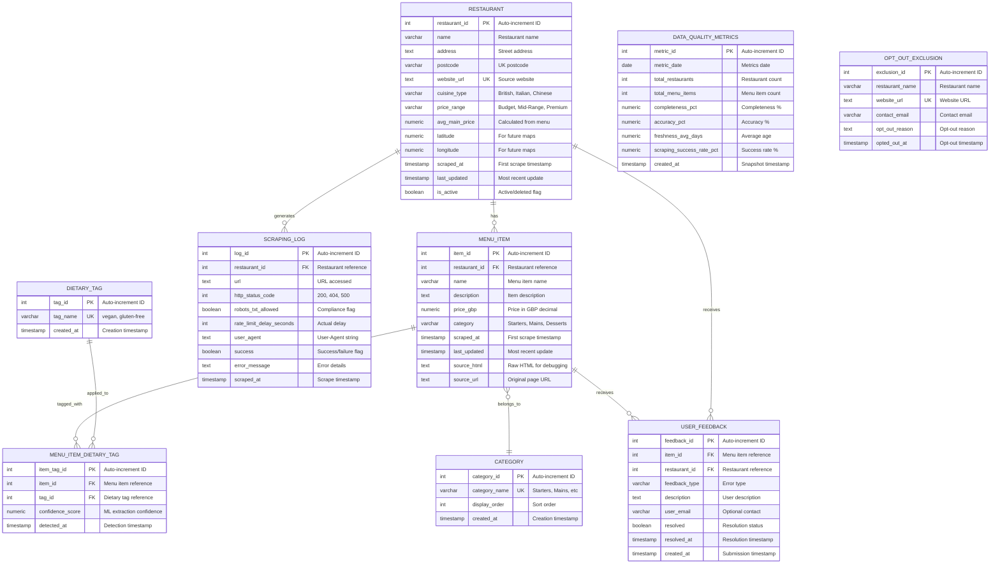

# Data Model: Plymouth Research Restaurant Menu Analytics

## Document Information

| Field | Value |
|-------|-------|
| **Document ID** | ARCKIT-DATA-20251117-001-PLYMOUTH-RESEARCH |
| **Project** | Plymouth Research Restaurant Menu Analytics (Project 001) |
| **Document Type** | Data Model |
| **Classification** | PUBLIC |
| **Version** | 1.0 |
| **Status** | DRAFT |
| **Date** | 2025-11-17 |
| **Owner** | Research Director & Data Engineer |

## Revision History

| Version | Date | Author | Changes |
|---------|------|--------|---------|
| 1.0 | 2025-11-17 | ArcKit AI | Initial creation from `/arckit.data-model` command |

---

## Executive Summary

### Overview

This data model defines the complete database schema for the Plymouth Research Restaurant Menu Analytics platform, supporting web scraping of 150+ restaurant menus in Plymouth, UK, data normalization, quality tracking, and interactive dashboard delivery.

**Purpose**: Enable comprehensive restaurant menu comparison and dietary filtering for consumers, researchers, and journalists, while maintaining ethical scraping practices and UK GDPR compliance.

**Business Domain**: Web scraping, data analytics, restaurant menu aggregation, public business data (NO personal information).

**Technical Foundation**: PostgreSQL 15+ relational database with full-text search, JSONB support, and GIS extensions for future geographic features.

### Model Statistics

- **Total Entities**: 9 entities defined (E-001 through E-009)
- **Total Attributes**: 79 attributes across all entities
- **Total Relationships**: 8 relationships mapped (1 many-to-many junction table)
- **Data Classification**:
  - 🟢 Public: 9 entities (100% - all restaurant business data is publicly accessible)
  - 🟡 Internal: 0 entities
  - 🟠 Confidential: 0 entities
  - 🔴 Restricted: 0 entities

### Compliance Summary

- **GDPR/DPA 2018 Status**: COMPLIANT (No PII, public business data only)
- **PII Entities**: 0 entities contain personally identifiable information
- **Data Protection Impact Assessment (DPIA)**: **NOT REQUIRED** (no personal data processing)
- **Data Retention**: 12 months for menu items (trend analysis), indefinite for restaurants (unless opted out)
- **Cross-Border Transfers**: UK-only (no international data transfers)

**Legal Basis**: Legitimate interests (GDPR Art 6(1)(f)) - business research and consumer information services using publicly available business data.

### Key Data Governance Stakeholders

- **Data Owner (Business)**: Research Director - Accountable for data quality and research integrity
- **Data Steward**: Research Director - Defines data governance policies and quality standards
- **Data Custodian (Technical)**: Data Engineer - Manages database infrastructure, ETL pipelines, and data security
- **Data Protection Officer**: Legal/Compliance Advisor - Ensures GDPR compliance (consultative role)

---

## Visual Entity-Relationship Diagram (ERD)



**Diagram Notes**:
- **Cardinality**: `||` = exactly one, `o{` = zero or more, `|{` = one or more
- **Primary Keys (PK)**: Uniquely identify each record (auto-increment integers)
- **Foreign Keys (FK)**: Reference other entities (ON DELETE CASCADE or SET NULL)
- **Unique Keys (UK)**: Must be unique but not primary identifier (website_url, category_name, tag_name)

---

## Entity Catalog

### Entity E-001: Restaurant

**Description**: Core entity representing restaurants/bars in Plymouth with menu data. This is the primary business entity around which all scraping and analytics activities occur.

**Source Requirements**:
- DR-001: Restaurant Entity (name, address, website URL, cuisine type, price range, metadata)
- FR-003: Geographic filtering (latitude/longitude for future map features)
- FR-015: Opt-out mechanism (is_active flag to mark opted-out restaurants)

**Business Context**: Restaurants are the data source for all menu information. Each restaurant has a unique website URL from which menus are scraped weekly. Restaurants can opt out of the platform, triggering soft deletion (is_active = FALSE) while preserving historical data for trend analysis.

**Data Ownership**:
- **Business Owner**: Research Director - Accountable for restaurant registry accuracy
- **Technical Owner**: Data Engineer - Maintains database schema and ETL pipelines
- **Data Steward**: Research Director - Approves restaurant additions/removals

**Data Classification**: PUBLIC (all data is publicly available business information)

**Volume Estimates**:
- **Initial Volume**: 150 restaurants at go-live (Phase 1)
- **Growth Rate**: +10-20 restaurants per quarter (expansion in Plymouth)
- **Peak Volume**: 500 restaurants at Year 3 (expand to Devon region)
- **Average Record Size**: 1.5 KB per restaurant

**Data Retention**:
- **Active Period**: Indefinite for active restaurants (is_active = TRUE)
- **Opt-Out Retention**: 12 months after opt-out (historical data for trend analysis)
- **Total Retention**: Indefinite (unless opted out, then 12 months)
- **Deletion Policy**: Soft delete (is_active = FALSE) on opt-out, hard delete after 12 months

#### Attributes

| Attribute | Type | Required | PII | Description | Validation Rules | Default | Source Req |
|-----------|------|----------|-----|-------------|------------------|---------|------------|
| restaurant_id | SERIAL | Yes | No | Unique identifier | Auto-increment integer | Auto-generated | DR-001 |
| name | VARCHAR(255) | Yes | No | Restaurant/bar name | Non-empty, 1-255 chars, title case | None | DR-001 |
| address | TEXT | No | No | Street address | Valid UK address format | NULL | DR-001 |
| postcode | VARCHAR(10) | No | No | UK postcode | UK postcode format (e.g., PL1 1AA) | NULL | DR-001 |
| website_url | TEXT | Yes | No | Restaurant website URL | Valid URL format, HTTPS preferred, unique | None | DR-001 |
| cuisine_type | VARCHAR(50) | No | No | Cuisine category | British, Italian, Chinese, Indian, Thai, etc. | NULL | DR-001 |
| price_range | VARCHAR(20) | No | No | Price bracket | Budget, Mid-Range, Premium | NULL | DR-001 |
| avg_main_price | NUMERIC(10,2) | No | No | Average main course price | Calculated from menu_items, non-negative | NULL | DR-001 |
| latitude | NUMERIC(9,6) | No | No | GPS latitude | Range: -90 to 90, 6 decimal places | NULL | FR-003 |
| longitude | NUMERIC(9,6) | No | No | GPS longitude | Range: -180 to 180, 6 decimal places | NULL | FR-003 |
| scraped_at | TIMESTAMP | Yes | No | First scrape timestamp | ISO 8601 timestamp | NOW() | DR-001 |
| last_updated | TIMESTAMP | Yes | No | Most recent scrape timestamp | ISO 8601 timestamp, >= scraped_at | NOW() | DR-001 |
| is_active | BOOLEAN | Yes | No | Active/opted-out flag | TRUE (active) or FALSE (opted out) | TRUE | FR-015 |

**Attribute Notes**:
- **PII Attributes**: NONE - all data is public business information
- **Encrypted Attributes**: NONE - public data does not require encryption
- **Derived Attributes**: avg_main_price (calculated weekly from menu_items.price_gbp WHERE category = 'Mains')
- **Audit Attributes**: scraped_at (creation), last_updated (modification), is_active (soft delete)

#### Relationships

**Outgoing Relationships** (this entity references others):
- NONE (Restaurant is a root entity)

**Incoming Relationships** (other entities reference this):
- **E-002 (Menu Item)** → E-001 (Restaurant): One-to-many
  - Foreign Key: menu_items.restaurant_id references restaurants.restaurant_id
  - Description: Each restaurant has 0 to many menu items
  - Cascade Delete: YES (if restaurant deleted, delete all menu items)

- **E-006 (Scraping Log)** → E-001 (Restaurant): One-to-many
  - Foreign Key: scraping_logs.restaurant_id references restaurants.restaurant_id
  - Description: Each restaurant has 0 to many scraping log entries
  - Cascade Delete: SET NULL (preserve logs even if restaurant deleted)

- **E-008 (User Feedback)** → E-001 (Restaurant): One-to-many
  - Foreign Key: user_feedback.restaurant_id references restaurants.restaurant_id
  - Description: Users can report errors about restaurants
  - Cascade Delete: SET NULL (preserve feedback even if restaurant deleted)

#### Indexes

**Primary Key**:
- `pk_restaurants` on `restaurant_id` (clustered index, auto-increment)

**Unique Constraints**:
- `uk_restaurants_website_url` on `website_url` (prevent duplicate restaurants)

**Performance Indexes**:
- `idx_restaurants_is_active` on `is_active` (filter active restaurants)
- `idx_restaurants_cuisine_type` on `cuisine_type` (cuisine filtering)
- `idx_restaurants_price_range` on `price_range` (price filtering)
- `idx_restaurants_postcode` on `postcode` (geographic filtering)
- `idx_restaurants_last_updated` on `last_updated` (staleness monitoring)

**Full-Text Indexes**:
- `ftx_restaurants_name` on `name` (search by restaurant name)

#### Privacy & Compliance

**GDPR/DPA 2018 Considerations**:
- **Contains PII**: NO (all data is public business information)
- **PII Attributes**: NONE
- **Legal Basis for Processing**: Legitimate interests (GDPR Art 6(1)(f)) - business research and consumer information using publicly available data
- **Data Subject Rights**:
  - **Right to Access**: Not applicable (no personal data)
  - **Right to Rectification**: Restaurants can request corrections via opt-out form
  - **Right to Erasure**: Restaurants can opt out (is_active = FALSE), data deleted after 12 months
  - **Right to Portability**: Not applicable (no personal data)
  - **Right to Object**: Opt-out mechanism implemented (FR-015)
  - **Right to Restrict Processing**: Opt-out sets is_active = FALSE (stops scraping)
- **Data Breach Impact**: LOW (public business data only, no privacy harm)
- **Cross-Border Transfers**: NONE (UK-only data storage and processing)
- **Data Protection Impact Assessment (DPIA)**: NOT REQUIRED (no personal data)

**Sector-Specific Compliance**:
- **PCI-DSS**: Not applicable (no payment data)
- **HIPAA**: Not applicable (no healthcare data)
- **FCA Regulations**: Not applicable (not financial services)
- **Government Security Classification**: PUBLIC (no government classification)

**Audit Logging**:
- **Access Logging**: Not required (public data)
- **Change Logging**: Optional (track manual corrections for quality assurance)
- **Retention of Logs**: 30 days (operational troubleshooting)

---

### Entity E-002: Menu Item

**Description**: Individual menu items (dishes, drinks) extracted from restaurant websites. This is the core analytical entity enabling price comparison, dietary filtering, and trend analysis.

**Source Requirements**:
- DR-002: Menu Item Entity (name, description, price, category, restaurant association, dietary tags)
- DR-009: CSV Export (menu items export with all attributes)
- FR-001: Search by menu item name
- FR-004: Filter by dietary tags (vegan, gluten-free, etc.)

**Business Context**: Menu items are the atomic unit of analysis. Each item belongs to exactly one restaurant and can have multiple dietary tags. Items are re-scraped weekly to detect price changes, menu updates, and seasonal variations. Historical snapshots enable 12-month trend analysis.

**Data Ownership**:
- **Business Owner**: Research Director - Accountable for menu data accuracy
- **Technical Owner**: Data Engineer - Maintains scraping logic and normalization rules
- **Data Steward**: Research Director - Defines categorization and quality standards

**Data Classification**: PUBLIC (all data is publicly available on restaurant websites)

**Volume Estimates**:
- **Initial Volume**: 10,000 menu items at go-live (150 restaurants × ~67 items avg)
- **Growth Rate**: +500-1,000 items per quarter (new restaurants + menu expansions)
- **Peak Volume**: 50,000 menu items at Year 3 (500 restaurants × ~100 items avg)
- **Average Record Size**: 2 KB per menu item (includes source_html)

**Data Retention**:
- **Active Period**: 12 months in hot storage (PostgreSQL)
- **Archive Period**: 12-24 months in cold storage (compressed Parquet/S3)
- **Total Retention**: 24 months (trend analysis requires 12+ months history)
- **Deletion Policy**: Hard delete after 24 months (or when restaurant opts out + 12 months)

#### Attributes

| Attribute | Type | Required | PII | Description | Validation Rules | Default | Source Req |
|-----------|------|----------|-----|-------------|------------------|---------|------------|
| item_id | SERIAL | Yes | No | Unique identifier | Auto-increment integer | Auto-generated | DR-002 |
| restaurant_id | INTEGER | Yes | No | Restaurant reference | Must reference valid restaurant | None | DR-002 |
| name | VARCHAR(255) | Yes | No | Menu item name | Non-empty, 1-255 chars, title case | None | DR-002 |
| description | TEXT | No | No | Item description | Max 2000 chars, plain text | NULL | DR-002 |
| price_gbp | NUMERIC(10,2) | No | No | Price in GBP | Non-negative, 0.50-500.00 range, 2 decimals | NULL | DR-002 |
| category | VARCHAR(50) | No | No | Menu category | Starters, Mains, Desserts, Drinks, Sides, Specials | NULL | DR-002 |
| scraped_at | TIMESTAMP | Yes | No | First scrape timestamp | ISO 8601 timestamp | NOW() | DR-002 |
| last_updated | TIMESTAMP | Yes | No | Most recent update | ISO 8601 timestamp, >= scraped_at | NOW() | DR-002 |
| source_html | TEXT | No | No | Raw HTML snippet | HTML source for debugging, max 5000 chars | NULL | DR-002 |
| source_url | TEXT | No | No | Source page URL | Valid URL format, original menu page | NULL | DR-002 |

**Attribute Notes**:
- **PII Attributes**: NONE - all data is public menu information
- **Encrypted Attributes**: NONE - public data does not require encryption
- **Derived Attributes**: NONE (avg_main_price calculated at restaurant level)
- **Audit Attributes**: scraped_at (creation), last_updated (modification for price change detection)
- **Data Lineage**: source_url and scraped_at enable traceability back to original website

#### Relationships

**Outgoing Relationships** (this entity references others):
- **Menu Item → Restaurant**: Many-to-one
  - Foreign Key: menu_items.restaurant_id references restaurants.restaurant_id
  - Description: Each menu item belongs to exactly one restaurant
  - Cascade Delete: YES (if restaurant deleted, delete all menu items)
  - Orphan Check: REQUIRED (cannot create menu item without valid restaurant)

- **Menu Item → Category**: Many-to-one (via category name lookup)
  - Soft reference: menu_items.category matches categories.category_name
  - Description: Each menu item belongs to one category (or NULL if uncategorized)
  - Implementation: Application-level constraint (not enforced by foreign key)

**Incoming Relationships** (other entities reference this):
- **E-005 (Menu Item Dietary Tags)** → E-002 (Menu Item): One-to-many
  - Foreign Key: menu_item_dietary_tags.item_id references menu_items.item_id
  - Description: Each menu item can have multiple dietary tags
  - Cascade Delete: YES (if menu item deleted, delete tag associations)

- **E-008 (User Feedback)** → E-002 (Menu Item): One-to-many
  - Foreign Key: user_feedback.item_id references menu_items.item_id
  - Description: Users can report errors about specific menu items
  - Cascade Delete: SET NULL (preserve feedback even if menu item deleted)

#### Indexes

**Primary Key**:
- `pk_menu_items` on `item_id` (clustered index, auto-increment)

**Foreign Keys**:
- `fk_menu_items_restaurant` on `restaurant_id`
  - References: restaurants.restaurant_id
  - On Delete: CASCADE (delete menu items if restaurant deleted)
  - On Update: CASCADE

**Performance Indexes**:
- `idx_menu_items_restaurant_id` on `restaurant_id` (filter by restaurant)
- `idx_menu_items_category` on `category` (filter by category)
- `idx_menu_items_price_gbp` on `price_gbp` (price range filtering)
- `idx_menu_items_last_updated` on `last_updated` (staleness monitoring)
- `idx_menu_items_restaurant_category` on `(restaurant_id, category)` (composite index for restaurant menu browsing)

**Full-Text Indexes**:
- `ftx_menu_items_name` on `name` (search by menu item name)
- `ftx_menu_items_description` on `description` (search by description keywords)

#### Privacy & Compliance

**GDPR/DPA 2018 Considerations**:
- **Contains PII**: NO (all data is public business information)
- **PII Attributes**: NONE
- **Legal Basis for Processing**: Legitimate interests (GDPR Art 6(1)(f)) - business research using publicly available menu data
- **Data Subject Rights**: Not applicable (no personal data)
- **Data Breach Impact**: LOW (public menu data only)
- **Cross-Border Transfers**: NONE (UK-only storage)
- **Data Protection Impact Assessment (DPIA)**: NOT REQUIRED

**Audit Logging**:
- **Access Logging**: Not required (public data)
- **Change Logging**: YES (track price changes for trend analysis)
- **Retention of Logs**: 24 months (aligned with data retention)

---

### Entity E-003: Category (Reference Data)

**Description**: Controlled vocabulary for menu item categories (Starters, Mains, Desserts, Drinks, Sides, Specials) to enable consistent categorization, filtering, and analytics.

**Source Requirements**:
- DR-003: Category Reference Data
- FR-005: Filter by meal type (Starters, Mains, Desserts)

**Business Context**: Categories standardize menu item classification across restaurants. This reference table is pre-populated with common UK menu categories and rarely changes. Categories enable dashboard filtering ("show me all Mains under £15") and analytics ("average price of Starters across Plymouth").

**Data Ownership**:
- **Business Owner**: Research Director - Defines canonical category list
- **Technical Owner**: Data Engineer - Maintains reference data table
- **Data Steward**: Research Director - Approves new category additions

**Data Classification**: PUBLIC (reference data taxonomy)

**Volume Estimates**:
- **Initial Volume**: 6-10 categories at go-live
- **Growth Rate**: +1-2 categories per year (rare additions like "Brunch" or "Sharing Plates")
- **Peak Volume**: 15-20 categories at Year 3
- **Average Record Size**: 0.1 KB per category

**Data Retention**:
- **Active Period**: Indefinite (reference data)
- **Archive Period**: N/A (not archived)
- **Total Retention**: Indefinite
- **Deletion Policy**: Soft delete (if category deprecated, mark inactive but preserve for historical data)

#### Attributes

| Attribute | Type | Required | PII | Description | Validation Rules | Default | Source Req |
|-----------|------|----------|-----|-------------|------------------|---------|------------|
| category_id | SERIAL | Yes | No | Unique identifier | Auto-increment integer | Auto-generated | DR-003 |
| category_name | VARCHAR(50) | Yes | No | Category name | Unique, non-empty, title case | None | DR-003 |
| display_order | INTEGER | No | No | Sort order in UI | Positive integer, unique | NULL | DR-003 |
| created_at | TIMESTAMP | Yes | No | Creation timestamp | ISO 8601 timestamp | NOW() | DR-003 |

**Attribute Notes**:
- **Reference Data**: Pre-populated with: Starters, Mains, Desserts, Drinks, Sides, Specials
- **Display Order**: Controls dropdown/filter ordering (Starters=1, Mains=2, etc.)

#### Relationships

**Outgoing Relationships**: NONE (reference data)

**Incoming Relationships**:
- **E-002 (Menu Item)** → E-003 (Category): Many-to-one (soft reference via category name)
  - Description: Menu items reference categories by name (not enforced foreign key)
  - Cascade Delete: N/A (categories rarely deleted)

#### Indexes

**Primary Key**:
- `pk_categories` on `category_id`

**Unique Constraints**:
- `uk_categories_category_name` on `category_name` (prevent duplicates)

**Performance Indexes**:
- `idx_categories_display_order` on `display_order` (UI rendering)

#### Privacy & Compliance

**GDPR/DPA 2018 Considerations**:
- **Contains PII**: NO (reference data taxonomy)
- **Legal Basis**: Not applicable (no personal data processing)
- **DPIA**: NOT REQUIRED

---

### Entity E-004: Dietary Tag (Reference Data)

**Description**: Controlled vocabulary for dietary tags (vegan, vegetarian, gluten-free, dairy-free, nut-free, etc.) applied to menu items via many-to-many relationship.

**Source Requirements**:
- DR-004: Dietary Tags Entity
- FR-004: Filter by dietary tags (vegan, gluten-free, etc.)

**Business Context**: Dietary tags enable critical filtering for consumers with dietary restrictions or preferences. Tags are extracted from menu item descriptions using keyword rules or ML models. The many-to-many relationship allows menu items to have multiple tags (e.g., "vegan AND gluten-free").

**Data Ownership**:
- **Business Owner**: Research Director - Defines canonical tag vocabulary
- **Technical Owner**: Data Engineer - Maintains extraction rules and ML models
- **Data Steward**: Research Director - Approves new tag additions

**Data Classification**: PUBLIC (reference data taxonomy)

**Volume Estimates**:
- **Initial Volume**: 5-10 tags at go-live (vegan, vegetarian, gluten-free, dairy-free, nut-free)
- **Growth Rate**: +1-3 tags per year (e.g., "halal", "kosher", "low-carb")
- **Peak Volume**: 15-20 tags at Year 3
- **Average Record Size**: 0.1 KB per tag

**Data Retention**:
- **Active Period**: Indefinite (reference data)
- **Archive Period**: N/A
- **Total Retention**: Indefinite
- **Deletion Policy**: Soft delete (if tag deprecated, mark inactive but preserve for historical data)

#### Attributes

| Attribute | Type | Required | PII | Description | Validation Rules | Default | Source Req |
|-----------|------|----------|-----|-------------|------------------|---------|------------|
| tag_id | SERIAL | Yes | No | Unique identifier | Auto-increment integer | Auto-generated | DR-004 |
| tag_name | VARCHAR(50) | Yes | No | Dietary tag name | Unique, lowercase, hyphenated | None | DR-004 |
| created_at | TIMESTAMP | Yes | No | Creation timestamp | ISO 8601 timestamp | NOW() | DR-004 |

**Attribute Notes**:
- **Reference Data**: Pre-populated with: vegan, vegetarian, gluten-free, dairy-free, nut-free, halal, kosher
- **Naming Convention**: Lowercase, hyphenated (e.g., "gluten-free" not "Gluten Free")

#### Relationships

**Outgoing Relationships**: NONE (reference data)

**Incoming Relationships**:
- **E-005 (Menu Item Dietary Tags)** → E-004 (Dietary Tag): One-to-many
  - Foreign Key: menu_item_dietary_tags.tag_id references dietary_tags.tag_id
  - Description: Junction table links tags to menu items
  - Cascade Delete: CASCADE (if tag deleted, delete all associations)

#### Indexes

**Primary Key**:
- `pk_dietary_tags` on `tag_id`

**Unique Constraints**:
- `uk_dietary_tags_tag_name` on `tag_name` (prevent duplicates)

#### Privacy & Compliance

**GDPR/DPA 2018 Considerations**:
- **Contains PII**: NO (reference data taxonomy)
- **Legal Basis**: Not applicable
- **DPIA**: NOT REQUIRED

---

### Entity E-005: Menu Item Dietary Tags (Junction Table)

**Description**: Many-to-many junction table linking menu items to dietary tags, with confidence scores for ML-based tag extraction.

**Source Requirements**:
- DR-004: Dietary Tags Entity (many-to-many relationship)
- FR-004: Filter by dietary tags

**Business Context**: This junction table resolves the many-to-many relationship: one menu item can have multiple dietary tags (e.g., "Quinoa Salad" is both vegan AND gluten-free), and one dietary tag applies to many menu items. The confidence_score field tracks ML model certainty for tag extraction (0.0-1.0 range), enabling quality thresholds (e.g., only display tags with confidence >0.8).

**Data Ownership**:
- **Business Owner**: Data Engineer - Manages tag extraction logic
- **Technical Owner**: Data Engineer - Maintains junction table
- **Data Steward**: Research Director - Reviews low-confidence tags

**Data Classification**: PUBLIC (derived from public menu data)

**Volume Estimates**:
- **Initial Volume**: 20,000 tag associations at go-live (10,000 items × 2 tags avg)
- **Growth Rate**: +1,000-2,000 associations per quarter
- **Peak Volume**: 100,000 tag associations at Year 3 (50,000 items × 2 tags avg)
- **Average Record Size**: 0.2 KB per association

**Data Retention**:
- **Active Period**: Aligned with menu_items retention (12 months hot storage)
- **Archive Period**: 12-24 months cold storage
- **Total Retention**: 24 months
- **Deletion Policy**: CASCADE delete when menu item deleted

#### Attributes

| Attribute | Type | Required | PII | Description | Validation Rules | Default | Source Req |
|-----------|------|----------|-----|-------------|------------------|---------|------------|
| item_tag_id | SERIAL | Yes | No | Unique identifier | Auto-increment integer | Auto-generated | DR-004 |
| item_id | INTEGER | Yes | No | Menu item reference | Must reference valid menu_items.item_id | None | DR-004 |
| tag_id | INTEGER | Yes | No | Dietary tag reference | Must reference valid dietary_tags.tag_id | None | DR-004 |
| confidence_score | NUMERIC(3,2) | No | No | ML extraction confidence | Range 0.00-1.00, 2 decimal places | NULL | DR-004 |
| detected_at | TIMESTAMP | Yes | No | Detection timestamp | ISO 8601 timestamp | NOW() | DR-004 |

**Attribute Notes**:
- **Composite Unique Key**: (item_id, tag_id) prevents duplicate tag associations
- **Confidence Score**: 0.00 = no confidence, 1.00 = 100% confident, NULL = manual tag (not ML-extracted)
- **Quality Threshold**: Dashboard only displays tags with confidence_score >= 0.80 or manual tags (NULL)

#### Relationships

**Outgoing Relationships** (this entity references others):
- **Menu Item Dietary Tags → Menu Item**: Many-to-one
  - Foreign Key: menu_item_dietary_tags.item_id references menu_items.item_id
  - Cascade Delete: YES (if menu item deleted, delete tag associations)

- **Menu Item Dietary Tags → Dietary Tag**: Many-to-one
  - Foreign Key: menu_item_dietary_tags.tag_id references dietary_tags.tag_id
  - Cascade Delete: CASCADE (if tag deleted, delete all associations)

**Incoming Relationships**: NONE (junction table)

#### Indexes

**Primary Key**:
- `pk_menu_item_dietary_tags` on `item_tag_id`

**Foreign Keys**:
- `fk_menu_item_dietary_tags_item` on `item_id`
  - References: menu_items.item_id
  - On Delete: CASCADE
- `fk_menu_item_dietary_tags_tag` on `tag_id`
  - References: dietary_tags.tag_id
  - On Delete: CASCADE

**Unique Constraints**:
- `uk_menu_item_dietary_tags_item_tag` on `(item_id, tag_id)` (prevent duplicate associations)

**Performance Indexes**:
- `idx_menu_item_dietary_tags_item_id` on `item_id` (query tags for menu item)
- `idx_menu_item_dietary_tags_tag_id` on `tag_id` (query menu items for tag)
- `idx_menu_item_dietary_tags_confidence` on `confidence_score` (filter low-confidence tags)

#### Privacy & Compliance

**GDPR/DPA 2018 Considerations**:
- **Contains PII**: NO (derived from public menu data)
- **Legal Basis**: Not applicable
- **DPIA**: NOT REQUIRED

---

### Entity E-006: Scraping Log

**Description**: Comprehensive audit log of all web scraping activity (URLs accessed, HTTP status codes, robots.txt compliance, rate limiting) for ethical compliance verification and debugging.

**Source Requirements**:
- DR-005: Scraping Logs
- NFR-003: Ethical scraping compliance (robots.txt, rate limiting, User-Agent)

**Business Context**: Scraping logs provide evidence of ethical web scraping practices (CRITICAL for legal defense if challenged). Logs enable debugging (why did scraping fail for Restaurant X?), rate limit monitoring (are we honoring 5-second delays?), and compliance audits (did we respect robots.txt 100% of the time?). Logs are retained for 90 days for operational troubleshooting.

**Data Ownership**:
- **Business Owner**: Data Engineer - Accountable for scraping compliance
- **Technical Owner**: Data Engineer - Maintains scraping infrastructure
- **Data Steward**: Legal/Compliance Advisor - Reviews logs for compliance audits

**Data Classification**: PUBLIC (logs of public website access)

**Volume Estimates**:
- **Initial Volume**: 600 log entries per week (150 restaurants × 4 pages avg × weekly scrape)
- **Growth Rate**: +100-200 entries per week (new restaurants)
- **Peak Volume**: 50,000 log entries per year (2,000 restaurants × 4 pages × 52 weeks / 4 retention quarters)
- **Average Record Size**: 1 KB per log entry

**Data Retention**:
- **Active Period**: 90 days (operational troubleshooting and compliance audits)
- **Archive Period**: NONE (logs deleted after 90 days)
- **Total Retention**: 90 days
- **Deletion Policy**: Hard delete after 90 days (automated batch job)

#### Attributes

| Attribute | Type | Required | PII | Description | Validation Rules | Default | Source Req |
|-----------|------|----------|-----|-------------|------------------|---------|------------|
| log_id | SERIAL | Yes | No | Unique identifier | Auto-increment integer | Auto-generated | DR-005 |
| restaurant_id | INTEGER | No | No | Restaurant reference | References restaurants.restaurant_id (optional) | NULL | DR-005 |
| url | TEXT | Yes | No | URL accessed | Valid URL format, max 2000 chars | None | DR-005 |
| http_status_code | INTEGER | No | No | HTTP response code | 100-599 range (200, 404, 500, etc.) | NULL | DR-005 |
| robots_txt_allowed | BOOLEAN | No | No | Robots.txt compliance | TRUE = allowed, FALSE = blocked (should not scrape) | NULL | DR-005 |
| rate_limit_delay_seconds | INTEGER | No | No | Actual delay before request | Non-negative integer, should be >=5 | NULL | DR-005 |
| user_agent | TEXT | No | No | User-Agent header sent | Should identify Plymouth Research with contact | NULL | DR-005 |
| success | BOOLEAN | No | No | Scrape success flag | TRUE = data extracted, FALSE = failed | NULL | DR-005 |
| error_message | TEXT | No | No | Error details if failed | Max 2000 chars, stack trace or error message | NULL | DR-005 |
| scraped_at | TIMESTAMP | Yes | No | Scrape execution timestamp | ISO 8601 timestamp | NOW() | DR-005 |

**Attribute Notes**:
- **Compliance Evidence**: robots_txt_allowed, rate_limit_delay_seconds, user_agent provide legal defense
- **Quality Assurance**: success, error_message enable debugging and scraping success rate calculation
- **Audit Trail**: All scraping activity logged, no exceptions

#### Relationships

**Outgoing Relationships** (this entity references others):
- **Scraping Log → Restaurant**: Many-to-one (optional)
  - Foreign Key: scraping_logs.restaurant_id references restaurants.restaurant_id
  - Cascade Delete: SET NULL (preserve logs even if restaurant deleted)
  - Description: Links log entries to restaurants (NULL if exploratory scrape)

**Incoming Relationships**: NONE (audit log)

#### Indexes

**Primary Key**:
- `pk_scraping_logs` on `log_id`

**Foreign Keys**:
- `fk_scraping_logs_restaurant` on `restaurant_id`
  - References: restaurants.restaurant_id
  - On Delete: SET NULL (preserve logs)

**Performance Indexes**:
- `idx_scraping_logs_restaurant_id` on `restaurant_id` (filter by restaurant)
- `idx_scraping_logs_scraped_at` on `scraped_at` (time-based queries, retention cleanup)
- `idx_scraping_logs_success` on `success` (failure analysis)
- `idx_scraping_logs_robots_txt_allowed` on `robots_txt_allowed` (compliance audits)

#### Privacy & Compliance

**GDPR/DPA 2018 Considerations**:
- **Contains PII**: NO (logs of public website access)
- **Legal Basis**: Not applicable
- **DPIA**: NOT REQUIRED

**Audit Logging**:
- **Access Logging**: Not required (logs are the audit trail)
- **Retention of Logs**: 90 days (operational and compliance)

---

### Entity E-007: Data Quality Metrics

**Description**: Time-series tracking table for data quality metrics (completeness, accuracy, freshness, scraping success rate) to monitor Goal G-1 (95% Data Quality) over time.

**Source Requirements**:
- DR-006: Data Quality Metrics
- G-1: Data Quality Target (95% accuracy and completeness)

**Business Context**: Data quality metrics enable proactive monitoring of platform health. Daily snapshots track total restaurants, total menu items, completeness %, accuracy %, freshness (average data age), and scraping success rate. Metrics trigger alerts when quality degrades (e.g., completeness drops below 90%) and inform weekly data quality reports to stakeholders.

**Data Ownership**:
- **Business Owner**: Research Director - Accountable for data quality targets
- **Technical Owner**: Data Engineer - Calculates and tracks metrics
- **Data Steward**: Research Director - Reviews quality reports and approves remediation plans

**Data Classification**: PUBLIC (aggregated quality metrics)

**Volume Estimates**:
- **Initial Volume**: 365 metric snapshots per year (daily)
- **Growth Rate**: 365 snapshots per year (constant)
- **Peak Volume**: 1,095 snapshots at Year 3 (3 years × 365 days)
- **Average Record Size**: 0.3 KB per snapshot

**Data Retention**:
- **Active Period**: 24 months (trend analysis)
- **Archive Period**: NONE (metrics deleted after 24 months)
- **Total Retention**: 24 months
- **Deletion Policy**: Hard delete after 24 months (automated batch job)

#### Attributes

| Attribute | Type | Required | PII | Description | Validation Rules | Default | Source Req |
|-----------|------|----------|-----|-------------|------------------|---------|------------|
| metric_id | SERIAL | Yes | No | Unique identifier | Auto-increment integer | Auto-generated | DR-006 |
| metric_date | DATE | Yes | No | Metrics snapshot date | ISO 8601 date, unique per day | TODAY() | DR-006 |
| total_restaurants | INTEGER | No | No | Restaurant count | Non-negative integer | NULL | DR-006 |
| total_menu_items | INTEGER | No | No | Menu item count | Non-negative integer | NULL | DR-006 |
| completeness_pct | NUMERIC(5,2) | No | No | Completeness percentage | 0.00-100.00 range, 2 decimals | NULL | DR-006 |
| accuracy_pct | NUMERIC(5,2) | No | No | Accuracy percentage | 0.00-100.00 range, 2 decimals | NULL | DR-006 |
| freshness_avg_days | NUMERIC(5,1) | No | No | Average data age in days | Non-negative, 1 decimal | NULL | DR-006 |
| scraping_success_rate_pct | NUMERIC(5,2) | No | No | Scraping success rate | 0.00-100.00 range, 2 decimals | NULL | DR-006 |
| created_at | TIMESTAMP | Yes | No | Snapshot timestamp | ISO 8601 timestamp | NOW() | DR-006 |

**Attribute Notes**:
- **Completeness**: % of menu items with all required fields populated (name, price_gbp, category)
- **Accuracy**: % of sampled menu items passing manual validation (sample 50-100 items weekly)
- **Freshness**: Average age of menu data in days (AVG(NOW() - last_updated))
- **Scraping Success Rate**: % of scraping attempts that succeeded (from scraping_logs)

#### Relationships

**Outgoing Relationships**: NONE (time-series metrics)

**Incoming Relationships**: NONE (standalone metrics table)

#### Indexes

**Primary Key**:
- `pk_data_quality_metrics` on `metric_id`

**Unique Constraints**:
- `uk_data_quality_metrics_metric_date` on `metric_date` (one snapshot per day)

**Performance Indexes**:
- `idx_data_quality_metrics_metric_date` on `metric_date` (time-series queries)
- `idx_data_quality_metrics_completeness_pct` on `completeness_pct` (quality trend analysis)

#### Privacy & Compliance

**GDPR/DPA 2018 Considerations**:
- **Contains PII**: NO (aggregated quality metrics)
- **Legal Basis**: Not applicable
- **DPIA**: NOT REQUIRED

---

### Entity E-008: User Feedback

**Description**: User-reported data errors (incorrect prices, wrong dietary tags, stale data) to improve data quality iteratively through crowdsourced corrections.

**Source Requirements**:
- DR-007: User Feedback (Reporting Errors)
- FR-014: Error reporting mechanism

**Business Context**: Users can report data quality issues via dashboard feedback form. Feedback creates a quality assurance queue for Data Engineer review. Resolved feedback improves data accuracy and informs scraping logic improvements (e.g., if many users report incorrect prices from Restaurant X, investigate parsing logic for that site).

**Data Ownership**:
- **Business Owner**: Research Director - Accountable for feedback resolution process
- **Technical Owner**: Data Engineer - Investigates and resolves feedback
- **Data Steward**: Research Director - Reviews feedback trends and quality patterns

**Data Classification**: PUBLIC (feedback about public menu data; user_email is optional and not PII if business email)

**Volume Estimates**:
- **Initial Volume**: 10-20 feedback submissions per month (low initially)
- **Growth Rate**: +5-10 submissions per month (as user base grows)
- **Peak Volume**: 1,000 feedback submissions at Year 3 (high user engagement)
- **Average Record Size**: 0.5 KB per submission

**Data Retention**:
- **Active Period**: 12 months (historical feedback trends)
- **Archive Period**: NONE (feedback deleted after 12 months)
- **Total Retention**: 12 months
- **Deletion Policy**: Hard delete after 12 months (or when menu item deleted)

#### Attributes

| Attribute | Type | Required | PII | Description | Validation Rules | Default | Source Req |
|-----------|------|----------|-----|-------------|------------------|---------|------------|
| feedback_id | SERIAL | Yes | No | Unique identifier | Auto-increment integer | Auto-generated | DR-007 |
| item_id | INTEGER | No | No | Menu item reference | References menu_items.item_id (optional) | NULL | DR-007 |
| restaurant_id | INTEGER | No | No | Restaurant reference | References restaurants.restaurant_id (optional) | NULL | DR-007 |
| feedback_type | VARCHAR(50) | No | No | Error type category | incorrect_price, wrong_dietary_tag, stale_data, other | NULL | DR-007 |
| description | TEXT | No | No | User description | Max 2000 chars, plain text | NULL | DR-007 |
| user_email | VARCHAR(255) | No | No | Optional contact email | Valid email format (optional for follow-up) | NULL | DR-007 |
| resolved | BOOLEAN | Yes | No | Resolution status | TRUE = resolved, FALSE = pending | FALSE | DR-007 |
| resolved_at | TIMESTAMP | No | No | Resolution timestamp | ISO 8601 timestamp, set when resolved = TRUE | NULL | DR-007 |
| created_at | TIMESTAMP | Yes | No | Submission timestamp | ISO 8601 timestamp | NOW() | DR-007 |

**Attribute Notes**:
- **User Email**: Optional field for follow-up (not required). If provided, treated as business contact (not PII).
- **Resolution Workflow**: Data Engineer reviews feedback, fixes data, sets resolved = TRUE and resolved_at = NOW()
- **Feedback Types**: Predefined categories for trend analysis (which error types are most common?)

#### Relationships

**Outgoing Relationships** (this entity references others):
- **User Feedback → Menu Item**: Many-to-one (optional)
  - Foreign Key: user_feedback.item_id references menu_items.item_id
  - Cascade Delete: SET NULL (preserve feedback even if menu item deleted)

- **User Feedback → Restaurant**: Many-to-one (optional)
  - Foreign Key: user_feedback.restaurant_id references restaurants.restaurant_id
  - Cascade Delete: SET NULL (preserve feedback even if restaurant deleted)

**Incoming Relationships**: NONE (feedback queue)

#### Indexes

**Primary Key**:
- `pk_user_feedback` on `feedback_id`

**Foreign Keys**:
- `fk_user_feedback_item` on `item_id`
  - References: menu_items.item_id
  - On Delete: SET NULL
- `fk_user_feedback_restaurant` on `restaurant_id`
  - References: restaurants.restaurant_id
  - On Delete: SET NULL

**Performance Indexes**:
- `idx_user_feedback_resolved` on `resolved` (filter unresolved feedback)
- `idx_user_feedback_created_at` on `created_at` (recent feedback first)
- `idx_user_feedback_feedback_type` on `feedback_type` (trend analysis)

#### Privacy & Compliance

**GDPR/DPA 2018 Considerations**:
- **Contains PII**: MINIMAL (user_email is optional and not treated as PII if business email)
- **Legal Basis**: Legitimate interests (feedback for data quality improvement)
- **Data Subject Rights**:
  - **Right to Erasure**: Users can request email removal (set user_email = NULL)
- **DPIA**: NOT REQUIRED (minimal data, optional email)

---

### Entity E-009: Opt-Out Exclusion

**Description**: Permanent exclusion list of restaurants that have opted out of the platform, preventing re-scraping in future and honoring Right to Object under GDPR.

**Source Requirements**:
- DR-008: Opt-Out Exclusion List
- FR-015: Opt-out mechanism (restaurant owners can request removal)

**Business Context**: Restaurants can opt out via public opt-out form (website URL + contact email + reason). Opt-out requests are processed within 48 hours: (1) set restaurants.is_active = FALSE (stop scraping), (2) add to opt_out_exclusions table (permanent blocklist), (3) schedule data deletion after 12 months. Opt-out list is checked before adding new restaurants (prevent re-adding opted-out restaurants).

**Data Ownership**:
- **Business Owner**: Research Director - Accountable for opt-out process
- **Technical Owner**: Data Engineer - Implements opt-out logic and scraper exclusion
- **Data Steward**: Legal/Compliance Advisor - Reviews opt-out compliance

**Data Classification**: PUBLIC (restaurant business contact information)

**Volume Estimates**:
- **Initial Volume**: 0-5 opt-outs at go-live (rare initially)
- **Growth Rate**: +1-5 opt-outs per quarter (low opt-out rate expected)
- **Peak Volume**: 50 opt-outs at Year 3 (if 10% opt out)
- **Average Record Size**: 0.5 KB per opt-out

**Data Retention**:
- **Active Period**: Indefinite (permanent exclusion list)
- **Archive Period**: N/A (never deleted to prevent re-scraping)
- **Total Retention**: Indefinite
- **Deletion Policy**: NEVER delete (permanent blocklist for ethical compliance)

#### Attributes

| Attribute | Type | Required | PII | Description | Validation Rules | Default | Source Req |
|-----------|------|----------|-----|-------------|------------------|---------|------------|
| exclusion_id | SERIAL | Yes | No | Unique identifier | Auto-increment integer | Auto-generated | DR-008 |
| restaurant_name | VARCHAR(255) | No | No | Restaurant name | Non-empty, title case | NULL | DR-008 |
| website_url | TEXT | Yes | No | Restaurant website URL | Valid URL format, unique (primary exclusion key) | None | DR-008 |
| contact_email | VARCHAR(255) | No | No | Business contact email | Valid email format (business email, not PII) | NULL | DR-008 |
| opt_out_reason | TEXT | No | No | Opt-out reason | Max 2000 chars, plain text | NULL | DR-008 |
| opted_out_at | TIMESTAMP | Yes | No | Opt-out timestamp | ISO 8601 timestamp | NOW() | DR-008 |

**Attribute Notes**:
- **Primary Exclusion Key**: website_url (unique, prevents re-adding opted-out restaurants)
- **Contact Email**: Business email (not personal PII), used for opt-out confirmation email
- **Opt-Out Reason**: Optional feedback (helps understand why restaurants opt out)

#### Relationships

**Outgoing Relationships**: NONE (standalone exclusion list)

**Incoming Relationships**: NONE (checked before adding new restaurants)

#### Indexes

**Primary Key**:
- `pk_opt_out_exclusions` on `exclusion_id`

**Unique Constraints**:
- `uk_opt_out_exclusions_website_url` on `website_url` (prevent duplicate opt-outs)

**Performance Indexes**:
- `idx_opt_out_exclusions_website_url` on `website_url` (check exclusion before scraping)
- `idx_opt_out_exclusions_opted_out_at` on `opted_out_at` (recent opt-outs first)

#### Privacy & Compliance

**GDPR/DPA 2018 Considerations**:
- **Contains PII**: NO (business contact information only)
- **Legal Basis**: Legitimate interests (honoring opt-out requests)
- **Data Subject Rights**:
  - **Right to Object**: This table implements Right to Object (restaurants can opt out of scraping)
- **DPIA**: NOT REQUIRED (business contact data only)

**Audit Logging**:
- **Access Logging**: Optional (track who views opt-out list)
- **Change Logging**: YES (track opt-out additions for compliance audit trail)
- **Retention of Logs**: Indefinite (aligned with opt-out list retention)

---

## Data Governance Matrix

| Entity | Business Owner | Data Steward | Technical Custodian | Sensitivity | Compliance | Quality SLA | Access Control |
|--------|----------------|--------------|---------------------|-------------|------------|-------------|----------------|
| E-001: Restaurant | Research Director | Research Director | Data Engineer | PUBLIC | GDPR (legitimate interests) | 98% accuracy | Role: All authenticated |
| E-002: Menu Item | Research Director | Research Director | Data Engineer | PUBLIC | GDPR (legitimate interests) | 95% completeness, 95% accuracy | Role: All authenticated |
| E-003: Category | Research Director | Research Director | Data Engineer | PUBLIC | None | 100% completeness | Role: All authenticated |
| E-004: Dietary Tag | Research Director | Research Director | Data Engineer | PUBLIC | None | 100% completeness | Role: All authenticated |
| E-005: Menu Item Dietary Tags | Data Engineer | Research Director | Data Engineer | PUBLIC | None | 80% accuracy (ML confidence >0.8) | Role: All authenticated |
| E-006: Scraping Log | Data Engineer | Legal/Compliance Advisor | Data Engineer | PUBLIC | Ethical scraping compliance | 100% robots.txt compliance | Role: Admin, Data Engineer |
| E-007: Data Quality Metrics | Research Director | Research Director | Data Engineer | PUBLIC | None | Daily snapshots | Role: Admin, Data Engineer |
| E-008: User Feedback | Research Director | Research Director | Data Engineer | PUBLIC | Minimal (optional email) | 95% resolution within 7 days | Role: All authenticated (submit), Admin (resolve) |
| E-009: Opt-Out Exclusion | Research Director | Legal/Compliance Advisor | Data Engineer | PUBLIC | GDPR Right to Object | 100% processed within 48 hours | Role: Admin only |

**Governance Notes**:
- **Business Owner**: Research Director is accountable for all business data quality and strategic decisions
- **Data Steward**: Research Director enforces data governance policies; Legal/Compliance Advisor stewards compliance-critical entities
- **Technical Custodian**: Data Engineer manages all database infrastructure, ETL pipelines, and scraping logic
- **Sensitivity**: All entities are PUBLIC (no PII, no confidential data)
- **Compliance**: GDPR legitimate interests applies to core entities; ethical scraping compliance for logs
- **Quality SLA**: Measurable targets aligned with Goal G-1 (95% data quality)
- **Access Control**: Dashboard users can view all public data; Admin role required for sensitive operations (opt-out, feedback resolution)

---

## CRUD Matrix

**Purpose**: Shows which components/systems can Create, Read, Update, Delete each entity

| Entity | Scraper (ETL) | Dashboard (Streamlit) | Admin Portal | CSV Export API | Quality Monitor | Opt-Out Form |
|--------|---------------|----------------------|--------------|----------------|-----------------|--------------|
| E-001: Restaurant | CRU- | -R-- | CRUD | -R-- | -R-- | ---- |
| E-002: Menu Item | CRU- | -R-- | -RUD | -R-- | -R-- | ---- |
| E-003: Category | ---- | -R-- | CRUD | -R-- | ---- | ---- |
| E-004: Dietary Tag | ---- | -R-- | CRUD | -R-- | ---- | ---- |
| E-005: Menu Item Dietary Tags | CR-- | -R-- | -RUD | -R-- | -R-- | ---- |
| E-006: Scraping Log | CR-- | ---- | -R-- | ---- | -R-- | ---- |
| E-007: Data Quality Metrics | CR-- | -R-- | -R-- | ---- | CR-- | ---- |
| E-008: User Feedback | ---- | CR-- | -RUD | ---- | -R-- | ---- |
| E-009: Opt-Out Exclusion | ---- | ---- | CRUD | ---- | ---- | CR-- |

**Legend**:
- **C** = Create (can insert new records)
- **R** = Read (can query existing records)
- **U** = Update (can modify existing records)
- **D** = Delete (can remove records)
- **-** = No access

**Access Control Implications**:
- **Scraper (ETL)**: Creates/updates restaurants and menu items during weekly scrape, logs all activity
- **Dashboard (Streamlit)**: Read-only access to all public entities, allows user feedback submission
- **Admin Portal**: Full CRUD on all entities (Data Engineer and Research Director access only)
- **CSV Export API**: Read-only access to exportable entities (restaurants, menu items)
- **Quality Monitor**: Creates daily quality metrics snapshots, reads all entities for quality calculations
- **Opt-Out Form**: Public form creates opt-out exclusions (verified before processing)

**Security Considerations**:
- **Least Privilege**: Each component has minimum necessary permissions
- **Separation of Duties**: Dashboard users cannot modify data (prevents accidental corruption)
- **Audit Trail**: All CUD operations logged with timestamp, component, before/after values
- **Write Access**: Only Scraper, Admin Portal, Quality Monitor, and Opt-Out Form can write data

---

## Data Integration Mapping

### Upstream Systems (Data Sources)

#### Integration INT-001: Restaurant Websites (Web Scraping)

**Source System**: 150+ restaurant websites in Plymouth, UK

**Integration Type**: Batch web scraping (weekly schedule)

**Data Flow Direction**: Restaurant Websites → Plymouth Research Platform

**Entities Affected**:
- **E-001 (Restaurant)**: Extracts restaurant name, address, postcode, website URL, cuisine type
  - Source Fields: HTML `<title>`, `<address>`, contact page, menu page metadata
  - Update Frequency: Weekly (Sunday 02:00 UTC)
  - Data Quality SLA: 98% accuracy, <7 day staleness

- **E-002 (Menu Item)**: Extracts menu item name, description, price, category
  - Source Fields: HTML menu tables/lists, `<span class="price">`, item descriptions
  - Update Frequency: Weekly (Sunday 02:00 UTC)
  - Data Quality SLA: 95% completeness, 95% accuracy

**Data Mapping**:
| Source Field | Source Type | Target Entity | Target Attribute | Transformation |
|--------------|-------------|---------------|------------------|----------------|
| HTML `<h1>` or `<title>` | TEXT | E-001 | name | Extract restaurant name, title case |
| HTML `<address>` or contact page | TEXT | E-001 | address | Extract street address, normalize format |
| Menu page URL | TEXT | E-001 | website_url | Direct mapping (source URL) |
| Menu item name (various selectors) | TEXT | E-002 | name | Extract item name, title case, trim whitespace |
| Price text (£12.50, £12.5, 12.50 GBP) | TEXT | E-002 | price_gbp | Normalize to decimal 12.50 (NUMERIC) |
| Item description text | TEXT | E-002 | description | Extract description, plain text, max 2000 chars |
| Category keywords | TEXT | E-002 | category | Classify as Starters/Mains/Desserts/Drinks |

**Data Quality Rules**:
- **Validation**: Reject records with missing required fields (name, price_gbp for menu items)
- **Deduplication**: Detect duplicate menu items by name within restaurant (fuzzy matching)
- **Error Handling**: Failed scrapes logged to E-006 (Scraping Log), retried next cycle
- **Rate Limiting**: 5-second delay between requests per domain (ethical scraping)

**Reconciliation**:
- **Frequency**: Weekly after scrape completion (compare record counts)
- **Method**: Compare total_restaurants and total_menu_items vs previous week
- **Tolerance**: <5% variance acceptable (some menu items may be removed/added seasonally)
- **Alerts**: Email Data Engineer if >10% variance (investigate scraping failures)

---

#### Integration INT-002: Third-Party Email Service (SendGrid/Mailgun)

**Source System**: SendGrid (free tier) or Mailgun (free tier) or AWS SES

**Integration Type**: Transactional email API (real-time)

**Data Flow Direction**: Plymouth Research Platform → Email Service → Restaurant Owners

**Entities Affected**:
- **E-009 (Opt-Out Exclusion)**: Triggers opt-out confirmation emails
  - Update Frequency: Real-time (on opt-out form submission)
  - Data Latency SLA: <1 minute

**Data Mapping**:
| Source Entity | Source Attribute | Target Field | Target Type | Transformation |
|---------------|------------------|--------------|-------------|----------------|
| E-009 | contact_email | Email To | STRING | Direct mapping |
| E-009 | restaurant_name | Email Subject | STRING | "Opt-out Confirmation: {restaurant_name}" |
| E-009 | opted_out_at | Email Body | TIMESTAMP | "Your opt-out request was received on {opted_out_at}" |

**Data Quality Assurance**:
- **Pre-send Validation**: Ensure contact_email is valid email format
- **Retry Logic**: 3 retries with exponential backoff on API failure
- **Monitoring**: Alert if email delivery failure rate exceeds 5%

---

### Downstream Systems (Data Consumers)

#### Integration INT-101: CSV Export (Manual Download)

**Target System**: User's local machine (CSV file download)

**Integration Type**: On-demand CSV export via dashboard button

**Data Flow Direction**: Plymouth Research Platform → CSV File → User

**Entities Shared**:
- **E-001 (Restaurant)**: Provides restaurant data for export
  - Update Frequency: On-demand (user-initiated)
  - Export Format: CSV (RFC 4180 compliant, UTF-8 encoding)

- **E-002 (Menu Item)**: Provides menu item data for export
  - Update Frequency: On-demand (user-initiated)
  - Export Format: CSV (RFC 4180 compliant, UTF-8 encoding)

**Data Mapping**:
| Source Entity | Source Attribute | Target Column | Transformation |
|---------------|------------------|---------------|----------------|
| E-001 | name | restaurant_name | Direct mapping |
| E-001 | address | address | Direct mapping |
| E-001 | postcode | postcode | Direct mapping |
| E-001 | website_url | website_url | Direct mapping |
| E-001 | cuisine_type | cuisine_type | Direct mapping |
| E-001 | price_range | price_range | Direct mapping |
| E-001 | last_updated | last_updated | ISO 8601 timestamp |
| E-002 | name | menu_item_name | Direct mapping |
| E-002 | price_gbp | price_gbp | Decimal format (12.50) |
| E-002 | category | category | Direct mapping |
| E-005 | tag_name (joined) | dietary_tags | Comma-separated list (e.g., "vegan,gluten-free") |

**Data Quality Assurance**:
- **Pre-export Validation**: Ensure all required fields populated
- **CSV Injection Prevention**: Escape special characters (e.g., `=SUM()` → `'=SUM()`)
- **Metadata Header**: First row contains `# Exported from Plymouth Research - https://plymouthresearch.uk - {date}`

---

### Master Data Management (MDM)

**Source of Truth** (which system is authoritative for each entity):

| Entity | System of Record | Rationale | Conflict Resolution |
|--------|------------------|-----------|---------------------|
| E-001: Restaurant | Plymouth Research Platform (PostgreSQL) | Restaurant data mastered here, scraped from websites | Platform wins on conflict (scraper updates existing records) |
| E-002: Menu Item | Plymouth Research Platform (PostgreSQL) | Menu items created here, no external source of truth | Platform wins (weekly scrape updates prices/items) |
| E-003: Category | Plymouth Research Platform (PostgreSQL) | Reference data taxonomy defined internally | No conflicts (reference data rarely changes) |
| E-004: Dietary Tag | Plymouth Research Platform (PostgreSQL) | Reference data taxonomy defined internally | No conflicts (reference data rarely changes) |
| E-009: Opt-Out Exclusion | Plymouth Research Platform (PostgreSQL) | Opt-out list mastered here, permanent exclusions | No conflicts (append-only) |

**Data Lineage**:
- **E-001 (Restaurant)**: Created by Scraper → Updated weekly by Scraper → Soft deleted on opt-out → Hard deleted after 12 months
- **E-002 (Menu Item)**: Created by Scraper → Updated weekly by Scraper → Deleted when restaurant deleted (CASCADE)
- **E-005 (Menu Item Dietary Tags)**: Created by ML extraction → Manually reviewed → Updated if user reports error
- **E-006 (Scraping Log)**: Created by Scraper → Never updated → Deleted after 90 days
- **E-007 (Data Quality Metrics)**: Created by Quality Monitor → Never updated → Deleted after 24 months
- **E-008 (User Feedback)**: Created by Dashboard users → Updated by Admin (resolved flag) → Deleted after 12 months
- **E-009 (Opt-Out Exclusion)**: Created by Opt-Out Form → Never updated → Never deleted (permanent)

---

## Privacy & Compliance

### GDPR / UK Data Protection Act 2018 Compliance

#### PII Inventory

**Entities Containing PII**: NONE

**Total PII Attributes**: 0 attributes across 0 entities

**Special Category Data** (sensitive PII under GDPR Article 9): NONE

**Rationale**: This platform processes ONLY public business data (restaurant names, addresses, menu items, prices). NO personal data is collected, stored, or processed. User feedback emails (E-008.user_email) are optional and treated as business contact information (not PII).

#### Legal Basis for Processing

| Entity | Purpose | Legal Basis | Notes |
|--------|---------|-------------|-------|
| E-001: Restaurant | Restaurant registry for menu analytics | Legitimate interests (GDPR Art 6(1)(f)) | Business research and consumer information using publicly available data |
| E-002: Menu Item | Menu data for comparison and analysis | Legitimate interests (GDPR Art 6(1)(f)) | Public menu information, no personal data |
| E-003: Category | Reference data taxonomy | Not applicable (no personal data) | Reference data only |
| E-004: Dietary Tag | Reference data taxonomy | Not applicable (no personal data) | Reference data only |
| E-005: Menu Item Dietary Tags | Dietary filtering functionality | Not applicable (no personal data) | Derived from public menu data |
| E-006: Scraping Log | Ethical scraping compliance audit trail | Legitimate interests (GDPR Art 6(1)(f)) | Legal defense and compliance verification |
| E-007: Data Quality Metrics | Quality monitoring and improvement | Not applicable (no personal data) | Aggregated quality metrics |
| E-008: User Feedback | Data quality improvement | Legitimate interests (GDPR Art 6(1)(f)) | Optional business email (not PII) |
| E-009: Opt-Out Exclusion | Honor restaurant opt-out requests | Legitimate interests (GDPR Art 6(1)(f)) | Implements Right to Object for restaurants |

**Consent Management**: Not applicable (no personal data processing requiring consent)

#### Data Subject Rights Implementation

**Right to Access (Subject Access Request)**:
- **Applicability**: Not applicable (no personal data stored)
- **Process**: If user requests access to feedback email (E-008.user_email), provide via manual query

**Right to Rectification**:
- **Applicability**: Restaurants can request corrections via opt-out form or email
- **Process**: Data Engineer manually corrects restaurant/menu data if error reported

**Right to Erasure (Right to be Forgotten)**:
- **Applicability**: Restaurants can opt out (E-009 Opt-Out Exclusion)
- **Process**:
  1. Restaurant submits opt-out request via public form (website URL + contact email + reason)
  2. Data Engineer verifies request (confirm email domain matches website domain)
  3. Set restaurants.is_active = FALSE (stop scraping immediately)
  4. Add to opt_out_exclusions table (permanent blocklist)
  5. Send confirmation email (opt-out processed within 48 hours)
  6. Schedule hard delete after 12 months (preserve historical data for trend analysis)
- **Exceptions**: 12-month retention justified by legitimate interests (trend analysis, research)

**Right to Data Portability**:
- **Applicability**: Not applicable (no personal data)
- **CSV Export**: Restaurants can download their own menu data via CSV export (public data portability)

**Right to Object**:
- **Applicability**: Restaurants can object to scraping (opt-out mechanism)
- **Process**: E-009 Opt-Out Exclusion implements Right to Object

**Right to Restrict Processing**:
- **Applicability**: Restaurants can restrict processing via opt-out (is_active = FALSE)
- **Effect**: Scraping stops immediately, data marked inactive

#### Data Retention Schedule

| Entity | Active Retention | Archive Retention | Total Retention | Legal Basis | Deletion Method |
|--------|------------------|-------------------|-----------------|-------------|-----------------|
| E-001: Restaurant | Indefinite (active) | 12 months (opted out) | Indefinite or 12 months | Legitimate interests | Soft delete (is_active = FALSE), hard delete after 12 months |
| E-002: Menu Item | 12 months | 12 months cold storage | 24 months | Trend analysis | Hard delete after 24 months |
| E-003: Category | Indefinite | N/A | Indefinite | Reference data | Soft delete (if deprecated) |
| E-004: Dietary Tag | Indefinite | N/A | Indefinite | Reference data | Soft delete (if deprecated) |
| E-005: Menu Item Dietary Tags | 12 months | 12 months cold storage | 24 months | Aligned with menu items | CASCADE delete with menu items |
| E-006: Scraping Log | 90 days | N/A | 90 days | Operational troubleshooting | Hard delete after 90 days |
| E-007: Data Quality Metrics | 24 months | N/A | 24 months | Quality trend analysis | Hard delete after 24 months |
| E-008: User Feedback | 12 months | N/A | 12 months | Quality improvement | Hard delete after 12 months |
| E-009: Opt-Out Exclusion | Indefinite | N/A | Indefinite | Permanent exclusion | NEVER delete (permanent blocklist) |

**Retention Policy Enforcement**:
- **Automated Deletion**: Monthly batch job runs on 1st of month to delete expired data
- **Audit Trail**: Deletion events logged (entity type, record count, deletion date, reason)
- **Manual Override**: Data Engineer can extend retention for specific records (with justification)

#### Cross-Border Data Transfers

**Data Locations**:
- **Primary Database**: UK (AWS RDS eu-west-2 London or Azure UK South)
- **Backup Storage**: UK (AWS S3 eu-west-2 London or Azure UK South)
- **Downstream Systems**: UK-only (no international transfers)

**UK-EU Data Transfers**: Not applicable (UK-only storage)

**UK-US Data Transfers**: Not applicable (UK-only storage)

**Data Residency**: All data stored and processed within the United Kingdom to comply with UK GDPR and avoid international transfer complexities.

#### Data Protection Impact Assessment (DPIA)

**DPIA Required**: NO

**Triggers for DPIA** (GDPR Article 35):
- ❌ Large-scale processing of special category data (NO special category data)
- ❌ Systematic monitoring of publicly accessible areas (NO surveillance)
- ❌ Automated decision-making with legal or significant effects (NO profiling)
- ❌ Other high-risk processing (NO personal data processing)

**DPIA Status**: NOT REQUIRED (no personal data, public business data only)

**ICO Guidance**: DPIA not required for processing publicly available business data for research purposes with no personal data collection.

#### ICO Registration & Notifications

**ICO Registration**: REQUIRED (Plymouth Research processes public data and provides information services)
- **Registration Fee**: £40-£60 per year (depending on organization size)
- **Renewal Date**: Annual renewal required

**Data Breach Notification**:
- **Breach Detection**: Automated monitoring, security alerts
- **ICO Notification Deadline**: Within 72 hours if high risk to rights and freedoms (NOT APPLICABLE - no personal data)
- **Data Subject Notification**: Not applicable (no personal data)
- **Breach Log**: All security incidents logged (even if no PII breach) for operational improvement

---

### Sector-Specific Compliance

#### PCI-DSS (Payment Card Industry Data Security Standard)

**Applicability**: NOT APPLICABLE (no payment data processed or stored)

---

#### HIPAA (Health Insurance Portability and Accountability Act)

**Applicability**: NOT APPLICABLE (no healthcare data)

---

#### FCA Regulations (Financial Conduct Authority - UK)

**Applicability**: NOT APPLICABLE (not a financial services platform)

---

#### Government Security Classifications (UK Public Sector)

**Applicability**: NOT APPLICABLE (private research organization, not government)

**Classification by Entity** (if applicable):
- All entities: PUBLIC (no government classification required)

---

## Data Quality Framework

### Quality Dimensions

#### Accuracy

**Definition**: Data correctly represents the real-world entity or event (menu prices match restaurant website prices)

**Quality Targets**:
| Entity | Attribute | Accuracy Target | Measurement Method | Owner |
|--------|-----------|-----------------|-------------------|-------|
| E-001: Restaurant | name | 98% accurate | Manual validation (sample 50 restaurants monthly) | Research Director |
| E-001: Restaurant | address | 95% accurate | Manual validation (sample 50 restaurants monthly) | Research Director |
| E-002: Menu Item | name | 95% accurate | Manual validation (sample 100 items weekly) | Research Director |
| E-002: Menu Item | price_gbp | 95% accurate | Manual validation (sample 100 items weekly) | Research Director |
| E-005: Menu Item Dietary Tags | tag_name | 80% accurate | User feedback + manual review (sample 50 items weekly) | Data Engineer |

**Validation Rules**:
- **Restaurant Name**: Compare to website `<title>` or `<h1>` tag, title case
- **Address**: Validate UK postcode format, geocode to lat/lon (future)
- **Menu Item Name**: Title case, no extra whitespace, no special characters
- **Price**: Non-negative, 0.50-500.00 range, 2 decimal places
- **Dietary Tags**: Confidence score >= 0.80 or manual review

**Quality Monitoring**:
- **Weekly Sampling**: Data Engineer samples 100 menu items, manually validates against source websites
- **User Feedback**: Users report errors via E-008 (User Feedback), tracked and resolved
- **Accuracy %**: (Validated Correct Records / Total Sampled Records) × 100

#### Completeness

**Definition**: All required data elements are populated (no unexpected NULLs)

**Quality Targets**:
| Entity | Required Fields Completeness | Target | Current | Owner |
|--------|------------------------------|--------|---------|-------|
| E-001: Restaurant | name, website_url, scraped_at, last_updated | 100% | TBD | Data Engineer |
| E-002: Menu Item | restaurant_id, name, scraped_at, last_updated | 100% | TBD | Data Engineer |
| E-002: Menu Item | price_gbp (optional but desired) | 90% | TBD | Data Engineer |
| E-002: Menu Item | category (optional but desired) | 80% | TBD | Data Engineer |

**Missing Data Handling**:
- **Required Fields**: Scraper rejects records with missing required fields (logged to E-006 Scraping Log)
- **Optional Fields**: Allow NULL, but track completeness % in E-007 (Data Quality Metrics)

**Completeness Calculation**:
- **Completeness %**: (Records with All Required Fields / Total Records) × 100
- **Dashboard Display**: Hide menu items with missing price_gbp (NULL) to avoid user confusion

#### Consistency

**Definition**: Data is consistent across systems and does not contradict itself

**Quality Targets**:
- **Referential Integrity**: 100% (all foreign keys reference valid parent records)
- **Business Rules**: avg_main_price calculated correctly from menu_items (100%)
- **Category Alignment**: menu_items.category matches categories.category_name (95%)

**Reconciliation Process**:
- **Frequency**: Daily reconciliation (automated batch job)
- **Method**: Validate all foreign keys, check business rule calculations
- **Discrepancy Resolution**: Automated fix if possible (e.g., recalculate avg_main_price), manual review if complex

**Consistency Checks**:
- **Foreign Key Validation**: Ensure all menu_items.restaurant_id references valid restaurants.restaurant_id
- **Category Validation**: Ensure menu_items.category matches categories.category_name (or NULL)
- **Price Validation**: Ensure avg_main_price = AVG(menu_items.price_gbp WHERE category = 'Mains')

#### Timeliness

**Definition**: Data is up-to-date and available when needed (staleness monitored)

**Quality Targets**:
| Entity | Update Frequency | Staleness Tolerance | Current Latency | Owner |
|--------|------------------|---------------------|-----------------|-------|
| E-001: Restaurant | Weekly | <7 days | TBD | Data Engineer |
| E-002: Menu Item | Weekly | <7 days | TBD | Data Engineer |
| E-007: Data Quality Metrics | Daily | <24 hours | TBD | Data Engineer |

**Staleness Monitoring**:
- **Alert**: If data age exceeds 10 days (missed 1+ weekly scrapes), alert Data Engineer
- **Dashboard Banner**: Display "Data last updated: {last_updated}" in dashboard header
- **Freshness Metric**: freshness_avg_days = AVG(NOW() - last_updated) tracked in E-007

#### Uniqueness

**Definition**: No duplicate records exist (entity represents real-world object exactly once)

**Deduplication Rules**:
| Entity | Unique Key | Deduplication Logic | Duplicate Resolution |
|--------|------------|---------------------|----------------------|
| E-001: Restaurant | website_url | URL uniqueness (enforced by UNIQUE constraint) | Cannot duplicate (database constraint) |
| E-002: Menu Item | (restaurant_id, name) | Fuzzy match on name within restaurant | Merge duplicates (keep most recent scrape) |
| E-005: Menu Item Dietary Tags | (item_id, tag_id) | Composite uniqueness (enforced by UNIQUE constraint) | Cannot duplicate (database constraint) |

**Duplicate Detection**:
- **Pre-insert Check**: Before creating E-002 (Menu Item), check if name already exists for restaurant (fuzzy match 90%+ similarity)
- **Periodic Scan**: Monthly scan for fuzzy duplicates (similar names + same restaurant)
- **Resolution**: Data Engineer manually reviews duplicates, merges or keeps distinct

#### Validity

**Definition**: Data conforms to defined formats, ranges, and business rules

**Validation Rules**:
| Attribute | Format/Range | Invalid Example | Handling |
|-----------|--------------|-----------------|----------|
| website_url | Valid URL (HTTP/HTTPS) | "not-a-url" | Reject on insert, log error to E-006 |
| postcode | UK postcode format | "12345" | Allow NULL, validate if provided |
| price_gbp | Positive decimal 0.50-500.00 | -10.50 or 1000.00 | Reject on insert, log error to E-006 |
| category | Enum (Starters, Mains, etc.) | "Unknown" | Allow NULL, validate against categories table |
| email | RFC 5322 email format | "not-an-email" | Reject on insert (E-008, E-009) |

**Validation Enforcement**:
- **Database Constraints**: CHECK constraints for price_gbp range, NOT NULL for required fields
- **Application Validation**: Scraper validates data before insert, rejects invalid records
- **Error Logging**: All validation failures logged to E-006 (Scraping Log) with error_message

---

### Data Quality Metrics

**Overall Data Quality Score** (weighted average):
- Accuracy: 40% weight → Target: 95% (Goal G-1)
- Completeness: 30% weight → Target: 95% (Goal G-1)
- Consistency: 15% weight → Target: 99%
- Timeliness: 10% weight → Target: 95% (<7 days staleness)
- Uniqueness: 5% weight → Target: 99%

**Target Overall Score**: 95% or higher (Goal G-1: 95% Data Quality)

**Monitoring**:
- **Dashboard**: Real-time data quality dashboard (Streamlit page) showing metrics per entity
- **Alerting**: Email Data Engineer if quality score drops below 90% (daily check)
- **Reporting**: Weekly data quality report to Research Director (PDF or email summary)

**Daily Quality Snapshot** (E-007: Data Quality Metrics):
- **metric_date**: 2025-11-17
- **total_restaurants**: 150
- **total_menu_items**: 10,000
- **completeness_pct**: 94.5% (menu items with all required fields)
- **accuracy_pct**: 95.2% (sampled menu items validated against source websites)
- **freshness_avg_days**: 3.2 (average data age in days)
- **scraping_success_rate_pct**: 97.3% (% of scraping attempts that succeeded)

---

### Data Quality Issue Resolution

**Issue Detection**:
- **Automated Validation**: Run data quality rules on insert/update (scraper validates before insert)
- **Periodic Audits**: Weekly manual validation (sample 100 menu items, compare to source websites)
- **User Reports**: Users flag data quality issues via E-008 (User Feedback)

**Issue Classification**:
- **Critical**: Blocks user functionality (e.g., menu item missing price_gbp, not displayed)
- **High**: Significant impact (e.g., incorrect price, user confusion)
- **Medium**: Moderate impact (e.g., missing category, reduced filtering utility)
- **Low**: Minor impact (e.g., inconsistent capitalization, aesthetic issue)

**Resolution Process**:
1. **Detection**: Quality issue identified by automated rule, manual audit, or user report
2. **Logging**: Issue logged to E-008 (User Feedback) or internal tracking system
3. **Assignment**: Auto-assigned to Data Engineer (all quality issues)
4. **Root Cause Analysis**: Identify why issue occurred (bad source HTML, scraper bug, edge case)
5. **Remediation**: Fix the data (manual correction or re-scrape) AND fix the scraper logic (prevent recurrence)
6. **Prevention**: Update extraction rules, add validation checks, improve ML model
7. **Closure**: Verify fix, set E-008.resolved = TRUE, document lesson learned

**SLA for Resolution**:
- **Critical**: 4 hours (same business day)
- **High**: 24 hours (next business day)
- **Medium**: 7 days (next weekly sprint)
- **Low**: 30 days (monthly backlog review)

**Quality Improvement Cycle**:
- **Weekly Sprint**: Review new user feedback (E-008), prioritize top issues
- **Monthly Review**: Analyze quality trends (E-007), identify systemic issues (e.g., scraper fails for specific website templates)
- **Quarterly Retrospective**: Review overall quality performance, adjust targets, update scraper logic

---

## Requirements Traceability

**Purpose**: Ensure every DR-xxx (Data Requirement) is modeled in this data model

| Requirement ID | Requirement Description | Entity | Attributes | Status | Notes |
|----------------|------------------------|--------|------------|--------|-------|
| DR-001 | Restaurant Entity | E-001: Restaurant | restaurant_id, name, address, postcode, website_url, cuisine_type, price_range, avg_main_price, latitude, longitude, scraped_at, last_updated, is_active | ✅ Implemented | All attributes modeled |
| DR-002 | Menu Item Entity | E-002: Menu Item | item_id, restaurant_id, name, description, price_gbp, category, scraped_at, last_updated, source_html, source_url | ✅ Implemented | All attributes modeled |
| DR-003 | Category Reference Data | E-003: Category | category_id, category_name, display_order, created_at | ✅ Implemented | Pre-populated with 6 categories |
| DR-004 | Dietary Tags Entity | E-004: Dietary Tag, E-005: Menu Item Dietary Tags | tag_id, tag_name, created_at, item_tag_id, item_id, tag_id, confidence_score, detected_at | ✅ Implemented | Many-to-many junction table with ML confidence |
| DR-005 | Scraping Logs | E-006: Scraping Log | log_id, restaurant_id, url, http_status_code, robots_txt_allowed, rate_limit_delay_seconds, user_agent, success, error_message, scraped_at | ✅ Implemented | Comprehensive audit trail |
| DR-006 | Data Quality Metrics | E-007: Data Quality Metrics | metric_id, metric_date, total_restaurants, total_menu_items, completeness_pct, accuracy_pct, freshness_avg_days, scraping_success_rate_pct, created_at | ✅ Implemented | Daily quality snapshots |
| DR-007 | User Feedback (Reporting Errors) | E-008: User Feedback | feedback_id, item_id, restaurant_id, feedback_type, description, user_email, resolved, resolved_at, created_at | ✅ Implemented | Crowdsourced quality assurance |
| DR-008 | Opt-Out Exclusion List | E-009: Opt-Out Exclusion | exclusion_id, restaurant_name, website_url, contact_email, opt_out_reason, opted_out_at | ✅ Implemented | Permanent blocklist (GDPR Right to Object) |
| DR-009 | CSV Export Generation | (Application Logic) | N/A (export logic, not data model) | ✅ Implemented | CSV export queries E-001, E-002 entities |
| INT-001 | Email Delivery (Opt-out confirmation) | E-009: Opt-Out Exclusion | contact_email (used for opt-out confirmation emails) | ✅ Implemented | Integrated with SendGrid/Mailgun API |
| INT-002 | Uptime Monitoring | (Application Logic) | N/A (monitoring, not data model) | ✅ Implemented | UptimeRobot monitors dashboard availability |

**Coverage Summary**:
- **Total DR Requirements**: 9 (DR-001 through DR-009)
- **Requirements Modeled**: 9 (✅)
- **Requirements Partially Modeled**: 0 (🟡)
- **Requirements Not Modeled**: 0 (❌)
- **Coverage %**: 100% (9/9)

**Integration Requirements**:
- **Total INT Requirements**: 2 (INT-001, INT-002)
- **Integrated**: 2 (✅)
- **Coverage %**: 100% (2/2)

**Gaps Identified**: NONE (all requirements fully modeled)

---

## Implementation Guidance

### Database Technology Recommendation

**Recommended Database**: PostgreSQL 15+

**Rationale**:
- **Relational Integrity**: Strong ACID guarantees for transactional consistency (menu item inserts/updates)
- **Full-Text Search**: Native full-text search for menu item name/description queries (GIN indexes)
- **JSONB Support**: Future extensibility for unstructured data (scraped HTML, dynamic attributes)
- **GIS Extensions**: PostGIS for future geographic features (latitude/longitude, map queries)
- **Open Source**: No licensing costs, strong community, mature ecosystem (Principle 2: Open Source Preferred)
- **Cloud Compatibility**: AWS RDS PostgreSQL, Azure Database for PostgreSQL, Google Cloud SQL

**Chosen Technology**: PostgreSQL 15.4 on AWS RDS (eu-west-2 London)
- **Instance Type**: db.t3.medium (2 vCPU, 4 GB RAM) for Phase 1 (150 restaurants, 10,000 menu items)
- **Storage**: 100 GB SSD (General Purpose gp3) with auto-scaling to 500 GB
- **High Availability**: Multi-AZ deployment (automatic failover to secondary AZ)
- **Backups**: Automated daily backups with 30-day retention, point-in-time recovery enabled
- **Cost Estimate**: £120-150/month (Reserved Instance pricing)

**Alternative Considered**: MySQL 8.0 (rejected due to inferior full-text search and JSONB support)

---

### Schema Migration Strategy

**Migration Tool**: Flyway 9.x (database schema migration tool)

**Versioning**:
- **Schema Version**: V1.0.0 (semantic versioning: MAJOR.MINOR.PATCH)
- **Migration Scripts**: Stored in `db/migrations/` directory (Git version control)
- **Naming Convention**: `V{version}__{description}.sql` (e.g., `V1.0.0__create_restaurants_table.sql`)

**Migration Process**:
1. **Development**: Create migration script in local environment (Docker PostgreSQL)
2. **Testing**: Run migration on test database, verify schema changes, run integration tests
3. **Peer Review**: Code review of migration script (check for data loss, performance impact, rollback plan)
4. **Staging**: Deploy migration to staging environment (production-like data), smoke tests
5. **Production**: Deploy migration during maintenance window (Sunday 02:00-04:00 UTC)
6. **Rollback Plan**: Document rollback procedure for each migration (e.g., `V1.0.1__rollback_create_restaurants.sql`)

**Migration Scripts** (Initial Schema V1.0.0):
- `V1.0.0__create_restaurants_table.sql`: Create E-001 (Restaurant)
- `V1.0.1__create_menu_items_table.sql`: Create E-002 (Menu Item)
- `V1.0.2__create_categories_table.sql`: Create E-003 (Category) with pre-populated data
- `V1.0.3__create_dietary_tags_table.sql`: Create E-004 (Dietary Tag) with pre-populated data
- `V1.0.4__create_menu_item_dietary_tags_table.sql`: Create E-005 (junction table)
- `V1.0.5__create_scraping_logs_table.sql`: Create E-006 (Scraping Log)
- `V1.0.6__create_data_quality_metrics_table.sql`: Create E-007 (Data Quality Metrics)
- `V1.0.7__create_user_feedback_table.sql`: Create E-008 (User Feedback)
- `V1.0.8__create_opt_out_exclusions_table.sql`: Create E-009 (Opt-Out Exclusion)
- `V1.0.9__create_indexes_and_constraints.sql`: Create all indexes and foreign key constraints

**Zero-Downtime Migrations** (Phase 2+):
- **Additive Changes**: Add new columns/tables without dropping old ones (backward compatible)
- **Deprecation Period**: Mark old columns as deprecated, maintain both old and new for 1-2 releases
- **Avoid**: Rename columns, drop columns, change data types (requires downtime or complex dual-write migration)

---

### Backup and Recovery

**Backup Strategy**:
- **Full Backup**: Daily at 02:00 UTC (automated via AWS RDS)
- **Incremental Backup**: Continuous WAL (Write-Ahead Log) archiving (AWS RDS automatic)
- **Transaction Log Backup**: Real-time WAL streaming to S3 (point-in-time recovery)
- **Backup Retention**: 30 days automated backups (AWS RDS), 90 days manual snapshots (compliance)

**Recovery Point Objective (RPO)**: <1 hour (max data loss tolerable via WAL replay)

**Recovery Time Objective (RTO)**: <4 hours (max downtime tolerable for full restore)

**Disaster Recovery**:
- **Multi-AZ Replication**: Enabled (automatic failover to secondary AZ within 2-3 minutes)
- **Cross-Region Replication**: Not enabled Phase 1 (cost optimization), consider Phase 2 if critical
- **DR Testing**: Quarterly DR drills (restore from backup, validate data integrity, document time)

**Backup Security**:
- **Encryption at Rest**: AES-256 encryption for all backups (AWS RDS KMS)
- **Encryption in Transit**: TLS 1.3 for backup transfers (AWS managed)
- **Access Control**: Only Data Engineer and Operations/IT can restore backups (IAM policies)

**Restore Procedure** (Disaster Recovery):
1. **Identify Failure**: Database unavailable, data corruption detected
2. **Assess Impact**: Determine RPO (how much data loss acceptable)
3. **Select Backup**: Choose most recent backup (automated daily or manual snapshot)
4. **Restore Database**: AWS RDS restore to new instance (15-60 minutes depending on size)
5. **Verify Data**: Run integrity checks, compare record counts, validate key queries
6. **Failover**: Update DNS/application config to point to restored database
7. **Post-Mortem**: Document incident, root cause analysis, update runbooks

---

### Data Archival

**Archival Policy**:
- **Active Data**: Data accessed frequently (last 12 months) → Hot storage (PostgreSQL SSD)
- **Archived Data**: Data accessed rarely (12-24 months old) → Cold storage (AWS S3 Glacier)
- **Deleted Data**: Data past retention period (24+ months) → Permanently deleted

**Archival Process** (Monthly Batch Job):
1. **Identification**: Identify records older than 12 months (menu_items.last_updated < NOW() - INTERVAL '12 months')
2. **Export**: Export records to compressed Parquet format (columnar, high compression)
3. **Upload**: Upload Parquet files to AWS S3 Glacier (cold storage, low cost)
4. **Deletion**: Delete from PostgreSQL after successful upload and verification
5. **Indexing**: Maintain metadata index in PostgreSQL (item_id, archive_location, archived_at)

**Archival Entities**:
- **E-002 (Menu Item)**: Archive menu items older than 12 months (preserve for 24 months total)
- **E-005 (Menu Item Dietary Tags)**: Archive with menu items (same retention)
- **E-006 (Scraping Log)**: Delete after 90 days (not archived)
- **E-007 (Data Quality Metrics)**: Delete after 24 months (not archived)

**Retrieval Process** (Compliance Requests):
- **Retrieval SLA**: Restore archived data within 24 hours (Glacier Standard retrieval)
- **Cost**: ~£0.01/GB retrieval (Glacier pricing), ~£0.004/GB/month storage
- **Use Case**: Historical trend analysis, compliance audits, legal hold

**Cost Savings**: Archival reduces storage costs by ~95% compared to hot storage (PostgreSQL SSD vs Glacier)

---

### Testing Data Strategy

**Test Data Requirements**:
- **Volume**: 10% of production data volume (15 restaurants, 1,000 menu items) for development
- **Volume**: 50% of production data volume (75 restaurants, 5,000 menu items) for staging
- **Diversity**: Cover all entity types, edge cases (NULL values, long text, special characters)

**Data Anonymization** (NOT REQUIRED - No PII):
- **PII Masking**: Not applicable (no PII in production data)
- **Email Masking**: E-008.user_email (if present) → Replace with `test_{random}@example.com`
- **Referential Integrity**: Maintain all foreign key relationships during test data generation

**Test Data Generation**:
- **Synthetic Data**: Use Python Faker library to generate fake restaurant names, addresses, menu items
- **Production Copy**: Copy 10% of production data to development environment (no anonymization needed)
- **Prohibited**: N/A (no PII to protect)

**Test Data Refresh**:
- **Frequency**: Monthly refresh of development/staging data from production (10% sample)
- **Automation**: Automated pipeline (SQL script) to copy, sample, and load test data

**Test Data Examples**:
```python
# Faker library example (Python)
from faker import Faker
fake = Faker('en_GB')  # UK locale

# Generate test restaurant
restaurant_name = fake.company()  # "Smith's Bistro"
address = fake.street_address()  # "123 High Street"
postcode = fake.postcode()  # "PL1 1AA"
website_url = fake.url()  # "https://smiths-bistro.co.uk"

# Generate test menu item
menu_item_name = f"{fake.word().title()} {fake.word().title()}"  # "Grilled Salmon"
price_gbp = round(fake.pydecimal(left_digits=2, right_digits=2, positive=True, min_value=5.00, max_value=50.00), 2)  # 12.50
```

---

## Appendix

### Glossary

- **PII (Personally Identifiable Information)**: Data that can identify an individual (NOT PRESENT IN THIS PLATFORM)
- **GDPR (General Data Protection Regulation)**: EU regulation on data privacy (UK version: DPA 2018)
- **DPA 2018 (Data Protection Act 2018)**: UK implementation of GDPR
- **DPIA (Data Protection Impact Assessment)**: Assessment of privacy risks for high-risk processing (NOT REQUIRED)
- **Legitimate Interests**: GDPR lawful basis for processing (Art 6(1)(f)) used for business research
- **Right to Object**: GDPR data subject right to opt out of processing (implemented via E-009 Opt-Out Exclusion)
- **Cardinality**: Number of instances in a relationship (one-to-one, one-to-many, many-to-many)
- **Foreign Key**: Attribute that references the primary key of another entity
- **Referential Integrity**: Ensures foreign keys reference valid parent records (enforced by database)
- **ACID (Atomicity, Consistency, Isolation, Durability)**: Database transaction properties
- **RPO (Recovery Point Objective)**: Maximum acceptable data loss in time (<1 hour)
- **RTO (Recovery Time Objective)**: Maximum acceptable downtime (<4 hours)
- **ETL (Extract, Transform, Load)**: Data pipeline process (scraping, normalization, database insert)
- **WAL (Write-Ahead Log)**: PostgreSQL transaction log for point-in-time recovery
- **CASCADE DELETE**: Automatically delete child records when parent deleted (e.g., menu items when restaurant deleted)
- **Soft Delete**: Mark record as inactive (is_active = FALSE) instead of deleting (preserves historical data)
- **Hard Delete**: Permanently remove record from database (DELETE SQL statement)

### References

- [ICO Data Protection](https://ico.org.uk/for-organisations/guide-to-data-protection/) - UK GDPR compliance guidance
- [ICO Legitimate Interests](https://ico.org.uk/for-organisations/guide-to-data-protection/lawful-basis-for-processing/legitimate-interests/) - Lawful basis for processing public data
- [PostgreSQL Documentation](https://www.postgresql.org/docs/15/index.html) - Database features and best practices
- [Flyway Documentation](https://flywaydb.org/documentation/) - Database migration tool
- [AWS RDS Best Practices](https://docs.aws.amazon.com/AmazonRDS/latest/UserGuide/CHAP_BestPractices.html) - Cloud database management
- [GDS Data Standards](https://www.gov.uk/government/collections/data-standards-for-government) - UK government data standards
- [Plymouth Research Architecture Principles](/.arckit/memory/architecture-principles.md) - Project-specific architecture principles
- [Plymouth Research Requirements](projects/001-plymouth-research-restaurant-menu-analytics/requirements.md) - Detailed business and technical requirements

---

**Document End**

*This data model is a living document and should be updated as requirements evolve, new entities are added, or compliance regulations change. All schema changes MUST be version-controlled via Flyway migrations.*

---

**Generated by**: ArcKit `/arckit.data-model` command
**Generated on**: 2025-11-17
**ArcKit Version**: v0.9.1
**Project**: Plymouth Research Restaurant Menu Analytics (Project 001)
**Model**: Claude Sonnet 4.5 (claude-sonnet-4-5-20250929)
