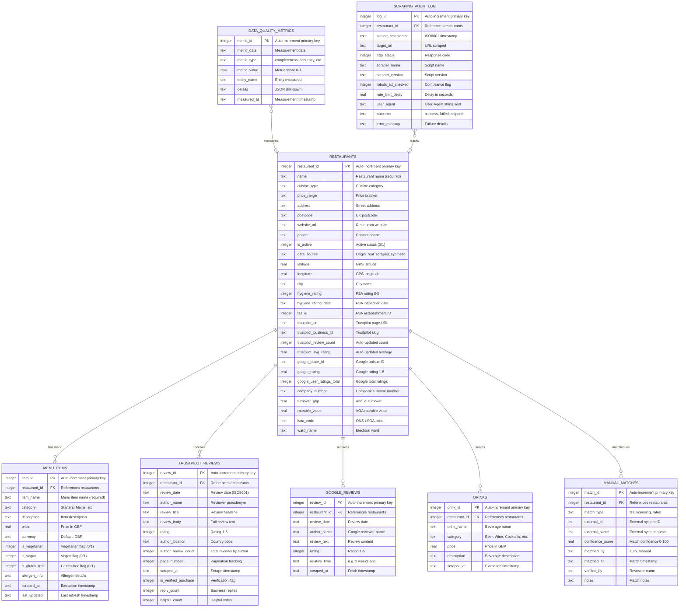

# Data Model: Plymouth Research Restaurant Menu Analytics

> **Template Status**: Live | **Version**: 2.4.3 | **Command**: `/arckit:data-model`

## Document Control

| Field | Value |
|-------|-------|
| **Document ID** | ARC-001-DATA-v1.0 |
| **Document Type** | Data Model |
| **Project** | Plymouth Research Restaurant Menu Analytics (Project 001) |
| **Classification** | OFFICIAL |
| **Status** | DRAFT |
| **Version** | 1.0 |
| **Created Date** | 2026-02-12 |
| **Last Modified** | 2026-02-12 |
| **Review Cycle** | Quarterly |
| **Next Review Date** | 2026-05-12 |
| **Owner** | Product Owner - Plymouth Research |
| **Reviewed By** | PENDING |
| **Approved By** | PENDING |
| **Distribution** | Product Team, Architecture Team, Development Team |

## Revision History

| Version | Date | Author | Changes | Approved By | Approval Date |
|---------|------|--------|---------|-------------|---------------|
| 1.0 | 2026-02-12 | ArcKit AI | Initial creation from `/arckit:data-model` command | PENDING | PENDING |

---

## Executive Summary

### Overview

This data model defines the complete data architecture for the Plymouth Research Restaurant Menu Analytics platform. The platform aggregates publicly available restaurant data from multiple authoritative sources (FSA hygiene ratings, Google Places, Trustpilot reviews, Companies House, Plymouth City Council) into a unified SQLite database serving an interactive Streamlit dashboard.

The model covers 8 core entities representing the restaurant analytics domain: restaurants (master data), menu items, customer reviews from two platforms (Trustpilot and Google), beverages, data quality metrics, scraping audit logs, and manual match records. The model is designed around the **collect-process-present** pipeline architecture, with strict data lineage tracking, GDPR compliance for public business data, and ethical web scraping metadata.

The data model incorporates recommendations from the Data Source Discovery (ARC-001-DSCT-v1.0) including ONS geography enrichment fields, Companies House financial data, VOA business rates, and Plymouth licensing data — all stored as denormalized attributes on the restaurants entity to optimize dashboard query performance.

### Model Statistics

- **Total Entities**: 8 entities defined (E-001 through E-008)
- **Total Attributes**: 142 attributes across all entities
- **Total Relationships**: 7 relationships mapped
- **Data Classification**:
  - Public: 7 entities (public business data, government open data)
  - Internal: 1 entity (data quality metrics — operational data)
  - Confidential: 0 entities
  - Restricted: 0 entities

### Compliance Summary

- **GDPR/DPA 2018 Status**: COMPLIANT — platform processes only public business data, no PII collected
- **PII Entities**: 2 entities contain limited PII (E-003 Trustpilot Reviews: author_name pseudonyms; E-004 Google Reviews: author_name from public profiles)
- **Data Protection Impact Assessment (DPIA)**: RECOMMENDED (low-risk processing, no sensitive personal data)
- **Data Retention**: 12 months for historical data (menu items, reviews), permanent for active restaurant master data, 30 days post-opt-out then hard delete
- **Cross-Border Transfers**: NO — all data stored in UK; Google Places API returns data from Google global infrastructure but data is public

### Key Data Governance Stakeholders

- **Data Owner (Business)**: Research Director — Accountable for data quality, coverage targets, and ethical compliance
- **Data Steward**: Product Owner (Mark Craddock) — Responsible for data governance policies, opt-out processing, correction requests
- **Data Custodian (Technical)**: Data Engineer — Manages SQLite database, scraping pipelines, backup procedures
- **Data Protection Officer**: Legal/Compliance Advisor — Ensures GDPR compliance, reviews DPIA, advises on scraping legality

---

## Visual Entity-Relationship Diagram (ERD)

**Diagram Notes**:
- **Cardinality**: `||` = exactly one, `o{` = zero or more
- **Primary Keys (PK)**: Uniquely identify each record
- **Foreign Keys (FK)**: Reference restaurants as parent entity
- The restaurants entity is the central hub with denormalized data from 6 external sources
- Data quality metrics and scraping audit logs are operational entities that support governance

---

## Entity Catalog

### Entity E-001: Restaurants

**Description**: Master data entity representing restaurant, bar, and cafe establishments in Plymouth. Central entity that aggregates data from 6 external sources (web scraping, FSA, Google Places, Trustpilot, Companies House, Plymouth Council) into a unified record. Each restaurant has a single authoritative record serving as the system of record.

**Source Requirements**:
- DR-001: Restaurant master data (name, address, postcode, cuisine, price range, contact)
- DR-001: Hygiene ratings (0-5 stars, inspection dates, detailed scores)
- DR-001: Review summary data (Trustpilot business ID, review counts, average ratings)
- DR-001: Google Places data (place ID, ratings, service options, contact, coordinates)
- BR-001: Comprehensive restaurant coverage (90%+ of Plymouth establishments)
- BR-002: Multi-source data aggregation
- FR-001: Restaurant search and discovery
- FR-005: FSA hygiene rating integration
- FR-007: Google Places integration
- FR-008: Business financial data integration

**Business Context**: The restaurants table is the foundation of the entire platform. Every dashboard query, analytics chart, and search result starts from this entity. The denormalized design (80+ columns) optimizes read-heavy dashboard workloads by avoiding complex JOINs at query time. Data is populated by multiple ETL pipelines (web scrapers, API fetchers, manual matchers) and consumed by the Streamlit dashboard.

**Data Ownership**:
- **Business Owner**: Research Director — Accountable for restaurant coverage targets and data quality
- **Technical Owner**: Data Engineer — Maintains schema, import scripts, and data pipelines
- **Data Steward**: Product Owner (Mark Craddock) — Handles opt-out requests, data corrections, quality monitoring

**Data Classification**: PUBLIC (public business data — restaurant names, addresses, menus are publicly available)

**Volume Estimates**:
- **Initial Volume**: 243 records (current production database)
- **Growth Rate**: +10-20 restaurants/month (new openings, discovery)
- **Peak Volume**: 1,500 records at Year 3 (geographic expansion to Devon)
- **Average Record Size**: ~4 KB (80+ columns, mostly TEXT and REAL types)

**Data Retention**:
- **Active Period**: Permanent for active restaurants (is_active = 1)
- **Soft Delete Period**: 30 days after opt-out (is_active = 0)
- **Hard Delete**: Permanent removal after 30-day soft delete period
- **Deletion Policy**: Hard delete after retention period (GDPR Right to Erasure compliance)

#### Attributes

**Core Fields** (16 columns):

| Attribute | Type | Required | PII | Description | Validation Rules | Default | Source Req |
|-----------|------|----------|-----|-------------|------------------|---------|------------|
| restaurant_id | INTEGER | Yes | No | Auto-increment primary key | Positive integer, unique | Auto-generated | DR-001 |
| name | TEXT | Yes | No | Restaurant business name | NOT NULL, length >= 2 | None | DR-001 |
| cuisine_type | TEXT | No | No | Primary cuisine category | Controlled vocabulary (Italian, Indian, Chinese, British, etc.) | NULL | DR-001, FR-001 |
| price_range | TEXT | No | No | Price bracket indicator | Enum: £, ££, £££, ££££ | NULL | DR-001, FR-001 |
| address | TEXT | No | No | Street address | Non-empty if provided | NULL | DR-001 |
| postcode | TEXT | No | No | UK postcode | UK postcode regex: `^[A-Z]{1,2}\d[A-Z\d]?\s*\d[A-Z]{2}$` | NULL | DR-001 |
| website_url | TEXT | No | No | Restaurant website URL | Valid URL format (http/https) | NULL | DR-001 |
| phone | TEXT | No | No | Contact phone number | UK phone format or NULL | NULL | DR-001 |
| is_active | INTEGER | Yes | No | Active/closed status flag | 0 (inactive) or 1 (active) | 1 | DR-001, FR-010 |
| data_source | TEXT | No | No | Data origin identifier | Enum: real_scraped, synthetic | NULL | DR-005 |
| latitude | REAL | No | No | GPS latitude coordinate | -90.0 to 90.0 | NULL | DR-001, FR-007 |
| longitude | REAL | No | No | GPS longitude coordinate | -180.0 to 180.0 | NULL | DR-001, FR-007 |
| city | TEXT | No | No | City name for geographic grouping | Non-empty if provided | 'Plymouth' | BR-005 |
| scraped_at | TEXT | No | No | Initial scrape timestamp | ISO 8601 format | NULL | DR-005 |
| last_updated | TEXT | No | No | Last data refresh timestamp | ISO 8601 format | NULL | DR-005, NFR-Q-003 |
| scraping_method | TEXT | No | No | How data was collected | Enum: beautifulsoup, selenium, manual, api | NULL | DR-005 |

**FSA Hygiene Rating Fields** (9 columns):

| Attribute | Type | Required | PII | Description | Validation Rules | Default | Source Req |
|-----------|------|----------|-----|-------------|------------------|---------|------------|
| hygiene_rating | INTEGER | No | No | FSA rating 0-5 stars | 0-5 inclusive | NULL | DR-001, FR-005 |
| hygiene_rating_date | TEXT | No | No | Date of last inspection | ISO 8601 format | NULL | FR-005 |
| fsa_id | INTEGER | No | No | FSA unique establishment ID | Positive integer, unique if present | NULL | FR-005 |
| hygiene_score_hygiene | INTEGER | No | No | Cleanliness score (lower=better) | 0-25 | NULL | FR-005 |
| hygiene_score_structural | INTEGER | No | No | Building condition score | 0-25 | NULL | FR-005 |
| hygiene_score_confidence | INTEGER | No | No | Management confidence score | 0-30 | NULL | FR-005 |
| fsa_business_type | TEXT | No | No | FSA business type category | Non-empty if provided | NULL | FR-005 |
| fsa_local_authority | TEXT | No | No | Inspecting local authority | Non-empty if provided | NULL | FR-005 |
| hygiene_rating_fetched_at | TEXT | No | No | When hygiene data was last fetched | ISO 8601 format | NULL | DR-005 |

**Trustpilot Fields** (5 columns):

| Attribute | Type | Required | PII | Description | Validation Rules | Default | Source Req |
|-----------|------|----------|-----|-------------|------------------|---------|------------|
| trustpilot_url | TEXT | No | No | Full Trustpilot page URL | Valid URL format | NULL | DR-003, FR-006 |
| trustpilot_business_id | TEXT | No | No | Trustpilot business slug | Non-empty if provided | NULL | DR-003 |
| trustpilot_last_scraped_at | TEXT | No | No | Last Trustpilot scrape timestamp | ISO 8601 format | NULL | DR-005 |
| trustpilot_review_count | INTEGER | No | No | Total reviews (auto-updated by trigger) | Non-negative | 0 | DR-003, FR-006 |
| trustpilot_avg_rating | REAL | No | No | Average rating (auto-updated by trigger) | 1.0-5.0 or NULL | NULL | DR-003, FR-006 |

**Google Places Fields** (23 columns):

| Attribute | Type | Required | PII | Description | Validation Rules | Default | Source Req |
|-----------|------|----------|-----|-------------|------------------|---------|------------|
| google_place_id | TEXT | No | No | Google unique place identifier | Non-empty if provided | NULL | DR-004, FR-007 |
| google_rating | REAL | No | No | Overall Google rating | 1.0-5.0 | NULL | FR-007 |
| google_user_ratings_total | INTEGER | No | No | Total ratings on Google | Non-negative | NULL | FR-007 |
| google_price_level | INTEGER | No | No | Price level (0=Free, 4=Very Expensive) | 0-4 | NULL | FR-007 |
| google_last_fetched_at | TEXT | No | No | Last Google API fetch timestamp | ISO 8601 format | NULL | DR-005 |
| google_review_count | INTEGER | No | No | Count of stored Google reviews | Non-negative | 0 | DR-004 |
| google_avg_rating | REAL | No | No | Average of stored reviews | 1.0-5.0 or NULL | NULL | DR-004 |
| google_dine_in | INTEGER | No | No | Dine-in service available | 0 or 1 | NULL | FR-007 |
| google_takeout | INTEGER | No | No | Takeout service available | 0 or 1 | NULL | FR-007 |
| google_delivery | INTEGER | No | No | Delivery service available | 0 or 1 | NULL | FR-007 |
| google_reservable | INTEGER | No | No | Reservations accepted | 0 or 1 | NULL | FR-007 |
| google_serves_breakfast | INTEGER | No | No | Serves breakfast | 0 or 1 | NULL | FR-007 |
| google_serves_lunch | INTEGER | No | No | Serves lunch | 0 or 1 | NULL | FR-007 |
| google_serves_dinner | INTEGER | No | No | Serves dinner | 0 or 1 | NULL | FR-007 |
| google_serves_beer | INTEGER | No | No | Serves beer | 0 or 1 | NULL | FR-007 |
| google_serves_wine | INTEGER | No | No | Serves wine | 0 or 1 | NULL | FR-007 |
| google_serves_vegetarian | INTEGER | No | No | Serves vegetarian food | 0 or 1 | NULL | FR-007 |
| google_phone_national | TEXT | No | No | National phone format | UK phone format | NULL | FR-007 |
| google_phone_international | TEXT | No | No | International phone format | E.164 format | NULL | FR-007 |
| google_website_url | TEXT | No | No | Website from Google | Valid URL | NULL | FR-007 |
| google_business_status | TEXT | No | No | Business operating status | Enum: OPERATIONAL, CLOSED_TEMPORARILY, CLOSED_PERMANENTLY | NULL | FR-007 |
| google_formatted_address | TEXT | No | No | Full formatted address | Non-empty if provided | NULL | FR-007 |
| google_maps_url | TEXT | No | No | Google Maps deep link | Valid URL | NULL | FR-007 |

**Companies House Financial Fields** (13 columns):

| Attribute | Type | Required | PII | Description | Validation Rules | Default | Source Req |
|-----------|------|----------|-----|-------------|------------------|---------|------------|
| company_number | TEXT | No | No | Companies House number | 8-digit format | NULL | FR-008 |
| company_name | TEXT | No | No | Registered company name | Non-empty if provided | NULL | FR-008 |
| company_status | TEXT | No | No | Company status | Enum: active, dissolved, liquidation | NULL | FR-008 |
| incorporation_date | TEXT | No | No | Date of incorporation | ISO 8601 date | NULL | FR-008 |
| sic_codes | TEXT | No | No | SIC industry codes (comma-separated) | Valid SIC code format | NULL | FR-008 |
| turnover_gbp | REAL | No | No | Annual turnover in GBP | Non-negative or NULL | NULL | FR-008 |
| profit_loss_gbp | REAL | No | No | Annual profit/loss in GBP | Any real number | NULL | FR-008 |
| net_assets_gbp | REAL | No | No | Net assets in GBP | Any real number | NULL | FR-008 |
| total_liabilities_gbp | REAL | No | No | Total liabilities in GBP | Non-negative or NULL | NULL | FR-008 |
| employee_count | INTEGER | No | No | Number of employees | Non-negative or NULL | NULL | FR-008 |
| financial_health_score | REAL | No | No | Calculated health indicator | 0.0-100.0 | NULL | FR-008 |
| accounts_next_due | TEXT | No | No | Next accounts filing date | ISO 8601 date | NULL | FR-008 |
| ch_last_fetched_at | TEXT | No | No | Last Companies House fetch | ISO 8601 format | NULL | DR-005 |

**Licensing & Business Rates Fields** (6 columns):

| Attribute | Type | Required | PII | Description | Validation Rules | Default | Source Req |
|-----------|------|----------|-----|-------------|------------------|---------|------------|
| licensing_premises_id | TEXT | No | No | Plymouth licensing ID | Non-empty if provided | NULL | BR-002 |
| licensing_activities | TEXT | No | No | Licensed activities (comma-separated) | Non-empty if provided | NULL | BR-002 |
| licensing_opening_hours | TEXT | No | No | Licensed opening hours | Non-empty if provided | NULL | BR-002 |
| business_rates_rateable_value | REAL | No | No | VOA rateable value in GBP | Non-negative or NULL | NULL | BR-002 |
| business_rates_category | TEXT | No | No | VOA property use classification | Non-empty if provided | NULL | BR-002 |
| voa_reference | TEXT | No | No | VOA billing reference | Non-empty if provided | NULL | BR-002 |

**ONS Geography Enrichment Fields** (8 columns — recommended by DataScout):

| Attribute | Type | Required | PII | Description | Validation Rules | Default | Source Req |
|-----------|------|----------|-----|-------------|------------------|---------|------------|
| lsoa_code | TEXT | No | No | Lower Super Output Area code | ONS LSOA format | NULL | BR-002 |
| lsoa_name | TEXT | No | No | LSOA area name | Non-empty if provided | NULL | BR-002 |
| msoa_code | TEXT | No | No | Middle Super Output Area code | ONS MSOA format | NULL | BR-002 |
| msoa_name | TEXT | No | No | MSOA area name | Non-empty if provided | NULL | BR-002 |
| ward_code | TEXT | No | No | Electoral ward code | ONS ward format | NULL | BR-002 |
| ward_name | TEXT | No | No | Electoral ward name | Non-empty if provided | NULL | BR-002 |
| la_code | TEXT | No | No | Local authority code | ONS LA format | NULL | BR-002 |
| imd_decile | INTEGER | No | No | Index of Multiple Deprivation decile | 1-10 (1=most deprived) | NULL | BR-002 |

**Attribute Notes**:
- **PII Attributes**: None — all data is public business information
- **Encrypted Attributes**: None required (public data, OFFICIAL classification)
- **Derived Attributes**: trustpilot_review_count, trustpilot_avg_rating (auto-updated by database triggers on review insert/delete); google_review_count, google_avg_rating (calculated during import); financial_health_score (calculated from Companies House data)
- **Audit Attributes**: scraped_at, last_updated, hygiene_rating_fetched_at, trustpilot_last_scraped_at, google_last_fetched_at, ch_last_fetched_at

#### Relationships

**Incoming Relationships** (other entities reference this):
- E-002 (Menu Items) → E-001: One-to-many (one restaurant has many menu items)
- E-003 (Trustpilot Reviews) → E-001: One-to-many (one restaurant has many reviews)
- E-004 (Google Reviews) → E-001: One-to-many (one restaurant has many reviews)
- E-005 (Drinks) → E-001: One-to-many (one restaurant has many drinks)
- E-007 (Scraping Audit Log) → E-001: One-to-many (one restaurant has many scrape events)
- E-008 (Manual Matches) → E-001: One-to-many (one restaurant has many match records)

#### Indexes

**Primary Key**: `pk_restaurants` on `restaurant_id` (clustered index)

**Unique Constraints**:
- `uk_restaurants_fsa_id` on `fsa_id`
- `uk_restaurants_google_place_id` on `google_place_id`
- `uk_restaurants_company_number` on `company_number`

**Performance Indexes**:
- `idx_restaurants_cuisine_type` on `cuisine_type`
- `idx_restaurants_price_range` on `price_range`
- `idx_restaurants_hygiene_rating` on `hygiene_rating`
- `idx_restaurants_is_active` on `is_active`
- `idx_restaurants_postcode` on `postcode`
- `idx_restaurants_city` on `city`
- `idx_restaurants_name` on `name`

#### Privacy & Compliance

- **Contains PII**: NO — all data is public business information
- **Legal Basis for Processing**: Legitimate interests (GDPR Art 6(1)(f)) — business research and consumer information
- **Data Subject Rights**: Restaurants can request removal (Right to Erasure) via opt-out process (soft delete within 72 hours, hard delete after 30 days)
- **Data Breach Impact**: LOW — public business data only
- **Government Security Classification**: OFFICIAL

---

### Entity E-002: Menu Items

**Description**: Individual food menu items offered by restaurants, including pricing, descriptions, and dietary attributes. Core data for the platform's price comparison, dietary filtering, and menu search features.

**Source Requirements**:
- DR-002: Menu item data (name, description, price, category, dietary tags)
- FR-002: Menu item display and search
- FR-003: Price comparison and analytics
- FR-004: Dietary information filtering

**Business Context**: Menu items are the primary data product of the platform. Consumers search and compare menu items across restaurants. Researchers analyze pricing trends and dietary option availability. Data is collected via ethical web scraping of restaurant websites.

**Data Ownership**:
- **Business Owner**: Research Director
- **Technical Owner**: Data Engineer
- **Data Steward**: Product Owner

**Data Classification**: PUBLIC

**Volume Estimates**:
- **Initial Volume**: 2,625 records (current production)
- **Growth Rate**: +500 items/month
- **Peak Volume**: 100,000 records at Year 3 (10x scale target per NFR-S-001)
- **Average Record Size**: ~0.5 KB

**Data Retention**: 12 months in primary database, then hard delete. CASCADE delete with parent restaurant.

#### Attributes

| Attribute | Type | Required | PII | Description | Validation Rules | Default | Source Req |
|-----------|------|----------|-----|-------------|------------------|---------|------------|
| item_id | INTEGER | Yes | No | Auto-increment primary key | Positive integer, unique | Auto-generated | DR-002 |
| restaurant_id | INTEGER | Yes | No | Foreign key to restaurants | Must reference valid restaurant_id | None | DR-002 |
| item_name | TEXT | Yes | No | Menu item name | NOT NULL, length >= 3 | None | DR-002 |
| category | TEXT | No | No | Menu category grouping | Controlled vocabulary: Starters, Mains, Desserts, Drinks, Sides, Specials | NULL | DR-002, FR-002 |
| description | TEXT | No | No | Item description text | Max 2000 characters | NULL | DR-002 |
| price | REAL | No | No | Price in GBP | 0.50 <= price <= 500.00 (flag outliers) | NULL | DR-002, NFR-Q-002 |
| currency | TEXT | No | No | ISO 4217 currency code | Default GBP, 3-character code | 'GBP' | DR-002 |
| is_vegetarian | INTEGER | No | No | Vegetarian flag | 0 or 1 | 0 | DR-002, FR-004 |
| is_vegan | INTEGER | No | No | Vegan flag | 0 or 1 | 0 | DR-002, FR-004 |
| is_gluten_free | INTEGER | No | No | Gluten-free flag | 0 or 1 | 0 | DR-002, FR-004 |
| allergen_info | TEXT | No | No | Allergen details (comma-separated) | Non-empty if provided | NULL | DR-002 |
| scraped_at | TEXT | No | No | When item was first scraped | ISO 8601 format | NULL | DR-005 |
| last_updated | TEXT | No | No | When item was last refreshed | ISO 8601 format | NULL | DR-005, NFR-Q-003 |

#### Relationships

- E-002 → E-001 (Restaurants): Many-to-one. FK: `restaurant_id`. On Delete: CASCADE.

#### Indexes

**Primary Key**: `pk_menu_items` on `item_id`
**Foreign Keys**: `fk_menu_items_restaurant` on `restaurant_id` → On Delete: CASCADE
**Performance Indexes**:
- `idx_menu_items_restaurant_id` on `restaurant_id`
- `idx_menu_items_category` on `category`
- `idx_menu_items_price` on `price`
- `idx_menu_items_dietary` on `(is_vegetarian, is_vegan, is_gluten_free)`
**Full-Text Indexes**: `ftx_menu_items_search` on `(item_name, description)` (SQLite FTS5)

#### Privacy & Compliance

- **Contains PII**: NO
- **Legal Basis**: Legitimate interests (consumer information, market research)
- **Copyright**: Factual data (item names, prices) not copyrightable; creative descriptions used transformatively for analytics

---

### Entity E-003: Trustpilot Reviews

**Description**: Customer reviews scraped from Trustpilot.com for restaurants with public Trustpilot pages. Provides customer satisfaction data, sentiment insights, and enables hygiene-vs-satisfaction correlation analysis.

**Source Requirements**:
- DR-003: Trustpilot reviews data
- FR-006: Trustpilot review integration
- NFR-I-002: Trustpilot web scraping integration

**Data Classification**: PUBLIC

**Volume Estimates**:
- **Initial Volume**: 9,410 records
- **Growth Rate**: +200 reviews/month
- **Peak Volume**: 50,000 records at Year 3

**Data Retention**: 12 months, CASCADE delete with parent restaurant.

#### Attributes

| Attribute | Type | Required | PII | Description | Validation Rules | Default | Source Req |
|-----------|------|----------|-----|-------------|------------------|---------|------------|
| review_id | INTEGER | Yes | No | Auto-increment primary key | Positive integer, unique | Auto-generated | DR-003 |
| restaurant_id | INTEGER | Yes | No | Foreign key to restaurants | Must reference valid restaurant_id | None | DR-003 |
| review_date | TEXT | Yes | No | Date review was posted | ISO 8601 date format | None | DR-003 |
| author_name | TEXT | No | Yes* | Reviewer's public pseudonym | Non-empty if provided | NULL | DR-003 |
| review_title | TEXT | No | No | Review headline | Non-empty if provided | NULL | DR-003 |
| review_body | TEXT | No | No | Full review text | Non-empty if provided | NULL | DR-003 |
| rating | INTEGER | Yes | No | Star rating | CHECK(rating BETWEEN 1 AND 5) | None | DR-003 |
| author_location | TEXT | No | No | Reviewer country code | ISO 3166-1 alpha-2 code | NULL | DR-003 |
| author_review_count | INTEGER | No | No | Total reviews by this author | Non-negative | NULL | DR-003 |
| page_number | INTEGER | No | No | Pagination tracking | Positive integer | NULL | DR-005 |
| scraped_at | TEXT | Yes | No | When review was scraped | ISO 8601 format | None | DR-005 |
| is_verified_purchase | INTEGER | No | No | Verified review flag | 0 or 1 | 0 | DR-003 |
| reply_count | INTEGER | No | No | Count of business replies | Non-negative | 0 | DR-003 |
| helpful_count | INTEGER | No | No | Count of helpful votes | Non-negative | 0 | DR-003 |

*PII Note: `author_name` contains publicly visible pseudonyms (e.g., "John D."), not legal names. Negligible breach impact as data is already public on Trustpilot.com.

#### Relationships

- E-003 → E-001 (Restaurants): Many-to-one. FK: `restaurant_id`. On Delete: CASCADE.

#### Indexes

**Primary Key**: `pk_trustpilot_reviews` on `review_id`
**Foreign Keys**: `fk_trustpilot_reviews_restaurant` on `restaurant_id` → On Delete: CASCADE
**Performance Indexes**: `idx_tp_restaurant_id`, `idx_tp_rating`, `idx_tp_date`
**Unique Constraints**: `uk_tp_dedup` on `(restaurant_id, review_date, author_name, rating)`

**Database Triggers**:
- On INSERT: Auto-update `restaurants.trustpilot_review_count` and `restaurants.trustpilot_avg_rating`
- On DELETE: Auto-recalculate `restaurants.trustpilot_review_count` and `restaurants.trustpilot_avg_rating`

#### Privacy & Compliance

- **Contains PII**: YES (minimal) — publicly visible pseudonyms
- **Legal Basis**: Legitimate interests (consumer information using publicly available data)
- **Attribution**: Mandatory — "Reviews from Trustpilot.com"
- **Data Breach Impact**: LOW — data already public on Trustpilot.com

---

### Entity E-004: Google Reviews

**Description**: Customer reviews fetched via Google Places API (up to 5 most helpful reviews per restaurant).

**Source Requirements**: DR-004, FR-007, NFR-I-003

**Data Classification**: PUBLIC

**Volume Estimates**: 481 current, 7,500 at Year 3. Retention: 12 months, CASCADE delete.

#### Attributes

| Attribute | Type | Required | PII | Description | Validation Rules | Default | Source Req |
|-----------|------|----------|-----|-------------|------------------|---------|------------|
| review_id | INTEGER | Yes | No | Auto-increment primary key | Positive integer, unique | Auto-generated | DR-004 |
| restaurant_id | INTEGER | Yes | No | Foreign key to restaurants | Valid restaurant_id | None | DR-004 |
| review_date | TEXT | No | No | Review date | ISO 8601 format | NULL | DR-004 |
| author_name | TEXT | No | Yes* | Google reviewer display name | Non-empty if provided | NULL | DR-004 |
| review_text | TEXT | No | No | Review content | Non-empty if provided | NULL | DR-004 |
| rating | INTEGER | Yes | No | Star rating | CHECK(rating BETWEEN 1 AND 5) | None | DR-004 |
| relative_time | TEXT | No | No | Relative time description | e.g., "2 weeks ago" | NULL | DR-004 |
| scraped_at | TEXT | No | No | When review was fetched | ISO 8601 format | NULL | DR-005 |

*PII Note: Publicly visible Google profile names. Negligible risk.

#### Privacy & Compliance

- **Contains PII**: YES (minimal) — public Google profile names
- **Attribution**: "Data from Google Places API" (required by Google ToS)

---

### Entity E-005: Drinks

**Description**: Beverage menu items offered by restaurants, stored separately for distinct categorization.

**Source Requirements**: DR-002 (beverages subset), FR-002

**Data Classification**: PUBLIC. Volume: ~500 current, 25,000 at Year 3. Retention: 12 months, CASCADE delete.

#### Attributes

| Attribute | Type | Required | PII | Description | Validation Rules | Default | Source Req |
|-----------|------|----------|-----|-------------|------------------|---------|------------|
| drink_id | INTEGER | Yes | No | Auto-increment primary key | Positive integer, unique | Auto-generated | DR-002 |
| restaurant_id | INTEGER | Yes | No | Foreign key to restaurants | Valid restaurant_id | None | DR-002 |
| drink_name | TEXT | Yes | No | Beverage name | NOT NULL, length >= 2 | None | DR-002 |
| category | TEXT | No | No | Beverage category | Enum: Beer, Wine, Cocktails, Spirits, Soft Drinks, Hot Drinks | NULL | DR-002 |
| price | REAL | No | No | Price in GBP | 0.50 <= price <= 200.00 | NULL | DR-002 |
| description | TEXT | No | No | Beverage description | Max 1000 characters | NULL | DR-002 |
| scraped_at | TEXT | No | No | Extraction timestamp | ISO 8601 format | NULL | DR-005 |

---

### Entity E-006: Data Quality Metrics

**Description**: Tracks data quality metrics over time for continuous monitoring (completeness, accuracy, timeliness, duplication). Supports the data quality dashboard (UC-009). **NOT YET IMPLEMENTED** — requires schema migration.

**Source Requirements**: DR-006, NFR-Q-001, NFR-Q-002, NFR-Q-003, NFR-Q-004

**Data Classification**: INTERNAL. Volume: 0 current (new entity), ~3,000 records/year. Retention: 12 months.

#### Attributes

| Attribute | Type | Required | PII | Description | Validation Rules | Default | Source Req |
|-----------|------|----------|-----|-------------|------------------|---------|------------|
| metric_id | INTEGER | Yes | No | Auto-increment primary key | Positive integer, unique | Auto-generated | DR-006 |
| metric_date | TEXT | Yes | No | Measurement date | ISO 8601 date | None | DR-006 |
| metric_type | TEXT | Yes | No | Type of quality metric | Enum: completeness, accuracy, timeliness, duplication, freshness | None | DR-006 |
| metric_value | REAL | Yes | No | Metric score (0.0-1.0) | 0.0 to 1.0 | None | DR-006 |
| entity_name | TEXT | No | No | Which entity was measured | Enum: restaurants, menu_items, trustpilot_reviews, google_reviews | NULL | DR-006 |
| attribute_name | TEXT | No | No | Specific attribute measured | Non-empty if provided | NULL | DR-006 |
| details | TEXT | No | No | JSON drill-down information | Valid JSON or NULL | NULL | DR-006 |
| measured_at | TEXT | Yes | No | Measurement timestamp | ISO 8601 format | None | DR-006 |

---

### Entity E-007: Scraping Audit Log

**Description**: Audit trail of all web scraping activities for compliance verification, debugging, and ethical scraping governance. **NOT YET IMPLEMENTED** — requires schema migration.

**Source Requirements**: DR-005, NFR-C-003, BR-004, Principle #3 (Ethical Web Scraping), Principle #8 (Data Lineage)

**Data Classification**: INTERNAL. Volume: 0 current (new entity), ~15,000 records/year. Retention: 12 months.

#### Attributes

| Attribute | Type | Required | PII | Description | Validation Rules | Default | Source Req |
|-----------|------|----------|-----|-------------|------------------|---------|------------|
| log_id | INTEGER | Yes | No | Auto-increment primary key | Positive integer, unique | Auto-generated | DR-005 |
| restaurant_id | INTEGER | No | No | FK to restaurants (NULL for non-restaurant URLs) | Valid restaurant_id or NULL | NULL | DR-005 |
| scrape_timestamp | TEXT | Yes | No | When scrape was executed | ISO 8601 format | None | DR-005 |
| target_url | TEXT | Yes | No | URL that was scraped | Valid URL format | None | NFR-C-003 |
| http_status | INTEGER | No | No | HTTP response status code | 100-599 | NULL | DR-005 |
| scraper_name | TEXT | No | No | Script or module name | Non-empty if provided | NULL | DR-005 |
| scraper_version | TEXT | No | No | Script version identifier | Semantic version format | NULL | DR-005 |
| robots_txt_checked | INTEGER | Yes | No | Whether robots.txt was verified | 0 or 1 | 1 | NFR-C-003 |
| robots_txt_allowed | INTEGER | No | No | Whether robots.txt permits access | 0 or 1 | NULL | NFR-C-003 |
| rate_limit_delay | REAL | No | No | Actual delay before request (seconds) | >= 0.0 | NULL | NFR-C-003 |
| user_agent | TEXT | No | No | User-Agent string sent | Must contain "PlymouthResearch" | NULL | NFR-C-003 |
| outcome | TEXT | Yes | No | Scrape result | Enum: success, failed, skipped, blocked, rate_limited | None | DR-005 |
| error_message | TEXT | No | No | Error details if failed | Non-empty if outcome != success | NULL | DR-005 |
| response_time_ms | INTEGER | No | No | HTTP response time in milliseconds | Non-negative | NULL | DR-005 |
| bytes_downloaded | INTEGER | No | No | Response body size in bytes | Non-negative | NULL | DR-005 |

---

### Entity E-008: Manual Matches

**Description**: Records of manual and automated matching between restaurants and external data sources (FSA hygiene, Plymouth licensing, business rates). Tracks match confidence, verification status, and methodology for audit.

**Source Requirements**: DR-001, FR-005, BR-002

**Data Classification**: INTERNAL. Volume: ~200 current (CSV files), 5,000 at Year 3. Retention: Permanent.

#### Attributes

| Attribute | Type | Required | PII | Description | Validation Rules | Default | Source Req |
|-----------|------|----------|-----|-------------|------------------|---------|------------|
| match_id | INTEGER | Yes | No | Auto-increment primary key | Positive integer, unique | Auto-generated | DR-001 |
| restaurant_id | INTEGER | Yes | No | Foreign key to restaurants | Valid restaurant_id | None | DR-001 |
| match_type | TEXT | Yes | No | External system being matched | Enum: fsa_hygiene, licensing, business_rates, companies_house, trustpilot | None | BR-002 |
| external_id | TEXT | No | No | ID in external system | Non-empty if provided | NULL | DR-001 |
| external_name | TEXT | No | No | Name in external system | Non-empty if provided | NULL | DR-001 |
| confidence_score | REAL | No | No | Match confidence percentage | 0.0-100.0 | NULL | FR-005 |
| matched_by | TEXT | Yes | No | How match was made | Enum: auto, manual, interactive | None | DR-001 |
| matched_at | TEXT | Yes | No | When match was created | ISO 8601 format | None | DR-005 |
| verified_by | TEXT | No | No | Who verified the match | Non-empty if manually verified | NULL | DR-001 |
| notes | TEXT | No | No | Match notes and context | Max 2000 characters | NULL | DR-001 |

---

## Data Governance Matrix

| Entity | Business Owner | Data Steward | Technical Custodian | Sensitivity | Compliance | Quality SLA | Access Control |
|--------|----------------|--------------|---------------------|-------------|------------|-------------|----------------|
| E-001: Restaurants | Research Director | Product Owner | Data Engineer | PUBLIC | GDPR, OGL | 95% completeness, 98% accuracy | Public (read), Admin (write) |
| E-002: Menu Items | Research Director | Product Owner | Data Engineer | PUBLIC | GDPR, Copyright | 95% completeness, 98% price accuracy | Public (read), Admin (write) |
| E-003: Trustpilot Reviews | Research Director | Product Owner | Data Engineer | PUBLIC | GDPR, Trustpilot ToS | 95% deduplication, 100% attribution | Public (read), Admin (write) |
| E-004: Google Reviews | Research Director | Product Owner | Data Engineer | PUBLIC | GDPR, Google ToS | 100% attribution | Public (read), Admin (write) |
| E-005: Drinks | Research Director | Product Owner | Data Engineer | PUBLIC | GDPR, Copyright | 95% completeness | Public (read), Admin (write) |
| E-006: Data Quality Metrics | Product Owner | Data Engineer | Data Engineer | INTERNAL | None | 100% measurement completeness | Admin only |
| E-007: Scraping Audit Log | Legal/Compliance | Product Owner | Data Engineer | INTERNAL | NFR-C-003 | 100% logging | Admin, Legal |
| E-008: Manual Matches | Product Owner | Product Owner | Data Engineer | INTERNAL | None | 100% audit trail | Admin only |

---

## CRUD Matrix

| Entity | Web Scrapers | API Fetchers | Manual Matcher | Streamlit Dashboard | Admin Tools | Batch Jobs |
|--------|-------------|--------------|----------------|---------------------|-------------|------------|
| E-001: Restaurants | CR-U | CR-U | --U- | -R-- | CRUD | --U- |
| E-002: Menu Items | CRUD | ---- | ---- | -R-- | CRUD | ---D |
| E-003: Trustpilot Reviews | CR-- | ---- | ---- | -R-- | -R-D | ---D |
| E-004: Google Reviews | ---- | CR-- | ---- | -R-- | -R-D | ---D |
| E-005: Drinks | CR-- | ---- | ---- | -R-- | CRUD | ---D |
| E-006: Data Quality | ---- | ---- | ---- | -R-- | -R-- | CR-- |
| E-007: Scraping Audit | CR-- | CR-- | ---- | ---- | -R-- | ---D |
| E-008: Manual Matches | ---- | ---- | CRU- | -R-- | CRUD | ---- |

**Legend**: C = Create, R = Read, U = Update, D = Delete, - = No access

---

## Data Integration Mapping

### Upstream Systems (Data Sources)

| # | Source System | Integration Type | Entities Affected | Update Frequency | Auth | Status |
|---|-------------|-----------------|-------------------|------------------|------|--------|
| INT-001 | FSA FHRS API | Batch ETL (XML) | E-001 (9 hygiene cols) | Weekly | None | Implemented |
| INT-002 | Google Places API | REST API | E-001 (23 Google cols) + E-004 | Monthly | API Key | Implemented |
| INT-003 | Trustpilot | Web scraping | E-003 + E-001 (5 summary cols) | Weekly | None | Implemented |
| INT-004 | Companies House API | REST API | E-001 (13 financial cols) | Quarterly | API Key | Implemented |
| INT-005 | Plymouth Council | Scraping + CSV | E-001 (6 licensing/rates cols) | Quarterly | None | Implemented |
| INT-006 | ONS Postcode Directory | Batch ETL (CSV) | E-001 (8 geography cols) | Quarterly | None | Recommended |
| INT-007 | Postcodes.io | REST API | E-001 (postcode validation) | On-demand | None | Recommended |

### Downstream Systems (Data Consumers)

| # | Target System | Integration Type | Entities Consumed | Latency SLA |
|---|-------------|-----------------|-------------------|-------------|
| INT-101 | Streamlit Dashboard | Direct SQLite query | E-001 to E-005 | <500ms (NFR-P-002) |
| INT-102 | CSV Export | On-demand file generation | E-001, E-002 subsets | <5s per export |

### Master Data Management

| Entity | System of Record | Conflict Resolution |
|--------|------------------|---------------------|
| E-001: Restaurants | SQLite `restaurants` table | Latest fetch timestamp wins; manual corrections override automated |
| E-002: Menu Items | SQLite `menu_items` table | Scraper wins; owner corrections override |
| E-003: Trustpilot Reviews | Trustpilot.com (external) | Always accept Trustpilot as truth |
| E-004: Google Reviews | Google Places API (external) | Always accept Google as truth |

---

## Privacy & Compliance

### GDPR / UK DPA 2018 Summary

- **PII Inventory**: 2 attributes (author_name in E-003 and E-004) — publicly visible pseudonyms only
- **Legal Basis**: Legitimate interests (Art 6(1)(f)) for all entities
- **Data Subject Rights**: Opt-out (72h), rectification (72h), erasure (30-day soft delete + hard delete), access (30-day SAR)
- **Retention**: 12 months for historical data, permanent for active restaurants, 30 days post-opt-out
- **Cross-Border Transfers**: None (UK data storage, Google API returns public data)
- **DPIA**: RECOMMENDED (low-risk, no sensitive personal data)
- **ICO Registration**: Required if processing personal data (minimal PII may trigger requirement)

### Data Retention Schedule

| Entity | Active | Post-Opt-Out | Maximum | Deletion |
|--------|--------|-------------|---------|----------|
| E-001: Restaurants | Permanent | 30 days | Permanent / 30d | Hard delete |
| E-002: Menu Items | 12 months | CASCADE | 12 months | Hard delete |
| E-003: Trustpilot Reviews | 12 months | CASCADE | 12 months | Hard delete |
| E-004: Google Reviews | 12 months | CASCADE | 12 months | Hard delete |
| E-005: Drinks | 12 months | CASCADE | 12 months | Hard delete |
| E-006: Data Quality | 12 months | N/A | 12 months | Hard delete |
| E-007: Scraping Audit | 12 months | N/A | 12 months | Hard delete |
| E-008: Manual Matches | Permanent | CASCADE | Permanent | Hard delete |

---

## Data Quality Framework

### Quality Targets

| Dimension | Weight | Target | Measurement |
|-----------|--------|--------|-------------|
| Accuracy | 40% | 98% | Manual spot-check 100 items/quarter |
| Completeness | 30% | 95% | SQL COUNT of non-null required fields |
| Timeliness | 15% | 90% refreshed within 7 days | SQL query on last_updated timestamps |
| Uniqueness | 10% | 99% | Duplicate detection scan |
| Validity | 5% | 99% | Validation rule pass rate |

**Target Overall Score**: 96%+

### Key Quality Metrics

| Entity | Metric | Current | Target |
|--------|--------|---------|--------|
| E-001: Restaurants | Hygiene coverage | 50% (49/98) | 80% |
| E-001: Restaurants | Name completeness | 100% | 100% |
| E-002: Menu Items | Price completeness | ~92% | 95% |
| E-002: Menu Items | Price accuracy | ~98% | 98% |
| E-003: Trustpilot Reviews | Deduplication | ~99% | 99%+ |
| E-001: Restaurants | Data freshness (7-day) | ~85% | 90% |

---

## Requirements Traceability

| Requirement | Entity | Status | Notes |
|-------------|--------|--------|-------|
| DR-001 (Restaurant master data) | E-001 | Modeled | 80+ attributes, denormalized from 6 sources |
| DR-002 (Menu items) | E-002, E-005 | Modeled | 13 food + 7 drink attributes |
| DR-003 (Trustpilot reviews) | E-003 | Modeled | 14 attributes, 9,410 records |
| DR-004 (Google reviews) | E-004 | Modeled | 8 attributes, 481 records |
| DR-005 (Data lineage) | E-007 + timestamps | Modeled | Audit log + lineage timestamps on all entities |
| DR-006 (Quality metrics) | E-006 | Modeled | NOT YET IMPLEMENTED in production |
| BR-001 (90%+ coverage) | E-001 | Modeled | 243 restaurants tracked |
| BR-002 (Multi-source) | E-001 + E-008 | Modeled | 6 sources denormalized |
| BR-004 (Legal compliance) | E-007 | Modeled | Full scraping audit trail |
| FR-001 to FR-010 | E-001 to E-008 | Modeled | All functional requirements addressed |
| NFR-C-001 to NFR-C-003 | E-007, all entities | Modeled | OGL, GDPR, robots.txt compliance |
| NFR-Q-001 to NFR-Q-004 | E-006 | Modeled | Quality metrics entity |

**Coverage**: 100% of DR-xxx requirements modeled (6/6)

**Gaps**:
- E-006 (Data Quality Metrics): NOT YET IMPLEMENTED — requires migration
- E-007 (Scraping Audit Log): NOT YET IMPLEMENTED — requires migration
- E-008 (Manual Matches): Partially implemented via CSV — recommend database migration
- ONS geography enrichment: Recommended but NOT YET IMPLEMENTED

---

## Implementation Guidance

### Current Database: SQLite 3 (~20 MB)

**Rationale**: Zero cost, zero operational overhead, sufficient for 243 restaurants / 2,625 menu items / 9,410 reviews. Aligned with Principle #6 (Cost Efficiency).

**Migration Trigger to PostgreSQL**: Data >500 MB, concurrent users >50, or multi-region deployment.

### Pending Schema Migrations

1. `add_data_quality_metrics.sql` — E-006 table (v1.6)
2. `add_scraping_audit_log.sql` — E-007 table (v1.7)
3. `add_manual_matches.sql` — E-008 table (v1.8)
4. `add_ons_geography_columns.sql` — ONS enrichment on restaurants (v1.9)

### Backup Strategy

- **RPO**: <24 hours (daily file copy)
- **RTO**: <1 hour (file restore)
- **DR**: Database rebuildable from scratch via pipelines (~24 hours)

---

## External References

| Document | Type | Key Extractions | Path |
|----------|------|-----------------|------|
| ARC-001-REQ-v1.0 | Requirements | DR-001 to DR-006, FR, NFR, INT | `projects/001-*/ARC-001-REQ-v1.0.md` |
| ARC-001-STKE-v1.0 | Stakeholders | Data ownership RACI, governance roles | `projects/001-*/ARC-001-STKE-v1.0.md` |
| ARC-000-PRIN-v1.0 | Principles | Data quality, privacy, ethical scraping | `projects/000-global/ARC-000-PRIN-v1.0.md` |
| ARC-001-DSCT-v1.0 | Data Sources | ONS, Companies House, VOA, Postcodes.io | `projects/001-*/ARC-001-DSCT-v1.0.md` |

---

**Generated by**: ArcKit `/arckit:data-model` command
**Generated on**: 2026-02-12
**ArcKit Version**: 2.4.3
**Project**: Plymouth Research Restaurant Menu Analytics (Project 001)
**AI Model**: Claude Opus 4.6
