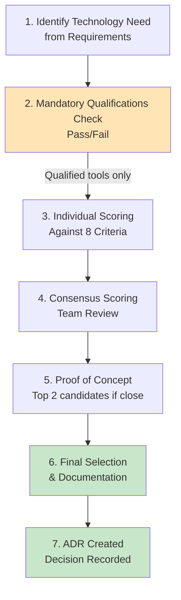

# Vendor Evaluation Criteria: Plymouth Research Restaurant Menu Analytics

> **Template Origin**: Official | **ArcKit Version**: 4.1.0 | **Command**: `/arckit:evaluate`

## Document Control

| Field | Value |
|-------|-------|
| **Document ID** | ARC-001-EVAL-v1.0 |
| **Document Type** | Vendor Evaluation Framework |
| **Project** | Plymouth Research Restaurant Menu Analytics (Project 001) |
| **Classification** | PUBLIC |
| **Status** | DRAFT |
| **Version** | 1.0 |
| **Created Date** | 2026-03-09 |
| **Last Modified** | 2026-03-09 |
| **Review Cycle** | On-Demand |
| **Next Review Date** | 2026-04-08 |
| **Owner** | Product Owner - Plymouth Research |
| **Reviewed By** | [PENDING] |
| **Approved By** | [PENDING] |
| **Distribution** | Product Team, Architecture Team |

## Revision History

| Version | Date | Author | Changes | Approved By | Approval Date |
|---------|------|--------|---------|-------------|---------------|
| 1.0 | 2026-03-09 | ArcKit AI | Initial creation from `/arckit:evaluate` command | [PENDING] | [PENDING] |

## Document Purpose

This document defines the evaluation criteria, scoring methodology, and process for assessing technology vendors and open-source tools for the Plymouth Research Restaurant Menu Analytics platform. Given the project's open-source-first principle (ARC-000-PRIN-v1.0, Principle #2), this framework evaluates both commercial vendors and open-source alternatives on equal footing.

The framework is designed for evaluating tools across six technology domains:
1. **Dashboard Framework** (Streamlit, Plotly Dash, Panel)
2. **Analytics Database** (SQLite, DuckDB)
3. **Data Collection** (Scrapy, BeautifulSoup)
4. **CI/CD Pipeline** (GitHub Actions)
5. **Hosting Platform** (Streamlit Cloud, Render)
6. **External APIs** (Google Places, Postcodes.io, Sentry, UptimeRobot)

---

## 1. Evaluation Overview

### 1.1 Purpose

This document defines the criteria for evaluating technology vendors and open-source tools for the Plymouth Research platform. The goal is to select components that provide the best value considering technical fit, cost efficiency, community health, and alignment with architecture principles.

### 1.2 Evaluation Principles

- **Open Source Preferred**: Evaluate open-source alternatives first (Principle #2, ARC-000-PRIN-v1.0)
- **Cost Efficiency**: Total operational costs must remain under £100/month (BR-003)
- **Data Quality First**: Components must support data validation and quality controls (Principle #1)
- **Ethical Operations**: Scraping tools must support rate limiting and robots.txt compliance (Principle #3)
- **No Vendor Lock-in**: Prefer standard interfaces and data portability (Principle #2)
- **Fair Comparison**: All tools evaluated against the same criteria regardless of licence type

### 1.3 Evaluation Team

| Name | Role | Department | Evaluation Focus |
|------|------|------------|------------------|
| Mark Craddock | Product Owner / Technical Lead | Plymouth Research | Overall fit, business value |
| Data Engineer | Technical Evaluator | Plymouth Research | Architecture, performance, integration |
| Research Analysts | User Representatives | Plymouth Research | Usability, feature completeness |
| Legal/Compliance Advisor | Compliance Reviewer | External Consultant | Licensing, GDPR, scraping legality |

### 1.4 Conflict of Interest

All evaluators must disclose any conflicts of interest with vendors:

- [ ] Personal relationships with vendor employees
- [ ] Financial interests in vendor companies
- [ ] Prior employment with vendor (within 2 years)
- [ ] Concurrent consulting arrangements

---

## 2. Evaluation Process

### 2.1 Process Flow



### 2.2 Timeline

| Phase | Duration | Responsible |
|-------|----------|-------------|
| Identify candidates | 1-2 days | Technical Lead |
| Mandatory qualifications check | 1 day | Technical Lead |
| Individual scoring | 2-3 days | All evaluators |
| Consensus meeting | Half day | Evaluation team |
| Proof of concept (if needed) | 1 week | Data Engineer |
| Final selection & ADR | 1 day | Technical Lead |

---

## 3. Mandatory Qualifications (Pass/Fail)

Before scoring, all tools must meet ALL mandatory qualifications. Failure on any item results in elimination.

### 3.1 Mandatory Qualification Checklist

| ID | Qualification | Derived From | Notes |
|----|---------------|--------------|-------|
| **MQ-1** | Compatible with Python 3.8+ runtime | Tech stack constraint | Core language of the platform |
| **MQ-2** | Licence compatible with project use (Apache-2.0, MIT, BSD, or similar permissive) | Principle #2 (Open Source Preferred) | GPL acceptable for standalone tools; AGPL requires review |
| **MQ-3** | Actively maintained (commits within last 6 months, responsive to critical issues) | Principle #2 (Community Health) | Abandoned projects are disqualified |
| **MQ-4** | Does not require personal data collection from end users | Principle #4 (Privacy by Design) | BR-004 (Legal and Ethical Compliance) |
| **MQ-5** | Operates within £100/month total budget constraint | BR-003 (Cost-Efficient Operations) | Free tier or low-cost option must exist |
| **MQ-6** | Supports UK GDPR compliance (no mandatory data export to non-adequate countries without controls) | BR-004, Principle #4 | Data residency consideration |
| **MQ-7** | For scraping tools: supports rate limiting and robots.txt compliance | Principle #3 (Ethical Web Scraping) | Non-negotiable for data collection tools |

**Disqualification Procedure**:

1. Evaluator identifies mandatory qualification failure
2. Technical Lead confirms failure with evidence
3. Tool documented as "Disqualified" with specific reason in scores.json
4. If borderline, team discusses whether a workaround exists

---

## 4. Evaluation Criteria (100 Points)

### 4.1 Criteria Summary

| ID | Category | Weight | Max Points | Requirement Alignment |
|----|----------|--------|------------|----------------------|
| **C-001** | Technical Fit | 25% | 25 | FR-001 to FR-015, NFR-P-001 to NFR-P-005 |
| **C-002** | Cost & Licensing | 15% | 15 | BR-003, Principle #2, Principle #6 |
| **C-003** | Community & Ecosystem | 10% | 10 | Principle #2 (Open Source Preferred) |
| **C-004** | Performance & Scalability | 15% | 15 | NFR-P-001 ( < 2s page load), NFR-P-002 ( < 500ms search), BR-005 |
| **C-005** | Security & Compliance | 10% | 10 | NFR-SEC-001 to NFR-SEC-003, BR-004 |
| **C-006** | Integration & Interoperability | 10% | 10 | INT-001 to INT-008, Principle #5 |
| **C-007** | Operational Simplicity | 10% | 10 | BR-003, Principle #6 (Cost Efficiency) |
| **C-008** | Data Quality Support | 5% | 5 | Principle #1 (Data Quality First), NFR-Q-001 to NFR-Q-004 |
| | **TOTAL** | **100%** | **100** | |

---

### 4.2 C-001: Technical Fit (25 points)

**Purpose**: Evaluate how well the tool meets the project's functional and technical requirements.

| Subcriterion | Points | Evaluation Questions |
|--------------|--------|---------------------|
| **1.1 Feature Completeness** | 10 | Does the tool provide the features needed for its role? Does it cover 80%+ of relevant functional requirements? |
| **1.2 Python Ecosystem Fit** | 5 | Does it integrate naturally with Python 3.8+, Pandas, SQLite, Plotly? Is the API Pythonic? |
| **1.3 Architecture Alignment** | 5 | Does it fit the collect-process-present pipeline? Does it respect the singleton config pattern? |
| **1.4 Extensibility** | 5 | Can it be customised or extended for future requirements (geographic expansion, new data sources)? |

#### Scoring Rubric

| Score Range | Description |
|-------------|-------------|
| **90-100%** | Exceeds requirements; provides additional capabilities beyond what was asked |
| **75-89%** | Meets all requirements with sound implementation |
| **60-74%** | Meets most requirements; some gaps requiring workarounds |
| **40-59%** | Meets minimum requirements; significant gaps |
| **0-39%** | Does not meet requirements; unworkable |

---

### 4.3 C-002: Cost & Licensing (15 points)

**Purpose**: Evaluate total cost of ownership and licence compatibility.

| Subcriterion | Points | Evaluation Questions |
|--------------|--------|---------------------|
| **2.1 Licence Type** | 5 | Is it permissive open source (Apache-2.0, MIT, BSD)? Are there usage restrictions? |
| **2.2 Direct Costs** | 5 | What are monthly/annual costs? Does it fit within £100/month total budget? What percentage of budget does it consume? |
| **2.3 Total Cost of Ownership** | 5 | Including setup, training, maintenance, migration costs. Is there a clear exit strategy? |

---

### 4.4 C-003: Community & Ecosystem (10 points)

**Purpose**: Evaluate the health and sustainability of the project's community.

| Subcriterion | Points | Evaluation Questions |
|--------------|--------|---------------------|
| **3.1 Community Size & Activity** | 4 | GitHub stars, contributors, commit frequency, issue response time? |
| **3.2 Documentation Quality** | 3 | Is documentation comprehensive, current, with examples? |
| **3.3 Ecosystem & Plugins** | 3 | Are there extensions, integrations, community components available? |

---

### 4.5 C-004: Performance & Scalability (15 points)

**Purpose**: Evaluate whether the tool meets performance requirements and can scale.

| Subcriterion | Points | Evaluation Questions |
|--------------|--------|---------------------|
| **4.1 Baseline Performance** | 5 | Does it meet NFR-P-001 ( < 2s page load) and NFR-P-002 ( < 500ms search)? |
| **4.2 Resource Efficiency** | 5 | Memory footprint? CPU usage? Can it run within ~1 GB RAM (Community Cloud constraint)? |
| **4.3 Scalability Path** | 5 | Can it handle 10x data growth (BR-005: 1,500 restaurants, 100K menu items)? What's the upgrade path? |

---

### 4.6 C-005: Security & Compliance (10 points)

**Purpose**: Evaluate security posture and regulatory compliance support.

| Subcriterion | Points | Evaluation Questions |
|--------------|--------|---------------------|
| **5.1 Transport Security** | 4 | Does it support HTTPS/TLS? Is encryption automatic or manual? |
| **5.2 Data Protection** | 3 | Does it support encryption at rest? Does it avoid unnecessary data collection? |
| **5.3 Vulnerability Management** | 3 | Are CVEs addressed promptly? Is there a security advisory process? Known vulnerabilities? |

---

### 4.7 C-006: Integration & Interoperability (10 points)

**Purpose**: Evaluate how well the tool integrates with the existing stack and external services.

| Subcriterion | Points | Evaluation Questions |
|--------------|--------|---------------------|
| **6.1 Existing Stack Compatibility** | 4 | Works with SQLite, Pandas, Plotly, Pydeck? Standard Python imports? |
| **6.2 External API Support** | 3 | Can it connect to FSA, Google Places, Trustpilot, Companies House, ONS, Postcodes.io? |
| **6.3 Data Format Support** | 3 | Handles CSV, JSON, XML, SQL natively? Standard data interchange? |

---

### 4.8 C-007: Operational Simplicity (10 points)

**Purpose**: Evaluate ease of deployment, maintenance, and operations.

| Subcriterion | Points | Evaluation Questions |
|--------------|--------|---------------------|
| **7.1 Deployment Simplicity** | 4 | How easy is initial setup? `pip install` and go, or complex configuration? |
| **7.2 Maintenance Burden** | 3 | How much ongoing maintenance is required? Auto-updates? Breaking changes? |
| **7.3 Monitoring & Debugging** | 3 | Built-in logging? Error reporting? Easy to diagnose issues? |

---

### 4.9 C-008: Data Quality Support (5 points)

**Purpose**: Evaluate support for data validation, quality monitoring, and lineage.

| Subcriterion | Points | Evaluation Questions |
|--------------|--------|---------------------|
| **8.1 Data Validation** | 2 | Does it support input validation, schema enforcement, or data quality checks? |
| **8.2 Quality Monitoring** | 2 | Can it report on data completeness, accuracy, freshness? |
| **8.3 Data Lineage** | 1 | Does it track data provenance (source URL, scrape timestamp, transformation steps)? |

---

## 5. Scoring Methodology

### 5.1 Scoring Scale (Per Subcriterion)

Each subcriterion is scored as a percentage of its maximum points:

| Score | Label | Description |
|-------|-------|-------------|
| **100%** | Exceeds | Goes beyond requirements with strong differentiation |
| **75%** | Met | Fully addresses the criterion with adequate evidence |
| **50%** | Partially Met | Some evidence but significant gaps remain |
| **25%** | Minimally Met | Barely addresses the criterion; major concerns |
| **0%** | Not Met | No evidence of capability; does not address the criterion |

### 5.2 Calculating Scores

1. Score each subcriterion as a percentage
2. Multiply by subcriterion max points to get raw score
3. Sum all subcriteria for category total
4. Sum all categories for overall total (out of 100)
5. Minimum threshold: **60/100** to be considered viable

### 5.3 Score Storage

All scores are persisted in `projects/001-plymouth-research-restaurant-menu-analytics/vendors/scores.json` using the following schema:

```json
{
  "projectId": "001",
  "lastUpdated": "2026-03-09T00:00:00Z",
  "criteria": [
    { "id": "C-001", "name": "Technical Fit", "weight": 0.25, "category": "Technical" },
    { "id": "C-002", "name": "Cost & Licensing", "weight": 0.15, "category": "Commercial" },
    { "id": "C-003", "name": "Community & Ecosystem", "weight": 0.10, "category": "Sustainability" },
    { "id": "C-004", "name": "Performance & Scalability", "weight": 0.15, "category": "Technical" },
    { "id": "C-005", "name": "Security & Compliance", "weight": 0.10, "category": "Governance" },
    { "id": "C-006", "name": "Integration & Interoperability", "weight": 0.10, "category": "Technical" },
    { "id": "C-007", "name": "Operational Simplicity", "weight": 0.10, "category": "Operational" },
    { "id": "C-008", "name": "Data Quality Support", "weight": 0.05, "category": "Governance" }
  ],
  "vendors": {}
}
```

---

## 6. Vendor Comparison Template

### 6.1 Comparison Matrix

| Criterion | Weight | Vendor A | Vendor B | Vendor C |
|-----------|--------|----------|----------|----------|
| C-001: Technical Fit | 25% | ___ | ___ | ___ |
| C-002: Cost & Licensing | 15% | ___ | ___ | ___ |
| C-003: Community & Ecosystem | 10% | ___ | ___ | ___ |
| C-004: Performance & Scalability | 15% | ___ | ___ | ___ |
| C-005: Security & Compliance | 10% | ___ | ___ | ___ |
| C-006: Integration & Interoperability | 10% | ___ | ___ | ___ |
| C-007: Operational Simplicity | 10% | ___ | ___ | ___ |
| C-008: Data Quality Support | 5% | ___ | ___ | ___ |
| **TOTAL** | **100%** | **___** | **___** | **___** |

### 6.2 Decision Thresholds

| Score Range | Recommendation |
|-------------|----------------|
| **80-100** | Strong Recommend — proceed with selection |
| **60-79** | Conditional Recommend — proceed with noted caveats |
| **40-59** | Not Recommended — significant gaps; consider alternatives |
| **0-39** | Rejected — does not meet minimum requirements |

---

## 7. Available Vendors for Evaluation

The following vendors have profiles in the project `vendors/` directory:

| Vendor | Domain | Profile Status |
|--------|--------|----------------|
| Streamlit | Dashboard Framework | Published (v1.2) |
| Plotly Dash | Dashboard Framework (Alternative) | Published |
| DuckDB | Analytics Database | Published |
| Scrapy | Web Scraping Framework | Published |
| GitHub Actions | CI/CD Pipeline | Published |
| Google Places API | External Data API | Published |
| Postcodes.io | UK Geocoding API | Published |
| Render | Hosting Platform | Published |
| Sentry | Error Monitoring | Published |
| UptimeRobot | Uptime Monitoring | Published |

---

## 8. Requirement-to-Criteria Traceability

| Requirement | C-001 | C-002 | C-003 | C-004 | C-005 | C-006 | C-007 | C-008 |
|-------------|-------|-------|-------|-------|-------|-------|-------|-------|
| BR-001 (Restaurant Coverage) | X | | | X | | | | X |
| BR-003 (Cost Efficiency) | | X | | | | | X | |
| BR-004 (Legal Compliance) | | X | | | X | | | |
| BR-005 (Geographic Scalability) | X | | | X | | X | | |
| BR-007 (Public Dashboard) | X | | | X | X | | X | |
| NFR-P-001 ( < 2s page load) | | | | X | | | | |
| NFR-P-002 ( < 500ms search) | | | | X | | | | |
| NFR-SEC-001 (HTTPS/TLS) | | | | | X | | | |
| NFR-Q-001 (Data Accuracy) | | | | | | | | X |
| Principle #1 (Data Quality) | | | | | | | | X |
| Principle #2 (Open Source) | | X | X | | | | | |
| Principle #3 (Ethical Scraping) | | | | | X | | | |
| Principle #6 (Cost Efficiency) | | X | | | | | X | |

---

## 9. Sensitivity Analysis Guidance

When comparing vendors with close scores (within 5 points), perform sensitivity analysis:

1. **Vary each criterion weight by +/-10%** and recalculate totals
2. **Identify decisive criteria** — which criterion changes the ranking
3. **Document sensitivity** — if ranking is fragile (changes with small weight adjustments), note this as a risk
4. **Cost sensitivity** — model impact of pricing tier changes (e.g., moving from free to paid tier)

---

## 10. Next Steps

1. **Score vendors**: Run `/arckit:score vendor <name> --project=001` for each vendor
2. **Compare vendors**: Run `/arckit:score compare --project=001` after scoring 2+ vendors
3. **Record decisions**: Run `/arckit:adr` to document technology selection decisions
4. **Audit trail**: Run `/arckit:score audit --project=001` for scoring history

---

## External References

| Document | Type | Source | Key Extractions |
|----------|------|--------|-----------------|
| ARC-001-REQ-v2.0 | Requirements | Project 001 | BR-001 to BR-008, FR-001 to FR-015, NFR-*, DR-*, INT-* |
| ARC-000-PRIN-v1.0 | Principles | Global | 18 architecture principles (4 non-negotiable) |
| ARC-001-RSCH-v2.0 | Research | Project 001 | Technology landscape, vendor recommendations |
| ARC-001-DSCT-v1.0 | Data Sources | Project 001 | 22 identified data sources |

---

**Generated by**: ArcKit `/arckit:evaluate` command
**Generated on**: 2026-03-09 GMT
**ArcKit Version**: 4.1.0
**Project**: Plymouth Research Restaurant Menu Analytics (Project 001)
**AI Model**: claude-opus-4-6
**Generation Context**: Derived from ARC-001-REQ-v2.0 (57 requirements), ARC-000-PRIN-v1.0 (18 principles), 10 vendor profiles, and 7 tech notes
