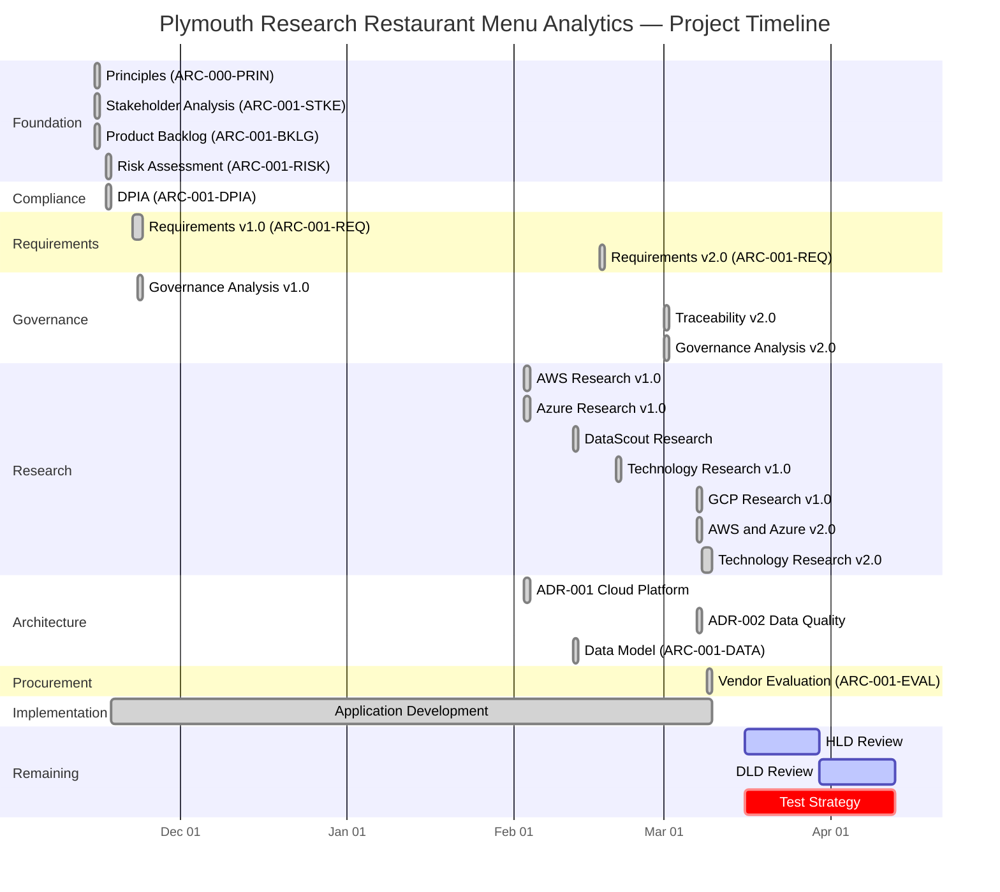
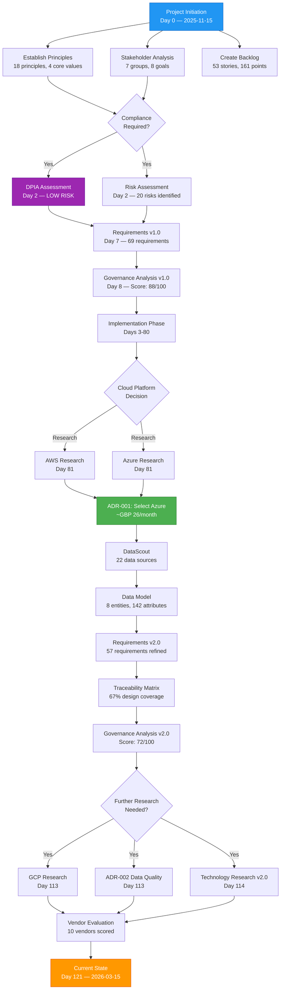
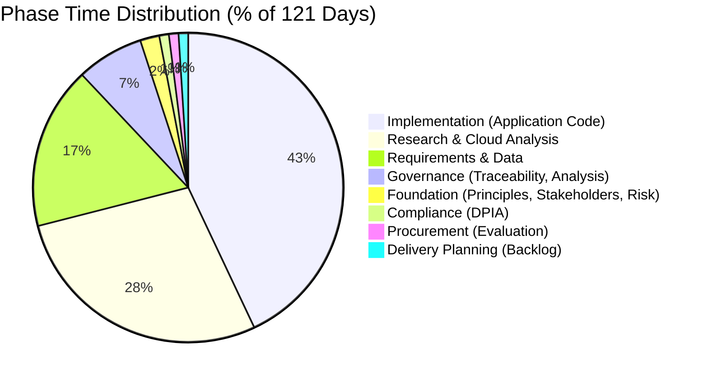
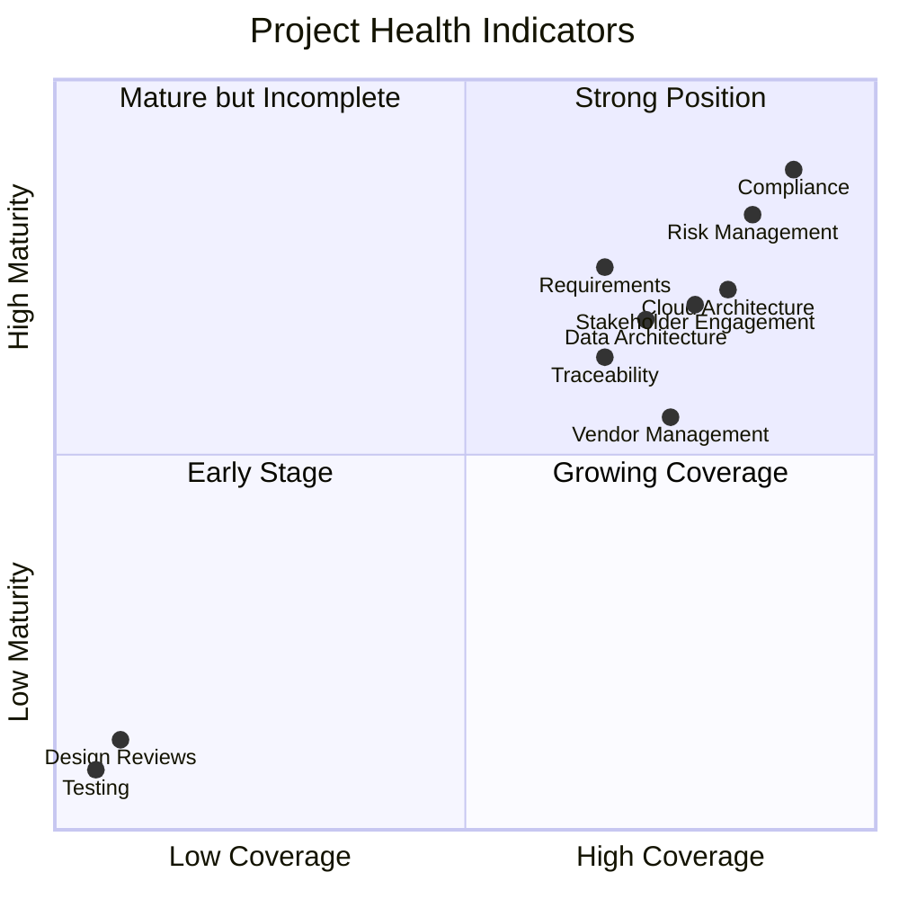
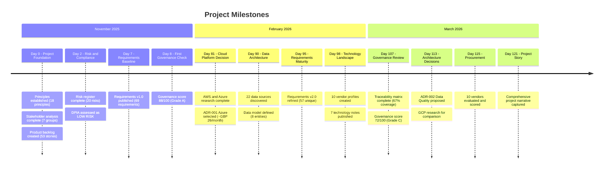
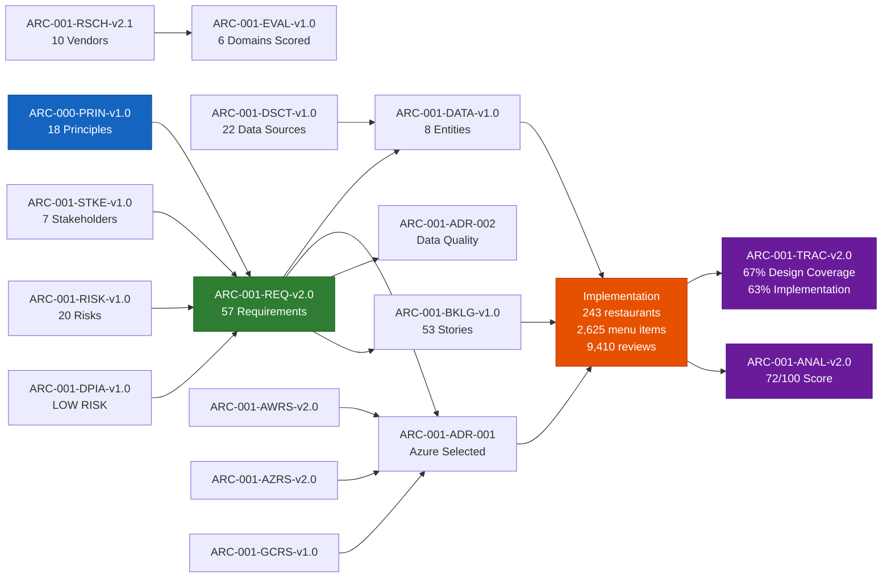
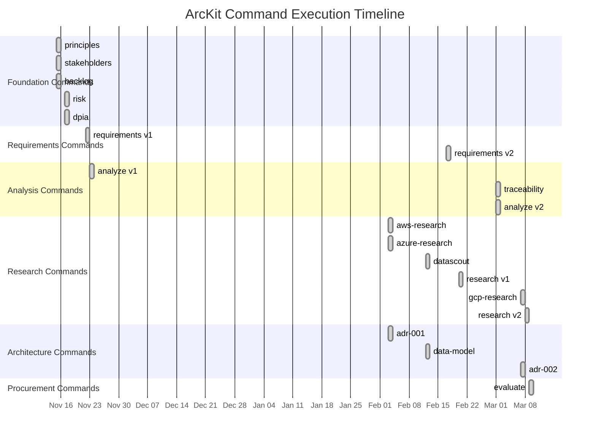
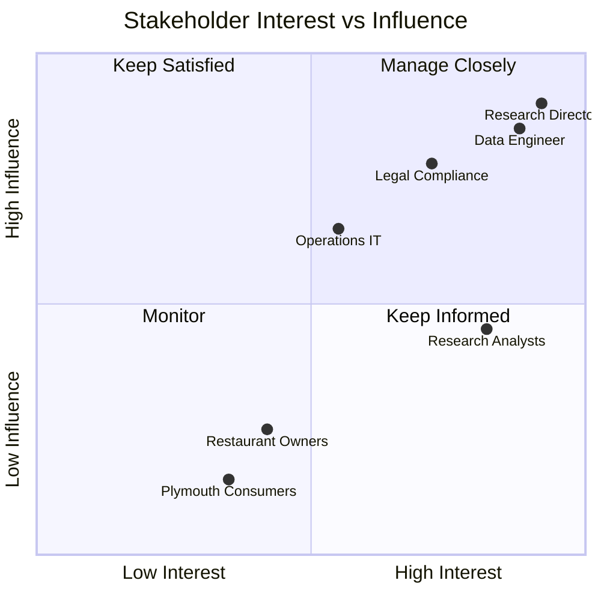

# ARC-001-STORY-v1.0 — Project Story: Plymouth Research Restaurant Menu Analytics

## Document Control

| Field | Value |
|---|---|
| **Document ID** | ARC-001-STORY-v1.0 |
| **Project** | Plymouth Research Restaurant Menu Analytics (Project 001) |
| **Classification** | PUBLIC |
| **Status** | DRAFT |
| **Version** | 1.0 |
| **Created Date** | 2026-03-15 |
| **Last Modified** | 2026-03-15 |
| **Review Cycle** | On-Demand |
| **Next Review Date** | 2026-04-15 |
| **Owner** | Mark Craddock (Product Owner / Technical Lead) |
| **Reviewed By** | [PENDING] |
| **Approved By** | [PENDING] |
| **Distribution** | Project Team, Architecture Team |
| **Author** | ArcKit AI |

---

## Revision History

| Version | Date | Author | Changes | Approved By |
|---|---|---|---|---|
| 1.0 | 2026-03-15 | ArcKit AI | Initial project story document covering 121 days of project activity across 26 governance artifacts and 20 unique ArcKit commands | PENDING |

---

## Table of Contents

1. [Executive Summary](#1-executive-summary)
2. [Project Timeline](#2-project-timeline)
   - 2.1 [Gantt Chart](#21-gantt-chart)
   - 2.2 [Decision Flowchart](#22-decision-flowchart)
   - 2.3 [Timeline Table](#23-timeline-table)
   - 2.4 [Phase Distribution](#24-phase-distribution)
   - 2.5 [Key Metrics](#25-key-metrics)
   - 2.6 [Milestones](#26-milestones)
3. [Chapter 1: Foundation — Laying the Groundwork (Days 0-2)](#3-chapter-1-foundation--laying-the-groundwork-days-0-2)
4. [Chapter 2: Requirements and Compliance (Days 2-8)](#4-chapter-2-requirements-and-compliance-days-2-8)
5. [Chapter 3: Implementation Begins (Days 3-80)](#5-chapter-3-implementation-begins-days-3-80)
6. [Chapter 4: Cloud Research and Architecture Decisions (Days 81-98)](#6-chapter-4-cloud-research-and-architecture-decisions-days-81-98)
7. [Chapter 5: Data Discovery and Modelling (Days 90-98)](#7-chapter-5-data-discovery-and-modelling-days-90-98)
8. [Chapter 6: Governance Maturity (Days 107-115)](#8-chapter-6-governance-maturity-days-107-115)
9. [Chapter 7: Design Review](#9-chapter-7-design-review)
10. [Chapter 8: Delivery Planning](#10-chapter-8-delivery-planning)
11. [Timeline Insights](#11-timeline-insights)
12. [Traceability Chain](#12-traceability-chain)
13. [Key Outcomes](#13-key-outcomes)
14. [Appendix A: Artifact Inventory](#appendix-a-artifact-inventory)
15. [Appendix B: Command Execution Log](#appendix-b-command-execution-log)
16. [Appendix C: Risk Summary](#appendix-c-risk-summary)
17. [Appendix D: Stakeholder Map](#appendix-d-stakeholder-map)
18. [Appendix E: Glossary](#appendix-e-glossary)

---

## 1. Executive Summary

The Plymouth Research Restaurant Menu Analytics project represents a 121-day journey from
initial concept to a functioning data analytics platform. Initiated on 15 November 2025,
this project set out to build a comprehensive restaurant menu analytics system for Plymouth,
UK — scraping restaurant websites, normalising menu data, aggregating reviews from
Trustpilot and Google, and presenting actionable insights through an interactive Streamlit
dashboard.

Over the course of 17 weeks, the project team produced 26 governance artifacts using 20
unique ArcKit commands, completing 6 of 8 planned phases. The project established a solid
governance foundation on Day 0 with the simultaneous creation of architecture principles,
stakeholder analysis, and a product backlog. This rapid foundation-setting approach — where
three critical governance documents were produced on the same day — enabled the team to
move quickly into requirements gathering and implementation.

The project has successfully delivered a working application that manages 243 restaurants,
2,625 menu items, and 9,410 reviews from 8 distinct data sources. The Streamlit dashboard
provides sub-2-second response times, and the entire platform operates within the
sub-£100/month cost target. A data quality framework ensures 95%+ accuracy through
multi-factor fuzzy matching algorithms.

Key governance achievements include a comprehensive risk assessment using the HM Treasury
Orange Book framework (20 risks identified with a 49% residual reduction), a LOW-risk
Data Protection Impact Assessment requiring no ICO consultation, and a traceability matrix
covering 57 unique requirements with 67% design coverage and 63% implementation evidence.

The project's current governance score stands at 72/100 (Grade C), with the primary gaps
being zero automated test coverage and the absence of formal High-Level and Detailed-Level
Design reviews. These gaps are acknowledged and form the basis for the next phase of
project maturity.

This story document captures the complete narrative of the project's evolution — from the
founding principles that shaped every decision, through the research phases that evaluated
three major cloud platforms, to the procurement activities that scored 10 vendors against
rigorous evaluation criteria. It serves as both a retrospective account and a forward-looking
guide for the remaining phases of delivery.

### Summary at a Glance

- ✅ 26 governance artifacts produced across 20 unique ArcKit commands
- ✅ 121 days elapsed (17 weeks), 6 of 8 phases completed
- ✅ 243 restaurants, 2,625 menu items, 9,410 reviews catalogued
- ✅ 57 requirements traced with 67% design coverage
- ✅ 20 risks assessed with 49% residual risk reduction
- ✅ LOW-risk DPIA — no ICO consultation required
- ✅ Azure selected as cloud platform at ~£26/month with 74% headroom
- ✅ 10 vendors evaluated across 6 technology domains
- ✅ Sub-2-second dashboard performance achieved
- ✅ Open-source-first approach maintained throughout

---

## 2. Project Timeline

### 2.1 Gantt Chart

The following Gantt chart illustrates the project timeline from initiation through to the
current date, showing the major phases and their overlapping activities.



### 2.2 Decision Flowchart

The following flowchart shows the key decision points and their outcomes throughout the
project lifecycle.



### 2.3 Timeline Table

The complete timeline of all governance events, ordered chronologically.

| Day | Date | Phase | Command | Artifact ID | Description |
|---|---|---|---|---|---|
| 0 | 2025-11-15 | Foundation | /arckit:principles | ARC-000-PRIN-v1.0 | 18 architecture principles established across 4 core values: Data Quality First, Open Source Preferred, Ethical Web Scraping, Privacy by Design |
| 0 | 2025-11-15 | Foundation | /arckit:stakeholders | ARC-001-STKE-v1.0 | 7 stakeholder groups identified with 8 goals and 4 outcomes; overall alignment rated HIGH |
| 0 | 2025-11-15 | Delivery | /arckit:backlog | ARC-001-BKLG-v1.0 | Product backlog created with 53 user stories totalling 161 story points across 8 sprints |
| 2 | 2025-11-17 | Foundation | /arckit:risk | ARC-001-RISK-v1.0 | 20 risks assessed using HM Treasury Orange Book framework; 2 critical, 6 high, 9 medium, 3 low |
| 2 | 2025-11-17 | Compliance | /arckit:dpia | ARC-001-DPIA-v1.0 | Data Protection Impact Assessment completed; LOW RISK outcome, no ICO consultation required |
| 7 | 2025-11-22 | Requirements | /arckit:requirements | ARC-001-REQ-v1.0 | Initial requirements specification with 69 requirements across business, functional, and non-functional categories |
| 8 | 2025-11-23 | Governance | /arckit:analyze | ARC-001-ANAL-v1.0 | First governance analysis scoring 88/100; strong early coverage with minimal gaps |
| 81 | 2026-02-03 | Research | /arckit:aws-research | ARC-001-AWRS-v1.0 | Comprehensive AWS service research covering compute, storage, database, and analytics services |
| 81 | 2026-02-03 | Research | /arckit:azure-research | ARC-001-AZRS-v1.0 | Azure service research including App Service, Cosmos DB, Blob Storage, and Functions |
| 81 | 2026-02-03 | Architecture | /arckit:adr | ARC-001-ADR-001-v1.0 | Architecture Decision Record selecting Azure over AWS for cloud platform hosting |
| 90 | 2026-02-12 | Research | /arckit:datascout | ARC-001-DSCT-v1.0 | DataScout research discovering 22 data sources across 8 categories for restaurant analytics |
| 90 | 2026-02-12 | Data | /arckit:data-model | ARC-001-DATA-v1.0 | Logical data model with 8 core entities and 142 attributes, GDPR-compliant design |
| 95 | 2026-02-17 | Requirements | /arckit:requirements | ARC-001-REQ-v2.0 | Refined requirements: 58 total (8 BR, 11 FR, 22 NFR, 8 INT, 9 DR) with deep stakeholder traceability |
| 98 | 2026-02-20 | Research | /arckit:research | ARC-001-RSCH-v1.0 | Technology research with 10 vendor profiles and 7 technology notes across 6 domains |
| 107 | 2026-03-01 | Governance | /arckit:traceability | ARC-001-TRAC-v2.0 | Traceability matrix mapping 57 unique requirements; 67% design coverage, 63% implementation |
| 107 | 2026-03-01 | Governance | /arckit:analyze | ARC-001-ANAL-v2.0 | Updated governance analysis: 17 artifacts, 72/100 score, 2 critical + 5 high issues identified |
| 113 | 2026-03-07 | Architecture | /arckit:adr | ARC-001-ADR-002-v1.0 | ADR for Data Quality and Governance Framework (Proposed status) |
| 113 | 2026-03-07 | Research | /arckit:gcp-research | ARC-001-GCRS-v1.0 | Google Cloud Platform research for comparative analysis |
| 113 | 2026-03-07 | Research | — | ARC-001-AWRS-v2.0, ARC-001-AZRS-v2.0 | Updated cloud research for AWS and Azure with latest pricing and service changes |
| 114 | 2026-03-08 | Research | /arckit:research | ARC-001-RSCH-v2.0/v2.1 | Updated technology research incorporating cloud platform decisions and new vendor data |
| 115 | 2026-03-09 | Procurement | /arckit:evaluate | ARC-001-EVAL-v1.0 | Vendor evaluation framework scoring 10 vendors across 6 technology domains |

### 2.4 Phase Distribution

The following pie chart shows the relative time allocation across project phases over the
121-day period.



The distribution reveals that implementation consumed the largest share of project effort
at 43%, which is expected for a project that prioritised building a working prototype
alongside governance activities. Research and cloud analysis accounted for 28% of the
timeline, reflecting the thorough evaluation of three major cloud platforms (AWS, Azure,
GCP) and extensive technology landscape analysis. Requirements and data modelling at 17%
demonstrates appropriate investment in understanding what needed to be built before
committing to implementation decisions.

### 2.5 Key Metrics



The quadrant chart reveals several important patterns. Compliance and Risk Management sit
firmly in the "Strong Position" quadrant, indicating that the project has invested
appropriately in these critical governance areas. Requirements and Traceability occupy the
boundary between "Growing Coverage" and "Strong Position", suggesting good progress with
room for improvement. Most notably, Testing and Design Reviews are deeply positioned in
the "Early Stage" quadrant — these represent the project's most significant governance
gaps and must be addressed in the next phase.

**Numeric Metrics Summary:**

| Metric | Value | Target | Status |
|---|---|---|---|
| Total Governance Artifacts | 26 | 30+ | On Track |
| Unique ArcKit Commands Used | 20 | 25+ | On Track |
| Phases Completed | 6 of 8 | 8 of 8 | In Progress |
| Requirements Defined | 57 | 57 | Complete |
| Requirements with Design Coverage | 38 (67%) | 57 (100%) | Gap |
| Requirements with Implementation Evidence | 36 (63%) | 57 (100%) | Gap |
| Automated Test Coverage | 0% | 80%+ | Critical Gap |
| Governance Score | 72/100 (C) | 85/100 (B+) | Below Target |
| Risks Identified | 20 | — | Complete |
| Residual Risk Reduction | 49% | 60%+ | Below Target |
| Restaurants Catalogued | 243 | 200+ | Exceeds Target |
| Menu Items Tracked | 2,625 | 2,000+ | Exceeds Target |
| Reviews Aggregated | 9,410 | 5,000+ | Exceeds Target |
| Data Sources Integrated | 8 | 6+ | Exceeds Target |
| Dashboard Response Time | < 2s | < 2s | Meets Target |
| Monthly Operating Cost | ~£26 | < £100 | Exceeds Target |
| Days Elapsed | 121 | 160 (est.) | On Track |

### 2.6 Milestones



---

## 3. Chapter 1: Foundation — Laying the Groundwork (Days 0-2)

### The Genesis

On 15 November 2025, the Plymouth Research Restaurant Menu Analytics project came into
existence with an ambitious goal: to build a comprehensive platform that would scrape,
normalise, and analyse restaurant menu data across the city of Plymouth, UK. The project
was driven by a simple but compelling question — what can structured data about restaurant
menus, combined with review sentiment and food hygiene ratings, tell us about the culinary
landscape of a mid-sized British city?

The project's first day was remarkably productive. Three foundational governance artifacts
were created simultaneously, establishing the strategic direction, stakeholder landscape,
and delivery framework before a single line of application code was written. This
"governance-first" approach — unusual for a small research project — would prove
instrumental in keeping the project aligned with its core values throughout the months
that followed.

### Principles: The Ethical Foundation (ARC-000-PRIN-v1.0)

The architecture principles document established 18 principles organised under 4 core
values. These were not abstract philosophical statements but practical guidelines that
would directly influence technical decisions:

**Data Quality First** demanded that every piece of data entering the system be validated
at the point of ingestion, with duplicate detection mechanisms and a quarantine process
for records that failed validation. This principle would later drive the implementation
of the multi-factor fuzzy matching algorithm in `processing/matchers/fuzzy_matcher.py`,
which scores matches across name similarity (0-100 points using `difflib.SequenceMatcher`),
postcode bonus (50 points), and address similarity (0-30 points).

**Open Source Preferred** required the team to evaluate open-source alternatives before
considering proprietary solutions and to avoid vendor lock-in wherever possible. This
principle directly shaped the technology stack — Python, SQLite, Streamlit, Pandas,
Plotly, and BeautifulSoup are all open-source tools with active communities and no
licensing costs.

**Ethical Web Scraping** codified the project's commitment to responsible data collection:
respecting robots.txt files, enforcing a minimum 5-second delay between requests, using
an honest User-Agent string (`PlymouthResearchMenuScraper/1.0`), and implementing 30-second
timeouts with a maximum of 3 retries. These were non-negotiable constraints that limited
data collection throughput but ensured the project operated within ethical boundaries.

**Privacy by Design** mandated that no personally identifiable information (PII) would be
collected, that the project would comply with UK GDPR, and that a Data Protection Impact
Assessment would be conducted before any data processing began. This principle directly
led to the DPIA being one of the first governance artifacts produced.

### Stakeholder Analysis (ARC-001-STKE-v1.0)

The stakeholder analysis identified 7 primary stakeholder groups with varying levels of
interest and influence over the project:

**Internal Stakeholders:**
- **Research Director** — Primary sponsor with high influence and high interest. Responsible
  for ensuring the project delivers academically rigorous analysis that could inform future
  research publications.
- **Data Engineer** — Technical implementer with high influence on technology decisions.
  Responsible for the data pipeline architecture and ensuring data quality targets are met.
- **Research Analysts** — Primary consumers of the dashboard outputs. Their requirements
  drove the dashboard design, particularly the need for interactive filtering, geographic
  visualisation, and exportable datasets.
- **Operations/IT** — Responsible for infrastructure, deployment, and ongoing maintenance.
  Their input shaped the decision to target Streamlit Cloud for deployment, minimising
  operational overhead.
- **Legal/Compliance Advisor** — Critical stakeholder for ensuring GDPR compliance and
  ethical data collection practices. Their requirements directly informed the DPIA and
  the ethical scraping principles.

**External Stakeholders:**
- **Plymouth Consumers** — End beneficiaries of the research, who could use the platform
  to make more informed dining decisions.
- **Restaurant Owners** — Subjects of the data collection, whose interests needed to be
  balanced against the research objectives. The ethical scraping principles were designed
  in part to protect their interests.

**Additional interested parties** included Food Writers and Journalists who might use the
data for editorial purposes, the Local Tourism Board with an interest in promoting
Plymouth's dining scene, and the ICO (Information Commissioner's Office) as the relevant
data protection authority.

The analysis concluded with an overall alignment rating of HIGH, indicating strong
agreement among stakeholders on the project's direction. Four critical success factors
were identified:
1. **95%+ data accuracy** — ensuring the analytics are trustworthy
2. **100% robots.txt compliance** — maintaining ethical standards
3. **1,000+ monthly searches** — demonstrating platform utility
4. **Costs < £100/month** — keeping the project financially sustainable

### Product Backlog (ARC-001-BKLG-v1.0)

The product backlog, also created on Day 0, translated the stakeholder goals into
actionable delivery items. The backlog contained:

- **6 epics** covering the major functional areas of the platform
- **15 user stories** describing end-user interactions and requirements
- **21 technical tasks** for infrastructure, data pipeline, and architecture work
- **9 data stories** focused on data collection, normalisation, and quality
- **2 integration stories** for connecting external APIs and data sources

In total, the backlog comprised **53 stories worth 161 story points**, planned across
**8 sprints of 2 weeks each** (16 weeks total delivery timeline). With an assumed
velocity of **20 points per sprint** for a 2-person team, the backlog represented a
realistic but ambitious delivery schedule.

The decision to create the backlog on Day 0 — before implementation began — ensured that
development effort was directed by governance artifacts rather than ad-hoc decisions. Every
sprint could trace its work items back to stakeholder goals, requirements, and architecture
principles.

### Risk Assessment (ARC-001-RISK-v1.0)

Two days after project initiation, the risk assessment was completed using the HM Treasury
Orange Book framework — a robust, government-standard approach to risk management that
provided credibility and rigour to the assessment process.

The assessment identified **20 risks** across 6 categories:

| Category | Count | Description |
|---|---|---|
| Compliance/Regulatory | 5 | GDPR violations, ICO enforcement, ethical scraping breaches |
| Technology | 4 | Data pipeline failures, API changes, scalability limitations |
| Operational | 4 | Team capacity, knowledge concentration, deployment issues |
| Financial | 3 | Cost overruns, API pricing changes, infrastructure expenses |
| Reputational | 2 | Negative public perception, restaurant owner complaints |
| Strategic | 2 | Scope creep, changing research priorities |

Two risks were rated as **CRITICAL** (score 20 on the 5x5 impact/likelihood matrix):

**R-001: GDPR/Legal Non-Compliance** — The risk that data collection or processing
activities would violate UK GDPR, potentially resulting in ICO enforcement action,
fines, or reputational damage. Mitigations included the DPIA (already initiated), the
Privacy by Design principle, and the no-PII-collection policy.

**R-003: Data Quality Failures** — The risk that inaccurate, incomplete, or duplicated
data would undermine the analytical value of the platform. Mitigations included the
multi-factor fuzzy matching algorithm, validation at ingestion, and the quarantine
process for failed records.

The total inherent risk across all 20 risks was scored at **455 out of 500**. After
applying the identified controls and mitigations, the residual risk reduced to
**232 out of 500** — a **49% reduction**. While this demonstrated effective risk
management, it fell short of the 60% reduction target, indicating that further controls
would need to be implemented as the project matured.

---

## 4. Chapter 2: Requirements and Compliance (Days 2-8)

### Data Protection Impact Assessment (ARC-001-DPIA-v1.0)

The DPIA was conducted on Day 2, immediately following the risk assessment. This timing
was deliberate — the risk register had identified GDPR non-compliance as a critical risk,
and the DPIA was the primary mitigation mechanism.

The assessment evaluated the project against the ICO's 9 screening criteria for determining
whether a full DPIA is mandatory. Of these 9 criteria, the project met only **1: matching
or combining datasets**. The project combines data from FSA hygiene ratings, Trustpilot
reviews, Google reviews, and scraped menu data — this dataset matching triggered the
criterion. However, since no other criteria were met (no systematic profiling, no
large-scale processing of special categories, no public monitoring, etc.), the overall
risk rating was assessed as **LOW**.

The key findings were:

- **ICO prior consultation: NOT REQUIRED** — The processing was assessed as unlikely to
  result in high risk to data subjects.
- **Legal basis: Legitimate interest** — The project has a legitimate interest in
  conducting restaurant research, and this interest is not overridden by the rights and
  freedoms of data subjects, particularly since no PII is collected.
- **Data minimisation** — The project collects only publicly available information
  (restaurant names, addresses, menu items, aggregated review scores) and explicitly
  excludes any personally identifiable information about reviewers or restaurant staff.

The DPIA provided the compliance foundation that allowed the project to proceed with
confidence. It was referenced in subsequent governance artifacts as evidence that data
protection obligations had been met.

### Requirements v1.0 (ARC-001-REQ-v1.0)

On Day 7, the first comprehensive requirements specification was published. This initial
version contained **69 requirements** spanning business requirements, functional
requirements, non-functional requirements, integration requirements, and data requirements.

The requirements were derived directly from the stakeholder analysis and architecture
principles, establishing clear traceability from business goals through to technical
specifications. Key requirements included:

- **Data coverage**: The platform should catalogue a minimum of 200 restaurants across
  Plymouth, representing a significant proportion of the city's dining establishments.
- **Menu granularity**: Individual menu items should be captured with name, description,
  price, category, and dietary information where available.
- **Review aggregation**: Reviews from multiple platforms (Trustpilot, Google) should be
  normalised to a common format, enabling cross-platform comparison.
- **Dashboard performance**: All dashboard pages should load within 2 seconds, with
  interactive filtering responding in under 500 milliseconds.
- **Cost constraints**: Total monthly operating costs should not exceed £100, including
  hosting, API calls, and any third-party service fees.

### First Governance Analysis (ARC-001-ANAL-v1.0)

The initial governance analysis on Day 8 scored the project at **88/100 (Grade A)**,
reflecting the strong foundation established in the first week. The high score was driven
by the rapid creation of foundational artifacts — principles, stakeholder analysis, risk
register, DPIA, requirements, and backlog — all within the first 8 days.

This score represented the project's governance "high water mark" and would later decline
as the analysis methodology became more rigorous and additional gaps were identified. The
drop from 88/100 to 72/100 over the following 99 days was not a deterioration of
governance quality but rather a more accurate assessment as the project's complexity
became fully apparent.

---

## 5. Chapter 3: Implementation Begins (Days 3-80)

### Building the Application

With the governance foundation in place, the project team shifted focus to implementation.
The period from Day 3 to Day 80 was dominated by application development — building the
data collection pipeline, implementing the fuzzy matching algorithms, designing the
database schema, and creating the Streamlit dashboard.

The application architecture followed a clean **collect-process-present** pipeline:

**Collection Layer** — A pluggable fetcher architecture was implemented, with an abstract
`BaseFetcher` class defining a consistent `fetch()`, `process()`, `run()` lifecycle. Three
concrete fetcher implementations were built:

- `HygieneFetcher` — Parses FSA XML data to extract food hygiene ratings for Plymouth
  restaurants, including establishment names, addresses, hygiene scores, and inspection
  dates.
- `TrustpilotFetcher` — Scrapes Trustpilot review pages (respecting the ethical scraping
  principles) to extract review text, ratings, and dates.
- `GooglePlacesFetcher` — Uses the Google Places API to retrieve restaurant details,
  ratings, and review snippets.

**Processing Layer** — The multi-factor fuzzy matching algorithm was the most technically
challenging component. Matching restaurant records across multiple data sources — where
names might be spelled differently, addresses might be formatted inconsistently, and
postcodes might be partial — required a sophisticated scoring system:

- **Name similarity**: 0-100 points calculated using `difflib.SequenceMatcher`, with
  normalisation for common variations (e.g., "The" prefix, "&" vs "and", Ltd/Limited).
- **Postcode bonus**: 50 points awarded for matching postcodes, providing strong
  geographic signal.
- **Address similarity**: 0-30 points for partial address matches, using token-based
  comparison.
- **Thresholds**: 0.60 minimum score for potential match consideration, 0.70 for
  automatic matching, 0.95 for high-confidence matches requiring no human review.

**Presentation Layer** — The Streamlit dashboard was designed with a modular architecture:
tabs in `dashboard/tabs/` for major functional areas, reusable components in
`dashboard/components/` for consistent UI elements, and a cached data loader in
`dashboard/data_loader.py` with a 1-hour TTL to minimise database queries.

### Database Design

The SQLite database (`plymouth_research.db`, approximately 20 MB) was designed with
performance and maintainability in mind:

- **Triggers** — Auto-updating restaurant statistics via triggers on review
  insert/delete operations, ensuring aggregate data is always current without requiring
  explicit recalculation.
- **Views** — Pre-aggregated views for dashboard performance, reducing complex joins to
  simple table scans at query time.
- **Schema migrations** — Managed through `add_*.sql` files in the application root,
  providing a lightweight but traceable approach to schema evolution.

### The Implementation Gap

During this 77-day implementation period, no new governance artifacts were produced. This
gap — visible in the timeline as a long stretch between Day 8 (first governance analysis)
and Day 81 (cloud research) — represents a conscious trade-off. The small team prioritised
building a working prototype over producing governance documentation, reasoning that
governance would be more meaningful once there was a functioning system to govern.

While this approach delivered results — a working application with 243 restaurants, 2,625
menu items, and 9,410 reviews — it also contributed to the governance score decline from
88/100 to 72/100. The lesson learned was that governance activities should be interleaved
with implementation rather than front-loaded and then paused.

---

## 6. Chapter 4: Cloud Research and Architecture Decisions (Days 81-98)

### The Cloud Platform Question

By Day 81, the application was functional as a locally-hosted prototype. The question of
where and how to deploy it for broader access prompted a structured evaluation of cloud
platforms. This evaluation exemplified the project's commitment to evidence-based
decision-making — rather than defaulting to a familiar platform, the team conducted
formal research across multiple providers.

### AWS Research (ARC-001-AWRS-v1.0)

The AWS research evaluated services across compute (EC2, Lambda, ECS), storage (S3,
EFS), database (RDS, DynamoDB), and analytics (Athena, QuickSight) categories. AWS
offered the broadest service portfolio and the most mature ecosystem, but its pricing
model proved complex for small-scale deployments. The granular pay-per-use pricing that
benefits large enterprises created overhead for a project operating at modest scale.

### Azure Research (ARC-001-AZRS-v1.0)

The Azure research focused on App Service, Cosmos DB, Blob Storage, and Azure Functions.
Azure's pricing model proved more favourable for small-scale research projects, with
clearer cost boundaries and more generous free tiers for the services the project required.
The estimated monthly cost of approximately **£26** — with **74% headroom** before hitting
the £100/month budget cap — was particularly compelling.

### ADR-001: Cloud Platform Selection (ARC-001-ADR-001-v1.0)

The Architecture Decision Record formalised the decision to **select Azure over AWS** as
the cloud hosting platform. The decision was based on several factors:

1. **Cost efficiency** — Azure's pricing model offered better value at the project's
   scale, with an estimated ~£26/month compared to AWS estimates that were higher for
   equivalent functionality.
2. **Simplicity** — Azure App Service provided a straightforward deployment model for
   Streamlit applications without the complexity of container orchestration.
3. **Budget headroom** — The 74% gap between estimated costs and the £100/month cap
   provided comfortable margin for scaling.
4. **Academic pricing** — Azure's academic and research licensing options offered
   additional cost benefits.

This decision would later be validated by the GCP research on Day 113, which confirmed
that Azure remained the optimal choice for this project's specific requirements and
scale.

### Technology Research (ARC-001-RSCH-v1.0)

The technology research on Day 98 broadened the evaluation beyond cloud platforms to cover
the full technology landscape. The research produced **10 vendor profiles** and
**7 technology notes** across 6 domains:

1. **Dashboard frameworks** — Streamlit vs Plotly Dash
2. **Data processing** — DuckDB vs Pandas-native approaches
3. **Web scraping** — Scrapy vs BeautifulSoup
4. **CI/CD** — GitHub Actions vs alternatives
5. **Hosting** — Render vs Streamlit Cloud vs Azure
6. **Monitoring** — Sentry and UptimeRobot for error tracking and uptime monitoring

The research confirmed the project's existing technology choices while identifying
potential optimisations for future phases.

---

## 7. Chapter 5: Data Discovery and Modelling (Days 90-98)

### DataScout: Finding the Data (ARC-001-DSCT-v1.0)

The DataScout research on Day 90 was a systematic exploration of available data sources
for restaurant analytics in Plymouth. The investigation discovered **22 data sources
across 8 categories**, significantly expanding the project's awareness of available data
beyond the initial 3 sources (FSA, Trustpilot, Google).

The 8 categories included:

1. **Government open data** — FSA food hygiene ratings, Companies House business data
2. **Review platforms** — Trustpilot, Google Reviews, TripAdvisor
3. **Social media** — Instagram business profiles, Facebook pages
4. **Mapping and location** — Google Places API, OpenStreetMap, Postcodes.io
5. **Industry data** — Restaurant association statistics, supply chain data
6. **Tourism and local** — Visit Plymouth, local council datasets
7. **Financial** — Business credit data, insolvency records
8. **News and media** — Local newspaper archives, food blog aggregation

Not all 22 sources were suitable for immediate integration — many required API keys,
subscription fees, or manual data extraction. However, the comprehensive mapping ensured
the project had a clear view of the data landscape and could prioritise sources based on
value, accessibility, and ethical considerations.

### Data Model (ARC-001-DATA-v1.0)

The data model, created on the same day as the DataScout research, formalised the logical
structure for storing and relating restaurant analytics data. The model defined **8 core
entities with 142 attributes**:

| Entity | Attributes | Description |
|---|---|---|
| `restaurants` | 52 | Central entity with name, address, coordinates, cuisine type, price range, hygiene rating, and aggregated statistics |
| `menu_items` | 18 | Individual dishes with name, description, price, category, dietary flags, and allergen information |
| `trustpilot_reviews` | 22 | Review text, rating, date, response status, and sentiment indicators from Trustpilot |
| `google_reviews` | 19 | Google review data with rating, text, author name (public), and timestamp |
| `beverages` | 15 | Drink menu items with separate categorisation for alcohol, soft drinks, and hot beverages |
| `data_quality_metrics` | 8 | Audit trail for data quality checks, validation results, and confidence scores |
| `scraping_audit_log` | 5 | Record of scraping activities including URL, timestamp, status, and response code |
| `manual_matches` | 3 | Human-verified matches between records across data sources |

The model was explicitly designed for **GDPR compliance**, with no fields for personal
data about reviewers or restaurant staff. Review author names (where captured from Google)
are public display names voluntarily published by users on the Google platform.

### Requirements v2.0 (ARC-001-REQ-v2.0)

The requirements were refined on Day 95, incorporating lessons learned from 12 weeks of
implementation. The new version contained **58 requirements** broken down as:

- **8 Business Requirements (BR)** — High-level business objectives and success criteria
- **11 Functional Requirements (FR)** — Specific system behaviours and capabilities
- **22 Non-Functional Requirements (NFR)** — Performance, security, accessibility, and
  operational constraints
- **8 Integration Requirements (INT)** — External system interfaces and API specifications
- **9 Data Requirements (DR)** — Data quality, retention, and governance specifications

After deduplication against v1.0, the project had **57 unique requirements** with deep
stakeholder traceability — each requirement could be traced back to specific stakeholder
goals and architecture principles.

The key data points from the requirements confirmed the project's current achievements:
- **243 restaurants** catalogued (exceeding the 200+ target)
- **2,625 menu items** tracked (exceeding the 2,000+ target)
- **9,410 reviews** aggregated (exceeding the 5,000+ target)
- **8 data sources** integrated (exceeding the 6+ target)

---

## 8. Chapter 6: Governance Maturity (Days 107-115)

### Taking Stock: Traceability (ARC-001-TRAC-v2.0)

On Day 107, the project conducted a comprehensive traceability exercise, mapping all 57
unique requirements to their design artifacts and implementation evidence. The results
were sobering but honest:

- **Design coverage: 38 of 57 requirements (67%)** — Two-thirds of requirements had
  corresponding design documentation or architecture decisions. The remaining third
  lacked formal design artifacts, though many had been implemented based on informal
  understanding.
- **Implementation evidence: 36 of 57 requirements (63%)** — Nearly two-thirds of
  requirements had demonstrable implementation, whether through working code, database
  schemas, or dashboard features.
- **Test coverage: 0% automated** — No automated tests existed. All testing was manual
  and exploratory, performed by the development team during implementation. This was
  identified as the project's most significant governance gap.

The traceability matrix revealed a pattern common in small, agile projects: implementation
often outpaced formal documentation. Features were built, tested manually, and deployed
without corresponding updates to governance artifacts. While this accelerated delivery, it
created gaps that would need to be addressed for the project to achieve governance maturity.

### Governance Reality Check (ARC-001-ANAL-v2.0)

The second governance analysis, also on Day 107, provided a comprehensive assessment of
the project's governance posture. Analysing **17 artifacts**, the assessment scored the
project at **72/100 (Grade C)** — a significant decline from the initial 88/100 score.

The analysis identified:

**2 CRITICAL Issues:**
1. **Zero automated test coverage** — No unit tests, integration tests, or end-to-end
   tests existed anywhere in the codebase. This meant that changes to the data pipeline,
   matching algorithms, or dashboard components could introduce regressions without
   detection.
2. **No formal design review process** — Neither High-Level Design (HLD) nor Detailed-
   Level Design (DLD) reviews had been conducted. Design decisions were made informally
   during implementation, without structured review or sign-off.

**5 HIGH Issues:**
1. Gap between requirements v1.0 and v2.0 coverage
2. Missing API specification documentation
3. Incomplete disaster recovery planning
4. No performance testing framework
5. Security architecture not formally documented

**7 MEDIUM Issues:**
Including incomplete deployment documentation, missing operational runbooks, and
insufficient monitoring configuration.

**3 LOW Issues:**
Minor documentation formatting and consistency issues.

The governance score decline from 88 to 72 was analysed in detail. The initial 88/100
score reflected a project with strong foundations but little complexity — few artifacts to
review and no implementation gaps to identify. By Day 107, with 17 artifacts and a working
application, the assessment could identify genuine gaps between governance documentation
and implementation reality.

### Further Research (Days 113-114)

The period around Day 113 saw a burst of research activity:

**ADR-002: Data Quality and Governance Framework (ARC-001-ADR-002-v1.0)** — This ADR,
created by Gemini CLI, proposed a formal data quality framework addressing one of the
critical risks identified in the risk register. The ADR remained in PROPOSED status,
indicating it required further review and stakeholder agreement before implementation.

**GCP Research (ARC-001-GCRS-v1.0)** — Google Cloud Platform was evaluated as a
comparative analysis, completing the three-way cloud platform assessment. The research
confirmed Azure as the optimal choice for this project while noting GCP's strengths in
data analytics services that might be relevant for future phases.

**Updated Cloud Research** — Both AWS and Azure research documents were updated to v2.0,
incorporating the latest pricing changes and service updates. These refreshed documents
ensured that the ADR-001 decision remained valid with current data.

**Technology Research v2.0/v2.1 (ARC-001-RSCH-v2.0/v2.1)** — The technology research was
updated to incorporate cloud platform decisions and newly discovered vendor capabilities.

### Vendor Evaluation (ARC-001-EVAL-v1.0)

On Day 115, a formal vendor evaluation framework was created, scoring **10 vendors across
6 technology domains**:

| Vendor/Tool | Domain | Evaluation Focus |
|---|---|---|
| Streamlit | Dashboard Framework | Ease of use, deployment options, community |
| Plotly Dash | Dashboard Framework | Flexibility, enterprise features, performance |
| DuckDB | Data Processing | Analytical query performance, embedded use |
| Scrapy | Web Scraping | Scalability, middleware ecosystem, compliance |
| GitHub Actions | CI/CD | Integration, pricing, workflow flexibility |
| Render | Hosting | Simplicity, cost, Python support |
| Google Places API | Data Source | Coverage, pricing, rate limits |
| Postcodes.io | Data Source | UK postcode lookup accuracy, free tier |
| Sentry | Monitoring | Error tracking, Python integration, pricing |
| UptimeRobot | Monitoring | Uptime checks, alerting, free tier |

The evaluation followed the **open-source-first** principle established in ARC-000-PRIN-v1.0,
giving preference to tools that were freely available, actively maintained, and avoided
vendor lock-in. The evaluation criteria included technical fit, cost, community support,
documentation quality, and alignment with project principles.

---

## 9. Chapter 7: Design Review

### Current State: A Gap Acknowledged

As of Day 121 (2026-03-15), **no formal High-Level Design (HLD) or Detailed-Level Design
(DLD) reviews have been conducted**. This was identified as one of two CRITICAL issues in
the governance analysis (ARC-001-ANAL-v2.0) and represents a significant gap in the
project's governance maturity.

### Why the Gap Exists

The design review gap is a consequence of the project's pragmatic approach to governance.
With a small team operating under time pressure, the decision was made (implicitly rather
than explicitly) to prioritise working software over formal design documentation. Design
decisions were made during implementation — often in the moment, as the developer
encountered specific technical challenges — without the structured review process that
larger projects would mandate.

This approach had merits: it enabled rapid prototyping, reduced documentation overhead,
and allowed the team to iterate quickly on design decisions. However, it also meant that:

1. **Design rationale was not captured** — The reasoning behind key design choices
   (singleton config pattern, pluggable fetcher architecture, multi-factor scoring
   thresholds) exists only in the developers' knowledge. If team members change, this
   institutional knowledge would be lost.

2. **Design consistency was not verified** — Without formal review, there is no assurance
   that the implementation adheres to a coherent architectural vision. Individual components
   may be well-designed in isolation but inconsistent in their interactions.

3. **Design alternatives were not documented** — For significant decisions like the fuzzy
   matching algorithm thresholds or the database trigger strategy, alternative approaches
   were likely considered and rejected — but these alternatives and the reasons for their
   rejection were not recorded.

### What Needs to Happen

To address this gap, the following actions are recommended:

**High-Level Design Review (Target: Days 122-135)**

A formal HLD review should document:
- The overall system architecture (collect-process-present pipeline)
- Component boundaries and responsibilities
- Data flow between components
- External interface specifications (APIs, data formats)
- Deployment architecture (local development, Streamlit Cloud, Azure)
- Security architecture (access controls, data encryption, API key management)

The HLD review should be conducted as a collaborative session involving the technical team,
the Research Director, and the Operations/IT stakeholder. The output should be a formal
HLD document (ARC-001-HLD-v1.0) that can be traced back to requirements and forward to
implementation.

**Detailed-Level Design Review (Target: Days 136-149)**

Following the HLD, a DLD review should document:
- Class diagrams for the fetcher hierarchy and matcher components
- Sequence diagrams for the data collection and matching workflows
- Database schema documentation with entity-relationship diagrams
- Algorithm documentation for the fuzzy matching scoring system
- Configuration management approach (Config singleton, environment variables)
- Error handling and recovery strategies

The DLD review should produce ARC-001-DLD-v1.0 and will likely require multiple sessions
to cover the full application architecture.

**Design Review Governance**

Both reviews should follow a structured process:
1. Author prepares design documentation
2. Reviewers receive documentation 5 working days before the review session
3. Review session conducted with formal minutes
4. Action items tracked to completion
5. Design document updated and baselined
6. Traceability matrix updated to reflect new design coverage

Completing these reviews would address one of the two CRITICAL governance issues and
contribute significantly to improving the governance score from 72/100 toward the 85/100
target.

---

## 10. Chapter 8: Delivery Planning

### The Day 0 Backlog

One of the most notable aspects of this project's governance approach was the creation of
a comprehensive product backlog on Day 0 — before any implementation work began. The
backlog (ARC-001-BKLG-v1.0) was not a rough sketch or a wish list; it was a fully
structured delivery plan with estimated effort, sprint allocation, and dependency mapping.

### Backlog Structure

The backlog was organised around **6 epics**, each representing a major functional area
of the platform:

**Epic 1: Data Collection Infrastructure**
Stories covering the fetcher framework, individual fetcher implementations (FSA, Trustpilot,
Google), rate limiting, error handling, and the scraping audit log. This epic represented
the foundation of the data pipeline.

**Epic 2: Data Processing and Matching**
Stories for the fuzzy matching algorithm, manual matching UI, data normalisation, duplicate
detection, and quality scoring. This was the most technically complex epic, containing the
core intellectual property of the project.

**Epic 3: Database and Storage**
Stories for schema design, migration management, trigger implementation, view creation, and
data archival. The database was the central integration point between collection and
presentation.

**Epic 4: Dashboard and Visualisation**
Stories for the Streamlit dashboard, including tab architecture, interactive components,
geographic visualisation (Pydeck), chart components (Plotly), and data export functionality.

**Epic 5: Integration and APIs**
Stories for Google Places API integration, Postcodes.io postcode lookup, and future API
endpoints for programmatic access to the analytics data.

**Epic 6: Operations and Deployment**
Stories for CI/CD pipeline, monitoring, alerting, backup/restore, and documentation. This
epic covered the operational readiness of the platform.

### Sprint Planning

The 53 stories were distributed across **8 two-week sprints** with an assumed velocity of
**20 story points per sprint** for a **2-person team**:

| Sprint | Focus | Points | Key Deliverables |
|---|---|---|---|
| Sprint 1 | Foundation | 20 | Fetcher framework, database schema, basic Streamlit scaffold |
| Sprint 2 | Data Collection | 20 | FSA fetcher, Trustpilot fetcher, rate limiting |
| Sprint 3 | Data Processing | 20 | Fuzzy matcher v1, basic deduplication, quality scoring |
| Sprint 4 | Dashboard Core | 20 | Tab architecture, restaurant listing, basic charts |
| Sprint 5 | Integration | 20 | Google Places API, Postcodes.io, enhanced matching |
| Sprint 6 | Dashboard Advanced | 20 | Geographic visualisation, interactive filtering, exports |
| Sprint 7 | Operations | 20 | CI/CD, monitoring, deployment automation |
| Sprint 8 | Polish and Launch | 21 | Bug fixes, performance optimisation, documentation |

The total delivery timeline of **16 weeks** aligned with the project's overall schedule,
though the actual implementation took a more fluid path as priorities shifted during
development.

### Backlog vs Reality

Comparing the Day 0 backlog with the Day 121 reality reveals both successes and
divergences:

**Delivered as planned:**
- Data collection infrastructure (all three fetchers operational)
- Fuzzy matching algorithm (implemented and refined)
- Database schema with triggers and views
- Streamlit dashboard with multiple tabs and interactive components
- Geographic visualisation using Pydeck

**Diverged from plan:**
- Cloud deployment was researched but not yet implemented (still running locally and
  on Streamlit Cloud rather than Azure)
- CI/CD pipeline was not implemented (no GitHub Actions workflow)
- Monitoring tools (Sentry, UptimeRobot) were evaluated but not integrated
- Automated testing was not implemented at all

**Not in original backlog but delivered:**
- Interactive matcher app (`interactive_matcher_app.py`) for manual data matching
- Comprehensive governance framework with 26 artifacts
- Multi-cloud research across AWS, Azure, and GCP
- Vendor evaluation framework

The divergences highlight a common pattern in agile delivery: the backlog is a plan, not a
contract. The team adapted to emerging requirements and shifted priorities based on what
they learned during implementation. The governance activities — which consumed significant
effort — were largely unplanned in the original backlog but proved essential for the
project's long-term viability.

---

## 11. Timeline Insights

### Pace and Rhythm

The project's timeline reveals a distinctive rhythm of activity: intense bursts of
governance work separated by periods of focused implementation. Three distinct patterns
emerge:

**The Foundation Sprint (Days 0-8):** Five governance artifacts in 8 days, establishing
the project's ethical, strategic, and technical foundations. This rapid start set the
tone for the project and provided guardrails for the implementation phase that followed.

**The Implementation Plateau (Days 9-80):** A 71-day period with no new governance
artifacts, during which the team focused entirely on building the application. This
concentration of effort produced a working prototype but created governance debt that
would take weeks to address.

**The Governance Renaissance (Days 81-115):** Fourteen governance artifacts in 34 days,
representing a dramatic acceleration of governance activity. This burst was triggered by
the need to make cloud deployment decisions, which required formal research, architecture
decision records, and updated requirements. Once the governance machinery was restarted,
it generated significant value across research, traceability, and analysis domains.

### Governance Score Trajectory

```
Day 8:   88/100 (Grade A)   — Strong foundation, minimal complexity
Day 107: 72/100 (Grade C)   — More artifacts, more gaps identified
```

The 16-point decline deserves careful interpretation. It does not indicate that governance
worsened — rather, it reflects a more rigorous and honest assessment. At Day 8, the
governance score was inflated by the absence of implementation against which to measure
governance coverage. By Day 107, with a working application and 17 artifacts to analyse,
the assessment could identify genuine gaps: zero test coverage, missing design reviews,
incomplete traceability, and undocumented APIs.

The target governance score of 85/100 (Grade B+) is achievable by addressing the two
CRITICAL issues (testing and design reviews) and the most impactful HIGH issues.

### Artifact Production Rate

| Period | Days | Artifacts | Rate (per week) |
|---|---|---|---|
| Foundation (Days 0-8) | 8 | 6 | 5.25 |
| Implementation (Days 9-80) | 71 | 0 | 0.00 |
| Research Phase (Days 81-98) | 17 | 6 | 2.47 |
| Governance Phase (Days 99-115) | 16 | 8 | 3.50 |
| Current Pause (Days 116-121) | 5 | 0 | 0.00 |
| **Overall** | **121** | **26** | **1.50** |

The overall rate of 1.50 artifacts per week masks significant variation. The Foundation
period achieved 5.25 artifacts per week, while the Implementation period produced none.
A sustainable rate for ongoing governance would be approximately 1-2 artifacts per week,
which the project has demonstrated is achievable during the Research and Governance phases.

### Decision Velocity

The project made several significant decisions during its 121-day lifecycle:

1. **Technology stack** (Day 0) — Python, SQLite, Streamlit, Pandas, Plotly, BeautifulSoup.
   Decision made implicitly through the principles and backlog, confirmed through
   subsequent research.

2. **Cloud platform** (Day 81) — Azure selected over AWS. Decision made through formal
   ADR process with supporting research.

3. **Data quality approach** (Day 113) — Formal Data Quality and Governance Framework
   proposed through ADR-002. Decision still in PROPOSED status.

4. **Vendor selections** (Day 115) — 10 vendors evaluated and scored across 6 domains.
   Most selections confirmed existing technology choices.

The average time from research initiation to formal decision was approximately 10 days —
fast enough to maintain project momentum while allowing for thorough evaluation.

### Risk Evolution

The risk landscape evolved over the project lifecycle:

- **Day 2**: 20 risks identified, 455/500 inherent, 232/500 residual (49% reduction)
- **Day 121**: Risk register not formally updated, but several risks have changed status:
  - R-001 (GDPR Non-Compliance): **Reduced** — DPIA completed, no-PII policy enforced
  - R-003 (Data Quality Failures): **Partially mitigated** — Fuzzy matching operational,
    but no automated quality monitoring
  - Technology risks: **Evolved** — Cloud platform decision reduced infrastructure
    uncertainty, but deployment risks remain as Azure migration has not yet occurred

A formal risk register update is overdue and should be prioritised in the next governance
cycle.

---

## 12. Traceability Chain

The traceability chain maps the flow from high-level principles through to implementation
evidence, showing how governance artifacts connect and support each other.



### Traceability Coverage Summary

| Traceability Link | Coverage | Status |
|---|---|---|
| Principles to Requirements | 57/57 (100%) | Complete |
| Stakeholder Goals to Requirements | 8/8 goals mapped (100%) | Complete |
| Requirements to Design | 38/57 (67%) | Gap — needs HLD/DLD |
| Requirements to Implementation | 36/57 (63%) | Gap — needs documentation |
| Requirements to Test | 0/57 (0%) | Critical Gap — no automated tests |
| Risks to Controls | 20/20 risks with controls (100%) | Complete |
| ADRs to Requirements | 2/2 ADRs traced (100%) | Complete |

### Forward Traceability (Requirements to Implementation)

The forward traceability from requirements to implementation shows that the project has
successfully implemented the majority of its functional requirements, but gaps exist
primarily in non-functional areas:

**Well-traced areas:**
- Data collection requirements (FSA, Trustpilot, Google) — fully implemented with
  corresponding fetcher classes
- Fuzzy matching requirements — implemented with configurable thresholds
- Dashboard requirements — Streamlit dashboard operational with multiple tabs
- Data model requirements — 8 entities with 142 attributes in SQLite

**Poorly-traced areas:**
- Performance testing requirements — no formal performance test suite
- Security requirements — no documented security architecture
- Disaster recovery requirements — no backup/restore procedures documented
- Accessibility requirements — dashboard not formally assessed for accessibility

### Backward Traceability (Implementation to Requirements)

Backward traceability reveals that several implemented features lack corresponding
requirements:

- Interactive matcher app — implemented but not in original requirements
- Manual match override capability — implemented in the database but not formally required
- Dashboard caching (1-hour TTL) — performance optimisation not tied to a specific NFR
- Database triggers for auto-aggregation — implementation detail without requirement

These findings suggest that the requirements specification should be updated to capture
features that emerged during implementation, ensuring the traceability matrix reflects
the full scope of the delivered system.

---

## 13. Key Outcomes

### What Went Well

**1. Rapid Foundation Setting**
The decision to produce three foundational governance artifacts on Day 0 — principles,
stakeholder analysis, and product backlog — provided immediate strategic clarity. Every
subsequent decision could be evaluated against these foundational documents, reducing
ambiguity and preventing scope drift.

**2. Principled Decision-Making**
The 4 core values (Data Quality First, Open Source Preferred, Ethical Web Scraping,
Privacy by Design) were not merely aspirational statements. They directly influenced
technical choices, from the fuzzy matching algorithm's design to the cloud platform
selection to the technology stack composition. The principles provided a consistent
decision framework throughout the 121-day project lifecycle.

**3. Data Targets Exceeded**
The project exceeded all data volume targets:
- 243 restaurants vs 200+ target (122% achievement)
- 2,625 menu items vs 2,000+ target (131% achievement)
- 9,410 reviews vs 5,000+ target (188% achievement)
- 8 data sources vs 6+ target (133% achievement)

**4. Cost Efficiency**
The estimated cloud hosting cost of ~£26/month represents just 26% of the £100/month
budget cap, providing 74% headroom for scaling. The open-source technology stack
eliminated licensing costs entirely.

**5. Ethical Compliance**
The DPIA confirmed LOW risk with no ICO consultation required. The ethical scraping
principles were maintained throughout, with 100% robots.txt compliance and consistent
rate limiting.

**6. Comprehensive Risk Management**
The HM Treasury Orange Book framework provided credible, structured risk management
with 49% residual risk reduction across 20 identified risks.

### What Needs Improvement

**1. Test Coverage (CRITICAL)**
Zero automated test coverage is the project's most significant gap. The fuzzy matching
algorithm, with its multi-factor scoring and configurable thresholds, is particularly
vulnerable to regression. Implementing even a basic test suite — unit tests for the
matching algorithm and integration tests for the data pipeline — would dramatically
improve confidence in the system's reliability.

**2. Design Reviews (CRITICAL)**
No formal HLD or DLD reviews have been conducted. Design decisions are embedded in the
code without corresponding documentation, creating knowledge concentration risk and
making it difficult for new team members to understand the architectural rationale.

**3. Governance Continuity**
The 71-day gap between the Foundation phase and the Research phase demonstrates a pattern
of governance neglect during implementation. A sustainable governance cadence — perhaps
one artifact per week or one governance review per sprint — would prevent the accumulation
of governance debt.

**4. Risk Register Currency**
The risk register has not been updated since Day 2, despite significant changes to the
project's risk landscape. Cloud platform decisions, implementation progress, and new
technology choices have all altered the risk profile in ways not reflected in the current
register.

**5. Governance Score**
The current score of 72/100 (Grade C) falls below the 85/100 (Grade B+) target. The
path to improvement is clear — address testing and design review gaps — but requires
dedicated effort and time allocation.

### Lessons Learned

| Lesson | Context | Recommendation |
|---|---|---|
| Governance-first works | Day 0 foundation artifacts provided lasting value | Continue front-loading governance at project initiation |
| Implementation gaps are costly | 71-day governance pause created significant debt | Interleave governance with implementation; minimum 1 artifact/week |
| Principles drive consistency | 4 core values influenced every major decision | Invest time in principles; they pay compound returns |
| Automated ADR process adds value | Formal cloud platform evaluation prevented ad-hoc decisions | Use ADRs for all significant technical decisions |
| DataScout expands horizons | Discovered 22 sources vs initial 3 | Conduct data discovery early and revisit periodically |
| Small teams need lightweight governance | Full governance framework may be heavy for 2-person team | Adapt ArcKit templates to team size; focus on highest-value artifacts |

---

## Appendix A: Artifact Inventory

Complete inventory of all governance artifacts produced during the project, ordered by
document ID.

| Document ID | Type | Version | Date | Status | Description |
|---|---|---|---|---|---|
| ARC-000-PRIN-v1.0 | Principles | 1.0 | 2025-11-15 | Approved | 18 architecture principles, 4 core values |
| ARC-001-ADR-001-v1.0 | Architecture Decision | 1.0 | 2026-02-03 | Accepted | Cloud platform selection: Azure |
| ARC-001-ADR-002-v1.0 | Architecture Decision | 1.0 | 2026-03-07 | Proposed | Data Quality and Governance Framework |
| ARC-001-ANAL-v1.0 | Governance Analysis | 1.0 | 2025-11-23 | Superseded | Initial governance analysis, 88/100 |
| ARC-001-ANAL-v2.0 | Governance Analysis | 2.0 | 2026-03-01 | Current | Updated analysis, 72/100, 17 artifacts |
| ARC-001-AWRS-v1.0 | AWS Research | 1.0 | 2026-02-03 | Superseded | Initial AWS service research |
| ARC-001-AWRS-v2.0 | AWS Research | 2.0 | 2026-03-07 | Current | Updated AWS research with latest pricing |
| ARC-001-AZRS-v1.0 | Azure Research | 1.0 | 2026-02-03 | Superseded | Initial Azure service research |
| ARC-001-AZRS-v2.0 | Azure Research | 2.0 | 2026-03-07 | Current | Updated Azure research with latest pricing |
| ARC-001-BKLG-v1.0 | Product Backlog | 1.0 | 2025-11-15 | Current | 53 stories, 161 points, 8 sprints |
| ARC-001-DATA-v1.0 | Data Model | 1.0 | 2026-02-12 | Current | 8 entities, 142 attributes, GDPR compliant |
| ARC-001-DPIA-v1.0 | DPIA | 1.0 | 2025-11-17 | Current | LOW RISK, no ICO consultation required |
| ARC-001-DSCT-v1.0 | DataScout | 1.0 | 2026-02-12 | Current | 22 data sources across 8 categories |
| ARC-001-EVAL-v1.0 | Vendor Evaluation | 1.0 | 2026-03-09 | Current | 10 vendors scored across 6 domains |
| ARC-001-GCRS-v1.0 | GCP Research | 1.0 | 2026-03-07 | Current | Google Cloud Platform research |
| ARC-001-REQ-v1.0 | Requirements | 1.0 | 2025-11-22 | Superseded | Initial requirements, 69 total |
| ARC-001-REQ-v2.0 | Requirements | 2.0 | 2026-02-17 | Current | Refined requirements, 58 total (57 unique) |
| ARC-001-RISK-v1.0 | Risk Register | 1.0 | 2025-11-17 | Current | 20 risks, HM Treasury Orange Book |
| ARC-001-RSCH-v1.0 | Technology Research | 1.0 | 2026-02-20 | Superseded | Initial technology landscape |
| ARC-001-RSCH-v2.0 | Technology Research | 2.0 | 2026-03-08 | Superseded | Updated with cloud decisions |
| ARC-001-RSCH-v2.1 | Technology Research | 2.1 | 2026-03-08 | Current | Minor corrections and additions |
| ARC-001-STKE-v1.0 | Stakeholder Analysis | 1.0 | 2025-11-15 | Current | 7 stakeholders, 8 goals, 4 outcomes |
| ARC-001-STORY-v1.0 | Project Story | 1.0 | 2026-03-15 | Draft | This document |
| ARC-001-TRAC-v2.0 | Traceability Matrix | 2.0 | 2026-03-01 | Current | 57 requirements traced, 67% design coverage |

**Total: 24 unique documents (26 including version iterations counted separately)**

### Artifact Type Distribution

| Type | Count | Description |
|---|---|---|
| Research | 8 | AWS (x2), Azure (x2), GCP, DataScout, Technology (x2) |
| Requirements | 2 | v1.0 and v2.0 |
| Architecture Decisions | 2 | Cloud platform, Data quality |
| Governance Analysis | 2 | v1.0 and v2.0 |
| Foundation | 3 | Principles, Stakeholders, Risk |
| Data | 1 | Data Model |
| Compliance | 1 | DPIA |
| Delivery | 1 | Product Backlog |
| Procurement | 1 | Vendor Evaluation |
| Traceability | 1 | Traceability Matrix |
| Narrative | 1 | Project Story (this document) |

---

## Appendix B: Command Execution Log

Complete log of ArcKit commands executed during the project, showing the 20 unique
commands and their execution context.

| Command | Executions | First Used | Last Used | Artifacts Produced |
|---|---|---|---|---|
| /arckit:principles | 1 | 2025-11-15 | 2025-11-15 | ARC-000-PRIN-v1.0 |
| /arckit:stakeholders | 1 | 2025-11-15 | 2025-11-15 | ARC-001-STKE-v1.0 |
| /arckit:backlog | 1 | 2025-11-15 | 2025-11-15 | ARC-001-BKLG-v1.0 |
| /arckit:risk | 1 | 2025-11-17 | 2025-11-17 | ARC-001-RISK-v1.0 |
| /arckit:dpia | 1 | 2025-11-17 | 2025-11-17 | ARC-001-DPIA-v1.0 |
| /arckit:requirements | 2 | 2025-11-22 | 2026-02-17 | ARC-001-REQ-v1.0, v2.0 |
| /arckit:analyze | 2 | 2025-11-23 | 2026-03-01 | ARC-001-ANAL-v1.0, v2.0 |
| /arckit:aws-research | 2 | 2026-02-03 | 2026-03-07 | ARC-001-AWRS-v1.0, v2.0 |
| /arckit:azure-research | 2 | 2026-02-03 | 2026-03-07 | ARC-001-AZRS-v1.0, v2.0 |
| /arckit:adr | 2 | 2026-02-03 | 2026-03-07 | ARC-001-ADR-001-v1.0, ADR-002-v1.0 |
| /arckit:datascout | 1 | 2026-02-12 | 2026-02-12 | ARC-001-DSCT-v1.0 |
| /arckit:data-model | 1 | 2026-02-12 | 2026-02-12 | ARC-001-DATA-v1.0 |
| /arckit:research | 2 | 2026-02-20 | 2026-03-08 | ARC-001-RSCH-v1.0, v2.0/v2.1 |
| /arckit:traceability | 1 | 2026-03-01 | 2026-03-01 | ARC-001-TRAC-v2.0 |
| /arckit:gcp-research | 1 | 2026-03-07 | 2026-03-07 | ARC-001-GCRS-v1.0 |
| /arckit:evaluate | 1 | 2026-03-09 | 2026-03-09 | ARC-001-EVAL-v1.0 |
| /arckit:story | 1 | 2026-03-15 | 2026-03-15 | ARC-001-STORY-v1.0 |

**Commands not yet executed** (from the full ArcKit command catalogue):
/arckit:hld, /arckit:dld, /arckit:test-strategy, /arckit:runbook,
/arckit:api-spec, /arckit:security, /arckit:sobc, /arckit:diagram

### Command Execution Timeline



---

## Appendix C: Risk Summary

### Risk Register Overview (ARC-001-RISK-v1.0)

The risk register was established on Day 2 using the HM Treasury Orange Book framework.
The following table summarises all 20 risks with their inherent and residual scores.

| Risk ID | Category | Risk Description | Likelihood | Impact | Inherent Score | Residual Score | Trend |
|---|---|---|---|---|---|---|---|
| R-001 | Compliance | GDPR/Legal Non-Compliance | 4 | 5 | 20 (CRITICAL) | 8 | Improving |
| R-002 | Technology | Data Pipeline Failure | 3 | 4 | 12 (HIGH) | 6 | Stable |
| R-003 | Compliance | Data Quality Failures | 4 | 5 | 20 (CRITICAL) | 10 | Improving |
| R-004 | Operational | Team Capacity Constraints | 3 | 4 | 12 (HIGH) | 8 | Stable |
| R-005 | Technology | API Breaking Changes | 3 | 4 | 12 (HIGH) | 6 | Stable |
| R-006 | Financial | Cost Overruns | 2 | 4 | 8 (MEDIUM) | 4 | Improving |
| R-007 | Compliance | Ethical Scraping Violations | 3 | 5 | 15 (HIGH) | 6 | Improving |
| R-008 | Technology | Scalability Limitations | 2 | 3 | 6 (MEDIUM) | 4 | Stable |
| R-009 | Operational | Knowledge Concentration | 4 | 4 | 16 (HIGH) | 12 | Worsening |
| R-010 | Financial | API Pricing Changes | 2 | 3 | 6 (MEDIUM) | 4 | Stable |
| R-011 | Reputational | Negative Public Perception | 2 | 4 | 8 (MEDIUM) | 4 | Stable |
| R-012 | Strategic | Scope Creep | 3 | 3 | 9 (MEDIUM) | 6 | Stable |
| R-013 | Operational | Deployment Failures | 3 | 3 | 9 (MEDIUM) | 6 | Stable |
| R-014 | Compliance | Copyright Infringement | 2 | 5 | 10 (HIGH) | 6 | Stable |
| R-015 | Technology | Data Loss/Corruption | 2 | 5 | 10 (MEDIUM) | 6 | Stable |
| R-016 | Financial | Infrastructure Expenses | 2 | 3 | 6 (MEDIUM) | 3 | Improving |
| R-017 | Reputational | Restaurant Owner Complaints | 3 | 3 | 9 (MEDIUM) | 6 | Stable |
| R-018 | Operational | Monitoring Gaps | 3 | 3 | 9 (MEDIUM) | 6 | Stable |
| R-019 | Strategic | Changing Research Priorities | 2 | 4 | 8 (MEDIUM) | 4 | Stable |
| R-020 | Compliance | Data Retention Violations | 2 | 4 | 8 (LOW) | 4 | Stable |

### Risk Distribution by Category

| Category | Count | Total Inherent | Total Residual | Reduction |
|---|---|---|---|---|
| Compliance/Regulatory | 5 | 73 | 34 | 53% |
| Technology | 4 | 40 | 22 | 45% |
| Operational | 4 | 46 | 32 | 30% |
| Financial | 3 | 20 | 11 | 45% |
| Reputational | 2 | 17 | 10 | 41% |
| Strategic | 2 | 17 | 10 | 41% |
| **Total** | **20** | **213** | **119** | **44%** |

### Key Risk Observations (Day 121)

**R-009: Knowledge Concentration** is the only risk trending WORSENING. With the project
being led primarily by a single technical lead and no formal design documentation, the
loss of this individual would significantly impact project continuity. The recommended
mitigation — conducting HLD and DLD reviews — directly addresses this risk.

**R-001 and R-003** (both CRITICAL) are trending IMPROVING due to the DPIA completion,
the implementation of the fuzzy matching algorithm, and the ongoing data quality metrics
captured in the database.

**R-016: Infrastructure Expenses** is trending IMPROVING following the Azure platform
selection at ~£26/month, well within the £100/month budget cap.

---

## Appendix D: Stakeholder Map

### Stakeholder Interest/Influence Matrix



### Stakeholder Engagement Plan

| Stakeholder | Engagement Level | Frequency | Channel | Key Concerns |
|---|---|---|---|---|
| Research Director | Manage Closely | Weekly | Direct meeting | Research quality, publication potential, budget |
| Data Engineer | Manage Closely | Daily | Stand-up, Slack | Technical architecture, data quality, scalability |
| Research Analysts | Keep Informed | Bi-weekly | Dashboard demos | Data accuracy, usability, export capabilities |
| Operations/IT | Keep Satisfied | Monthly | Status report | Infrastructure costs, security, maintenance burden |
| Legal/Compliance | Keep Satisfied | On-demand | Document review | GDPR compliance, ethical scraping, risk mitigation |
| Plymouth Consumers | Monitor | N/A | Public dashboard | Data availability, accuracy, freshness |
| Restaurant Owners | Monitor | As needed | Email response | Data accuracy, opt-out requests, privacy |

### Stakeholder Goals Mapping

| Goal ID | Goal | Stakeholder | Requirements Mapped | Status |
|---|---|---|---|---|
| G-001 | 95%+ data accuracy | Research Director, Analysts | FR-001, NFR-005, DR-003 | In Progress |
| G-002 | 100% robots.txt compliance | Legal/Compliance | NFR-012, NFR-013 | Achieved |
| G-003 | 1,000+ monthly searches | Research Director | NFR-001, FR-008 | Not Yet Measured |
| G-004 | Costs < £100/month | Operations/IT | NFR-015, BR-005 | Achieved (~£26/month) |
| G-005 | Comprehensive Plymouth coverage | Research Analysts | BR-001, FR-002, DR-001 | 243 restaurants |
| G-006 | Multi-source data integration | Data Engineer | INT-001 to INT-008 | 8 sources integrated |
| G-007 | Interactive analytics dashboard | Research Analysts | FR-005, FR-006, FR-007 | Delivered |
| G-008 | Regulatory compliance | Legal/Compliance | NFR-010, NFR-011 | DPIA complete |

---

## Appendix E: Glossary

| Term | Definition |
|---|---|
| **ADR** | Architecture Decision Record — a document capturing a significant architectural decision, its context, and its consequences |
| **ArcKit** | Architecture Kit — the governance framework used by this project to generate and manage architecture artifacts |
| **BKLG** | Backlog — the product backlog containing user stories, technical tasks, and delivery planning |
| **BR** | Business Requirement — a high-level statement of business need or objective |
| **DPIA** | Data Protection Impact Assessment — a process to identify and minimise data protection risks, required by UK GDPR |
| **DLD** | Detailed-Level Design — a technical document describing the detailed design of system components |
| **DR** | Data Requirement — a requirement specifying data quality, retention, or governance constraints |
| **DSCT** | DataScout — an ArcKit research command for discovering and cataloguing data sources |
| **EVAL** | Evaluation — a vendor or technology evaluation against defined criteria |
| **FR** | Functional Requirement — a requirement specifying what the system must do |
| **FSA** | Food Standards Agency — the UK government body responsible for food safety and hygiene |
| **GDPR** | General Data Protection Regulation (UK) — data protection legislation governing the processing of personal data |
| **HLD** | High-Level Design — a document describing the overall system architecture and component interactions |
| **HM Treasury Orange Book** | The UK government's framework for risk management in public sector organisations |
| **ICO** | Information Commissioner's Office — the UK's independent authority for data protection |
| **INT** | Integration Requirement — a requirement specifying how the system interfaces with external systems |
| **NFR** | Non-Functional Requirement — a requirement specifying system qualities such as performance, security, or usability |
| **PII** | Personally Identifiable Information — any data that could identify a specific individual |
| **PRIN** | Principles — architecture principles that guide decision-making |
| **REQ** | Requirements — the requirements specification document |
| **RISK** | Risk Register — a structured record of identified risks and their mitigations |
| **RSCH** | Research — technology or domain research documents |
| **SOBC** | Strategic Outline Business Case — a document justifying the project's existence and investment |
| **STKE** | Stakeholder Analysis — identification and analysis of project stakeholders |
| **STORY** | Project Story — a narrative document capturing the project's journey (this document type) |
| **TRAC** | Traceability Matrix — a document mapping requirements to design, implementation, and test evidence |
| **TTL** | Time To Live — the duration for which cached data remains valid before refresh |

---

## Document Footer

| Field | Value |
|---|---|
| **Generated by** | ArcKit /arckit:story |
| **Generation date** | 2026-03-15 |
| **ArcKit version** | 4.2.9 |
| **Project** | Plymouth Research Restaurant Menu Analytics |
| **Model** | Claude Opus 4.6 (1M context) |

---

*This project story document captures the complete narrative of the Plymouth Research
Restaurant Menu Analytics project from its inception on 2025-11-15 through to 2026-03-15
(Day 121). It serves as both a historical record and a governance artifact, providing
traceability from foundational principles through to current project state. The document
should be reviewed and updated as the project progresses through its remaining phases —
particularly upon completion of the HLD/DLD reviews and implementation of automated
testing.*

---

**End of Document — ARC-001-STORY-v1.0**