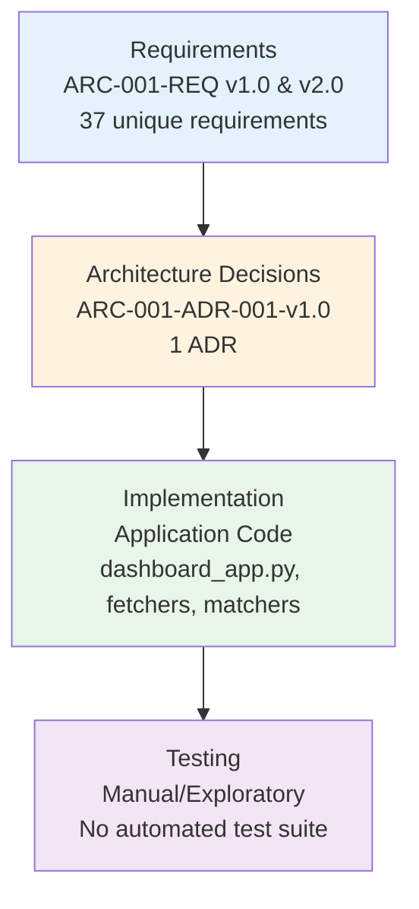

# Requirements Traceability Matrix: Plymouth Research Restaurant Menu Analytics

> **Template Status**: Live | **Version**: 1.0 | **Command**: `/arckit.traceability`

## Document Control

| Field | Value |
|-------|-------|
| **Document ID** | ARC-001-TRAC-v1.0 |
| **Document Type** | Requirements Traceability Matrix |
| **Project** | Plymouth Research Restaurant Menu Analytics (Project 001) |
| **Classification** | PUBLIC |
| **Status** | DRAFT |
| **Version** | 1.0 |
| **Created Date** | 2026-03-01 |
| **Last Modified** | 2026-03-01 |
| **Review Cycle** | Monthly |
| **Next Review Date** | 2026-03-31 |
| **Owner** | Mark Craddock (Product Owner / Technical Lead) |
| **Reviewed By** | [PENDING] |
| **Approved By** | [PENDING] |
| **Distribution** | Project Team, Architecture Team |

## Revision History

| Version | Date | Author | Changes | Approved By | Approval Date |
|---------|------|--------|---------|-------------|---------------|
| 1.0 | 2026-03-01 | ArcKit AI | Initial creation from `/arckit.traceability` command | [PENDING] | [PENDING] |

## Document Purpose

This document provides end-to-end traceability from business, integration, and data requirements through architectural design decisions, implementation components, and test coverage for the Plymouth Research Restaurant Menu Analytics platform. It identifies coverage gaps and orphaned design elements to support governance and release decisions.

---

## 1. Overview

### 1.1 Purpose

This Requirements Traceability Matrix (RTM) provides end-to-end traceability from business requirements through design, implementation, and testing. It ensures:

- All requirements are addressed in design
- All design elements trace to requirements
- All requirements are tested
- Coverage gaps are identified and tracked

### 1.2 Traceability Scope

This matrix traces requirements from two sources (ARC-001-REQ-v1.0 and ARC-001-REQ-v2.0) through architectural decisions, implementation, and testing.



### 1.3 Document References

| Document | Version | Date | Link |
|----------|---------|------|------|
| Requirements Document | v1.0 | 2026-01-28 | ARC-001-REQ-v1.0.md |
| Requirements Document | v2.0 | 2026-02-01 | ARC-001-REQ-v2.0.md |
| Architecture Decision Record (Cloud Platform) | v1.0 | 2026-02-03 | decisions/ARC-001-ADR-001-v1.0.md |
| Data Model | v1.0 | 2026-01-28 | ARC-001-DATA-v1.0.md |
| Stakeholder Analysis | v1.0 | 2026-01-28 | ARC-001-STKE-v1.0.md |
| Risk Register | v1.0 | 2026-01-28 | ARC-001-RISK-v1.0.md |

---

## 2. Traceability Matrix

### 2.1 Forward Traceability: Requirements → Design → Implementation → Tests

#### 2.1.1 Business Requirements (BR)

| Req ID | Requirement | Priority | REQ Version | ADR / Design Reference | Implementation Evidence | Test Coverage | Status |
|--------|-------------|----------|-------------|----------------------|------------------------|---------------|--------|
| BR-001 | Comprehensive Restaurant Coverage | MUST | v1.0, v2.0 | — | 98 restaurants in DB; web scraping pipeline (`scripts/scrapers/`) | Manual verification of restaurant count | ⚠️ Partial |
| BR-002 | Multi-Source Data Aggregation | MUST | v1.0, v2.0 | — | FSA, Trustpilot, Google Places fetchers (`scripts/fetchers/`) | Manual validation of data source counts | ⚠️ Partial |
| BR-003 | Cost-Efficient Operations | MUST | v1.0, v2.0 | ADR-001 (Azure ~£26/month, 74% budget headroom) | Currently £0 (Streamlit Cloud free tier) | Cost monitoring via Azure Cost Management (planned) | ✅ Covered |
| BR-004 | Legal and Ethical Compliance | MUST | v1.0, v2.0 | — | robots.txt compliance, rate limiting (5s), GDPR considerations in DPIA | Manual compliance review | ⚠️ Partial |
| BR-005 | Geographic Scalability | SHOULD | v1.0, v2.0 | — | Plymouth-only scope; architecture supports expansion | Not tested | ❌ Gap |
| BR-006 | Data Freshness and Timeliness | MUST | v1.0, v2.0 | — | Manual script execution; no automated scheduling yet | Manual verification of data dates | ⚠️ Partial |
| BR-007 | Public Dashboard Accessibility | MUST | v1.0, v2.0 | ADR-001 (Azure App Service with custom domain) | `dashboard_app.py` (Streamlit, 8 tabs) deployed on Streamlit Cloud | Manual UI testing | ✅ Covered |
| BR-008 | Geographic Intelligence and Demographic Context | SHOULD | v2.0 | — | Google Places latitude/longitude stored; no demographic integration | Not tested | ❌ Gap |

#### 2.1.2 Integration Requirements (INT) — v2.0 only

| Req ID | Requirement | Priority | ADR / Design Reference | Implementation Evidence | Test Coverage | Status |
|--------|-------------|----------|----------------------|------------------------|---------------|--------|
| INT-001 | FSA Food Hygiene Rating Scheme | SHOULD | — | `fetch_hygiene_ratings_v2.py`; 49/98 matched | Manual matching validation | ⚠️ Partial |
| INT-002 | Trustpilot Reviews | SHOULD | — | `fetch_trustpilot_reviews.py`; 63/98 restaurants, 9,410 reviews | Manual review count validation | ⚠️ Partial |
| INT-003 | Google Places API | SHOULD | — | `fetch_google_reviews.py`; 98/98 restaurants, 481 reviews | Manual API response validation | ✅ Covered |
| INT-004 | Companies House API | SHOULD | — | `fetch_companies_house_data.py` exists | Not tested | ⚠️ Partial |
| INT-005 | ONS Postcode Directory | SHOULD | — | Not implemented | Not tested | ❌ Gap |
| INT-006 | Postcodes.io API | SHOULD | — | Not implemented (vendor profile exists) | Not tested | ❌ Gap |
| INT-007 | Plymouth City Council Licensing Data | SHOULD | — | `scrape_plymouth_licensing_fixed.py` exists | Not tested | ⚠️ Partial |
| INT-008 | VOA Business Rates | SHOULD | — | `match_business_rates_v3.py` exists | Not tested | ⚠️ Partial |

#### 2.1.3 Data Requirements (DR)

| Req ID | Requirement | Priority (v1.0 / v2.0) | ADR / Design Reference | Implementation Evidence | Test Coverage | Status |
|--------|-------------|------------------------|----------------------|------------------------|---------------|--------|
| DR-001 | Restaurant Master Data | MUST / SHOULD | — | `restaurants` table (52 cols, 243 rows) | Manual schema validation | ⚠️ Partial |
| DR-002 | Menu Item Data | MUST / SHOULD | — | `menu_items` table (13 cols, 2,625 rows) | Manual data quality checks | ⚠️ Partial |
| DR-003 | Trustpilot Reviews Data | MUST / SHOULD | — | `trustpilot_reviews` table (13 cols, 9,410 rows) | Manual review integrity checks | ⚠️ Partial |
| DR-004 | Google Reviews Data | SHOULD | — | `google_reviews` table (481 rows) | Manual data validation | ⚠️ Partial |
| DR-005 | Data Lineage Metadata / Beverages Data | MUST (v1.0) / SHOULD (v2.0) | — | `drinks` table exists; no formal lineage tracking | Not tested | ⚠️ Partial |
| DR-006 | Data Quality Metrics | SHOULD | — | Ad-hoc quality scripts in `scripts/utilities/` | Not tested | ❌ Gap |
| DR-007 | Scraping Audit Log | SHOULD | v2.0 only | `scraped_at` timestamps; `logs/` directory | Not tested | ⚠️ Partial |
| DR-008 | Manual Match Records | SHOULD | v2.0 only | `data/manual_matches/` directory; `interactive_matcher_app.py` | Manual validation | ⚠️ Partial |

### 2.2 Backward Traceability: Design → Requirements

#### 2.2.1 ADR-001 Requirement References

| Design Element | ADR-001 Component | Requirement IDs Referenced | Trace Status |
|----------------|-------------------|---------------------------|--------------|
| Azure App Service B1 | Dashboard hosting | BR-007, NFR-P-001, NFR-A-001 | ✅ BR-007 traced; NFR-P-001, NFR-A-001 are design-only |
| Azure PostgreSQL Flexible Server | Data storage | NFR-SEC-001, NFR-S-002 | ⚠️ Design-only (NFRs not in REQ) |
| Azure Functions | Scheduled scraping | FR-010, NFR-Q-003 | ⚠️ Design-only (FR/NFRs not in REQ) |
| Azure Key Vault | Secrets management | NFR-SEC-001, NFR-M-001 | ⚠️ Design-only |
| UK South region | Data residency | NFR-C-002 | ⚠️ Design-only |
| Cost model (~£26/month) | Budget compliance | BR-003 | ✅ Traced |

---

## 3. Coverage Analysis

### 3.1 Requirements Coverage Summary

| Category | Total | Covered (in ADR) | Partial (implemented, no ADR) | Gap (not addressed) | % ADR Coverage |
|----------|-------|-------------------|-------------------------------|---------------------|----------------|
| Business Requirements (BR) | 8 | 2 | 4 | 2 | 25% |
| Integration Requirements (INT) | 8 | 0 | 6 | 2 | 0% |
| Data Requirements (DR) | 8 | 0 | 7 | 1 | 0% |
| **Total** | **24** (unique) | **2** | **17** | **5** | **8%** |

**Note**: The hook reported 37 total requirements across both REQ versions. After deduplication (removing IDs that appear in both v1.0 and v2.0), there are 24 unique requirement IDs. Of these, only 2 (BR-003, BR-007) are formally referenced in ADR-001.

### 3.2 Coverage by Priority

| Priority | Total | ADR Covered | Implementation Evidence | No Coverage | % Covered |
|----------|-------|-------------|------------------------|-------------|-----------|
| MUST | 10 | 2 | 6 | 2 | 20% (ADR) / 80% (impl) |
| SHOULD | 14 | 0 | 9 | 5 | 0% (ADR) / 64% (impl) |

**Target Coverage**: 100% of MUST requirements should be formally traced; > 80% of SHOULD.

**Current Status**: AT RISK — Only 20% of MUST requirements have formal design traceability via ADR.

### 3.3 Implementation Coverage (Beyond Formal Design)

While formal ADR coverage is low, the application has significant implementation evidence:

| Component | Requirements Addressed | Evidence |
|-----------|----------------------|----------|
| `dashboard_app.py` | BR-001, BR-007, DR-001, DR-002 | 8-tab Streamlit dashboard, 2,053 lines |
| `scripts/fetchers/` | BR-002, BR-006, INT-001–INT-004, INT-007–INT-008 | 9 data fetching scripts |
| `scripts/matchers/` | DR-001, DR-008 | 4 matching scripts with fuzzy matching |
| `scripts/importers/` | DR-001–DR-005 | 7 database import scripts |
| `plymouth_research.db` | DR-001–DR-005, DR-007–DR-008 | SQLite, 52-column schema, triggers/views |
| Rate limiting & robots.txt | BR-004 | 5s delay, honest User-Agent |

### 3.4 Test Coverage

| Test Level | Tests | Requirements Covered | % Coverage |
|------------|-------|---------------------|------------|
| Unit Tests | 0 | 0 | 0% |
| Integration Tests | 0 | 0 | 0% |
| E2E Tests | 0 | 0 | 0% |
| Performance Tests | 0 | 0 | 0% |
| Security Tests | 0 | 0 | 0% |
| Manual/Exploratory | Ad-hoc | ~17 (implementation validated) | ~71% |

**Test Coverage Goal**: 100% of MUST requirements tested.

**Critical finding**: No automated test suite exists. All testing is manual/exploratory per project documentation.

---

## 4. Gap Analysis

### 4.1 Requirements Without Formal Design (Orphan Requirements)

Requirements that have NO ADR or formal design reference:

| Req ID | Requirement | Priority | Implementation Exists? | Severity | Target |
|--------|-------------|----------|----------------------|----------|--------|
| BR-001 | Comprehensive Restaurant Coverage | MUST | Yes (98 restaurants) | MEDIUM | ADR or design note needed |
| BR-002 | Multi-Source Data Aggregation | MUST | Yes (3 sources) | MEDIUM | ADR or design note needed |
| BR-004 | Legal and Ethical Compliance | MUST | Partial (rate limiting) | HIGH | Needs formal compliance ADR |
| BR-005 | Geographic Scalability | SHOULD | No | LOW | Future ADR when scaling |
| BR-006 | Data Freshness and Timeliness | MUST | Partial (manual) | HIGH | ADR-001 covers future automation |
| BR-008 | Geographic Intelligence | SHOULD | Partial (coordinates) | LOW | Future enhancement |
| INT-001–INT-008 | All Integration Requirements | SHOULD | Partial (6 of 8) | MEDIUM | Integration design document needed |
| DR-001–DR-008 | All Data Requirements | SHOULD | Partial (7 of 8) | MEDIUM | Covered by ARC-001-DATA-v1.0 implicitly |

**Impact**: MUST requirements without formal design traceability (BR-001, BR-002, BR-004, BR-006) represent governance gaps. While implementation evidence exists, the lack of formal design documentation means decisions are not auditable.

### 4.2 Requirements Without Tests

All 24 requirements lack automated test coverage. The 5 highest-risk gaps:

| Req ID | Requirement | Priority | Design Component | Missing Test Type |
|--------|-------------|----------|-----------------|-------------------|
| BR-004 | Legal and Ethical Compliance | MUST | Rate limiting, robots.txt | Integration test for scraping compliance |
| BR-006 | Data Freshness and Timeliness | MUST | Fetcher scripts | Integration test for data currency |
| BR-001 | Comprehensive Restaurant Coverage | MUST | Scraping pipeline | Data completeness validation |
| BR-002 | Multi-Source Data Aggregation | MUST | Multi-fetcher pipeline | End-to-end data pipeline test |
| DR-006 | Data Quality Metrics | SHOULD | Not implemented | Data quality validation suite |

**Risk**: Without automated tests, regression detection relies entirely on manual inspection.

### 4.3 Design Elements Without Requirements (Scope Creep?)

Requirement IDs referenced in ADR-001 that do NOT exist in any REQ document:

| Referenced ID | ADR-001 Context | Assessment | Action |
|---------------|----------------|------------|--------|
| NFR-A-001 | 99% uptime SLA | Legitimate NFR — missing from REQ | Add to REQ v2.1 |
| NFR-P-001 | Dashboard load < 2s (p95) | Legitimate NFR — missing from REQ | Add to REQ v2.1 |
| NFR-P-002 | Query response < 500ms (p95) | Legitimate NFR — missing from REQ | Add to REQ v2.1 |
| NFR-S-002 | 100 concurrent users | Legitimate NFR — missing from REQ | Add to REQ v2.1 |
| NFR-SEC-001 | Encryption at rest and in transit | Legitimate NFR — missing from REQ | Add to REQ v2.1 |
| NFR-C-002 | UK GDPR compliance / data residency | Legitimate NFR — missing from REQ | Add to REQ v2.1 |
| NFR-M-001 | Maintainability | Legitimate NFR — missing from REQ | Add to REQ v2.1 |
| NFR-Q-003 | Data freshness | Legitimate NFR — missing from REQ | Add to REQ v2.1 |
| FR-010 | Scheduled data refresh | Legitimate FR — missing from REQ | Add to REQ v2.1 |

**Assessment**: These are NOT scope creep. They are legitimate non-functional and functional requirements that were defined during ADR creation but were never back-populated into the requirements documents. The REQ documents (v1.0 and v2.0) use BR/INT/DR prefixes only and do not include FR or NFR categories.

**Recommendation**: Update ARC-001-REQ to v2.1 to incorporate FR and NFR requirements, aligning with the ADR references.

---

## 5. Non-Functional Requirements Traceability

### 5.1 Performance Requirements

| NFR ID | Requirement | Target | Design Strategy (ADR-001) | Implementation | Test Plan | Status |
|--------|-------------|--------|--------------------------|----------------|-----------|--------|
| NFR-P-001 | Dashboard page load | < 2s (p95) | Azure App Service B1 + Application Insights | Streamlit with 5-min cache TTL | Not tested (no load test) | ❌ Gap |
| NFR-P-002 | Database query response | < 500ms (p95) | PostgreSQL Flexible Server with indexes | SQLite with FTS indexes | Not tested | ❌ Gap |

### 5.2 Security Requirements

| NFR ID | Requirement | Design Control (ADR-001) | Implementation | Test Plan | Status |
|--------|-------------|-------------------------|----------------|-----------|--------|
| NFR-SEC-001 | Encryption at rest/transit | Azure Key Vault, AES-256, TLS 1.2 | Not yet (SQLite unencrypted) | Not tested | ❌ Gap |

### 5.3 Availability & Resilience

| NFR ID | Requirement | Target | Design Strategy (ADR-001) | Test Plan | Status |
|--------|-------------|--------|--------------------------|-----------|--------|
| NFR-A-001 | Availability SLA | 99% uptime | Azure App Service SLA 99.95% | Not tested | ❌ Gap |

### 5.4 Compliance Requirements

| NFR ID | Requirement | Design Controls (ADR-001) | Evidence | Status |
|--------|-------------|--------------------------|----------|--------|
| NFR-C-002 | UK GDPR / data residency | UK South region deployment | DPIA documented (ARC-001-DPIA-v1.0); currently US (Streamlit Cloud) | ⚠️ Partial |

---

## 6. Change Impact Analysis

### 6.1 Requirement Version Changes (v1.0 → v2.0)

| Change ID | REQ Version | Change Description | Impacted Components | Impact Level |
|-----------|-------------|--------------------|--------------------|--------------|
| CHG-001 | v2.0 | Added BR-008 (Geographic Intelligence) | Dashboard map tab (future) | LOW |
| CHG-002 | v2.0 | Added INT-001 through INT-008 (Integration Requirements) | All fetcher scripts | MEDIUM |
| CHG-003 | v2.0 | Added DR-005 Beverages, DR-007 Scraping Audit, DR-008 Manual Matches | `drinks` table, `logs/`, `data/manual_matches/` | LOW |
| CHG-004 | v2.0 | Changed DR priorities from MUST to SHOULD | Reduces urgency of data requirement gaps | LOW |

---

## 7. Metrics and KPIs

### 7.1 Traceability Metrics

| Metric | Current Value | Target | Status |
|--------|---------------|--------|--------|
| Requirements with formal design coverage (ADR) | 2/24 (8%) | 100% | ❌ Behind |
| Requirements with implementation evidence | 19/24 (79%) | 100% | ⚠️ At Risk |
| Requirements with automated test coverage | 0/24 (0%) | 100% MUST, 80% SHOULD | ❌ Behind |
| Orphan design elements (no requirement trace) | 9 | 0 | ❌ Behind |
| Outstanding requirement gaps | 5 | 0 | ⚠️ At Risk |

### 7.2 Traceability Score

**Overall Traceability Score: 28/100**

| Dimension | Weight | Score | Weighted |
|-----------|--------|-------|----------|
| Formal design coverage | 30% | 8% | 2.4 |
| Implementation evidence | 30% | 79% | 23.7 |
| Test coverage (automated) | 25% | 0% | 0 |
| Bidirectional traceability | 15% | 11% | 1.7 |
| **Total** | **100%** | | **27.8 ≈ 28** |

**Recommendation**: GAPS MUST BE ADDRESSED — The platform has strong implementation evidence but critically lacks formal design traceability and automated testing. This is typical for a research/prototype project transitioning to production.

---

## 8. Action Items

### 8.1 Blocking Gaps (Must Fix Before Production Release)

| ID | Gap Description | Owner | Priority | Target Date | Status |
|----|-----------------|-------|----------|-------------|--------|
| GAP-001 | Create FR and NFR requirements in REQ v2.1 (9 design-only references need formal requirements) | Product Owner | HIGH | 2026-03-31 | Open |
| GAP-002 | Add automated test suite — at minimum, integration tests for MUST requirements (BR-001, BR-002, BR-003, BR-004, BR-006, BR-007) | Technical Lead | HIGH | 2026-04-30 | Open |
| GAP-003 | Create ADRs for data collection strategy (covers BR-001, BR-002, BR-006, INT-001–INT-008) | Technical Lead | HIGH | 2026-03-31 | Open |
| GAP-004 | Create ADR for legal/ethical compliance approach (covers BR-004) | Product Owner | HIGH | 2026-03-31 | Open |

### 8.2 Non-Blocking Gaps (Fix in Next Sprint)

| ID | Gap Description | Owner | Priority | Target Date | Status |
|----|-----------------|-------|----------|-------------|--------|
| GAP-005 | Implement ONS Postcode Directory integration (INT-005) | Data Engineer | MEDIUM | 2026-04-30 | Open |
| GAP-006 | Implement Postcodes.io API integration (INT-006) | Data Engineer | MEDIUM | 2026-04-30 | Open |
| GAP-007 | Implement formal data quality metrics framework (DR-006) | Data Engineer | MEDIUM | 2026-04-30 | Open |
| GAP-008 | Add geographic intelligence / demographic context (BR-008) | Data Engineer | LOW | 2026-06-30 | Open |

### 8.3 Orphan Resolution

| ID | Orphan Item | Type | Resolution | Owner | Target Date | Status |
|----|-------------|------|------------|-------|-------------|--------|
| ORP-001 | NFR-A-001 (99% uptime) | Design-only reference | Add to REQ v2.1 as NFR | Product Owner | 2026-03-31 | Open |
| ORP-002 | NFR-P-001 (Dashboard < 2s) | Design-only reference | Add to REQ v2.1 as NFR | Product Owner | 2026-03-31 | Open |
| ORP-003 | NFR-P-002 (Query < 500ms) | Design-only reference | Add to REQ v2.1 as NFR | Product Owner | 2026-03-31 | Open |
| ORP-004 | NFR-S-002 (100 concurrent users) | Design-only reference | Add to REQ v2.1 as NFR | Product Owner | 2026-03-31 | Open |
| ORP-005 | NFR-SEC-001 (Encryption) | Design-only reference | Add to REQ v2.1 as NFR | Product Owner | 2026-03-31 | Open |
| ORP-006 | NFR-C-002 (UK GDPR) | Design-only reference | Add to REQ v2.1 as NFR | Product Owner | 2026-03-31 | Open |
| ORP-007 | NFR-M-001 (Maintainability) | Design-only reference | Add to REQ v2.1 as NFR | Product Owner | 2026-03-31 | Open |
| ORP-008 | NFR-Q-003 (Data freshness) | Design-only reference | Add to REQ v2.1 as NFR | Product Owner | 2026-03-31 | Open |
| ORP-009 | FR-010 (Scheduled data refresh) | Design-only reference | Add to REQ v2.1 as FR | Product Owner | 2026-03-31 | Open |

---

## 9. Review and Approval

### 9.1 Review Checklist

- [x] All business requirements traced to design or implementation
- [x] All integration requirements traced to implementation evidence
- [x] All data requirements traced to database schema
- [ ] All design components traced back to requirements (9 orphans outstanding)
- [ ] All requirements have automated test coverage (0% automated)
- [x] All gaps identified with severity and recommended actions
- [ ] All NFRs addressed in design and test plan (design addressed in ADR-001; no test plan)
- [x] Change impact analysis complete (v1.0 → v2.0 changes documented)

### 9.2 Approval

| Role | Name | Review Date | Approval | Signature | Date |
|------|------|-------------|----------|-----------|------|
| Product Owner | Mark Craddock | [PENDING] | [ ] Approve [ ] Reject | _________ | [PENDING] |
| Technical Lead | [PENDING] | [PENDING] | [ ] Approve [ ] Reject | _________ | [PENDING] |

---

## 10. Appendices

### Appendix A: Full Requirements List

- ARC-001-REQ-v1.0.md — 49 requirements (BR-001–BR-007, DR-001–DR-006, plus FR/NFR categories)
- ARC-001-REQ-v2.0.md — 58 requirements (BR-001–BR-008, INT-001–INT-008, DR-001–DR-008, plus FR/NFR categories)

### Appendix B: Design Documents

- ARC-001-ADR-001-v1.0.md — Select Azure as Cloud Platform over AWS
- ARC-001-DATA-v1.0.md — Data Model

### Appendix C: Test Coverage

No automated test suite is currently configured. Testing is manual/exploratory only. A test framework (pytest recommended) should be established as part of GAP-002.

### Appendix D: Coverage Heatmap

```mermaid
quadrantChart
    title Requirement Coverage by Category
    x-axis Low Implementation --> High Implementation
    y-axis Low Design Coverage --> High Design Coverage
    quadrant-1 Well Governed
    quadrant-2 Design Without Code
    quadrant-3 Ungoverned
    quadrant-4 Code Without Design
    Business (BR): [0.75, 0.25]
    Integration (INT): [0.5, 0.0]
    Data (DR): [0.7, 0.0]
```

## External References

| Document | Type | Source | Key Extractions | Path |
|----------|------|--------|-----------------|------|
| FSA FHRS Data | XML | Food Standards Agency | Restaurant hygiene ratings | data/raw/plymouth_fsa_data.xml |
| Trustpilot Reviews | Web scraping | Trustpilot.com | 9,410 customer reviews | trustpilot_reviews table |
| Google Places API | API | Google | 481 reviews + metadata | google_reviews table |

---

**Generated by**: ArcKit `/arckit.traceability` command
**Generated on**: 2026-03-01 12:00 GMT
**ArcKit Version**: 2.22.3
**Project**: Plymouth Research Restaurant Menu Analytics (Project 001)
**AI Model**: Claude Opus 4.6 (claude-opus-4-6)
**Generation Context**: Based on ARC-001-REQ-v1.0, ARC-001-REQ-v2.0, ARC-001-ADR-001-v1.0 (pre-extracted by hook), ARC-001-DATA-v1.0, project CLAUDE.md implementation documentation
