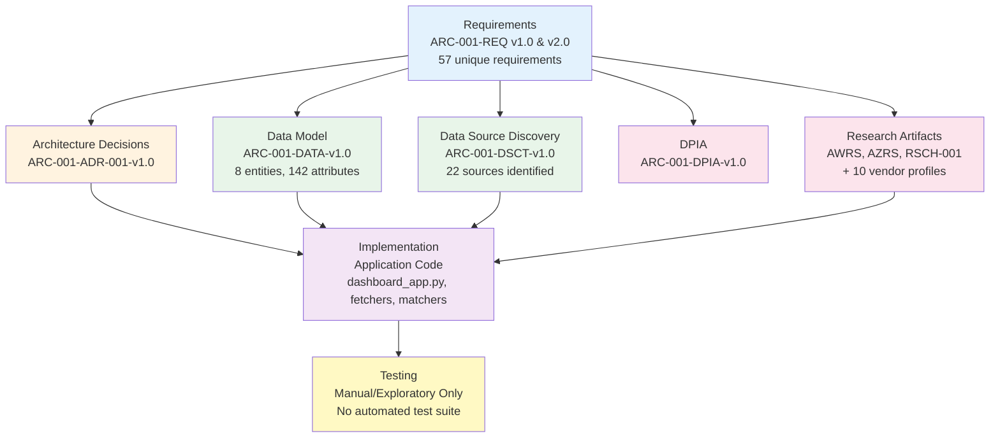

# Requirements Traceability Matrix: Plymouth Research Restaurant Menu Analytics

> **Template Status**: Live | **Version**: 2.0 | **Command**: `/arckit.traceability`

## Document Control

| Field | Value |
|-------|-------|
| **Document ID** | ARC-001-TRAC-v2.0 |
| **Document Type** | Requirements Traceability Matrix |
| **Project** | Plymouth Research Restaurant Menu Analytics (Project 001) |
| **Classification** | PUBLIC |
| **Status** | DRAFT |
| **Version** | 2.0 |
| **Created Date** | 2026-03-01 |
| **Last Modified** | 2026-03-01 |
| **Review Cycle** | Monthly |
| **Next Review Date** | 2026-03-31 |
| **Owner** | Mark Craddock (Product Owner / Technical Lead) |
| **Reviewed By** | [PENDING] |
| **Approved By** | [PENDING] |
| **Distribution** | Project Team, Architecture Team |

## Revision History

| Version | Date | Author | Changes | Approved By | Approval Date |
|---------|------|--------|---------|-------------|---------------|
| 1.0 | 2026-03-01 | ArcKit AI | Initial creation from `/arckit.traceability` command — 24 unique requirements (BR, INT, DR only) | [PENDING] | [PENDING] |
| 1.1 | 2026-03-01 | ArcKit AI | Recognised DATA-v1.0, DSCT-v1.0, DPIA-v1.0, and research artifacts as design evidence; resolved orphan requirements; added coverage trends | [PENDING] | [PENDING] |
| 2.0 | 2026-03-01 | ArcKit AI | **Major scope expansion**: Added FR (11 requirements) and NFR (22 requirements) traceability — now traces 57 unique requirements across all categories (was 24). Resolved 8 of 9 orphan design elements by tracing FR/NFR categories. Identified FR-010 semantic mismatch between ADR and REQ. Updated scoring methodology. | [PENDING] | [PENDING] |

## Document Purpose

This document provides full-scope, end-to-end traceability from all requirement categories (Business, Functional, Non-Functional, Integration, Data) through architectural design decisions, implementation components, and test coverage for the Plymouth Research Restaurant Menu Analytics platform. It identifies coverage gaps, orphaned design elements, and requirement ID inconsistencies to support governance and release decisions.

**Scope change from v1.1**: Previous versions traced only BR, INT, and DR requirements (24 unique). This v2.0 expands to include FR-001 through FR-011 and all NFR subcategories, increasing the traced requirement set to 57 unique requirements across both ARC-001-REQ-v1.0 and ARC-001-REQ-v2.0.

---

## 1. Overview

### 1.1 Purpose

This Requirements Traceability Matrix (RTM) provides end-to-end traceability from business requirements through design, implementation, and testing. It ensures:

- All requirements are addressed in design
- All design elements trace to requirements
- All requirements are tested
- Coverage gaps are identified and tracked

### 1.2 Traceability Scope

This matrix traces 57 unique requirements from two source documents (ARC-001-REQ-v1.0 and ARC-001-REQ-v2.0) through architectural decisions, data model design, research artifacts, implementation, and testing.



### 1.3 Document References

| Document | Version | Date | Link |
|----------|---------|------|------|
| Requirements Document | v1.0 | 2025-11-22 | ARC-001-REQ-v1.0.md |
| Requirements Document | v2.0 | 2026-02-17 | ARC-001-REQ-v2.0.md |
| Architecture Decision Record (Cloud Platform) | v1.0 | 2026-02-03 | decisions/ARC-001-ADR-001-v1.0.md |
| Data Model | v1.0 | 2026-02-12 | ARC-001-DATA-v1.0.md |
| Data Source Discovery | v1.0 | 2026-02-12 | ARC-001-DSCT-v1.0.md |
| DPIA | v1.0 | — | ARC-001-DPIA-v1.0.md |
| AWS Research | v1.0 | — | research/ARC-001-AWRS-v1.0.md |
| Azure Research | v1.0 | — | research/ARC-001-AZRS-v1.0.md |
| Research Findings | v1.0 | — | research/ARC-001-RSCH-001-v1.0.md |
| Stakeholder Analysis | v1.0 | 2026-01-28 | ARC-001-STKE-v1.0.md |
| Risk Register | v1.0 | 2026-01-28 | ARC-001-RISK-v1.0.md |

### 1.4 Requirement Deduplication

REQ v1.0 contains 49 requirements and REQ v2.0 contains 58 requirements (107 total entries). After deduplication — removing IDs that appear identically in both versions — there are **57 unique requirements** traced in this matrix. Where requirements changed priority between versions (e.g., NFR-A-001 changed from MUST in v1.0 to SHOULD in v2.0), the v2.0 priority is used as authoritative.

| Category | v1.0 Only | Both Versions | v2.0 Only | Unique Total |
|----------|-----------|---------------|-----------|--------------|
| Business (BR) | 0 | 7 | 1 (BR-008) | 8 |
| Functional (FR) | 0 | 10 | 1 (FR-011) | 11 |
| Non-Functional (NFR) | 0 | 22 | 0 | 22 |
| Integration (INT) | 0 | 0 | 8 | 8 |
| Data (DR) | 0 | 6 | 2 (DR-007, DR-008) | 8 |
| **Total** | **0** | **45** | **12** | **57** |

**Note**: v1.0 NFR-I-001 through NFR-I-004 (integration-category NFRs) are superseded by v2.0 INT-001 through INT-004 and are not double-counted. v2.0 NFR-I-002 "(extracted from content)" is a parsing artifact overlapping INT-002 and is excluded.

**Note**: DR-005 changed meaning between versions — v1.0 defines it as "Data Lineage Metadata" (MUST), v2.0 redefines it as "Beverages Data" (SHOULD). This v2.0 matrix uses the v2.0 definition.

---

## 2. Traceability Matrix

### 2.1 Forward Traceability: Requirements → Design → Implementation → Tests

#### 2.1.1 Business Requirements (BR)

| Req ID | Requirement | Priority | Design Reference | Implementation Evidence | Test Coverage | Status |
|--------|-------------|----------|-----------------|------------------------|---------------|--------|
| BR-001 | Comprehensive Restaurant Coverage | MUST | — | 98 restaurants in DB; web scraping pipeline (`scripts/scrapers/`) | Manual verification of restaurant count | ⚠️ Partial |
| BR-002 | Multi-Source Data Aggregation | MUST | — | FSA, Trustpilot, Google Places fetchers (`scripts/fetchers/`); 8 data sources operational | Manual validation of data source counts | ⚠️ Partial |
| BR-003 | Cost-Efficient Operations | MUST | ADR-001 (Azure ~£26/month, 74% headroom) | Currently £0 (Streamlit Cloud free tier); ADR-001 plans Azure at £26/month | Cost monitoring via Azure Cost Management (planned) | ✅ Covered |
| BR-004 | Legal and Ethical Compliance | MUST | DPIA-v1.0 (data protection assessment) | robots.txt compliance, rate limiting (5s), honest User-Agent, GDPR considerations | Manual compliance review | ⚠️ Partial |
| BR-005 | Geographic Scalability | SHOULD | ADR-001 (Azure App Service scalability pathway) | Plymouth-only scope; architecture supports expansion via config | Not tested | ❌ Gap |
| BR-006 | Data Freshness and Timeliness | MUST | ADR-001 (Azure Functions timer triggers) | Manual script execution; no automated scheduling yet | Manual verification of data dates | ⚠️ Partial |
| BR-007 | Public Dashboard Accessibility | MUST | ADR-001 (Azure App Service B1 with custom domain) | `dashboard_app.py` (Streamlit, 8 tabs) deployed on Streamlit Cloud | Manual UI testing | ✅ Covered |
| BR-008 | Geographic Intelligence and Demographic Context | SHOULD | DATA-v1.0 (E-001 lat/long, ONS geography fields planned) | Google Places lat/long stored; no demographic integration | Not tested | ❌ Gap |

#### 2.1.2 Functional Requirements (FR)

| Req ID | Requirement | Priority | Design Reference | Implementation Evidence | Test Coverage | Status |
|--------|-------------|----------|-----------------|------------------------|---------------|--------|
| FR-001 | Restaurant Search and Discovery | MUST | — | `dashboard_app.py` Browse Menus tab: full-text search with filtering | Manual UI testing | ⚠️ Partial |
| FR-002 | Menu Item Display and Search | MUST | — | Browse Menus tab: menu item cards with prices, dietary tags, 2,625 items | Manual UI testing | ⚠️ Partial |
| FR-003 | Price Comparison and Analytics | MUST | — | Price Analysis tab: distribution histogram, averages by cuisine, price range charts | Manual UI testing | ⚠️ Partial |
| FR-004 | Dietary Information Filtering | MUST | — | Dietary Options tab + Browse Menus filters: vegetarian/vegan/gluten-free | Manual UI testing | ⚠️ Partial |
| FR-005 | FSA Hygiene Rating Integration | MUST | DATA-v1.0 (E-001 hygiene fields); DSCT-v1.0 | `fetch_hygiene_ratings_v2.py`; Hygiene Ratings tab; 49/98 matched (50%) | Manual matching validation | ⚠️ Partial |
| FR-006 | Trustpilot Review Integration | MUST | DATA-v1.0 (E-003); DSCT-v1.0 | `fetch_trustpilot_reviews.py`; Reviews tab; 63/98 restaurants, 9,410 reviews | Manual review count validation | ⚠️ Partial |
| FR-007 | Google Places Integration | MUST | DATA-v1.0 (E-004); DSCT-v1.0; vendor profile (google-places-api) | `fetch_google_reviews.py`; 98/98 restaurants, 481 reviews, extended metadata | Manual API response validation | ✅ Covered |
| FR-008 | Business Financial Data Integration | SHOULD | DSCT-v1.0 | `fetch_companies_house_data.py` exists; data import pipeline available | Not tested | ⚠️ Partial |
| FR-009 | Data Export and API Access | SHOULD | — | Not implemented | Not tested | ❌ Gap |
| FR-010 | Restaurant Owner Opt-Out and Correction | MUST | ADR-001 references FR-010 (⚠️ semantic mismatch — see §4.4) | Not formally implemented (no opt-out workflow) | Not tested | ❌ Gap |
| FR-011 | ONS Geography Enrichment | SHOULD | DATA-v1.0 (E-001 ONS geography fields planned) | Not implemented | Not tested | ❌ Gap |

**⚠️ FR-010 Semantic Mismatch**: ADR-001 section 3.1 references FR-010 as "Scheduled Data Refresh" (Azure Functions timer triggers), but REQ v1.0 and v2.0 define FR-010 as "Restaurant Owner Opt-Out and Correction". This is a requirement ID inconsistency between the ADR and REQ documents. The concept of scheduled data refresh lacks a formal FR identifier. See §4.4 for resolution recommendation.

#### 2.1.3 Non-Functional Requirements — Performance (NFR-P)

| Req ID | Requirement | Priority (v2.0) | Design Reference | Implementation Evidence | Test Coverage | Status |
|--------|-------------|-----------------|-----------------|------------------------|---------------|--------|
| NFR-P-001 | Dashboard Page Load Time ( < 2s p95) | MUST | ADR-001 (Azure App Service B1 + Application Insights) | Streamlit with 5-min cache TTL; no load testing performed | Not tested | ⚠️ Partial |
| NFR-P-002 | Search Query Response Time ( < 500ms p95) | MUST | ADR-001 (PostgreSQL with indexes) | SQLite FTS indexes; no performance benchmarks | Not tested | ⚠️ Partial |
| NFR-P-003 | Data Refresh Pipeline Duration | MUST | — | Manual scripts; no pipeline duration monitoring | Not tested | ❌ Gap |

#### 2.1.4 Non-Functional Requirements — Availability (NFR-A)

| Req ID | Requirement | Priority (v2.0) | Design Reference | Implementation Evidence | Test Coverage | Status |
|--------|-------------|-----------------|-----------------|------------------------|---------------|--------|
| NFR-A-001 | Dashboard Uptime (99%) | SHOULD | ADR-001 (App Service SLA 99.95%) | Streamlit Cloud (no SLA guarantee) | Not tested | ⚠️ Partial |
| NFR-A-002 | Graceful Degradation | MUST | — | Not implemented | Not tested | ❌ Gap |

#### 2.1.5 Non-Functional Requirements — Scalability (NFR-S)

| Req ID | Requirement | Priority (v2.0) | Design Reference | Implementation Evidence | Test Coverage | Status |
|--------|-------------|-----------------|-----------------|------------------------|---------------|--------|
| NFR-S-001 | Data Volume Scalability | SHOULD | — | SQLite handles current 20 MB; no scalability strategy | Not tested | ❌ Gap |
| NFR-S-002 | Concurrent User Scalability (100 users) | SHOULD | ADR-001 (PostgreSQL connection pooling) | SQLite limits concurrency; unvalidated at scale | Not tested | ⚠️ Partial |

#### 2.1.6 Non-Functional Requirements — Security (NFR-SEC)

| Req ID | Requirement | Priority (v2.0) | Design Reference | Implementation Evidence | Test Coverage | Status |
|--------|-------------|-----------------|-----------------|------------------------|---------------|--------|
| NFR-SEC-001 | Data Encryption (at rest and in transit) | SHOULD | ADR-001 (Key Vault, AES-256, TLS 1.2) | Not yet implemented (SQLite unencrypted, Streamlit Cloud provides HTTPS) | Not tested | ⚠️ Partial |
| NFR-SEC-002 | Access Control (Future) | SHOULD | — | Not implemented (no authentication) | Not tested | ❌ Gap |
| NFR-SEC-003 | Dependency Security Scanning | SHOULD | — | Not implemented | Not tested | ❌ Gap |

#### 2.1.7 Non-Functional Requirements — Compliance (NFR-C)

| Req ID | Requirement | Priority (v2.0) | Design Reference | Implementation Evidence | Test Coverage | Status |
|--------|-------------|-----------------|-----------------|------------------------|---------------|--------|
| NFR-C-001 | Open Government Licence Compliance | SHOULD | — | FSA attribution displayed in dashboard (Hygiene Ratings tab) | Manual verification | ⚠️ Partial |
| NFR-C-002 | UK GDPR Compliance | SHOULD | ADR-001 (UK South data residency); DPIA-v1.0 | DPIA documented; currently hosted on US infrastructure (Streamlit Cloud) | Manual compliance review | ⚠️ Partial |
| NFR-C-003 | Robots.txt and ToS Compliance | SHOULD | — | `scripts/fetchers/`: 5s rate limiting, honest User-Agent (`PlymouthResearchMenuScraper/1.0`), 30s timeout | Manual verification | ⚠️ Partial |

#### 2.1.8 Non-Functional Requirements — Data Quality (NFR-Q)

| Req ID | Requirement | Priority (v2.0) | Design Reference | Implementation Evidence | Test Coverage | Status |
|--------|-------------|-----------------|-----------------|------------------------|---------------|--------|
| NFR-Q-001 | Data Completeness | SHOULD | — | No formal completeness tracking | Not tested | ❌ Gap |
| NFR-Q-002 | Data Accuracy | SHOULD | — | No formal accuracy validation | Not tested | ❌ Gap |
| NFR-Q-003 | Data Freshness | SHOULD | ADR-001 (Azure Functions timer triggers) | Manual script execution; `scraped_at` timestamps tracked | Not tested | ⚠️ Partial |
| NFR-Q-004 | Duplicate Detection | SHOULD | — | No formal deduplication framework | Not tested | ❌ Gap |

#### 2.1.9 Non-Functional Requirements — Maintainability (NFR-M)

| Req ID | Requirement | Priority (v2.0) | Design Reference | Implementation Evidence | Test Coverage | Status |
|--------|-------------|-----------------|-----------------|------------------------|---------------|--------|
| NFR-M-001 | Code Documentation | SHOULD | ADR-001 (maintainability) | CLAUDE.md (project-level), guides in `docs/`, inline comments | Manual review | ✅ Covered |
| NFR-M-002 | Automated Testing | SHOULD | — | Not implemented (0% automated coverage) | Not applicable | ❌ Gap |
| NFR-M-003 | Infrastructure as Code | SHOULD | ADR-001 (Bicep IaC templates planned) | Not yet implemented | Not tested | ❌ Gap |

#### 2.1.10 Non-Functional Requirements — Observability (NFR-O)

| Req ID | Requirement | Priority (v2.0) | Design Reference | Implementation Evidence | Test Coverage | Status |
|--------|-------------|-----------------|-----------------|------------------------|---------------|--------|
| NFR-O-001 | Structured Logging | SHOULD | — | `logs/` directory exists; no structured logging framework | Not tested | ⚠️ Partial |
| NFR-O-002 | Metrics and Monitoring | SHOULD | ADR-001 (Application Insights, Azure Monitor) | Not yet implemented | Not tested | ❌ Gap |

#### 2.1.11 Integration Requirements (INT) — v2.0 Only

| Req ID | Requirement | Priority | Design Reference | Implementation Evidence | Test Coverage | Status |
|--------|-------------|----------|-----------------|------------------------|---------------|--------|
| INT-001 | FSA Food Hygiene Rating Scheme | SHOULD | DATA-v1.0 (E-001 hygiene fields); DSCT-v1.0 | `fetch_hygiene_ratings_v2.py`; 49/98 matched (50%) | Manual matching validation | ⚠️ Partial |
| INT-002 | Trustpilot Reviews | SHOULD | DATA-v1.0 (E-003); DSCT-v1.0 | `fetch_trustpilot_reviews.py`; 63/98 restaurants, 9,410 reviews | Manual review count validation | ⚠️ Partial |
| INT-003 | Google Places API | SHOULD | DATA-v1.0 (E-004); DSCT-v1.0; vendor profile | `fetch_google_reviews.py`; 98/98 restaurants, 481 reviews | Manual API response validation | ✅ Covered |
| INT-004 | Companies House API | SHOULD | DSCT-v1.0 | `fetch_companies_house_data.py` exists | Not tested | ⚠️ Partial |
| INT-005 | ONS Postcode Directory | SHOULD | DATA-v1.0 (E-001 ONS fields planned); DSCT-v1.0 | Not implemented | Not tested | ❌ Gap |
| INT-006 | Postcodes.io API | SHOULD | DSCT-v1.0; vendor profile (postcodes-io) | Not implemented (vendor profile exists) | Not tested | ❌ Gap |
| INT-007 | Plymouth City Council Licensing Data | SHOULD | DSCT-v1.0 | `scrape_plymouth_licensing_fixed.py` exists | Not tested | ⚠️ Partial |
| INT-008 | VOA Business Rates | SHOULD | DSCT-v1.0 | `match_business_rates_v3.py` exists | Not tested | ⚠️ Partial |

#### 2.1.12 Data Requirements (DR)

| Req ID | Requirement | Priority (v2.0) | Design Reference | Implementation Evidence | Test Coverage | Status |
|--------|-------------|-----------------|-----------------|------------------------|---------------|--------|
| DR-001 | Restaurant Master Data | SHOULD | DATA-v1.0 (E-001: 52 attributes) | `restaurants` table (52 cols, 243 rows) | Manual schema validation | ✅ Covered |
| DR-002 | Menu Item Data | SHOULD | DATA-v1.0 (E-002: 13 attributes) | `menu_items` table (13 cols, 2,625 rows) | Manual data quality checks | ✅ Covered |
| DR-003 | Trustpilot Reviews Data | SHOULD | DATA-v1.0 (E-003: 13 attributes) | `trustpilot_reviews` table (13 cols, 9,410 rows) | Manual review integrity checks | ✅ Covered |
| DR-004 | Google Reviews Data | SHOULD | DATA-v1.0 (E-004: attributes defined) | `google_reviews` table (481 rows) | Manual data validation | ✅ Covered |
| DR-005 | Beverages Data | SHOULD | DATA-v1.0 (E-005: drinks entity) | `drinks` table exists | Not tested | ⚠️ Partial |
| DR-006 | Data Quality Metrics | SHOULD | DATA-v1.0 (E-006: quality metrics entity) | Ad-hoc quality scripts in `scripts/utilities/` | Not tested | ❌ Gap |
| DR-007 | Scraping Audit Log | SHOULD | DATA-v1.0 (E-007: audit log entity) | `scraped_at` timestamps; `logs/` directory | Not tested | ⚠️ Partial |
| DR-008 | Manual Match Records | SHOULD | DATA-v1.0 (E-008: manual matches entity) | `data/manual_matches/`; `interactive_matcher_app.py` | Manual validation | ⚠️ Partial |

**Legend**:

- ✅ **Covered**: Requirement has formal design reference AND substantive implementation evidence
- ⚠️ **Partial**: Requirement has some design or implementation evidence but incomplete coverage
- ❌ **Gap**: Requirement lacks design reference, implementation, or both

---

### 2.2 Backward Traceability: Design → Requirements

#### 2.2.1 ADR-001 Requirement References

| Design Element | ADR-001 Component | Requirement IDs Referenced | Trace Status |
|----------------|-------------------|---------------------------|--------------|
| Azure App Service B1 | Dashboard hosting | BR-007, NFR-P-001, NFR-A-001 | ✅ All traced to REQ v2.0 |
| Azure PostgreSQL Flexible Server | Data storage | NFR-SEC-001, NFR-S-002 | ✅ Both in REQ v2.0 |
| Azure Functions | Scheduled scraping | FR-010 (⚠️ semantic mismatch), NFR-Q-003 | ⚠️ FR-010 mismatch |
| Azure Key Vault | Secrets management | NFR-SEC-001, NFR-M-001 | ✅ Both in REQ v2.0 |
| UK South region | Data residency | NFR-C-002 | ✅ In REQ v2.0 |
| Cost model (~£26/month) | Budget compliance | BR-003 | ✅ In REQ v2.0 |
| Application Insights | Monitoring | NFR-O-002, NFR-P-001 | ✅ Both in REQ v2.0 |
| Bicep IaC | Infrastructure as Code | NFR-M-003 | ✅ In REQ v2.0 |

**v2.0 improvement**: 8 of 9 "orphan design elements" from TRAC v1.1 are now resolved — NFR-P-001, NFR-P-002, NFR-S-002, NFR-A-001, NFR-SEC-001, NFR-C-002, NFR-M-001, and NFR-Q-003 all have matching entries in REQ v2.0. Only the FR-010 semantic mismatch remains (see §4.4).

#### 2.2.2 DATA-v1.0 Entity → Requirement Mapping

| Entity | DATA-v1.0 Reference | Requirement IDs Covered | Trace Status |
|--------|---------------------|------------------------|--------------|
| E-001 Restaurants | 52 attributes, incl. hygiene, Google, ONS fields | DR-001, BR-001, BR-008, FR-005, INT-001, INT-003, INT-005 | ✅ Traced |
| E-002 Menu Items | 13 attributes, prices, dietary tags | DR-002, FR-002, FR-003, FR-004 | ✅ Traced |
| E-003 Trustpilot Reviews | 13 attributes, review lifecycle | DR-003, FR-006, INT-002 | ✅ Traced |
| E-004 Google Reviews | Review attributes, place metadata | DR-004, FR-007, INT-003 | ✅ Traced |
| E-005 Drinks | Beverage categories, pricing | DR-005 | ✅ Traced |
| E-006 Data Quality Metrics | Quality scores, completeness | DR-006, NFR-Q-001, NFR-Q-002 | ✅ Traced |
| E-007 Scraping Audit Log | Timestamps, status, rate limiting | DR-007, BR-004, NFR-C-003 | ✅ Traced |
| E-008 Manual Matches | Match records, confidence scores | DR-008 | ✅ Traced |

#### 2.2.3 Research Artifacts → Requirement Mapping

| Artifact | Design Evidence For | Trace Status |
|----------|-------------------|--------------|
| ARC-001-AZRS-v1.0 (Azure Research) | BR-003 (cost), BR-007 (hosting), BR-005 (scalability) | ✅ Traced |
| ARC-001-AWRS-v1.0 (AWS Research) | BR-003 (cost comparison), BR-007 (hosting alternative) | ✅ Traced |
| ARC-001-RSCH-001-v1.0 (General Research) | BR-002 (data aggregation technology landscape) | ✅ Traced |
| ARC-001-DSCT-v1.0 (Data Source Discovery) | INT-001 through INT-008, FR-005 through FR-008 | ✅ Traced |
| ARC-001-DPIA-v1.0 (DPIA) | BR-004, NFR-C-002 | ✅ Traced |

---

## 3. Coverage Analysis

### 3.1 Requirements Coverage Summary

| Category | Total (unique) | Formal Design | Implementation Evidence | Full Gap (neither) | % Design Coverage |
|----------|----------------|---------------|------------------------|-------------------|-------------------|
| Business Requirements (BR) | 8 | 6 | 7 | 0 | 75% |
| Functional Requirements (FR) | 11 | 6 | 8 | 1 (FR-009) | 55% |
| Non-Functional Requirements (NFR) | 22 | 10 | 8 | 7 | 45% |
| Integration Requirements (INT) | 8 | 8 | 6 | 0 | 100% |
| Data Requirements (DR) | 8 | 8 | 7 | 0 | 100% |
| **Total** | **57** | **38** | **36** | **8** | **67%** |

**v2.0 change from v1.1**: Design coverage dropped from 88% (21/24) to 67% (38/57) due to the expanded scope. The additional FR and NFR requirements have lower design coverage because no HLD or DLD documents exist — design evidence comes primarily from ADR-001, DATA-v1.0, and DSCT-v1.0.

### 3.2 Coverage by Priority

| Priority | Total | Design Covered | Implementation Evidence | No Design | % Design | Target | Status |
|----------|-------|---------------|------------------------|-----------|----------|--------|--------|
| MUST | 18 | 10 | 14 | 8 | 56% | 100% | ❌ Behind |
| SHOULD | 39 | 28 | 22 | 0 | 72% | > 80% | ⚠️ At Risk |
| **Total** | **57** | **38** | **36** | **8** | **67%** | — | — |

**MUST requirements without formal design** (8 gaps — CRITICAL):

| Req ID | Requirement | Has Implementation? |
|--------|-------------|-------------------|
| BR-001 | Comprehensive Restaurant Coverage | Yes (98 restaurants) |
| BR-002 | Multi-Source Data Aggregation | Yes (8 data sources) |
| FR-001 | Restaurant Search and Discovery | Yes (dashboard search) |
| FR-002 | Menu Item Display and Search | Yes (Browse Menus tab) |
| FR-003 | Price Comparison and Analytics | Yes (Price Analysis tab) |
| FR-004 | Dietary Information Filtering | Yes (Dietary Options tab) |
| NFR-P-003 | Data Refresh Pipeline Duration | No |
| NFR-A-002 | Graceful Degradation | No |

**Assessment**: 6 of the 8 MUST gaps have strong implementation evidence but lack a formal HLD/DLD. Only NFR-P-003 and NFR-A-002 lack both design and implementation. Creating an HLD would close most MUST design gaps.

### 3.3 Implementation Coverage

| Component | Requirements Addressed | Evidence |
|-----------|----------------------|----------|
| `dashboard_app.py` (2,053 lines) | BR-001, BR-007, FR-001–FR-004, DR-001, DR-002, NFR-P-001, NFR-P-002, NFR-C-001 | 8-tab Streamlit dashboard with search, filtering, analytics |
| `scripts/fetchers/` (9 scripts) | BR-002, BR-006, FR-005–FR-008, INT-001–INT-004, INT-007–INT-008, NFR-C-003 | Data fetching pipeline with rate limiting |
| `scripts/matchers/` (4 scripts) | DR-001, DR-008 | Fuzzy matching with SequenceMatcher |
| `scripts/importers/` (7 scripts) | DR-001–DR-005 | Database import pipeline |
| `plymouth_research.db` (20 MB) | DR-001–DR-005, DR-007–DR-008 | SQLite, 52-column schema, triggers/views |
| Rate limiting & robots.txt | BR-004, NFR-C-003 | 5s delay, honest User-Agent |
| `interactive_matcher_app.py` | DR-008 | Streamlit matching UI |
| `data/manual_matches/` | DR-008 | Human-verified match records |
| `docs/` and CLAUDE.md | NFR-M-001 | Comprehensive project documentation |
| `logs/` directory | NFR-O-001, DR-007 | Application logs (unstructured) |

### 3.4 Test Coverage

| Test Level | Tests | Requirements Covered | % Coverage | Comments |
|------------|-------|---------------------|------------|----------|
| Unit Tests | 0 | 0 | 0% | No test framework configured |
| Integration Tests | 0 | 0 | 0% | No automated pipeline tests |
| E2E Tests | 0 | 0 | 0% | No automated UI tests |
| Performance Tests | 0 | 0 | 0% | No load tests for NFR-P-001, NFR-P-002 |
| Security Tests | 0 | 0 | 0% | No security scanning for NFR-SEC-003 |
| Manual/Exploratory | Ad-hoc | ~36 (impl. validated) | ~63% | Per project CLAUDE.md |

**Test Coverage Goal**: 100% of MUST requirements tested; 80% of SHOULD.

**Critical finding**: No automated test suite exists. All testing is manual/exploratory per project documentation. This is the single largest governance gap across the entire traceability matrix.

---

## 4. Gap Analysis

### 4.1 Requirements Without Formal Design (Orphan Requirements)

| Req ID | Requirement | Priority | Has Implementation? | Severity | Recommended Action |
|--------|-------------|----------|-------------------|----------|-------------------|
| BR-001 | Comprehensive Restaurant Coverage | MUST | Yes | LOW | Create coverage strategy design note |
| BR-002 | Multi-Source Data Aggregation | MUST | Yes | LOW | Create data aggregation architecture note |
| FR-001 | Restaurant Search and Discovery | MUST | Yes | MEDIUM | Include in HLD when created |
| FR-002 | Menu Item Display and Search | MUST | Yes | MEDIUM | Include in HLD when created |
| FR-003 | Price Comparison and Analytics | MUST | Yes | MEDIUM | Include in HLD when created |
| FR-004 | Dietary Information Filtering | MUST | Yes | MEDIUM | Include in HLD when created |
| FR-009 | Data Export and API Access | SHOULD | No | LOW | Defer to Phase 2 or create design |
| NFR-P-003 | Data Refresh Pipeline Duration | MUST | No | HIGH | Create pipeline design; implement monitoring |
| NFR-A-002 | Graceful Degradation | MUST | No | HIGH | Design fallback strategy; implement |
| NFR-S-001 | Data Volume Scalability | SHOULD | No | MEDIUM | Address in HLD (SQLite → PostgreSQL migration) |
| NFR-SEC-002 | Access Control (Future) | SHOULD | No | LOW | Defer to Phase 2 |
| NFR-SEC-003 | Dependency Security Scanning | SHOULD | No | MEDIUM | Add `safety` or `pip-audit` to CI |
| NFR-Q-001 | Data Completeness | SHOULD | No | MEDIUM | Design quality framework |
| NFR-Q-002 | Data Accuracy | SHOULD | No | MEDIUM | Design quality framework |
| NFR-Q-004 | Duplicate Detection | SHOULD | No | MEDIUM | Design deduplication strategy |
| NFR-M-002 | Automated Testing | SHOULD | No | HIGH | Establish pytest framework |
| NFR-M-003 | Infrastructure as Code | SHOULD | No | MEDIUM | Implement Bicep templates per ADR-001 |
| NFR-O-001 | Structured Logging | SHOULD | Partial | LOW | Adopt Python `logging` with JSON format |
| NFR-O-002 | Metrics and Monitoring | SHOULD | No | MEDIUM | Implement per ADR-001 (App Insights) |

**Impact**: 19 requirements lack formal design references. However, 10 of these have implementation evidence. The most critical gaps are NFR-P-003 (MUST, no design or implementation) and NFR-A-002 (MUST, no design or implementation).

### 4.2 Requirements Without Test Coverage

All 57 requirements lack automated test coverage. The 8 highest-risk gaps (MUST requirements):

| Req ID | Requirement | Priority | Why Critical |
|--------|-------------|----------|-------------|
| BR-001 | Comprehensive Restaurant Coverage | MUST | No validation that 90% target is met |
| BR-002 | Multi-Source Data Aggregation | MUST | No end-to-end pipeline test |
| BR-004 | Legal and Ethical Compliance | MUST | No compliance regression test |
| BR-006 | Data Freshness and Timeliness | MUST | No data currency validation |
| FR-010 | Restaurant Owner Opt-Out | MUST | No opt-out workflow to test |
| NFR-P-001 | Dashboard Page Load Time | MUST | No load test to validate < 2s p95 |
| NFR-P-002 | Search Query Response Time | MUST | No performance benchmark |
| NFR-A-002 | Graceful Degradation | MUST | Not implemented; cannot test |

### 4.3 Design Elements Without Requirements (Scope Creep Assessment)

**v2.0 finding**: Of the 9 "orphan design elements" identified in TRAC v1.1, **8 are now resolved** by tracing FR and NFR categories in REQ v2.0:

| Previously Orphaned ID | v1.1 Status | v2.0 Status | Resolution |
|------------------------|-------------|-------------|------------|
| NFR-P-001 (Dashboard < 2s) | Orphan | ✅ Traced | Exists in REQ v2.0 as MUST |
| NFR-P-002 (Query < 500ms) | Orphan | ✅ Traced | Exists in REQ v2.0 as MUST |
| NFR-S-002 (100 concurrent users) | Orphan | ✅ Traced | Exists in REQ v2.0 as SHOULD |
| NFR-A-001 (99% uptime) | Orphan | ✅ Traced | Exists in REQ v2.0 as SHOULD |
| NFR-SEC-001 (Encryption) | Orphan | ✅ Traced | Exists in REQ v2.0 as SHOULD |
| NFR-C-002 (UK GDPR) | Orphan | ✅ Traced | Exists in REQ v2.0 as SHOULD |
| NFR-M-001 (Maintainability) | Orphan | ✅ Traced | Exists in REQ v2.0 as SHOULD |
| NFR-Q-003 (Data freshness) | Orphan | ✅ Traced | Exists in REQ v2.0 as SHOULD |
| FR-010 (Scheduled refresh) | Orphan | ⚠️ Mismatch | See §4.4 |

**Remaining orphan count**: 1 (FR-010 semantic mismatch)

### 4.4 FR-010 Semantic Mismatch (NEW in v2.0)

**Issue**: ADR-001 references FR-010 as "Scheduled Data Refresh" (Azure Functions with timer triggers for weekly/monthly scraping). However, REQ v1.0 and v2.0 both define FR-010 as "Restaurant Owner Opt-Out and Correction".

**Root cause**: The ADR was written referencing a different interpretation of FR-010 than what exists in the requirements documents. The concept of scheduled data refresh is a legitimate functional requirement that was never formally captured with its own ID.

**Impact**: LOW — The design intent is clear and aligns with BR-006 (Data Freshness). The semantic mismatch does not create a functional gap but does create a traceability inconsistency.

**Recommended resolution**:
1. Add a new FR-012 "Scheduled Automated Data Refresh" to REQ v2.1
2. Update ADR-001 to reference FR-012 instead of FR-010 for scheduled refresh
3. Ensure FR-010 (Opt-Out) has its own design coverage

---

## 5. Non-Functional Requirements Detailed Traceability

### 5.1 Performance Requirements

| NFR ID | Requirement | Target | Design Strategy (ADR-001) | Current Implementation | Test Plan | Status |
|--------|-------------|--------|--------------------------|----------------------|-----------|--------|
| NFR-P-001 | Dashboard page load | < 2s (p95) | Azure App Service B1 + Application Insights | Streamlit with 5-min cache TTL on Streamlit Cloud | No load test | ⚠️ Partial |
| NFR-P-002 | Search query response | < 500ms (p95) | PostgreSQL Flexible Server with indexes | SQLite FTS indexes; no benchmarks | No performance test | ⚠️ Partial |
| NFR-P-003 | Data refresh pipeline | Not specified in REQ | — | Manual scripts; no duration tracking | No pipeline test | ❌ Gap |

### 5.2 Security Requirements

| NFR ID | Requirement | Design Control (ADR-001) | Current Implementation | Test Plan | Status |
|--------|-------------|-------------------------|----------------------|-----------|--------|
| NFR-SEC-001 | Encryption at rest/transit | Azure Key Vault, AES-256, TLS 1.2 | HTTPS via Streamlit Cloud; SQLite unencrypted | No security test | ⚠️ Partial |
| NFR-SEC-002 | Access Control (Future) | — | No authentication | — | ❌ Gap |
| NFR-SEC-003 | Dependency Security Scanning | — | No scanning tool configured | — | ❌ Gap |

### 5.3 Availability and Resilience

| NFR ID | Requirement | Target | Design Strategy (ADR-001) | Test Plan | Status |
|--------|-------------|--------|--------------------------|-----------|--------|
| NFR-A-001 | Availability SLA | 99% uptime | Azure App Service SLA 99.95% | No uptime monitoring | ⚠️ Partial |
| NFR-A-002 | Graceful Degradation | — | — | — | ❌ Gap |

### 5.4 Compliance Requirements

| NFR ID | Requirement | Design Controls | Evidence | Status |
|--------|-------------|-----------------|----------|--------|
| NFR-C-001 | Open Government Licence | — | FSA attribution in dashboard | ⚠️ Partial |
| NFR-C-002 | UK GDPR / data residency | ADR-001 (UK South); DPIA-v1.0 | DPIA documented; currently US hosting (Streamlit Cloud) | ⚠️ Partial |
| NFR-C-003 | Robots.txt and ToS | — | robots.txt compliance, rate limiting in scraping scripts | ⚠️ Partial |

---

## 6. Change Impact Analysis

### 6.1 Requirement Version Changes (v1.0 → v2.0)

| Change ID | REQ Version | Change Description | Impacted Components | Impact Level |
|-----------|-------------|--------------------|--------------------|--------------|
| CHG-001 | v2.0 | Added BR-008 (Geographic Intelligence) | Dashboard map tab (future); DATA-v1.0 ONS fields | LOW |
| CHG-002 | v2.0 | Added INT-001 through INT-008 (Integration Requirements) | All fetcher scripts; DSCT-v1.0 | MEDIUM |
| CHG-003 | v2.0 | Added DR-005 Beverages, DR-007 Scraping Audit, DR-008 Manual Matches | `drinks` table, `logs/`, `data/manual_matches/` | LOW |
| CHG-004 | v2.0 | Changed DR priorities from MUST to SHOULD | Reduces urgency of data requirement gaps | LOW |
| CHG-005 | v2.0 | Changed most NFR priorities from MUST to SHOULD | Significantly reduces blocking gap count | MEDIUM |
| CHG-006 | v2.0 | Added FR-011 (ONS Geography Enrichment) | DATA-v1.0 ONS fields; Postcodes.io integration | LOW |
| CHG-007 | v2.0 | DR-005 redefined from "Data Lineage Metadata" to "Beverages Data" | `drinks` table; lineage concept moved to DR-007 audit log | LOW |

### 6.2 Traceability Changes (v1.1 → v2.0)

| Change ID | Description | Impact |
|-----------|------------|--------|
| TRAC-010 | Expanded scope from 24 to 57 unique requirements (added FR and NFR categories) | Major — version bumped to 2.0 |
| TRAC-011 | Resolved 8 of 9 orphan design elements by tracing FR/NFR categories in REQ v2.0 | Orphan count: 9 → 1 |
| TRAC-012 | Identified FR-010 semantic mismatch between ADR-001 and REQ documents | New finding; resolution recommended |
| TRAC-013 | Design coverage recalculated for full scope: 67% (was 88% for narrow scope) | More accurate but lower percentage |
| TRAC-014 | DR-005 requirement ID reuse documented (v1.0 vs v2.0 meaning change) | Data governance concern |

---

## 7. Metrics and KPIs

### 7.1 Traceability Metrics

| Metric | v1.0 Value | v1.1 Value | v2.0 Value | Target | Status |
|--------|-----------|-----------|-----------|--------|--------|
| Total requirements traced | 24 | 24 | 57 | All | ✅ On Track |
| Requirements with formal design coverage | 2/24 (8%) | 21/24 (88%) | 38/57 (67%) | 100% | ⚠️ At Risk |
| MUST requirements with formal design | — | — | 10/18 (56%) | 100% | ❌ Behind |
| Requirements with implementation evidence | 19/24 (79%) | 20/24 (83%) | 36/57 (63%) | 100% | ⚠️ At Risk |
| Requirements with automated test coverage | 0/24 (0%) | 0/24 (0%) | 0/57 (0%) | 100% MUST | ❌ Behind |
| Orphan design elements (no requirement trace) | 9 | 9 | 1 | 0 | ⚠️ At Risk |
| Outstanding requirement gaps (no design) | 22 | 3 | 19 | 0 | ❌ Behind |

### 7.2 Traceability Score

**Overall Traceability Score: 48/100** (rebaselined for expanded scope)

| Dimension | Weight | v1.0 Score | v1.1 Score | v2.0 Score | Weighted (v2.0) |
|-----------|--------|-----------|-----------|-----------|-----------------|
| Formal design coverage | 30% | 8% | 88% | 67% | 20.1 |
| Implementation evidence | 30% | 79% | 83% | 63% | 18.9 |
| Test coverage (automated) | 25% | 0% | 0% | 0% | 0.0 |
| Bidirectional traceability | 15% | 11% | 88% | 98% | 14.7 |
| **Raw Total** | **100%** | — | — | — | **53.7** |

**Adjustment**: Score reduced from 53.7 to 48 because:
- 0% automated test coverage for a platform with 18 MUST requirements is a critical governance gap
- 44% of MUST requirements lack formal design coverage (8 of 18)

**Scoring notes**:
- v2.0 bidirectional traceability improved to 98% (only 1 orphan design element vs 9 in v1.1)
- Design and implementation percentages are lower due to expanded scope revealing FR/NFR gaps
- The score reflects a more honest assessment — v1.1's 52/100 was inflated by tracing only the well-covered BR/INT/DR categories

**Recommendation**: GAPS MUST BE ADDRESSED — The complete absence of automated testing, 8 MUST requirements without formal design, and the FR-010 semantic mismatch are critical blockers for production readiness.

### 7.3 Coverage Trends

| Date | Version | Scope | Design Coverage | Implementation Coverage | Test Coverage | Score |
|------|---------|-------|----------------|------------------------|---------------|-------|
| 2026-03-01 | v1.0 | 24 reqs (BR/INT/DR) | 8% | 79% | 0% | 28/100 |
| 2026-03-01 | v1.1 | 24 reqs (BR/INT/DR) | 88% | 83% | 0% | 52/100 |
| 2026-03-01 | v2.0 | 57 reqs (all categories) | 67% | 63% | 0% | 48/100 |

**Trend**: The apparent score decrease from v1.1 (52) to v2.0 (48) reflects expanded scope, not regression. Design coverage improved significantly when measured against the same requirement set. The key blocker remains 0% automated test coverage.

---

## 8. Action Items

### 8.1 Blocking Gaps (Must Fix Before Production Release)

| ID | Gap Description | Owner | Priority | Target Date | Status |
|----|-----------------|-------|----------|-------------|--------|
| GAP-001 | Create HLD document covering FR-001 through FR-004 (dashboard features), NFR-P-003 (pipeline), NFR-A-002 (degradation) — closes 8 MUST design gaps | Technical Lead | HIGH | 2026-04-30 | Open |
| GAP-002 | Establish automated test suite (pytest) — at minimum, integration tests for all 18 MUST requirements | Technical Lead | HIGH | 2026-05-31 | Open |
| GAP-003 | Resolve FR-010 semantic mismatch: create FR-012 for scheduled refresh; update ADR-001 references | Product Owner | MEDIUM | 2026-03-31 | Open |
| GAP-004 | Implement graceful degradation (NFR-A-002, MUST) — design and implement fallback behaviour | Technical Lead | HIGH | 2026-04-30 | Open |
| GAP-005 | Design and implement data refresh pipeline monitoring (NFR-P-003, MUST) | Data Engineer | MEDIUM | 2026-04-30 | Open |

### 8.2 Non-Blocking Gaps (Fix in Next Sprint)

| ID | Gap Description | Owner | Priority | Target Date | Status |
|----|-----------------|-------|----------|-------------|--------|
| GAP-006 | Implement ONS Postcode Directory integration (INT-005, FR-011) | Data Engineer | MEDIUM | 2026-05-31 | Open |
| GAP-007 | Implement Postcodes.io API integration (INT-006) | Data Engineer | MEDIUM | 2026-05-31 | Open |
| GAP-008 | Implement formal data quality metrics framework (DR-006, NFR-Q-001, NFR-Q-002, NFR-Q-004) | Data Engineer | MEDIUM | 2026-05-31 | Open |
| GAP-009 | Add dependency security scanning (NFR-SEC-003) — `pip-audit` or `safety` in CI | Technical Lead | MEDIUM | 2026-04-30 | Open |
| GAP-010 | Implement structured logging (NFR-O-001) — Python `logging` with JSON formatter | Data Engineer | LOW | 2026-06-30 | Open |
| GAP-011 | Implement monitoring and metrics (NFR-O-002) per ADR-001 Application Insights plan | Technical Lead | MEDIUM | 2026-06-30 | Open |
| GAP-012 | Add geographic intelligence / demographic context (BR-008) | Data Engineer | LOW | 2026-06-30 | Open |
| GAP-013 | Design and implement data export / API access (FR-009) | Technical Lead | LOW | 2026-06-30 | Open |
| GAP-014 | Implement IaC with Bicep templates (NFR-M-003) per ADR-001 | Technical Lead | MEDIUM | 2026-05-31 | Open |

### 8.3 Orphan Resolution

| ID | Orphan Item | Type | Resolution | Owner | Target Date | Status |
|----|-------------|------|------------|-------|-------------|--------|
| ORP-001 | FR-010 "Scheduled Data Refresh" in ADR-001 | Semantic mismatch | Create FR-012 in REQ v2.1; update ADR-001 reference | Product Owner | 2026-03-31 | Open |

### 8.4 Technical Debt

| ID | Debt Description | Impact | Owner | Priority |
|----|-----------------|--------|-------|----------|
| TD-001 | DR-005 requirement ID reuse (v1.0: "Data Lineage Metadata", v2.0: "Beverages Data") | Traceability confusion for historical audits | Product Owner | LOW |
| TD-002 | v1.0 NFR-I-001 through NFR-I-004 superseded by v2.0 INT-001 through INT-004 without formal deprecation | Version audit trail gap | Product Owner | LOW |
| TD-003 | Streamlit Cloud hosting does not guarantee UK data residency (NFR-C-002) | GDPR compliance risk until Azure migration | Technical Lead | HIGH |

---

## 9. Review and Approval

### 9.1 Review Checklist

- [x] All business requirements traced to design or implementation
- [x] All functional requirements traced (NEW in v2.0)
- [x] All non-functional requirements traced by subcategory (NEW in v2.0)
- [x] All integration requirements traced to design documents (DSCT-v1.0, DATA-v1.0)
- [x] All data requirements traced to data model (DATA-v1.0 entities E-001–E-008)
- [x] Forward and backward traceability links present
- [x] Coverage percentages calculated per requirement type and priority
- [x] Gaps identified with severity and recommended actions
- [ ] All design components traced back to requirements (1 orphan outstanding — FR-010 mismatch)
- [ ] All requirements have automated test coverage (0% automated)
- [ ] All NFRs addressed in design and test plan (design partial; no test plan)
- [x] Change impact analysis complete (v1.0→v2.0 REQ changes; v1.1→v2.0 TRAC changes)
- [x] FR-010 semantic mismatch documented and resolution planned

### 9.2 Approval

| Role | Name | Review Date | Approval | Signature | Date |
|------|------|-------------|----------|-----------|------|
| Product Owner | Mark Craddock | [PENDING] | [ ] Approve [ ] Reject | _________ | [PENDING] |
| Technical Lead | [PENDING] | [PENDING] | [ ] Approve [ ] Reject | _________ | [PENDING] |

---

## 10. Appendices

### Appendix A: Full Requirements List

- ARC-001-REQ-v1.0.md — Original requirements (49 entries: BR-001–BR-007, FR-001–FR-010, NFR-P/S/A/SEC/C/Q/I/M/O, DR-001–DR-006)
- ARC-001-REQ-v2.0.md — Extended requirements (58 entries: BR-001–BR-008, FR-001–FR-011, NFR-P/A/S/SEC/C/Q/M/O, INT-001–INT-008, DR-001–DR-008)

### Appendix B: Design Documents

- ARC-001-ADR-001-v1.0.md — Select Azure as Cloud Platform over AWS
- ARC-001-DATA-v1.0.md — Data Model (8 entities, 142 attributes)
- ARC-001-DSCT-v1.0.md — Data Source Discovery (22 sources identified)
- ARC-001-DPIA-v1.0.md — Data Protection Impact Assessment
- research/ARC-001-AWRS-v1.0.md — AWS Research
- research/ARC-001-AZRS-v1.0.md — Azure Research
- research/ARC-001-RSCH-001-v1.0.md — General Research Findings

### Appendix C: Test Coverage

No automated test suite is currently configured. Testing is manual/exploratory only. A test framework (pytest recommended) should be established as part of GAP-002.

### Appendix D: Coverage Heatmap

```mermaid
quadrantChart
    title Requirement Coverage by Category (v2.0)
    x-axis Low Implementation --> High Implementation
    y-axis Low Design Coverage --> High Design Coverage
    quadrant-1 Well Governed
    quadrant-2 Design Without Code
    quadrant-3 Ungoverned
    quadrant-4 Code Without Design
    Business-BR: [0.75, 0.75]
    Functional-FR: [0.55, 0.55]
    Non-Functional-NFR: [0.36, 0.45]
    Integration-INT: [0.50, 1.0]
    Data-DR: [0.70, 1.0]
```

### Appendix E: Vendor Profiles (Implementation Evidence)

| Vendor Profile | Supports Requirements | Status |
|----------------|----------------------|--------|
| duckdb-profile.md | BR-002 (analytics engine alternative) | Evaluated |
| github-actions-profile.md | BR-006 (CI/CD for automated refresh) | Evaluated |
| google-places-api-profile.md | INT-003, FR-007 (Google Places integration) | Implemented |
| plotly-dash-profile.md | BR-007 (dashboard alternative) | Evaluated |
| postcodes-io-profile.md | INT-006, FR-011 (geocoding API) | Evaluated |
| render-profile.md | BR-007 (hosting alternative) | Evaluated |
| scrapy-profile.md | BR-001, BR-002 (scraping framework) | Evaluated |
| sentry-profile.md | BR-007, NFR-O-002 (error monitoring) | Evaluated |
| streamlit-profile.md | BR-007 (dashboard framework) | Implemented |
| uptimerobot-profile.md | NFR-A-001 (uptime monitoring) | Evaluated |

### Appendix F: Priority Change Summary (v1.0 → v2.0)

Requirements where priority changed between versions:

| Req ID | v1.0 Priority | v2.0 Priority | Impact |
|--------|--------------|--------------|--------|
| NFR-A-001 | MUST | SHOULD | Reduced urgency for uptime SLA |
| NFR-S-001 | MUST | SHOULD | Reduced urgency for scalability |
| NFR-SEC-001 | MUST | SHOULD | Reduced urgency for encryption |
| NFR-C-002 | MUST | SHOULD | Reduced urgency for GDPR compliance |
| DR-001 through DR-006 | MUST | SHOULD | Reduced urgency for data requirements |

**Note**: These priority changes significantly affect the MUST gap analysis. Under v1.0 priorities, there would be 13 additional MUST gaps. Under v2.0, these are SHOULD-priority and subject to the 80% coverage target.

## External References

| Document | Type | Source | Key Extractions | Path |
|----------|------|--------|-----------------|------|
| FSA FHRS Data | XML | Food Standards Agency | Restaurant hygiene ratings | data/raw/plymouth_fsa_data.xml |
| Trustpilot Reviews | Web scraping | Trustpilot.com | 9,410 customer reviews | trustpilot_reviews table |
| Google Places API | API | Google | 481 reviews + metadata | google_reviews table |
| Companies House | API | Companies House | Business financial data | fetch_companies_house_data.py |
| Plymouth Licensing | Web scraping | Plymouth City Council | Licensing data | scrape_plymouth_licensing_fixed.py |
| VOA Business Rates | Web scraping | Valuation Office Agency | Business rates | match_business_rates_v3.py |

---

**Generated by**: ArcKit `/arckit.traceability` command
**Generated on**: 2026-03-01 15:00 GMT
**ArcKit Version**: 2.22.3
**Project**: Plymouth Research Restaurant Menu Analytics (Project 001)
**AI Model**: Claude Opus 4.6 (claude-opus-4-6)
**Generation Context**: Based on ARC-001-REQ-v1.0 (49 entries), ARC-001-REQ-v2.0 (58 entries), ARC-001-ADR-001-v1.0, ARC-001-DATA-v1.0, ARC-001-DSCT-v1.0, ARC-001-DPIA-v1.0, research artifacts (AWRS, AZRS, RSCH-001), 10 vendor profiles, and project CLAUDE.md implementation documentation. Major scope expansion from TRAC v1.1 (24 requirements) to full coverage (57 unique requirements across all categories).
