# Plymouth Research Restaurant Analytics - Data Model ERD

## Entity Relationship Diagram

```mermaid
erDiagram
    %% Core Entities
    RESTAURANTS ||--o{ MENU_ITEMS : "has many"
    RESTAURANTS ||--o{ TRUSTPILOT_REVIEWS : "has many"
    RESTAURANTS ||--o{ GOOGLE_REVIEWS : "has many"
    RESTAURANTS ||--o| FSA_HYGIENE_DATA : "has"
    RESTAURANTS ||--o| BUSINESS_RATES_DATA : "has"
    RESTAURANTS ||--o| LICENSING_DATA : "has"
    RESTAURANTS ||--o| GOOGLE_PLACES_DATA : "has"

    %% Main Restaurant Entity
    RESTAURANTS {
        int restaurant_id PK "Primary Key"
        string name "Restaurant name"
        string cuisine_type "e.g. Italian, Indian"
        string price_range "£, ££, £££, ££££"
        string address "Physical address"
        string website_url "Restaurant website"
        string data_source "real_scraped or synthetic"
        int is_active "0 or 1"
        datetime scraped_at "When scraped"
        datetime last_updated "Last update timestamp"
    }

    %% Menu Items
    MENU_ITEMS {
        int item_id PK "Primary Key"
        int restaurant_id FK "Foreign Key to RESTAURANTS"
        string item_name "Menu item name"
        string category "Starter, Main, Dessert, etc."
        text description "Item description"
        decimal price "Price in GBP"
        string currency "GBP"
        int is_vegetarian "0 or 1"
        int is_vegan "0 or 1"
        int is_gluten_free "0 or 1"
        text allergen_info "Allergen information"
        datetime scraped_at "When scraped"
        datetime last_updated "Last update"
    }

    %% Trustpilot Reviews
    TRUSTPILOT_REVIEWS {
        int review_id PK "Primary Key"
        int restaurant_id FK "Foreign Key to RESTAURANTS"
        date review_date "Review date"
        string author_name "Reviewer name"
        string review_title "Review title"
        text review_body "Review text"
        int rating "1-5 stars"
        string author_location "Country code"
        int author_review_count "Reviewer total reviews"
        int page_number "Pagination"
        datetime scraped_at "When scraped"
        int is_verified_purchase "0 or 1"
        int reply_count "Number of replies"
        int helpful_count "Helpful votes"
    }

    %% Google Reviews
    GOOGLE_REVIEWS {
        int review_id PK "Primary Key"
        int restaurant_id FK "Foreign Key to RESTAURANTS"
        string author_name "Reviewer name"
        string author_url "Reviewer profile URL"
        text review_text "Review text"
        int rating "1-5 stars"
        datetime review_time "Review timestamp"
        string relative_time "e.g. 2 months ago"
        datetime scraped_at "When scraped"
    }

    %% FSA Food Hygiene Data (embedded in RESTAURANTS)
    FSA_HYGIENE_DATA {
        int restaurant_id FK "Foreign Key to RESTAURANTS"
        int hygiene_rating "0-5 stars"
        datetime hygiene_rating_date "Inspection date"
        int fsa_id "FSA unique identifier"
        int hygiene_score_hygiene "0-25 lower better"
        int hygiene_score_structural "0-25 lower better"
        int hygiene_score_confidence "0-30 lower better"
        string fsa_business_type "Restaurant, Cafe, etc"
        string fsa_business_name "Name in FSA records"
        string fsa_address_line1 "FSA address"
        string fsa_address_line2 "FSA address"
        string fsa_postcode "FSA postcode"
        string fsa_local_authority "Plymouth City"
        decimal fsa_latitude "GPS coordinate"
        decimal fsa_longitude "GPS coordinate"
        datetime hygiene_rating_fetched_at "When fetched"
    }

    %% Business Rates Data (embedded in RESTAURANTS)
    BUSINESS_RATES_DATA {
        int restaurant_id FK "Foreign Key to RESTAURANTS"
        string business_rates_propref "Property reference"
        string business_rates_account_holder "Business name"
        string business_rates_address "Rates register address"
        string business_rates_postcode "Postcode"
        int business_rates_rateable_value "Property valuation £"
        decimal business_rates_net_charge "Annual charge 2025-26 £"
        string business_rates_category "Property category"
        string business_rates_vo_description "Valuation Office description"
        decimal business_rates_match_score "0-100 confidence"
        string business_rates_match_reason "Match explanation"
        datetime business_rates_matched_at "When matched"
    }

    %% Plymouth Licensing Data (embedded in RESTAURANTS)
    LICENSING_DATA {
        int restaurant_id FK "Foreign Key to RESTAURANTS"
        string licensing_number "License number"
        string licensing_status "Active, Expired, etc"
        text licensing_activities "Licensed activities"
        string licensing_address "License address"
        string licensing_postcode "License postcode"
        string licensing_holder "License holder name"
        string licensing_dps_name "Designated Premises Supervisor"
        datetime licensing_valid_from "Start date"
        datetime licensing_valid_to "Expiry date"
        string licensing_url "Source URL"
        decimal licensing_match_confidence "0-100 match score"
        datetime licensing_scraped_at "When scraped"
    }

    %% Google Places Data (embedded in RESTAURANTS)
    GOOGLE_PLACES_DATA {
        int restaurant_id FK "Foreign Key to RESTAURANTS"
        string google_place_id "Google unique identifier"
        decimal google_rating "1-5 overall rating"
        int google_user_ratings_total "Total ratings count"
        int google_price_level "0-4 price level"
        datetime google_last_fetched_at "When fetched"
        int google_review_count "Reviews in our DB"
        decimal google_avg_rating "Avg of stored reviews"
        int google_dine_in "0 or 1"
        int google_takeout "0 or 1"
        int google_delivery "0 or 1"
        int google_reservable "0 or 1"
        int google_serves_breakfast "0 or 1"
        int google_serves_lunch "0 or 1"
        int google_serves_dinner "0 or 1"
        int google_serves_beer "0 or 1"
        int google_serves_wine "0 or 1"
        int google_serves_vegetarian "0 or 1"
        string google_phone_national "UK format"
        string google_phone_international "International format"
        string google_website_url "Website URL"
        string google_business_status "OPERATIONAL, CLOSED, etc"
        decimal google_latitude "GPS coordinate"
        decimal google_longitude "GPS coordinate"
        string google_formatted_address "Full address"
        string google_maps_url "Deep link to Google Maps"
    }
```



## Data Sources Summary

### Internal Data (Scraped)
- **RESTAURANTS**: 243 active restaurants
- **MENU_ITEMS**: 2,625 menu items
- **DRINKS**: Beverage data with categories

### External Data Sources
1. **FSA Food Hygiene Rating Scheme** (49/243 matched)
   - Source: https://ratings.food.gov.uk/
   - Update: Weekly XML downloads
   - Coverage: 50% of restaurants

2. **Trustpilot Reviews** (63/243 restaurants, 9,410 reviews)
   - Source: Trustpilot.com web scraping
   - Date Range: 2013-2025 (12 years)
   - Update: Manual incremental scraping

3. **Google Places API** (98/243 restaurants)
   - Source: Google Places API
   - Coverage: Service options, contact info, ratings
   - Update: API calls with rate limiting

4. **Plymouth Business Rates** (41/243 matched)
   - Source: Monthly-Business-Rates-November-2025.xlsx
   - Data: Rateable values, annual charges 2025-26
   - Coverage: 17% of restaurants

5. **Plymouth Licensing Register** (In Progress)
   - Source: licensing.plymouth.gov.uk
   - Status: 1,350/2,232 premises scraped
   - Data: License numbers, activities, DPS names

## Key Relationships

### One-to-Many
- **RESTAURANTS → MENU_ITEMS**: Each restaurant has multiple menu items
- **RESTAURANTS → TRUSTPILOT_REVIEWS**: Each restaurant has multiple reviews
- **RESTAURANTS → GOOGLE_REVIEWS**: Each restaurant has multiple reviews (max 5 stored)

### One-to-One (Embedded)
- **RESTAURANTS ← FSA_HYGIENE_DATA**: Hygiene ratings embedded in restaurants table
- **RESTAURANTS ← BUSINESS_RATES_DATA**: Business rates embedded in restaurants table
- **RESTAURANTS ← LICENSING_DATA**: Licensing info embedded in restaurants table
- **RESTAURANTS ← GOOGLE_PLACES_DATA**: Google Places data embedded in restaurants table

## Data Quality Metrics

| Dataset | Coverage | Match Quality | Update Frequency |
|---------|----------|---------------|------------------|
| Menu Items | 100% (243/243) | Scraped | Manual |
| FSA Hygiene | 50% (49/243) | 70%+ confidence | Weekly |
| Trustpilot | 64% (63/98) | Web scraped | Manual |
| Google Places | 100% (98/98) | API verified | API calls |
| Business Rates | 17% (41/243) | 60-100% confidence | Annual |
| Licensing | In Progress | Being scraped | One-time |

## Indexing Strategy

### Primary Keys
- `restaurants.restaurant_id`
- `menu_items.item_id`
- `trustpilot_reviews.review_id`

### Foreign Keys
- `menu_items.restaurant_id` → `restaurants.restaurant_id`
- `trustpilot_reviews.restaurant_id` → `restaurants.restaurant_id`

### Indexes for Performance
- `restaurants(business_rates_propref)`
- `restaurants(business_rates_rateable_value)`
- `restaurants(fsa_id)`
- `restaurants(google_place_id)`
- `trustpilot_reviews(restaurant_id, review_date)`
- `menu_items(restaurant_id, category)`

## Data Lineage

```
Web Scraping (BeautifulSoup/Selenium)
    ↓
SQLite Database (plymouth_research.db)
    ↓
Streamlit Dashboard (dashboard_app.py)
    ↓
User Interface (Browser)
```

### External Data Integration Flow

```
1. FSA XML Download → parse_fsa_xml.py → match_hygiene_ratings.py → restaurants table
2. Trustpilot Scraping → fetch_trustpilot_reviews.py → trustpilot_reviews table
3. Google Places API → fetch_google_places.py → restaurants table (embedded)
4. Business Rates Excel → match_business_rates.py → restaurants table (embedded)
5. Licensing Scraping → scrape_plymouth_licensing_fixed.py → restaurants table (embedded)
```

---

**Generated**: 2025-11-21
**Database**: plymouth_research.db
**Total Tables**: 4 (restaurants, menu_items, trustpilot_reviews, drinks)
**Total Columns**: 100+ across all entities
**Total Rows**: 12,000+ (243 restaurants, 2,625 menu items, 9,410 reviews)
