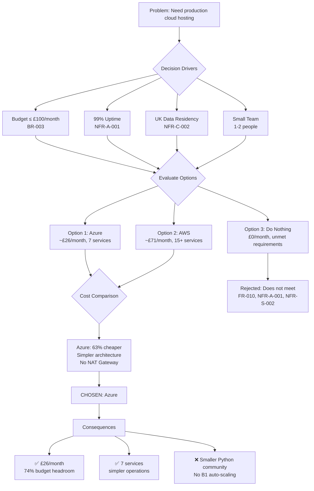

# Architecture Decision Record: Select Azure as Cloud Platform over AWS

> **Template Status**: Beta | **Version**: 1.0.0 | **Command**: `/arckit.adr`

## Document Control

| Field | Value |
|-------|-------|
| **Document ID** | ARC-001-ADR-001-v1.0 |
| **Document Type** | Architecture Decision Record |
| **Project** | Plymouth Research Restaurant Menu Analytics (Project 001) |
| **Classification** | PUBLIC |
| **Status** | DRAFT |
| **Version** | 1.0 |
| **Created Date** | 2026-02-03 |
| **Last Modified** | 2026-02-03 |
| **Review Cycle** | Quarterly |
| **Next Review Date** | 2026-05-03 |
| **Owner** | Mark Craddock (Product Owner / Technical Lead) |
| **Reviewed By** | [PENDING] |
| **Approved By** | [PENDING] |
| **Distribution** | Product Team, Architecture Team, Development Team |
| **ADR Number** | ADR-001 |
| **Date** | 2026-02-03 |
| **Author** | ArcKit AI |
| **Supersedes** | N/A |
| **Superseded by** | N/A |
| **Escalation Level** | Department |
| **Governance Forum** | Architecture Review Board |

## Revision History

| Version | Date | Author | Changes | Approved By | Approval Date |
|---------|------|--------|---------|-------------|---------------|
| 1.0 | 2026-02-03 | ArcKit AI | Initial creation from `/arckit.adr` command | [PENDING] | [PENDING] |

## 1. Decision Title

**Select Azure as the Cloud Hosting Platform for Plymouth Research**

---

## 2. Stakeholders

### 2.1 Deciders (RACI: Accountable)

- **Mark Craddock**, Product Owner / Technical Lead — Budget authority and final platform decision
- **Research Director**, Executive Sponsor — Strategic alignment and cost approval

### 2.2 Consulted (RACI: Consulted)

- **Data Engineer**, Technical Lead — Infrastructure implementation, migration feasibility
- **Legal/Compliance Advisor** — UK GDPR data residency, web scraping compliance on cloud

### 2.3 Informed (RACI: Informed)

- Research Analysts — Dashboard availability and performance implications
- Operations/IT — Monitoring, deployment pipeline, operational support

### 2.4 UK Government Escalation Context

**Decision Level**: Department

**Escalation Rationale**:
- [x] **Department**: Technology standards, cloud providers, security frameworks

This is a cloud provider selection that affects the entire technology stack, budget allocation, security posture, and operational model. While Plymouth Research is not a UK Government department, the decision follows departmental-level governance because it sets a binding technology standard for all infrastructure.

**Governance Forum**: Architecture Review Board

**Approval Date**: [PENDING]

---

## 3. Context and Problem Statement

### 3.1 Problem Description

The Plymouth Research Restaurant Menu Analytics platform currently runs locally (development) and on Streamlit Cloud (free tier) with a SQLite database. To achieve production-grade reliability (99% uptime — NFR-A-001), scheduled automated data collection (weekly scraping — FR-010), and scalability for geographic expansion (Principle 5), the platform must migrate to a cloud hosting environment.

**Problem statement as a question**: Which cloud platform — Microsoft Azure or Amazon Web Services (AWS) — should Plymouth Research adopt for hosting the Streamlit dashboard, PostgreSQL database, and scheduled scraping pipelines?

### 3.2 Why This Decision Is Needed

- **Business context**: The platform must operate within a strict budget of £100/month (BR-003) while delivering a public dashboard (BR-007) with sub-2-second page loads (NFR-P-001) and 99% uptime (NFR-A-001). Cloud hosting is required to move beyond local/free-tier constraints.
- **Technical context**: The current SQLite database cannot support concurrent users (NFR-S-002: 100 concurrent users) or scheduled background processing (FR-010). A managed PostgreSQL service and serverless compute for scraping jobs are needed.
- **Regulatory context**: All data must reside in the UK (UK GDPR compliance — NFR-C-002). Both platforms offer UK regions, but cost and operational complexity differ.

### 3.3 Supporting Links

- **Requirements**: ARC-001-REQ-v1.0 (BR-003, BR-007, FR-010, NFR-P-001, NFR-A-001, NFR-S-002, NFR-SEC-001, NFR-C-002)
- **Azure research**: ARC-001-AZRS-v1.0
- **AWS research**: ARC-001-AWRS-v1.0
- **General research**: ARC-001-RSCH-001-v1.0
- **Stakeholder analysis**: ARC-001-STKE-v1.0
- **Risk register**: ARC-001-RISK-v1.0

---

## 4. Decision Drivers (Forces)

### 4.1 Technical Drivers

- **Streamlit hosting simplicity**: The dashboard is a Python/Streamlit application. The hosting platform must support Python natively with minimal containerisation overhead.
  - Requirements: NFR-P-001 (Dashboard Load <2s), NFR-M-001 (Maintainability)
  - Principles: Principle 2 (Open Source Preferred), Principle 5 (Scalability)

- **Managed PostgreSQL**: Migration from SQLite to PostgreSQL requires a managed database service with encryption at rest, automated backups, and UK region deployment.
  - Requirements: NFR-SEC-001 (Encryption), NFR-A-001 (99% Uptime)
  - Principles: Principle 1 (Data Quality First)

- **Serverless scheduling**: Weekly/monthly scraping jobs need serverless compute with timer triggers and rate-limiting support.
  - Requirements: FR-010 (Scheduled Data Refresh), NFR-Q-003 (Data Freshness)

- **Operational simplicity**: The platform is maintained by a small team (1-2 people). Operational overhead must be minimal.
  - Principles: Principle 5 (Scalability), Principle 2 (Open Source Preferred — avoid lock-in)

### 4.2 Business Drivers

- **Cost constraint (£100/month maximum)**: BR-003 mandates total operational costs under £100/month. This is the dominant business driver.
  - Stakeholder: Research Director (budget authority)
  - Risk: R-005 (Budget Overruns — High risk)

- **Cost sustainability**: Stakeholder analysis identifies long-term cost sustainability as a critical success factor for an independent research firm.
  - Stakeholder: Research Director, Operations/IT

- **Time to market**: Faster migration path with fewer moving parts is preferred.

### 4.3 Regulatory & Compliance Drivers

- **UK GDPR**: Data must reside in UK data centres (NFR-C-002). Both platforms have UK regions.
- **NCSC Cloud Security Principles**: Both Azure and AWS have 14/14 NCSC attestation.
- **Technology Code of Practice**: Point 5 (Cloud first) — both satisfy this requirement.

### 4.4 Alignment to Architecture Principles

| Principle | Azure Alignment | AWS Alignment |
|-----------|----------------|---------------|
| 1. Data Quality First | ✅ PostgreSQL Flexible Server supports full-text search, quality validation | ✅ RDS PostgreSQL equivalent capability |
| 2. Open Source Preferred | ✅ Uses PostgreSQL, Python, Streamlit — no proprietary lock-in | ✅ Same open source stack; App Runner adds container dependency |
| 3. Ethical Web Scraping | ✅ Azure Functions support rate limiting, timer triggers | ✅ Lambda + EventBridge equivalent capability |
| 4. Privacy by Design | ✅ UK South region, Key Vault for secrets, managed identities | ✅ eu-west-2, Secrets Manager, IAM roles |
| 5. Scalability | ✅ App Service scales to Standard/Premium tiers | ✅ App Runner auto-scales; more granular but more complex |
| 6. Cost Transparency | ✅ Simpler pricing model, fewer services (~7 vs ~15) | ⚠️ NAT Gateway hidden cost (~£28/month), more services to track |

---

## 5. Considered Options

### Option 1: Microsoft Azure

**Description**: Deploy the platform on Azure using App Service (B1 Linux) for the Streamlit dashboard, Azure Database for PostgreSQL Flexible Server (Burstable B1ms) for data, Azure Functions (Flex Consumption) for scheduled scraping, and Azure Blob Storage for raw data.

**Implementation approach**: Bicep IaC templates deploy all resources to UK South region. GitHub Actions CI/CD pipeline. Managed identities eliminate credential management. Migration uses `pgloader` for SQLite-to-PostgreSQL conversion.

**Wardley Evolution Stage**: Product (off-the-shelf managed services)

#### Good (Pros)
- ✅ **Lowest cost**: ~£26/month total — 74% headroom under £100/month budget (BR-003)
- ✅ **No NAT Gateway required**: Azure Functions and App Service access external APIs directly without a NAT Gateway, avoiding the largest single cost item on AWS
- ✅ **Simpler architecture**: 7 core services vs 15+ on AWS; fewer components to manage, monitor, and pay for
- ✅ **Native Python/Streamlit support**: App Service has built-in Python runtime — no containerisation required (deploy with `az webapp up`)
- ✅ **Managed identity ecosystem**: Entra ID managed identities provide credential-free access between services (Key Vault, PostgreSQL, Blob Storage)
- ✅ **3-year TCO**: £936 — significantly lower than AWS (£2,316)
- ✅ **Free tier monitoring**: Application Insights + Log Analytics free tiers sufficient for this workload
- ✅ **UK region availability**: All services available in UK South (primary) and UK West (DR)

#### Bad (Cons)
- ❌ **Smaller community for Python**: Azure documentation and community tooling are stronger for .NET/C# than Python — fewer Streamlit-on-Azure examples
- ❌ **App Service cold start**: B1 tier has potential cold starts after inactivity (mitigated by Always On setting)
- ❌ **Less granular auto-scaling**: B1 Basic tier does not support autoscaling; requires upgrade to Standard (~£40/month) for rule-based scaling
- ❌ **Azure Functions Flex Consumption**: Relatively new plan — less community experience than AWS Lambda

#### Cost Analysis
- **CAPEX**: £0 (no upfront costs, pay-as-you-go)
- **OPEX**: ~£26/month (£312/year)
- **TCO (3-year)**: £936

#### GDS Service Standard Impact
| Point | Impact | Notes |
|-------|--------|-------|
| 5. Make sure everyone can use the service | Neutral | Public dashboard, no authentication barriers |
| 9. Create a secure service | Positive | Key Vault, managed identities, encryption at rest/transit |
| 11. Choose the right tools and technology | Positive | Cloud-first, managed services, UK data residency |
| 12. Make new source code open | Neutral | Application code remains open source regardless |
| 14. Operate a reliable service | Positive | 99.95% SLA on App Service B1, automated backups |

---

### Option 2: Amazon Web Services (AWS)

**Description**: Deploy on AWS using App Runner for the containerised Streamlit dashboard, Amazon RDS PostgreSQL (db.t4g.micro) for data, Lambda + EventBridge Scheduler + SQS for scraping pipelines, S3 for storage, and CloudFront + Route 53 for CDN/DNS.

**Implementation approach**: AWS CDK (Python) or Terraform for IaC. GitHub Actions CI/CD pipeline. ECR for container images. IAM roles for least-privilege access. VPC with public/private subnets.

**Wardley Evolution Stage**: Product (off-the-shelf managed services)

#### Good (Pros)
- ✅ **Mature serverless ecosystem**: Lambda, EventBridge, SQS are battle-tested with extensive documentation and community support
- ✅ **Graviton processors**: t4g instances offer ~20% better price/performance on ARM architecture
- ✅ **Broader service catalogue**: More services available for future expansion (SageMaker for sentiment analysis, Comprehend for NLP)
- ✅ **Stronger Python community**: AWS Lambda has extensive Python documentation, tutorials, and community tooling
- ✅ **App Runner auto-scaling**: Scales to zero and back up automatically (though minimum instance required for always-on)
- ✅ **UK region availability**: All 15 recommended services available in eu-west-2 (London)
- ✅ **WAF included**: Web Application Firewall for DDoS protection (adds cost but improves security)

#### Bad (Cons)
- ❌ **Higher cost**: ~£71/month standard deployment (71% of budget consumed), or ~£31/month budget-optimised
- ❌ **NAT Gateway cost**: ~£28/month for a single NAT Gateway — required if Lambda workers run in private subnets; largest single line item
- ❌ **More complex architecture**: 15+ services vs 7 on Azure; higher operational overhead for a small team
- ❌ **Container requirement**: App Runner requires containerisation (Dockerfile) — additional build step not needed on Azure App Service
- ❌ **Budget-optimised trade-offs**: Reaching ~£31/month requires removing WAF, NAT Gateway, and CDN — reducing security and network isolation
- ❌ **Higher 3-year TCO**: £2,316 (2.5x Azure)

#### Cost Analysis
- **CAPEX**: £0 (no upfront costs)
- **OPEX (standard)**: ~£71/month (£852/year)
- **OPEX (budget-optimised)**: ~£31/month (£372/year)
- **TCO (3-year, standard)**: £2,316
- **TCO (3-year, budget-optimised)**: £1,116

#### GDS Service Standard Impact
| Point | Impact | Notes |
|-------|--------|-------|
| 5. Make sure everyone can use the service | Neutral | Public dashboard via CloudFront CDN |
| 9. Create a secure service | Positive | WAF, Secrets Manager, KMS encryption, Security Hub |
| 11. Choose the right tools and technology | Positive | Cloud-first, UK region, managed services |
| 12. Make new source code open | Neutral | Application code remains open source |
| 14. Operate a reliable service | Positive | App Runner SLA, RDS automated backups |

---

### Option 3: Do Nothing (Continue with SQLite + Streamlit Cloud)

**Description**: Continue running the platform on Streamlit Cloud free tier with SQLite as the database. No scheduled automation — manual script execution for data refresh.

#### Good
- ✅ **No immediate cost**: £0/month operational costs
- ✅ **No migration risk**: No data migration, no new infrastructure to learn
- ✅ **Already working**: Current setup meets basic functional requirements

#### Bad
- ❌ **No automated scheduling**: FR-010 (Scheduled Data Refresh) cannot be met — manual script execution required weekly
- ❌ **SQLite concurrency limits**: NFR-S-002 (100 concurrent users) cannot be met — SQLite write-locks block reads
- ❌ **No uptime SLA**: NFR-A-001 (99% uptime) not guaranteed on Streamlit Cloud free tier
- ❌ **No encryption at rest**: NFR-SEC-001 not met — SQLite file is unencrypted
- ❌ **No UK data residency guarantee**: NFR-C-002 at risk — Streamlit Cloud deploys to US regions
- ❌ **No secrets management**: API keys stored in environment variables or .env files
- ❌ **Scalability blocked**: Principle 5 (Scalability) — cannot scale beyond single SQLite file
- ❌ **Technical debt accumulates**: R-005 (Budget — deferred investment increases future migration cost)

#### Cost Analysis
- **CAPEX**: £0
- **OPEX**: £0/month
- **TCO (3-year)**: £0 (but opportunity cost of unmet requirements)

---

## 6. Decision Outcome

### 6.1 Chosen Option

**"Option 1: Microsoft Azure"**

### 6.2 Y-Statement (Structured Justification)

> **In the context of** migrating the Plymouth Research platform to production cloud hosting,
> **facing** a strict budget constraint of £100/month and a small operations team (1-2 people),
> **we decided for** Microsoft Azure (App Service + PostgreSQL Flexible Server + Azure Functions),
> **to achieve** the lowest total cost of ownership (~£26/month, 3-year TCO £936) with the simplest architecture (7 services),
> **accepting** a smaller Python-focused community compared to AWS and limited auto-scaling on the B1 tier.

### 6.3 Justification (Why This Option?)

**Key reasons**:

1. **Cost is the decisive factor**: Azure at ~£26/month is 63% cheaper than AWS standard (~£71/month) and 16% cheaper than AWS budget-optimised (~£31/month). The primary driver is the absence of a NAT Gateway requirement on Azure, which alone saves ~£28/month. For a budget-constrained independent research firm (BR-003: £100/month max), this cost advantage is significant — it preserves £74/month headroom for future expansion (geographic scaling, additional data sources).

2. **Architectural simplicity**: Azure requires 7 core services vs 15+ on AWS. Fewer services means fewer failure points, less monitoring overhead, less operational knowledge required, and faster incident response. This directly benefits a 1-2 person team.

3. **No containerisation required**: Azure App Service deploys Python applications natively without Dockerfiles. AWS App Runner requires containerisation, adding build complexity and an ECR dependency. For a Streamlit application, native deployment is simpler and faster.

4. **Equivalent security and compliance**: Both platforms meet all security requirements (NCSC 14/14, encryption at rest/transit, UK data residency). Azure's managed identity ecosystem (Entra ID) provides credential-free service-to-service authentication comparable to AWS IAM roles.

5. **Equal UK region coverage**: Both platforms have UK regions (Azure UK South/West, AWS eu-west-2). No regional availability advantage for either platform.

**Stakeholder consensus**: Cost sustainability is the top stakeholder concern (Research Director, Operations/IT). Azure's cost advantage directly addresses this. No dissenting views anticipated given the clear cost differential.

**Risk appetite**: Plymouth Research has a low risk appetite for budget overruns (R-005: High risk). Azure's lower cost profile and simpler pricing model align with conservative financial management.

---

## 7. Consequences

### 7.1 Positive Consequences

- ✅ **74% budget headroom**: £26/month against £100/month budget leaves significant room for growth
- ✅ **Production-grade reliability**: App Service B1 SLA (99.95%) meets NFR-A-001 (99% uptime)
- ✅ **Automated data collection**: Azure Functions with timer triggers enable weekly/monthly scheduled scraping (FR-010)
- ✅ **Concurrent user support**: PostgreSQL Flexible Server handles 100+ concurrent connections (NFR-S-002)
- ✅ **UK data residency**: All data in UK South region (NFR-C-002)
- ✅ **Encryption everywhere**: AES-256 at rest, TLS 1.2 in transit (NFR-SEC-001)
- ✅ **Credential-free operations**: Managed identities eliminate API key management in code

**Measurable outcomes**:
- Monthly cost: £0/month → £26/month (within £100 budget)
- Uptime: Unmonitored → 99.95% SLA
- Concurrent users: ~5 (SQLite limit) → 100+ (PostgreSQL)
- Data refresh: Manual → Automated weekly/monthly
- Encryption at rest: None → AES-256

### 7.2 Negative Consequences (Accepted Trade-offs)

- ❌ **Azure vendor dependency**: Platform becomes dependent on Azure services, though all core components (PostgreSQL, Python, Streamlit) are portable open-source technologies. The vendor-specific elements are infrastructure (App Service, Functions) not application code.
- ❌ **Limited auto-scaling on B1**: Cannot auto-scale without upgrading to Standard tier (~£40/month). Acceptable at current scale (100 concurrent users), but will need upgrade if public adoption exceeds expectations.
- ❌ **Smaller Python/Streamlit community on Azure**: Fewer community examples and Stack Overflow answers for Python workloads on Azure vs AWS. Mitigated by the growing AZD template ecosystem and Microsoft's investment in Python support.
- ❌ **Migration effort**: SQLite-to-PostgreSQL migration required, including schema conversion, data validation, and application connection string updates.

**Mitigation strategies**:
- **Vendor dependency**: Application code uses standard PostgreSQL and Python — portable to AWS RDS or any PostgreSQL host with connection string change only. No Azure-specific SDKs in application code.
- **Auto-scaling**: Monitor dashboard traffic. If sustained concurrent users exceed 100, upgrade to Standard tier (additional ~£14/month).
- **Community**: Use Microsoft Learn MCP and Azure Architecture Center for guidance. Streamlit-on-Azure patterns are documented in AZD templates.
- **Migration**: Use `pgloader` for automated SQLite-to-PostgreSQL migration. Validate row counts and checksums post-migration.

### 7.3 Neutral Consequences (Changes Needed)

- 🔄 **Team training**: Azure fundamentals (App Service, Functions, PostgreSQL Flexible Server, Key Vault) — Microsoft Learn free courses
- 🔄 **Infrastructure changes**: Bicep IaC templates, GitHub Actions deployment pipeline, Azure subscription setup
- 🔄 **Process updates**: Deployment runbook, monitoring dashboards, incident response procedures
- 🔄 **Database migration**: SQLite → PostgreSQL schema conversion, data migration, connection string updates

### 7.4 Risks and Mitigations

| Risk | Likelihood | Impact | Mitigation | Owner |
|------|------------|--------|------------|-------|
| Azure pricing changes increase monthly cost beyond budget | Low | High | Monitor Azure pricing updates; architecture portable to AWS if needed | Mark Craddock |
| PostgreSQL migration introduces data quality issues | Medium | High | Validate with row counts, checksums, and data quality tests post-migration | Data Engineer |
| App Service B1 insufficient for traffic spikes | Low | Medium | Monitor response times; upgrade to Standard tier if needed (~£14/month extra) | Operations/IT |
| Azure Functions Flex Consumption instability | Low | Medium | Fall back to Consumption plan if issues arise; scraping jobs are idempotent | Data Engineer |
| Team unfamiliar with Azure operations | Medium | Low | Microsoft Learn training; start with dev environment before production | Mark Craddock |

**Link to risk register**: ARC-001-RISK-v1.0 — R-005 (Budget Overruns), R-008 (Technical Implementation)

---

## 8. Validation & Compliance

### 8.1 How Will Implementation Be Verified?

**Design review**:
- [ ] High-Level Design (HLD) includes Azure architecture diagram
- [ ] Detailed Design (DLD) specifies Bicep templates, deployment pipeline, monitoring
- [ ] Architecture diagrams updated to show Azure services

**Code review**:
- [ ] Application uses PostgreSQL connection (not SQLite) in production config
- [ ] No Azure-specific SDKs in core application code (portability)
- [ ] Secrets accessed via environment variables injected by Key Vault (not hardcoded)

**Testing strategy**:
- [ ] Integration tests run against PostgreSQL (not just SQLite)
- [ ] Load test with 100 simulated concurrent users on App Service B1
- [ ] Scraping pipeline tested on Azure Functions with timer trigger
- [ ] Data migration validated: row counts, checksums, schema integrity

### 8.2 Monitoring & Observability

**Success metrics**:
- **Monthly cost**: Target ≤£30/month (measured via Azure Cost Management)
- **Dashboard uptime**: Target ≥99% (measured via Application Insights availability tests)
- **Page load time (p95)**: Target <2s (measured via Application Insights)
- **Query response time (p95)**: Target <500ms (measured via Application Insights)
- **Scraping job success rate**: Target ≥95% (measured via Azure Functions metrics)

**Alerts and dashboards**:
- Alert: Monthly cost exceeds £50 (50% of budget)
- Alert: Dashboard uptime drops below 99%
- Alert: Page load time p95 exceeds 3 seconds
- Alert: Scraping job failure rate exceeds 10%
- Dashboard: Azure Monitor workbook with cost, performance, and availability metrics

### 8.3 Compliance Verification

**Security assurance**:
- [ ] NCSC Cloud Security Principles: Azure meets 14/14 (Microsoft attestation)
- [ ] Encryption at rest: PostgreSQL + Blob Storage (AES-256)
- [ ] Encryption in transit: TLS 1.2 enforced on all services
- [ ] Secrets management: Key Vault with managed identity access
- [ ] No credentials in code or environment variables

**Data protection**:
- [ ] All data resides in UK South region (verified via Azure Resource Graph)
- [ ] DPIA updated to reflect Azure hosting (ARC-001-DPIA-v1.0)
- [ ] No PII stored (public business data only)

---

## 9. Links to Supporting Documents

### 9.1 Requirements Traceability

**Business Requirements**:
- BR-003: Operational costs ≤£100/month — Azure at ~£26/month (74% headroom)
- BR-007: Public dashboard accessibility — App Service with custom domain

**Functional Requirements**:
- FR-010: Scheduled data refresh — Azure Functions with timer triggers

**Non-Functional Requirements**:
- NFR-P-001: Dashboard load <2s (p95) — App Service B1 with Application Insights monitoring
- NFR-P-002: Query response <500ms (p95) — PostgreSQL Flexible Server with indexes
- NFR-S-002: 100 concurrent users — PostgreSQL connection pooling
- NFR-A-001: 99% uptime — App Service SLA 99.95%
- NFR-SEC-001: Encryption at rest and in transit — Key Vault, AES-256, TLS 1.2
- NFR-C-002: UK GDPR compliance — UK South data residency

### 9.2 Architecture Artifacts

**Architecture principles**: `projects/000-global/ARC-000-PRIN-v1.0.md`
- Principle 1 (Data Quality First): PostgreSQL supports validation, constraints, full-text search
- Principle 2 (Open Source Preferred): All application components remain open source (PostgreSQL, Python, Streamlit)
- Principle 3 (Ethical Web Scraping): Azure Functions support rate limiting and timer triggers
- Principle 4 (Privacy by Design): Key Vault, managed identities, UK data residency
- Principle 5 (Scalability): App Service and PostgreSQL scale vertically; Functions scale horizontally
- Principle 6 (Cost Transparency): Azure Cost Management provides detailed cost breakdown

**Stakeholder drivers**: `projects/001-plymouth-research-restaurant-menu-analytics/ARC-001-STKE-v1.0.md`
- Research Director: Cost sustainability (£100/month budget)
- Operations/IT: Operational simplicity (fewer services to manage)

**Risk register**: `projects/001-plymouth-research-restaurant-menu-analytics/ARC-001-RISK-v1.0.md`
- R-005 (Budget Overruns): Mitigated by 74% budget headroom
- R-008 (Technical Implementation): Mitigated by simpler architecture (7 services)

**Research findings**:
- Azure research: `projects/001-plymouth-research-restaurant-menu-analytics/research/ARC-001-AZRS-v1.0.md`
- AWS research: `projects/001-plymouth-research-restaurant-menu-analytics/research/ARC-001-AWRS-v1.0.md`
- General research: `projects/001-plymouth-research-restaurant-menu-analytics/research/ARC-001-RSCH-001-v1.0.md`

**Data model**: `projects/001-plymouth-research-restaurant-menu-analytics/ARC-001-DATA-v1.0.md`
- Decision affects database service selection (SQLite → Azure PostgreSQL Flexible Server)

### 9.3 External References

**Vendor documentation**:
- Azure App Service: https://learn.microsoft.com/en-us/azure/app-service/
- Azure PostgreSQL Flexible Server: https://learn.microsoft.com/en-us/azure/postgresql/
- Azure Functions: https://learn.microsoft.com/en-us/azure/azure-functions/
- Azure Key Vault: https://learn.microsoft.com/en-us/azure/key-vault/

**UK Government guidance**:
- NCSC Cloud Security Principles: https://www.ncsc.gov.uk/collection/cloud/the-cloud-security-principles
- Azure UK compliance: https://learn.microsoft.com/en-us/azure/compliance/offerings/offering-uk-g-cloud

**Architecture references**:
- Azure Architecture Center — Basic Web App: https://learn.microsoft.com/en-us/azure/architecture/web-apps/app-service/architectures/basic-web-app
- Azure Well-Architected Framework: https://learn.microsoft.com/en-us/azure/well-architected/

---

## 10. Implementation Plan

### 10.1 Dependencies

**Prerequisite decisions**: None — this is the first ADR (foundational platform decision).

**Infrastructure dependencies**:
- Azure subscription (Pay-As-You-Go or Visual Studio Enterprise)
- GitHub repository with Actions enabled
- Custom domain (optional — can use `*.azurewebsites.net` initially)

**Team dependencies**:
- Azure fundamentals knowledge (Microsoft Learn free courses)
- Bicep IaC familiarity
- PostgreSQL migration skills (`pgloader`)

### 10.2 Implementation Timeline

| Phase | Activities | Owner |
|-------|-----------|-------|
| **Phase 1: Setup** | Create Azure subscription, resource group, Bicep templates | Mark Craddock |
| **Phase 2: Database Migration** | SQLite → PostgreSQL migration using `pgloader`, schema validation, data integrity checks | Data Engineer |
| **Phase 3: Application Deployment** | Deploy Streamlit to App Service, configure managed identities, Key Vault secrets | Data Engineer |
| **Phase 4: Pipeline Migration** | Migrate scraping scripts to Azure Functions with timer triggers | Data Engineer |
| **Phase 5: Validation** | Load testing, monitoring setup, security review | Mark Craddock |

### 10.3 Rollback Plan

**Rollback trigger**: Monthly costs exceed £80/month for 2 consecutive months, or Azure service reliability drops below 95% uptime for 30 days.

**Rollback procedure**:
1. Export PostgreSQL data to SQLite using `pg_dump` + conversion script
2. Revert application connection string to SQLite
3. Redeploy to Streamlit Cloud
4. Decommission Azure resources
5. Evaluate AWS as alternative (ARC-001-AWRS-v1.0 provides ready architecture)

**Rollback owner**: Mark Craddock (Product Owner / Technical Lead)

---

## 11. Review and Updates

### 11.1 Review Schedule

**Initial review**: 2026-05-03 (3 months after implementation)

**Periodic review**: Quarterly (aligned with Azure billing cycles)

**Review criteria**:
- Are monthly costs within £30/month target?
- Is uptime meeting 99% SLA?
- Is dashboard performance meeting <2s p95?
- Has Azure pricing changed significantly?
- Are there new services or pricing models that change the analysis?

### 11.2 Trigger Events for Review

- [ ] Azure pricing changes >20% on any core service
- [ ] Monthly costs exceed £50 for 2+ consecutive months
- [ ] AWS introduces pricing that would make it cheaper than Azure for this workload
- [ ] Platform scales beyond 1,000 concurrent users (may need architectural rethink)
- [ ] Geographic expansion to multiple UK cities (may need multi-region deployment)
- [ ] Security incident related to Azure services

---

## 12. Related Decisions

### 12.1 Decisions This ADR Depends On

- None (foundational platform decision)

### 12.2 Decisions That Depend On This ADR

- **ADR-002** (future): Database selection (PostgreSQL Flexible Server vs Azure SQL) — constrained to Azure services
- **ADR-003** (future): CI/CD pipeline design (GitHub Actions to Azure) — deployment target determined
- **ADR-004** (future): Monitoring and alerting strategy — Azure Monitor ecosystem selected

### 12.3 Conflicting Decisions

- None identified

---

## 13. Appendices

### Appendix A: Options Comparison Matrix

| Criterion | Azure | AWS (Standard) | AWS (Budget-Optimised) | Do Nothing |
|-----------|-------|----------------|----------------------|------------|
| Monthly cost | ~£26 | ~£71 | ~£31 | £0 |
| 3-year TCO | £936 | £2,316 | £1,116 | £0 |
| Core services | 7 | 15+ | 10 | 0 |
| NAT Gateway required | No | Yes (~£28/month) | Optional | N/A |
| Containerisation required | No | Yes (Dockerfile) | Yes | No |
| UK region | UK South/West | eu-west-2 | eu-west-2 | US (Streamlit Cloud) |
| NCSC attestation | 14/14 | 14/14 | 14/14 | N/A |
| Auto-scaling (dashboard) | Standard tier+ | Built-in | Built-in | N/A |
| Managed database SLA | 99.9% | 99.95% | 99.95% | N/A (SQLite) |
| Serverless scraping | Azure Functions | Lambda + EventBridge + SQS | Lambda + EventBridge | Manual |
| IaC tooling | Bicep (native) | CDK (Python) / Terraform | CDK / Terraform | N/A |
| Budget headroom | 74% | 29% | 69% | 100% |
| Meets all requirements | ✅ Yes | ✅ Yes | ⚠️ Partial (no WAF/CDN) | ❌ No |

### Appendix B: Cost Breakdown Detail

**Azure (Recommended)**:

| Service | Configuration | Monthly (GBP) |
|---------|---------------|---------------|
| App Service | B1 Linux, 1 core, 1.75 GB | 10 |
| PostgreSQL Flexible Server | Burstable B1ms, 32 GB | 12 |
| Azure Functions | Flex Consumption | 2.50 |
| Blob Storage | Standard LRS Hot, 5 GB | 1 |
| Key Vault | Standard, ~20 secrets | 0.50 |
| Azure Monitor + App Insights | Free tier | 0 |
| Entra ID | Free tier | 0 |
| **Total** | | **~26** |

**AWS (Standard)**:

| Service | Configuration | Monthly (GBP) |
|---------|---------------|---------------|
| App Runner | 1 vCPU, 2 GB RAM | 12 |
| RDS PostgreSQL | db.t4g.micro, 20 GB | 16 |
| Lambda + SQS + EventBridge | Serverless scraping | 1 |
| S3 | 5 GB Standard | 1 |
| CloudFront + Route 53 | CDN + DNS | 1 |
| Secrets Manager | 4 secrets | 2 |
| WAF | 1 ACL, 3 rule groups | 6 |
| CloudWatch | Logs + metrics + alarms | 3 |
| ECR | 1 repository | 1 |
| NAT Gateway | 1 gateway | 28 |
| **Total** | | **~71** |

### Appendix C: Decision Flow Diagram

---

## Document Approval

| Role | Name | Signature | Date |
|------|------|-----------|------|
| **Technical Architect** | [PENDING] | | |
| **Product Owner** | Mark Craddock | | |
| **Senior Responsible Owner** | [PENDING] | | |

---

*This ADR follows the MADR v4.0 format enhanced with UK Government requirements and ArcKit governance standards.*

*For more information:*
- *MADR: https://adr.github.io/madr/*
- *ArcKit Documentation: https://github.com/tractorjuice/arc-kit*

---

**Generated by**: ArcKit `/arckit.adr` command
**Generated on**: 2026-02-03
**ArcKit Version**: 1.1.0
**Project**: Plymouth Research Restaurant Menu Analytics (Project 001)
**AI Model**: Claude Opus 4.5 (claude-opus-4-5-20251101)
**Generation Context**: Based on ARC-001-AZRS-v1.0 (Azure research), ARC-001-AWRS-v1.0 (AWS research), ARC-001-REQ-v1.0 (requirements), ARC-001-STKE-v1.0 (stakeholders), ARC-001-RISK-v1.0 (risk register), ARC-000-PRIN-v1.0 (principles)
