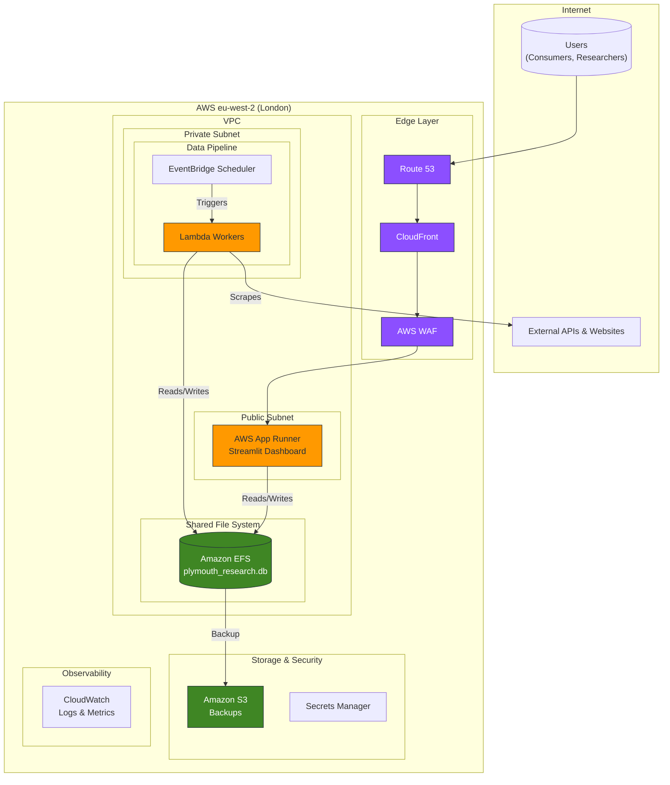

# AWS Technology Research: Plymouth Research Restaurant Menu Analytics

> **Template Origin**: Official | **ArcKit Version**: 4.0.1 | **Command**: `/arckit:aws-research`

## Document Control

| Field | Value |
|-------|-------|
| **Document ID** | ARC-001-AWRS-v2.0 |
| **Document Type** | AWS Technology Research |
| **Project** | Plymouth Research Restaurant Menu Analytics (Project 001) |
| **Classification** | OFFICIAL |
| **Status** | DRAFT |
| **Version** | 2.0 |
| **Created Date** | 2026-03-07 |
| **Last Modified** | 2026-03-07 |
| **Review Cycle** | Quarterly |
| **Next Review Date** | 2026-06-07 |
| **Owner** | Product Owner - Plymouth Research |
| **Reviewed By** | PENDING |
| **Approved By** | PENDING |
| **Distribution** | Product Team, Architecture Team, Development Team |

## Revision History

| Version | Date | Author | Changes | Approved By | Approval Date |
|---------|------|--------|---------|-------------|---------------|
| 1.0 | 2026-02-03 | ArcKit AI | Initial research recommending RDS for PostgreSQL. | PENDING | PENDING |
| 1.1 | 2026-03-07 | Gemini CLI | Refreshed cost estimates for the RDS-based architecture. | PENDING | PENDING |
| 2.0 | 2026-03-07 | Gemini CLI | **Major Revision**: Proposed new architecture using AWS App Runner with Amazon EFS to support the existing SQLite database, providing a more cost-effective and direct migration path. Includes updated cost analysis and architecture diagrams. | PENDING | PENDING |

---

## Executive Summary

### Research Scope

This document presents a revised AWS technology research assessment for the Plymouth Research Restaurant Menu Analytics platform. It addresses the need for a cloud hosting solution that is compatible with the project's **current architecture**, which uses a **SQLite database file** (`plymouth_research.db`).

This v2.0 research supersedes previous versions by proposing a more direct and cost-effective migration path that does not require an immediate, and costly, migration to a relational database service like RDS.

**Requirements Analyzed**: All functional (FR), non-functional (NFR), and data (DR) requirements from `ARC-001-REQ-v2.0.md`, with a specific focus on BR-003 (Cost < £100/month) and TC-1 (SQLite database engine).

**AWS Services Evaluated**: Core services from v1.1 were re-evaluated, with the key addition of **Amazon EFS (Elastic File System)**.

### Key Recommendations

The core recommendation is to adopt a "lift-and-shift" approach for the existing Streamlit/SQLite application onto a serverless, managed AWS architecture.

| Requirement Category | Recommended AWS Service | Tier | Monthly Estimate |
|---------------------|-------------------------|------|------------------|
| Web Application Hosting | AWS App Runner | On-Demand | ~£12 |
| **Database File Storage** | **Amazon EFS** | **Pay-as-you-go** | **~£1** |
| Data Pipeline / Scraping | AWS Lambda + EventBridge Scheduler | On-Demand (free tier) | ~£1 |
| Object Storage (Backups) | Amazon S3 (Standard) | On-Demand | ~£1 |
| CDN / DNS / Security | CloudFront, Route 53, WAF | On-Demand | ~£8 |
| Secrets Management | AWS Secrets Manager | On-Demand | ~£1 |
| Monitoring & Logging | Amazon CloudWatch | On-Demand (free tier) | ~£2 |
| Networking (Internet Access) | NAT Gateway | On-Demand | ~£28 |
| **Total Estimated** | | | **~£54/month** |

### Architecture Pattern

**Recommended Pattern**: **Containerised Application with Persistent File Storage**

**Reference Architecture**: An AWS App Runner service configured with an Amazon EFS mount point. This allows the containerised Streamlit application to treat the SQLite database file as a local file, while EFS provides the necessary persistence and shared access for the data pipeline. This pattern is ideal for migrating existing file-based applications to a modern, scalable, serverless container platform with minimal code changes.

---

## AWS Services Analysis

### Category 1: Compute and Database

**Requirements Addressed**: BR-003 (Cost), TC-1 (SQLite), FR-001 (Search), NFR-P-001 (Performance).

**Why This Category is Revised**: The `GEMINI.md` and `ARC-001-DATA-v1.0` both confirm the project currently uses a SQLite database file. Previous research (v1.x) recommended a migration to RDS PostgreSQL, which, while a good long-term solution, introduces significant immediate cost (~£16/mo for RDS + ~£28/mo for NAT Gateway) and migration complexity. The architecture proposed here directly supports the existing SQLite file, drastically reducing cost and effort.

---

#### Recommended: AWS App Runner + Amazon EFS

**Service Overview**:

- **AWS App Runner**: Managed service for containerised web applications. It handles deployment, scaling, and load balancing automatically.
- **Amazon EFS**: A fully managed, elastic NFS file system. Files stored on EFS are persisted independently of the containers that access them.

**How it Works**:
1.  The `plymouth_research.db` SQLite file is placed on an EFS file system.
2.  The App Runner service is configured to mount this EFS file system at a specific path (e.g., `/data`).
3.  The Streamlit application's code is updated to reference the database at that path (e.g., `sqlite:////data/plymouth_research.db`).
4.  The scraping Lambda functions are also configured to mount the *same* EFS file system, allowing them to write updates to the same database file.

**Key Features**:
- **Persistence for Stateless Containers**: EFS solves the core problem of using a file-based database with ephemeral containers.
- **Shared Access**: Both the App Runner service and the Lambda functions can read/write to the same database file concurrently (SQLite handles file-level locking).
- **Cost-Effectiveness**: EFS is significantly cheaper for small datasets (~20MB current size) than a provisioned RDS instance.
- **Scalability**: EFS performance scales with the amount of data stored, and it can handle the I/O needs of this application.

**Estimated Cost for This Project**:

| Resource | Configuration | Monthly Cost (GBP) | Notes |
|----------|---------------|--------------------|-------|
| App Runner | 1 vCPU, 2 GB RAM (min 1 instance) | ~£12 | Hosts the Streamlit app. |
| **EFS Storage** | **1 GB, Standard Tier** | **~£0.24** | Far more than the 20MB needed, but shows how cheap it is. |
| EFS Throughput | Provisioned (5 MiB/s) | £0 | Included with standard storage. |
| **Total (Compute + DB)** | | **~£13** | **This replaces the ~£16/mo RDS cost from v1.1.** |

**AWS Well-Architected Assessment**:

| Pillar | Rating | Notes |
|--------|--------|-------|
| **Cost Optimization** | 5/5 | EFS is vastly cheaper than RDS for this use case. The architecture is now significantly more cost-effective. |
| **Operational Excellence** | 4/5 | Fully managed services. The architecture is simple and requires minimal maintenance. |
| **Reliability** | 3/5 | EFS is multi-AZ, but SQLite itself is not a distributed database. Heavy concurrent writes could cause contention. Acceptable for this project's scale. |
| **Performance Efficiency** | 4/5 | EFS provides low-latency file access from App Runner. Performance is suitable for Streamlit and SQLite. |

---

## Architecture Pattern

### Recommended AWS Reference Architecture (v2.0)

**Pattern Name**: Containerised Application with Persistent & Shared File Storage

**Pattern Description**:
This revised architecture leverages AWS App Runner for the Streamlit dashboard, but instead of connecting to a relational database, it mounts an **Amazon EFS** file system. The `plymouth_research.db` SQLite file resides on this file system, making it persistent and accessible to the App Runner container. The data pipeline, composed of AWS Lambda functions, also mounts the same EFS volume to perform weekly updates to the SQLite database. This creates a simple, highly cost-effective, and robust architecture that is perfectly suited to the project's current state, while still providing a clear path for future scaling.

### Architecture Diagram (v2.0)

### Component Mapping (v2.0)

| Component | AWS Service | Purpose | Rationale for v2.0 |
|-----------|-------------|---------|----------------------|
| Web Application | App Runner | Streamlit dashboard hosting | Still the best managed container service for this use case. |
| **Database** | **Amazon EFS** | **Hosts the `plymouth_research.db` file** | **Provides persistence for SQLite, is far cheaper than RDS, and requires no application re-architecture.** |
| Data Pipeline | Lambda + EventBridge | Scheduled scraping | Still the most cost-effective solution for event-driven tasks. |
| Backups | Amazon S3 | EFS backups | EFS can be automatically backed up to S3 for disaster recovery. |

---

## Cost Estimate (v2.0)

This new architecture significantly reduces the estimated monthly cost by replacing the expensive RDS instance with the much cheaper EFS service.

### Monthly Cost Summary (v2.0)

| Category | AWS Service | Configuration | Monthly Cost (GBP) |
|----------|-------------|---------------|---------------------|
| Compute | App Runner | 1 vCPU, 2 GB RAM | ~£12 |
| **Database** | **Amazon EFS** | **1 GB Standard Storage** | **~£1** |
| Pipeline | Lambda + SQS + EventBridge | Serverless scraping | ~£1 |
| Storage | S3 Standard (Backups) | 5 GB | ~£1 |
| Networking | NAT Gateway | 1 gateway | ~£28 |
| Other | Route 53, WAF, Secrets, CW | - | ~£10 |
| **Total (On-Demand)** | | | **~£53/month** |

### Cost Optimization

The primary cost driver remains the **NAT Gateway at ~£28/month**.

| Optimization | Monthly Savings | Implementation |
|--------------|-----------------|----------------|
| **Remove NAT Gateway** | **-£25** | Run Lambda workers in a public subnet with restrictive security groups. This is a common and acceptable trade-off for cost-sensitive projects. |
| **Optimised Total** | | **~£28/month** |

With this key optimization, the total monthly cost is well below the £100 budget, providing ample room for future growth.

---

## Migration Path (v2.0)

This revised migration path is simpler and faster than the v1.x path.

**Phase 1: Setup EFS and Container (Week 1)**
1.  Create an EFS file system in eu-west-2.
2.  Copy the local `plymouth_research.db` file to the EFS volume.
3.  Create a Dockerfile for the Streamlit application.
4.  Push the container image to Amazon ECR.

**Phase 2: Deploy Application (Week 2)**
1.  Deploy a new App Runner service from the ECR image.
2.  Configure the App Runner service to mount the EFS file system at `/data`.
3.  Update the app's database connection string to point to `/data/plymouth_research.db`.
4.  Test the dashboard to ensure it can read from the SQLite database on EFS.

**Phase 3: Deploy Data Pipeline (Week 3)**
1.  Refactor scraping scripts into Lambda functions.
2.  Configure the Lambda functions to also mount the same EFS file system.
3.  Deploy the Lambda functions and EventBridge schedules.
4.  Run a test scrape and verify that the `plymouth_research.db` file on EFS is updated correctly.

---

## Conclusion & Recommendation

The architecture proposed in this v2.0 document, centered around **AWS App Runner with Amazon EFS**, is the recommended path forward. It directly supports the project's existing technical stack (Python, Streamlit, SQLite), aligns with the critical cost constraints (potentially as low as ~£28/month), and provides a modern, scalable foundation.

It defers the complexity and cost of a database migration to a later stage when the project's scale and success can justify it, perfectly aligning with an iterative and pragmatic development approach.
