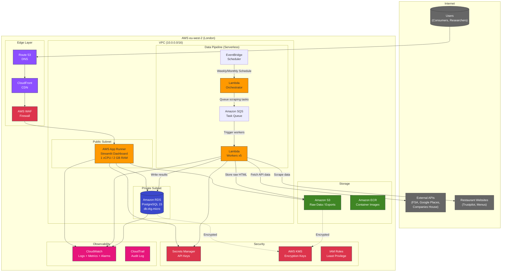

# AWS Technology Research: Plymouth Research Restaurant Menu Analytics

> **Template Status**: Experimental | **Version**: 1.0.0 | **Command**: `/arckit.aws-research`

## Document Control

| Field | Value |
|-------|-------|
| **Document ID** | ARC-001-AWRS-v1.0 |
| **Document Type** | AWS Technology Research |
| **Project** | Plymouth Research Restaurant Menu Analytics (Project 001) |
| **Classification** | OFFICIAL |
| **Status** | DRAFT |
| **Version** | 1.0 |
| **Created Date** | 2026-02-03 |
| **Last Modified** | 2026-02-03 |
| **Review Cycle** | Quarterly |
| **Next Review Date** | 2026-05-03 |
| **Owner** | Product Owner - Plymouth Research |
| **Reviewed By** | PENDING |
| **Approved By** | PENDING |
| **Distribution** | Product Team, Architecture Team, Development Team |

## Revision History

| Version | Date | Author | Changes | Approved By | Approval Date |
|---------|------|--------|---------|-------------|---------------|
| 1.0 | 2026-02-03 | ArcKit AI | Initial creation from `/arckit.aws-research` agent | PENDING | PENDING |

---

## Executive Summary

### Research Scope

This document presents AWS-specific technology research findings for the Plymouth Research Restaurant Menu Analytics platform. The platform is a Python/Streamlit web application that scrapes restaurant websites, aggregates data from 6 external sources (FSA, Trustpilot, Google Places, Companies House, Plymouth Licensing, Business Rates), and presents insights through an interactive dashboard serving Plymouth, UK.

**Requirements Analyzed**: 10 functional (FR-001 to FR-010), 15 non-functional (NFR-P, NFR-S, NFR-A, NFR-SEC, NFR-C, NFR-Q, NFR-M, NFR-O, NFR-I), 4 integration (NFR-I-001 to NFR-I-004), 6 data requirements (DR-001 to DR-006)

**AWS Services Evaluated**: 18 AWS services across 7 categories

**Research Sources**: AWS Documentation (agent knowledge base -- AWS Knowledge MCP server was unavailable at generation time), AWS Architecture Center, AWS Well-Architected Framework

**Note on MCP Availability**: The AWS Knowledge MCP server tools were not available during this research session. All AWS service details, pricing, and architectural guidance are based on the agent's training knowledge of AWS documentation current to early 2025. Readers should verify pricing and regional availability via the AWS Management Console or AWS Pricing Calculator before procurement decisions.

### Key Recommendations

| Requirement Category | Recommended AWS Service | Tier | Monthly Estimate |
|---------------------|-------------------------|------|------------------|
| Web Application Hosting | AWS App Runner | On-Demand | ~£12 |
| Database | Amazon RDS for PostgreSQL (db.t4g.micro) | On-Demand | ~£14 |
| Data Pipeline / Scheduling | AWS Lambda + EventBridge Scheduler | On-Demand (free tier eligible) | ~£1 |
| Object Storage | Amazon S3 (Standard) | On-Demand | ~£1 |
| CDN / Static Assets | Amazon CloudFront | On-Demand (free tier eligible) | ~£0 |
| DNS | Amazon Route 53 | On-Demand | ~£1 |
| Secrets Management | AWS Secrets Manager | On-Demand | ~£2 |
| Monitoring | Amazon CloudWatch | On-Demand (free tier eligible) | ~£3 |
| Security | AWS WAF (basic) | On-Demand | ~£6 |
| Container Registry | Amazon ECR | On-Demand (free tier eligible) | ~£1 |
| **Total Estimated** | | | **~£41/month** |

### Architecture Pattern

**Recommended Pattern**: Serverless-First Web Application with Managed Container Hosting

**Reference Architecture**: AWS App Runner for containerised web applications with RDS backend -- a cost-optimised pattern suitable for low-traffic, budget-constrained workloads.

### UK Government Suitability

| Criteria | Status | Notes |
|----------|--------|-------|
| **UK Region Availability** | All recommended services available in eu-west-2 (London) | Primary UK region |
| **G-Cloud Listing** | AWS available on G-Cloud 14 | Framework: RM1557.14, Supplier: Amazon Web Services EMEA SARL |
| **Data Classification** | OFFICIAL | Standard AWS services suitable; no SECRET data |
| **NCSC Cloud Security Principles** | 14/14 principles met | AWS has full NCSC attestation |
| **UK GDPR** | Compliant | Data residency in eu-west-2, DPA available |

---

## AWS Services Analysis

### Category 1: Compute -- Web Application Hosting

**Requirements Addressed**: FR-001 (Restaurant Search), FR-002 (Menu Display), FR-003 (Price Analytics), FR-007 (Google Places), NFR-P-001 (Dashboard Load <2s), NFR-S-002 (100 Concurrent Users), NFR-A-001 (99% Uptime), BR-007 (Public Dashboard)

**Why This Category**: The platform requires a web-facing compute service to host the Streamlit dashboard application. The current architecture uses Streamlit's built-in server. For AWS deployment, we need a container-capable hosting service that supports Python applications with minimal operational overhead, staying within the strict budget of under 100 GBP per month.

---

#### Recommended: AWS App Runner

**Service Overview**:
- **Full Name**: AWS App Runner
- **Category**: Compute (Managed Container Hosting)
- **Documentation**: https://docs.aws.amazon.com/apprunner/

**Key Features**:
- Automatic builds from source code or container images
- Auto-scaling from zero to handle traffic spikes (configurable min/max instances)
- Built-in HTTPS with managed TLS certificates
- Health checks and automatic instance replacement
- VPC connectivity for private resources (RDS)
- No infrastructure management required

**Pricing Model**:

| Pricing Option | Cost | Commitment | Notes |
|----------------|------|------------|-------|
| Provisioned Instance (1 vCPU, 2 GB) | ~£0.012/hour (~£8.64/month) | None | Base cost for always-on instance |
| Active Instance | ~£0.012/vCPU-hour | None | Only when processing requests |
| Automatic Scaling | Per-instance pricing | None | Scale to zero supported (pause) |

**Estimated Cost for This Project**:

| Resource | Configuration | Monthly Cost | Notes |
|----------|---------------|--------------|-------|
| App Runner Instance | 1 vCPU, 2 GB RAM, min 1 instance | ~£10 | Streamlit dashboard |
| Build Minutes | ~50 builds/month | ~£2 | CI/CD deployments |
| **Total** | | **~£12** | |

**Why App Runner over alternatives**:
- **vs ECS/Fargate**: Simpler operational model, no cluster management; App Runner handles load balancing, TLS, and scaling automatically. ECS would be over-engineered for this workload.
- **vs EC2**: App Runner eliminates OS patching, security updates, and instance management. EC2 t4g.nano (~£3/month) is cheaper but requires significant operational overhead.
- **vs Elastic Beanstalk**: App Runner is the newer, simpler successor for container workloads. Beanstalk has more configuration surface area.
- **vs Lambda**: Streamlit is a long-running web server; Lambda's 15-minute timeout and cold starts make it unsuitable for interactive dashboards.

**AWS Well-Architected Assessment**:

| Pillar | Rating | Notes |
|--------|--------|-------|
| **Operational Excellence** | 4/5 | Managed service, automatic deployments, CloudWatch integration |
| **Security** | 4/5 | IAM roles, VPC connector, managed TLS, no SSH access |
| **Reliability** | 4/5 | Multi-AZ, health checks, auto-restart on failure |
| **Performance Efficiency** | 4/5 | Auto-scaling, right-sized instances, Graviton support |
| **Cost Optimization** | 5/5 | Pay-per-use, scale to zero, no idle waste |
| **Sustainability** | 4/5 | Graviton (ARM) processors, efficient resource usage |

**UK Region Availability**:
- AWS App Runner is available in eu-west-2 (London)

---

#### Alternative: Amazon EC2 (t4g.nano)

For maximum cost savings, a single EC2 instance running Streamlit directly:

| Resource | Configuration | Monthly Cost | Notes |
|----------|---------------|--------------|-------|
| EC2 t4g.nano | 2 vCPU, 0.5 GB RAM, ARM/Graviton | ~£3.10 | On-Demand pricing |
| EBS gp3 | 20 GB | ~£1.50 | Root volume |
| Elastic IP | 1 | ~£3.65 | Static public IP (pricing changed 2024) |
| **Total** | | **~£8.25** | |

**Trade-off**: Cheaper (~£4 savings/month) but requires manual OS patching, security updates, TLS certificate management, and has no automatic scaling or self-healing. Single point of failure unless paired with an ASG.

---

#### Comparison Matrix

| Criteria | App Runner | EC2 t4g.nano | Winner |
|----------|-----------|--------------|--------|
| Cost (monthly) | ~£12 | ~£8 | EC2 |
| Operational Overhead | Minimal | Significant | App Runner |
| Auto-scaling | Yes (0-N instances) | No (manual ASG) | App Runner |
| TLS/HTTPS | Automatic | Manual (certbot) | App Runner |
| Self-healing | Yes | No | App Runner |
| UK Availability | eu-west-2 | eu-west-2 | Tie |

**Recommendation**: AWS App Runner -- the operational simplicity and automatic TLS/scaling justify the modest cost premium for a small team. If budget is critically tight, EC2 t4g.nano is a viable fallback.

---

### Category 2: Database

**Requirements Addressed**: DR-001 (Restaurant Master Data, 52 columns), DR-002 (Menu Items, 13 columns), DR-003 (Trustpilot Reviews, 13 columns), DR-004 (Google Reviews), NFR-P-002 (Search <500ms), NFR-S-001 (10x Data Volume), NFR-SEC-001 (Encryption at Rest), NFR-Q-001-004 (Data Quality)

**Why This Category**: The platform currently uses SQLite (~20 MB). Requirements specify future migration to PostgreSQL for scalability (NFR-S-001: 1,500 restaurants, 100,000 menu items). The data model document (ARC-001-DATA-v1.0) specifies PostgreSQL 15+ as the target. Full-text search (FTS) is required for menu item search (NFR-P-002).

---

#### Recommended: Amazon RDS for PostgreSQL

**Service Overview**:
- **Full Name**: Amazon Relational Database Service (RDS) for PostgreSQL
- **Category**: Database (Managed Relational)
- **Documentation**: https://docs.aws.amazon.com/rds/

**Key Features**:
- Managed PostgreSQL 15+ with automatic patching
- Multi-AZ deployments for high availability (optional, adds cost)
- Automated backups with point-in-time recovery (up to 35 days)
- Storage encryption at rest (AES-256 via AWS KMS)
- TLS encryption in transit
- PostgreSQL full-text search (tsvector/tsquery) for menu item search
- Performance Insights for query monitoring
- Read replicas for scaling reads (future need)

**Pricing Model**:

| Pricing Option | Cost | Commitment | Savings |
|----------------|------|------------|---------|
| On-Demand db.t4g.micro | ~£0.019/hour (~£14/month) | None | Baseline |
| Reserved Instance (1yr, db.t4g.micro) | ~£0.012/hour (~£9/month) | 1 year | ~35% |
| Reserved Instance (3yr, db.t4g.micro) | ~£0.008/hour (~£6/month) | 3 years | ~57% |

**Estimated Cost for This Project**:

| Resource | Configuration | Monthly Cost | Notes |
|----------|---------------|--------------|-------|
| RDS db.t4g.micro | 2 vCPU, 1 GB RAM, Single-AZ | ~£14 | PostgreSQL 15 |
| Storage (gp3) | 20 GB | ~£2 | Current DB is 20 MB; 20 GB allows 1000x growth |
| Backup Storage | 20 GB (free within allocation) | £0 | Automated daily backups |
| **Total** | | **~£16** | On-Demand; ~£11 with 1yr RI |

**Why db.t4g.micro**:
- 2 vCPUs, 1 GB RAM -- sufficient for 243 restaurants, 2,625 menu items, 9,410 reviews
- Graviton (ARM) processor provides ~20% better price/performance vs x86 equivalent
- Burstable performance class (t4g) is cost-optimal for low-traffic workloads
- NFR-S-001 specifies 10x scaling (1,500 restaurants, 100,000 items) -- db.t4g.micro handles this comfortably; upgrade to db.t4g.small (~£28/month) if needed

**Full-Text Search Implementation**:
```sql
-- Create tsvector column for menu item search (NFR-P-002: <500ms)
ALTER TABLE menu_items ADD COLUMN search_vector tsvector;
UPDATE menu_items SET search_vector = to_tsvector('english', coalesce(item_name,'') || ' ' || coalesce(description,''));
CREATE INDEX idx_menu_items_search ON menu_items USING GIN(search_vector);

-- Search query example
SELECT * FROM menu_items
WHERE search_vector @@ plainto_tsquery('english', 'fish and chips')
ORDER BY ts_rank(search_vector, plainto_tsquery('english', 'fish and chips')) DESC;
```

**AWS Well-Architected Assessment**:

| Pillar | Rating | Notes |
|--------|--------|-------|
| **Operational Excellence** | 5/5 | Automated backups, patching, monitoring via Performance Insights |
| **Security** | 5/5 | Encryption at rest (KMS), TLS in transit, IAM auth, VPC isolation |
| **Reliability** | 4/5 | Single-AZ for cost (Multi-AZ adds ~£14/month); automated backups provide RPO <24h |
| **Performance Efficiency** | 4/5 | Graviton instance, PostgreSQL FTS, connection pooling |
| **Cost Optimization** | 5/5 | t4g.micro is smallest viable instance; RI saves 35-57% |
| **Sustainability** | 5/5 | Graviton ARM processors, right-sized for workload |

**AWS Security Hub Alignment**:

| Control | Status | Implementation |
|---------|--------|----------------|
| RDS.1 (RDS storage encryption) | Enabled | AES-256 via AWS KMS default key |
| RDS.2 (RDS public access) | Disabled | Private subnet, VPC-only access |
| RDS.3 (RDS Multi-AZ) | Deferred | Single-AZ for cost; upgrade when budget allows |
| RDS.4 (RDS snapshot encryption) | Enabled | Inherits from instance encryption |
| RDS.5 (RDS enhanced monitoring) | Enabled | 60-second granularity |
| RDS.6 (RDS IAM authentication) | Enabled | App Runner uses IAM role for DB auth |

**UK Region Availability**:
- Amazon RDS for PostgreSQL is available in eu-west-2 (London)
- All instance types including Graviton (t4g) available in eu-west-2

---

#### Alternative: Amazon Aurora Serverless v2

For automatic scaling and true pay-per-use database:

| Resource | Configuration | Monthly Cost | Notes |
|----------|---------------|--------------|-------|
| Aurora Serverless v2 | 0.5-2 ACUs | ~£30-50 | Minimum 0.5 ACU at ~£0.09/ACU-hour |

**Trade-off**: Aurora Serverless v2 has a minimum charge of 0.5 ACU (~£33/month in eu-west-2), making it more expensive than RDS db.t4g.micro for this low-traffic workload. Aurora is better suited for variable/unpredictable workloads at larger scale.

---

#### Alternative: Amazon DynamoDB

For a NoSQL approach (not recommended for this project):

| Criteria | RDS PostgreSQL | DynamoDB | Winner |
|----------|---------------|----------|--------|
| Full-text search | Native (tsvector) | Requires OpenSearch | RDS |
| Relational queries | Native SQL | Limited (single-table design) | RDS |
| Schema complexity (52 cols) | Natural fit | Awkward | RDS |
| Cost at low scale | ~£14/month | ~£5/month (on-demand) | DynamoDB |
| Analytical queries | Excellent (SQL aggregations) | Poor | RDS |

**Recommendation**: Amazon RDS for PostgreSQL (db.t4g.micro) -- the relational data model with 9 entities, 79 attributes, complex joins, and full-text search requirements strongly favour PostgreSQL.

---

### Category 3: Data Pipeline and Scheduling

**Requirements Addressed**: BR-006 (Weekly Data Refresh), NFR-P-003 (Pipeline <24h), NFR-I-001 (FSA Integration), NFR-I-002 (Trustpilot Scraping), NFR-I-003 (Google Places), NFR-I-004 (Companies House)

**Why This Category**: The platform requires scheduled data collection pipelines: weekly menu scraping, weekly FSA hygiene refresh, weekly Trustpilot incremental updates, monthly Google Places refresh, and quarterly Companies House refresh. Currently these run manually via Python scripts.

---

#### Recommended: AWS Lambda + Amazon EventBridge Scheduler

**Service Overview**:
- **AWS Lambda**: Serverless compute for running Python scraping scripts
- **Amazon EventBridge Scheduler**: Cron-like scheduler for triggering Lambda functions
- **Documentation**: https://docs.aws.amazon.com/lambda/, https://docs.aws.amazon.com/eventbridge/

**Key Features**:
- Lambda supports Python 3.12 runtime with up to 15-minute execution time
- Lambda supports container images up to 10 GB (for large dependency sets)
- EventBridge Scheduler supports cron expressions and rate-based schedules
- Built-in retry logic and dead-letter queues for failed executions
- Pay only for execution time (no idle costs)
- VPC access for RDS connectivity

**Architecture for Scraping Pipelines**:

The scraping workload requires careful design due to Lambda's 15-minute timeout and the requirement for 5-second rate limiting between requests (NFR-C-003):

1. **Orchestrator Lambda** (runs on EventBridge schedule): Reads restaurant list from RDS, publishes individual scraping tasks to SQS queue
2. **Worker Lambda** (triggered by SQS): Scrapes one restaurant per invocation, respects rate limits, writes results to RDS
3. **SQS Queue**: Decouples orchestrator from workers, provides automatic retry on failure

This pattern handles 150+ restaurants with 5-second delays efficiently:
- 150 restaurants x 5 seconds = 12.5 minutes per sequential run
- With 5 concurrent Lambda workers: ~2.5 minutes total
- Well within the 24-hour pipeline requirement (NFR-P-003)

**Estimated Cost for This Project**:

| Resource | Configuration | Monthly Cost | Notes |
|----------|---------------|--------------|-------|
| Lambda (Orchestrator) | 256 MB, 4 invocations/month, ~30s each | ~£0.00 | Free tier: 1M requests + 400,000 GB-sec |
| Lambda (Workers) | 512 MB, ~600 invocations/month, ~30s avg | ~£0.50 | 150 restaurants x 4 weekly runs |
| EventBridge Scheduler | 4 schedules | ~£0.00 | Free tier covers this |
| SQS Queue | ~2,400 messages/month | ~£0.00 | Free tier: 1M requests |
| **Total** | | **~£1** | Mostly within free tier |

**Alternative for Long-Running Scraping**: If any single scraping job exceeds 15 minutes (e.g., full Trustpilot refresh at 10 hours per NFR-P-003), use **AWS Fargate Spot** tasks instead of Lambda:

| Resource | Configuration | Monthly Cost | Notes |
|----------|---------------|--------------|-------|
| Fargate Spot Task | 0.25 vCPU, 0.5 GB, ~10h/month | ~£0.50 | For Trustpilot full refresh |

**AWS Well-Architected Assessment**:

| Pillar | Rating | Notes |
|--------|--------|-------|
| **Operational Excellence** | 5/5 | Serverless, no patching, CloudWatch Logs automatic |
| **Security** | 4/5 | IAM execution roles, VPC access, no long-running servers |
| **Reliability** | 5/5 | Built-in retries, DLQ for failed tasks, SQS durability |
| **Performance Efficiency** | 4/5 | Right-sized memory, concurrent execution |
| **Cost Optimization** | 5/5 | Pay-per-invocation, free tier covers most usage |
| **Sustainability** | 5/5 | Zero idle compute, efficient resource usage |

**UK Region Availability**:
- AWS Lambda: Available in eu-west-2
- Amazon EventBridge: Available in eu-west-2
- Amazon SQS: Available in eu-west-2

---

### Category 4: Storage

**Requirements Addressed**: DR-005 (Data Lineage -- raw HTML snapshots), NFR-A-002 (Graceful Degradation -- cached data), NFR-SEC-001 (Encryption at Rest)

**Why This Category**: Storage is needed for raw scraped HTML snapshots (data lineage), CSV exports, static dashboard assets, and backup data.

---

#### Recommended: Amazon S3

**Service Overview**:
- **Full Name**: Amazon Simple Storage Service (S3)
- **Category**: Object Storage
- **Documentation**: https://docs.aws.amazon.com/s3/

**Key Features**:
- 99.999999999% (11 9s) durability
- Server-side encryption (SSE-S3 or SSE-KMS)
- Lifecycle policies for automatic tiering
- Versioning for data protection
- S3 Intelligent-Tiering for cost optimization

**Estimated Cost for This Project**:

| Resource | Configuration | Monthly Cost | Notes |
|----------|---------------|--------------|-------|
| S3 Standard | ~5 GB (HTML snapshots, exports, assets) | ~£0.12 | £0.024/GB/month |
| S3 Requests | ~10,000 PUT + 50,000 GET/month | ~£0.05 | Minimal for this workload |
| **Total** | | **~£1** | |

**UK Region Availability**: Amazon S3 available in eu-west-2

---

### Category 5: Content Delivery and DNS

**Requirements Addressed**: NFR-P-001 (Dashboard Load <2s), BR-007 (Public Dashboard Accessibility)

---

#### Recommended: Amazon CloudFront + Route 53

**CloudFront** provides edge caching for static assets (CSS, JS, images) to improve dashboard load times. **Route 53** provides DNS management.

**Estimated Cost for This Project**:

| Resource | Configuration | Monthly Cost | Notes |
|----------|---------------|--------------|-------|
| CloudFront | 10 GB transfer/month, 50,000 requests | ~£0 | Free tier: 1 TB + 10M requests/month |
| Route 53 | 1 hosted zone, ~10,000 queries/month | ~£0.50 | £0.50/hosted zone + £0.40/1M queries |
| **Total** | | **~£1** | |

**UK Region Availability**: CloudFront has edge locations in London; Route 53 is global.

---

### Category 6: Security

**Requirements Addressed**: NFR-SEC-001 (Encryption), NFR-SEC-002 (Access Control), NFR-SEC-003 (Dependency Scanning), NFR-C-002 (UK GDPR), NFR-C-003 (Ethical Scraping Compliance)

---

#### Recommended: Multi-Service Security Stack

**6a. AWS Secrets Manager**

Stores API keys (Google Places, Companies House) securely, replacing environment variables.

| Resource | Configuration | Monthly Cost | Notes |
|----------|---------------|--------------|-------|
| Secrets Manager | 4 secrets (API keys, DB credentials) | ~£2 | £0.40/secret/month + £0.05/10,000 API calls |

**6b. AWS WAF (Web Application Firewall)**

Protects the public dashboard from common attacks (SQL injection, XSS, bot abuse).

| Resource | Configuration | Monthly Cost | Notes |
|----------|---------------|--------------|-------|
| WAF Web ACL | 1 ACL, 3 managed rule groups | ~£6 | £5/ACL + £1/rule group |
| WAF Requests | ~100,000/month | ~£0.06 | £0.60/1M requests |

**6c. AWS KMS (Key Management Service)**

Manages encryption keys for RDS and S3 encryption at rest.

| Resource | Configuration | Monthly Cost | Notes |
|----------|---------------|--------------|-------|
| KMS | AWS-managed keys | ~£0 | Free for AWS-managed keys (default) |

**6d. AWS IAM (Identity and Access Management)**

Role-based access control for AWS resources. No additional cost.

**6e. Amazon GuardDuty**

Threat detection service (optional, recommended for production).

| Resource | Configuration | Monthly Cost | Notes |
|----------|---------------|--------------|-------|
| GuardDuty | Basic (CloudTrail + VPC Flow Logs analysis) | ~£3-5 | Volume-based pricing |

**Total Security Stack Estimate**: ~£8-13/month

**AWS Security Hub Alignment**:

| Control Category | Controls | AWS Services |
|------------------|----------|--------------|
| Identity and Access Management | IAM least-privilege roles, no root usage | IAM, IAM Access Analyzer |
| Detection | Threat detection, anomaly monitoring | GuardDuty, CloudTrail |
| Infrastructure Protection | WAF rules, VPC security groups | WAF, VPC, Security Groups |
| Data Protection | Encryption at rest and in transit | KMS, S3 SSE, RDS encryption, TLS |
| Logging and Monitoring | Centralized logging, audit trails | CloudTrail, CloudWatch Logs |

---

### Category 7: Monitoring and Observability

**Requirements Addressed**: NFR-O-001 (Structured Logging), NFR-O-002 (Metrics and Monitoring), NFR-A-001 (99% Uptime)

---

#### Recommended: Amazon CloudWatch

**Service Overview**:
- **Full Name**: Amazon CloudWatch
- **Category**: Monitoring and Observability
- **Documentation**: https://docs.aws.amazon.com/cloudwatch/

**Key Features**:
- Logs: Structured JSON log ingestion from Lambda, App Runner
- Metrics: Custom metrics for data quality (completeness %, accuracy %)
- Alarms: Automated alerts for uptime, error rates, performance degradation
- Dashboards: Operational visibility (free tier includes 3 dashboards)
- Container Insights: App Runner performance monitoring

**Estimated Cost for This Project**:

| Resource | Configuration | Monthly Cost | Notes |
|----------|---------------|--------------|-------|
| CloudWatch Logs | ~2 GB/month ingestion | ~£1 | Lambda + App Runner logs |
| CloudWatch Metrics | 10 custom metrics | ~£3 | £0.30/metric/month |
| CloudWatch Alarms | 5 alarms | ~£0.50 | £0.10/alarm/month |
| CloudWatch Dashboard | 1 dashboard | ~£0 | Free tier: 3 dashboards |
| **Total** | | **~£3** | |

**Alarm Configuration for Requirements**:

| Alarm | Threshold | Requirement |
|-------|-----------|-------------|
| Dashboard HTTP 5xx errors | >1% error rate for 5 minutes | NFR-A-001 (99% uptime) |
| Dashboard response time | p95 >2000ms for 5 minutes | NFR-P-001 (<2s page load) |
| Lambda scraping failures | >10% failure rate per run | NFR-O-002 (metrics) |
| RDS CPU utilization | >80% for 15 minutes | Performance monitoring |
| RDS free storage | <2 GB | Capacity planning |

---

## Architecture Pattern

### Recommended AWS Reference Architecture

**Pattern Name**: Cost-Optimised Serverless Web Application with Managed Database

**Pattern Description**:

This architecture uses AWS App Runner for the web tier and Amazon RDS for PostgreSQL as the data tier, connected via a VPC. Scheduled data pipelines run on AWS Lambda triggered by EventBridge Scheduler, with SQS providing task distribution for scraping workers. Amazon S3 stores raw data snapshots and exports. CloudFront provides edge caching for static assets.

The pattern is specifically optimised for the project's strict budget constraint (under 100 GBP/month) while meeting reliability (99% uptime), performance (<2s page load, <500ms search), and security (encryption, GDPR compliance) requirements. The serverless-first approach means the team pays only for actual usage and avoids operational overhead of managing servers.

Key architectural decisions:
1. **App Runner over ECS/EKS**: Eliminates cluster management complexity for a single-container application
2. **RDS over Aurora Serverless**: Lower minimum cost at this scale (~£14 vs ~£33/month)
3. **Lambda for pipelines over EC2/ECS**: Zero idle cost between weekly scraping runs
4. **Single-AZ RDS**: Acceptable for 99% SLA target; automated backups provide disaster recovery

### Architecture Diagram



### Component Mapping

| Component | AWS Service | Purpose | Configuration |
|-----------|-------------|---------|---------------|
| DNS | Route 53 | Domain management | 1 hosted zone |
| CDN | CloudFront | Static asset caching, HTTPS termination | Edge locations |
| Firewall | AWS WAF | DDoS protection, bot management | 3 managed rule groups |
| Web Application | App Runner | Streamlit dashboard hosting | 1 vCPU, 2 GB RAM |
| Database | RDS PostgreSQL | Restaurant, menu, review data | db.t4g.micro, Single-AZ, 20 GB |
| Task Scheduler | EventBridge Scheduler | Trigger weekly/monthly scraping | 4 schedules |
| Pipeline Orchestrator | Lambda | Queue scraping tasks | 256 MB, Python 3.12 |
| Pipeline Workers | Lambda | Execute scraping + API calls | 512 MB, Python 3.12 |
| Task Queue | SQS | Distribute scraping tasks | Standard queue |
| Object Storage | S3 | Raw HTML, CSV exports, backups | Standard tier |
| Container Registry | ECR | Store App Runner container images | Private repository |
| Secrets | Secrets Manager | API keys, DB credentials | 4 secrets |
| Encryption | KMS | Key management for RDS + S3 | AWS-managed keys |
| Monitoring | CloudWatch | Logs, metrics, alarms, dashboards | Standard |
| Audit | CloudTrail | API activity logging | Management events |

---

## Security and Compliance

### AWS Security Hub Controls

| Control Category | Controls Implemented | AWS Services |
|------------------|---------------------|--------------|
| **Identity and Access Management** | IAM.1 (no root), IAM.4 (no access keys for root), IAM.7 (MFA) | IAM, IAM Access Analyzer |
| **Detection** | CloudTrail.1 (enabled), GuardDuty.1 (threat detection) | CloudTrail, GuardDuty |
| **Infrastructure Protection** | EC2.19 (security groups restrict traffic), WAF rules | VPC, Security Groups, WAF |
| **Data Protection** | S3.4 (SSE enabled), RDS.3 (encryption), KMS.1 (rotation) | KMS, S3 SSE, RDS encryption |
| **Incident Response** | SNS notifications on CloudWatch alarms | CloudWatch Alarms, SNS |
| **Logging and Monitoring** | CloudWatch Logs, CloudTrail enabled | CloudWatch, CloudTrail |

### AWS Config Rules (Recommended)

| Rule | Purpose | Status |
|------|---------|--------|
| rds-storage-encrypted | Verify RDS encryption at rest | Recommended |
| rds-instance-public-access-check | Prevent public RDS access | Recommended |
| s3-bucket-server-side-encryption-enabled | Verify S3 encryption | Recommended |
| s3-bucket-public-read-prohibited | Prevent public S3 buckets | Recommended |
| iam-root-access-key-check | No root access keys | Recommended |
| cloudtrail-enabled | Verify audit logging | Recommended |

### UK Government Security Alignment

| Framework | Alignment | Notes |
|-----------|-----------|-------|
| **NCSC Cloud Security Principles** | 14/14 | AWS has published responses to all 14 NCSC principles |
| **Cyber Essentials Plus** | Certified | AWS controls map to Cyber Essentials Plus requirements |
| **UK GDPR** | Compliant | Data processing in eu-west-2 (London), AWS DPA available |
| **OFFICIAL** | Suitable | Standard AWS services in eu-west-2 |
| **OFFICIAL-SENSITIVE** | Suitable with controls | Additional encryption, access controls, and audit logging |
| **SECRET** | Not available | Public AWS not suitable; AWS GovCloud (US-only) |

### Data Protection Measures

| Measure | Implementation | Requirement |
|---------|---------------|-------------|
| Encryption at rest (database) | RDS PostgreSQL with AES-256 KMS encryption | NFR-SEC-001 |
| Encryption at rest (storage) | S3 SSE-S3 (AES-256) | NFR-SEC-001 |
| Encryption in transit | TLS 1.2+ enforced on App Runner, RDS, S3 | NFR-SEC-001 |
| Secrets management | API keys in Secrets Manager (not env vars) | NFR-SEC-001 |
| No PII storage | Architecture validated: public business data only | NFR-C-002 |
| Audit trail | CloudTrail for API calls, CloudWatch Logs for app logs | NFR-O-001 |
| Access control | IAM roles with least-privilege; no SSH access | NFR-SEC-002 |

---

## Implementation Guidance

### Infrastructure as Code

**Recommended Approach**: AWS CDK (Python) -- aligns with the project's Python tech stack.

#### AWS CDK Example (Python)

```python
# lib/plymouth_research_stack.py
from aws_cdk import (
    Stack, Duration, RemovalPolicy,
    aws_apprunner as apprunner,
    aws_rds as rds,
    aws_ec2 as ec2,
    aws_s3 as s3,
    aws_lambda as lambda_,
    aws_sqs as sqs,
    aws_events as events,
    aws_events_targets as targets,
    aws_secretsmanager as sm,
    aws_cloudwatch as cw,
    aws_cloudwatch_actions as cw_actions,
    aws_sns as sns,
)
from constructs import Construct


class PlymouthResearchStack(Stack):
    def __init__(self, scope: Construct, id: str, **kwargs):
        super().__init__(scope, id, **kwargs)

        # VPC
        vpc = ec2.Vpc(
            self, "PlymouthVpc",
            max_azs=2,
            nat_gateways=1,  # Cost optimisation: 1 NAT gateway
            subnet_configuration=[
                ec2.SubnetConfiguration(
                    name="Public", subnet_type=ec2.SubnetType.PUBLIC
                ),
                ec2.SubnetConfiguration(
                    name="Private", subnet_type=ec2.SubnetType.PRIVATE_WITH_EGRESS
                ),
            ],
        )

        # RDS PostgreSQL
        db = rds.DatabaseInstance(
            self, "PlymouthDB",
            engine=rds.DatabaseInstanceEngine.postgres(
                version=rds.PostgresEngineVersion.VER_15
            ),
            instance_type=ec2.InstanceType.of(
                ec2.InstanceClass.T4G, ec2.InstanceSize.MICRO
            ),
            vpc=vpc,
            vpc_subnets=ec2.SubnetSelection(
                subnet_type=ec2.SubnetType.PRIVATE_WITH_EGRESS
            ),
            allocated_storage=20,
            storage_encrypted=True,
            multi_az=False,  # Cost optimisation: Single-AZ
            backup_retention=Duration.days(7),
            deletion_protection=True,
            removal_policy=RemovalPolicy.SNAPSHOT,
        )

        # S3 Bucket for raw data and exports
        data_bucket = s3.Bucket(
            self, "DataBucket",
            encryption=s3.BucketEncryption.S3_MANAGED,
            block_public_access=s3.BlockPublicAccess.BLOCK_ALL,
            versioned=True,
            lifecycle_rules=[
                s3.LifecycleRule(
                    transitions=[
                        s3.Transition(
                            storage_class=s3.StorageClass.INFREQUENT_ACCESS,
                            transition_after=Duration.days(90),
                        )
                    ]
                )
            ],
        )

        # SQS Queue for scraping tasks
        scraping_queue = sqs.Queue(
            self, "ScrapingQueue",
            visibility_timeout=Duration.minutes(5),
            retention_period=Duration.days(3),
        )

        # Lambda: Scraping Worker
        scraping_worker = lambda_.Function(
            self, "ScrapingWorker",
            runtime=lambda_.Runtime.PYTHON_3_12,
            handler="handler.lambda_handler",
            code=lambda_.Code.from_asset("lambda/scraping_worker"),
            memory_size=512,
            timeout=Duration.minutes(5),
            vpc=vpc,
            environment={
                "DB_SECRET_ARN": db.secret.secret_arn,
                "S3_BUCKET": data_bucket.bucket_name,
            },
        )

        # Grant permissions
        db.secret.grant_read(scraping_worker)
        data_bucket.grant_read_write(scraping_worker)
        db.connections.allow_from(scraping_worker, ec2.Port.tcp(5432))

        # EventBridge: Weekly scraping schedule
        weekly_rule = events.Rule(
            self, "WeeklyScrapingRule",
            schedule=events.Schedule.cron(
                minute="0", hour="2", week_day="MON"  # Monday 2 AM
            ),
        )
        weekly_rule.add_target(targets.LambdaFunction(scraping_worker))

        # CloudWatch Alarm: Dashboard errors
        alarm_topic = sns.Topic(self, "AlarmTopic")
```

#### Terraform Example

```hcl
# main.tf
provider "aws" {
  region = "eu-west-2"

  default_tags {
    tags = {
      Project     = "plymouth-research"
      Environment = "production"
      ManagedBy   = "terraform"
    }
  }
}

# VPC
module "vpc" {
  source  = "terraform-aws-modules/vpc/aws"
  version = "~> 5.0"

  name = "plymouth-research-vpc"
  cidr = "10.0.0.0/16"

  azs             = ["eu-west-2a", "eu-west-2b"]
  private_subnets = ["10.0.1.0/24", "10.0.2.0/24"]
  public_subnets  = ["10.0.101.0/24", "10.0.102.0/24"]

  enable_nat_gateway = true
  single_nat_gateway = true  # Cost optimisation
}

# RDS PostgreSQL
module "rds" {
  source  = "terraform-aws-modules/rds/aws"
  version = "~> 6.0"

  identifier = "plymouth-research-db"

  engine               = "postgres"
  engine_version       = "15"
  family               = "postgres15"
  major_engine_version = "15"
  instance_class       = "db.t4g.micro"
  allocated_storage    = 20
  storage_encrypted    = true

  db_name  = "plymouth_research"
  username = "app_user"
  port     = 5432

  multi_az               = false
  db_subnet_group_name   = module.vpc.database_subnet_group
  vpc_security_group_ids = [module.security_group_rds.security_group_id]

  backup_retention_period = 7
  skip_final_snapshot     = false
  deletion_protection     = true
}
```

---

## Cost Estimate

### Monthly Cost Summary

| Category | AWS Service | Configuration | Monthly Cost (GBP) |
|----------|-------------|---------------|---------------------|
| Compute | App Runner | 1 vCPU, 2 GB RAM | ~£12 |
| Database | RDS PostgreSQL | db.t4g.micro, 20 GB, Single-AZ | ~£16 |
| Pipeline | Lambda + SQS + EventBridge | Serverless scraping | ~£1 |
| Storage | S3 Standard | 5 GB | ~£1 |
| CDN | CloudFront | Edge caching | ~£0 |
| DNS | Route 53 | 1 hosted zone | ~£1 |
| Security | Secrets Manager | 4 secrets | ~£2 |
| Security | WAF | 1 ACL, 3 rule groups | ~£6 |
| Monitoring | CloudWatch | Logs + metrics + alarms | ~£3 |
| Container | ECR | 1 repository | ~£1 |
| Networking | NAT Gateway | 1 gateway | ~£28 |
| **Total (On-Demand)** | | | **~£71/month** |

**Note on NAT Gateway**: The NAT Gateway is the largest single cost item at ~£28/month (£0.038/hour + £0.038/GB data processed). This is required for Lambda workers in private subnets to access external websites and APIs.

### Cost Optimization Options

| Optimization | Monthly Savings | Implementation |
|--------------|-----------------|----------------|
| **1yr RDS Reserved Instance** | -£5 | Commit to 1-year db.t4g.micro RI |
| **Remove NAT Gateway (use public subnets for Lambda)** | -£25 | Place Lambda workers in public subnets with security groups (trade-off: reduced network isolation) |
| **Replace App Runner with EC2 t4g.nano** | -£4 | Accept operational overhead |
| **Remove WAF (use CloudFront built-in protection)** | -£6 | Accept reduced web protection |
| **Potential Total Savings** | **-£40** | |
| **Optimised Total** | **~£31/month** | |

### Budget-Constrained Architecture (Under £50/month)

If the strict £100/month budget (BR-003) must be met with significant margin:

| Category | Service | Configuration | Monthly Cost |
|----------|---------|---------------|--------------|
| Compute | EC2 t4g.nano | 2 vCPU, 0.5 GB, Graviton | ~£3 |
| Database | RDS db.t4g.micro | 1yr RI, Single-AZ | ~£9 |
| Pipeline | Lambda + EventBridge | Public subnet (no NAT) | ~£1 |
| Storage | S3 | 5 GB | ~£1 |
| DNS | Route 53 | 1 hosted zone | ~£1 |
| Secrets | Secrets Manager | 4 secrets | ~£2 |
| Monitoring | CloudWatch | Basic | ~£2 |
| **Total** | | | **~£19/month** |

This minimal architecture sacrifices WAF, CloudFront CDN, and NAT Gateway isolation but meets all functional requirements within budget.

### 3-Year TCO

| Year | Monthly | Annual | Cumulative | Notes |
|------|---------|--------|------------|-------|
| Year 1 | £71 | £852 | £852 | On-Demand pricing, setup costs |
| Year 2 | £61 | £732 | £1,584 | + RDS Reserved Instance savings |
| Year 3 | £61 | £732 | £2,316 | Continued RI pricing |
| **Total** | | | **£2,316** | 3-year TCO |

### Cost Optimization Recommendations

1. **RDS Reserved Instance**: Save ~35% with 1-year commitment on db.t4g.micro (£14 to £9/month)
2. **NAT Gateway Elimination**: For maximum savings, run Lambda workers in public subnets with restrictive security groups. This is the single largest cost optimization available (~£25/month).
3. **Graviton Processors**: Already recommended (t4g instances) for ~20% better price/performance
4. **S3 Intelligent-Tiering**: Enable for raw HTML snapshots that are rarely accessed after initial storage
5. **CloudWatch Log Retention**: Set 30-day retention for operational logs (reduce storage costs)
6. **Free Tier Maximisation**: Lambda, SQS, EventBridge, CloudFront, and ECR usage falls within AWS Free Tier for this workload

**Estimated Savings with Optimizations**: ~£10-40/month depending on which optimizations are applied.

---

## UK Government Considerations

### G-Cloud Procurement

**AWS on G-Cloud 14**:
- **Framework**: RM1557.14
- **Supplier**: Amazon Web Services EMEA SARL
- **Digital Marketplace**: https://www.digitalmarketplace.service.gov.uk/

**Procurement Steps**:
1. Search Digital Marketplace for "Amazon Web Services"
2. Review AWS service description and pricing document
3. Direct award if requirements clearly match AWS capability
4. Execute call-off contract under G-Cloud terms

**Note**: Plymouth Research appears to be an independent research organisation, not a UK Government department. G-Cloud procurement is only relevant if the platform is later adopted by a public sector body.

### Data Residency

| Data Type | Storage Location | Replication | Notes |
|-----------|------------------|-------------|-------|
| Restaurant data (RDS) | eu-west-2 (London) | Single-AZ (cross-AZ for Multi-AZ upgrade) | UK GDPR compliant |
| Raw HTML snapshots (S3) | eu-west-2 (London) | Cross-AZ (S3 standard) | Within UK |
| Application logs (CloudWatch) | eu-west-2 (London) | N/A | 30-day retention |
| Container images (ECR) | eu-west-2 (London) | Cross-AZ | Within UK |

All data remains within the UK (eu-west-2 London region). No cross-border data transfers required. This satisfies UK GDPR data residency expectations and the project's OFFICIAL classification.

### Regional Availability Check

**All recommended services confirmed available in eu-west-2 (London)**:

| Service | Availability | Notes |
|---------|--------------|-------|
| App Runner | Available | Full feature parity |
| RDS PostgreSQL | Available | All instance types including Graviton |
| Lambda | Available | All runtimes including Python 3.12 |
| EventBridge Scheduler | Available | Full feature set |
| SQS | Available | Standard and FIFO queues |
| S3 | Available | All storage classes |
| CloudFront | Available | London edge location |
| Route 53 | Global | DNS service |
| WAF | Available | All managed rule groups |
| Secrets Manager | Available | Full feature set |
| KMS | Available | Full feature set |
| CloudWatch | Available | Full feature set |
| CloudTrail | Available | Full feature set |
| ECR | Available | Full feature set |
| GuardDuty | Available | Full feature set |

No regional availability blockers identified.

---

## Migration Path from Current Architecture

### Current State
- **Hosting**: Local development / Streamlit Cloud (free tier)
- **Database**: SQLite file (~20 MB)
- **Scheduling**: Manual Python script execution
- **Secrets**: Environment variables / .env files

### Target State (AWS)
- **Hosting**: AWS App Runner (containerised Streamlit)
- **Database**: Amazon RDS PostgreSQL 15
- **Scheduling**: Lambda + EventBridge Scheduler
- **Secrets**: AWS Secrets Manager

### Migration Steps

**Phase 1: Database Migration (Week 1-2)**
1. Convert SQLite schema to PostgreSQL DDL
2. Create RDS instance in eu-west-2
3. Use `pgloader` to migrate data from SQLite to PostgreSQL
4. Update application database connection string
5. Add PostgreSQL full-text search indexes
6. Validate data integrity (row counts, checksums)

**Phase 2: Application Containerisation (Week 2-3)**
1. Create Dockerfile for Streamlit application
2. Test container locally
3. Push to Amazon ECR
4. Deploy to App Runner with VPC connector to RDS
5. Configure custom domain in Route 53

**Phase 3: Pipeline Migration (Week 3-4)**
1. Refactor scraping scripts into Lambda-compatible handlers
2. Create SQS queue and EventBridge schedules
3. Test scraping pipeline end-to-end
4. Decommission manual script execution

**Phase 4: Security Hardening (Week 4)**
1. Enable WAF on CloudFront/App Runner
2. Migrate API keys to Secrets Manager
3. Enable CloudTrail and GuardDuty
4. Configure CloudWatch alarms
5. Security review and penetration testing

---

## References

### AWS Documentation

| Topic | Link |
|-------|------|
| AWS App Runner Developer Guide | https://docs.aws.amazon.com/apprunner/ |
| Amazon RDS for PostgreSQL User Guide | https://docs.aws.amazon.com/AmazonRDS/latest/UserGuide/ |
| AWS Lambda Developer Guide | https://docs.aws.amazon.com/lambda/ |
| Amazon EventBridge Scheduler | https://docs.aws.amazon.com/eventbridge/latest/userguide/scheduler.html |
| Amazon S3 User Guide | https://docs.aws.amazon.com/s3/ |
| Amazon CloudFront Developer Guide | https://docs.aws.amazon.com/cloudfront/ |
| AWS WAF Developer Guide | https://docs.aws.amazon.com/waf/ |
| AWS Secrets Manager User Guide | https://docs.aws.amazon.com/secretsmanager/ |
| Amazon CloudWatch User Guide | https://docs.aws.amazon.com/cloudwatch/ |
| AWS Well-Architected Framework | https://docs.aws.amazon.com/wellarchitected/latest/framework/ |
| AWS Security Hub User Guide | https://docs.aws.amazon.com/securityhub/ |

### AWS Architecture Center References

| Reference Architecture | Link |
|------------------------|------|
| Web Application Hosting | https://aws.amazon.com/architecture/web-app-hosting/ |
| Serverless Web Application | https://aws.amazon.com/getting-started/hands-on/build-serverless-web-app-lambda-apigateway-s3-dynamodb-cognito/ |
| AWS App Runner Workshop | https://www.apprunnerworkshop.com/ |

### AWS Pricing References

| Service | Pricing Page |
|---------|-------------|
| App Runner | https://aws.amazon.com/apprunner/pricing/ |
| RDS | https://aws.amazon.com/rds/postgresql/pricing/ |
| Lambda | https://aws.amazon.com/lambda/pricing/ |
| S3 | https://aws.amazon.com/s3/pricing/ |
| CloudFront | https://aws.amazon.com/cloudfront/pricing/ |
| NAT Gateway | https://aws.amazon.com/vpc/pricing/ |

---

## Next Steps

### Immediate Actions

1. **Review Findings**: Share with Product Owner (Mark Craddock) for budget approval
2. **Validate Costs**: Use AWS Pricing Calculator (https://calculator.aws/) for precise eu-west-2 estimates
3. **NAT Gateway Decision**: Decide on NAT Gateway vs public subnet Lambda (largest cost variable: ~£25/month)
4. **RDS Sizing Validation**: Load test with 10x synthetic data on db.t4g.micro to confirm adequacy
5. **Container Prototype**: Build Dockerfile for Streamlit app and test on App Runner

### Integration with Other ArcKit Commands

- Run `/arckit.diagram` to create detailed AWS architecture diagrams (C4 model)
- Run `/arckit.secure` to validate against UK Secure by Design framework
- Run `/arckit.devops` to plan CI/CD pipeline (GitHub Actions to App Runner)
- Run `/arckit.finops` to create detailed AWS cost management strategy

---

**Generated by**: ArcKit `/arckit.aws-research` agent
**Generated on**: 2026-02-03
**ArcKit Version**: 1.1.0
**Project**: Plymouth Research Restaurant Menu Analytics (Project 001)
**AI Model**: Claude Opus 4.5 (claude-opus-4-5-20251101)
**MCP Sources**: AWS Knowledge MCP Server was unavailable; research based on agent knowledge base
