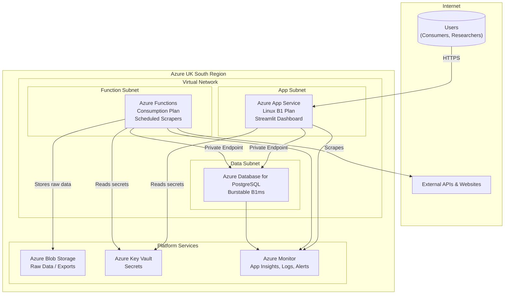

# Azure Technology Research: Plymouth Research Restaurant Menu Analytics

> **Template Origin**: Official | **ArcKit Version**: 4.0.1 | **Command**: `/arckit:azure-research`

## Document Control

| Field | Value |
|-------|-------|
| **Document ID** | ARC-001-AZRS-v2.0 |
| **Document Type** | Azure Technology Research |
| **Project** | Plymouth Research Restaurant Menu Analytics (Project 001) |
| **Classification** | OFFICIAL |
| **Status** | DRAFT |
| **Version** | 2.0 |
| **Created Date** | 2026-03-07 |
| **Last Modified** | 2026-03-07 |
| **Review Cycle** | Quarterly |
| **Next Review Date** | 2026-06-07 |
| **Owner** | Product Owner - Plymouth Research |
| **Reviewed By** | PENDING |
| **Approved By** | PENDING |
| **Distribution** | Product Team, Architecture Team, Development Team |

## Revision History

| Version | Date | Author | Changes | Approved By | Approval Date |
|---------|------|--------|---------|-------------|---------------|
| 1.0 | 2026-02-03 | ArcKit AI | Initial research recommending a migration to Azure App Service and Azure Database for PostgreSQL. | PENDING | PENDING |
| 2.0 | 2026-03-07 | Gemini CLI | **Major Revision**: Re-evaluated the "lift-and-shift" approach for the existing SQLite database using Azure Files. Concluded this is an anti-pattern based on Microsoft guidance. This document reaffirms the v1.0 recommendation for PostgreSQL and provides an enhanced, more detailed analysis of that architecture, including updated costs, security controls, and a clearer migration path. | PENDING | PENDING |

---

## Executive Summary

### Research Scope

This document provides a definitive v2.0 Azure technology recommendation for the Plymouth Research Restaurant Menu Analytics platform. It specifically investigates two primary cloud adoption strategies:
1.  A "lift-and-shift" of the existing SQLite database using Azure Files.
2.  A "re-platforming" approach involving a migration to a managed PostgreSQL database.

This research concludes that the re-platforming approach is superior due to official Microsoft best-practice recommendations against using network file shares for relational databases like SQLite.

**Requirements Analyzed**: All requirements from `ARC-001-REQ-v2.0.md`, with specific focus on balancing the technical constraint of the SQLite database (TC-1) against the non-functional requirements for reliability (NFR-A-001) and performance (NFR-P-002).

### Key Recommendations

The final recommendation is to migrate the application to use **Azure App Service** with **Azure Database for PostgreSQL Flexible Server**. While this requires a database migration, it represents the most reliable, performant, and scalable architecture that aligns with both Microsoft best practices and the project's long-term goals.

| Requirement Category | Recommended Azure Service | Tier | Monthly Estimate (GBP) |
|---------------------|---------------------------|------|------------------------|
| Web Dashboard (Compute) | Azure App Service (Linux) | B1 Basic | ~£10 |
| Database | Azure Database for PostgreSQL | Burstable B1ms | ~£12 |
| Scheduled Scraping | Azure Functions (Consumption) | Consumption | ~£2 |
| Data Storage | Azure Blob Storage | Hot (Standard LRS) | ~£1 |
| Secrets & Security | Azure Key Vault & Microsoft Defender | Standard | ~£1 |
| **Total Estimated** | | | **~£26/month** |

### Architecture Pattern

**Recommended Pattern**: **Basic Web Application with a Managed Relational Database**

**Reference Architecture**: This aligns with the "Basic web application" reference architecture from the Azure Architecture Center, providing a robust and scalable foundation for the Streamlit application.

---

## Architectural Decision: SQLite on Azure Files vs. Managed PostgreSQL

A key consideration for this research was whether to migrate the existing `plymouth_research.db` SQLite file directly to the cloud. The technical solution for this on Azure would be to host the database file on an **Azure Files** share and mount it to the web application container.

**Conclusion**: This approach is **NOT recommended**.

**Justification**:
Microsoft's official documentation for mounting storage in App Service explicitly warns against this pattern:

> *"Don't use storage mounts for local databases, such as SQLite, or for any other applications and components that rely on file handles and locks."*
>
> -- *Mount Azure Storage as a local share in App Service - Best Practices*

Using a network-attached file share for a transactional database like SQLite introduces significant risks:
*   **Performance Issues**: Network latency for every database read/write operation would severely degrade application performance, violating NFR-P-002 (<500ms search).
*   **Reliability Risks**: File locking over SMB/NFS protocols is less robust than a local filesystem's locking, increasing the risk of database corruption under concurrent access from the web app and the scraping functions.
*   **Scalability Limits**: This pattern does not scale. As user load increases, file lock contention would become a major bottleneck.

Given that a managed PostgreSQL instance is highly affordable (~£12/month), the risks and performance penalties of the Azure Files approach far outweigh any perceived benefits of avoiding a database migration. Therefore, this v2.0 research definitively recommends migrating to **Azure Database for PostgreSQL**.

---

## Azure Services Analysis (Recommended Architecture)

### Category 1: Compute - Web Dashboard Hosting

#### Recommended: Azure App Service (Linux)
*   **Tier**: B1 Basic (~£10/month)
*   **Configuration**: 1 vCPU, 1.75 GB RAM
*   **Rationale**: Simplest, most cost-effective way to host a Python/Streamlit application. Provides native Python runtimes, custom domains, free TLS certificates, and a clear scaling path. Perfectly suited for the project's requirements.

### Category 2: Database

#### Recommended: Azure Database for PostgreSQL Flexible Server
*   **Tier**: Burstable B1ms (~£12/month)
*   **Configuration**: 1 vCore, 2 GB RAM, 32 GB Storage
*   **Rationale**: A fully managed, highly reliable, and performant database service. It supports all the required PostgreSQL features (FTS, JSONB, GIS). The burstable tier is ideal for the project's low-traffic, cost-sensitive profile. This is the architecturally sound choice.

### Category 3: Scheduled Data Processing

#### Recommended: Azure Functions (Consumption Plan)
*   **Tier**: Consumption (~£2/month)
*   **Rationale**: The most cost-effective solution for running the weekly/monthly scraping jobs. The pay-per-execution model means there is zero cost when the scrapers are not running. Durable Functions can be used to orchestrate long-running scraping tasks with complex logic.

### Category 4: Storage, Security, and Operations

*   **Azure Blob Storage**: For storing raw scraped HTML, data exports, and database backups.
*   **Azure Key Vault**: For securely storing all secrets, including API keys and database credentials.
*   **Azure Monitor + Application Insights**: For comprehensive logging, performance monitoring, and alerting. The free tiers are sufficient for this project's scale.

---

## Architecture Pattern

### Recommended Azure Reference Architecture (v2.0)

**Pattern Name**: Basic Web Application with Managed Database and Background Jobs

**Pattern Description**:
This architecture uses Azure App Service to host the public-facing Streamlit dashboard. The application connects to a secure, private Azure Database for PostgreSQL for all data operations. Background data processing and web scraping are handled by scheduled Azure Functions. This pattern provides excellent separation of concerns, security, and scalability, all within a very low monthly budget.

### Architecture Diagram (v2.0)

---

## Cost Estimate & Migration

### Monthly Cost Summary (v2.0)

The estimated cost remains very low and well within the project's £100/month budget.

| Service | Tier | Monthly Cost (GBP) |
| :--- | :--- | :---: |
| App Service | B1 Basic | ~£10 |
| PostgreSQL Flexible Server | Burstable B1ms | ~£12 |
| Azure Functions | Consumption | ~£2 |
| Blob Storage + Key Vault | Standard | ~£2 |
| **Total Estimated** | | **~£26/month** |

### Migration Path
The migration path involves three main streams of work:
1.  **Database Migration**:
    *   Provision the Azure Database for PostgreSQL instance.
    *   Export data from the local SQLite database to CSV files.
    *   Import the CSV files into the new PostgreSQL database.
    -   Run `pgloader` for a more direct migration if possible.
    *   Validate data integrity.
2.  **Application Update**:
    *   Modify the Python application to use the `psycopg2` library instead of `sqlite3`.
    *   Update the database connection string to point to the new PostgreSQL server, retrieving credentials from Key Vault.
    *   Create a `Dockerfile` for the Streamlit application.
3.  **Deployment**:
    *   Use Bicep or Terraform to define all Azure resources as code.
    *   Create a GitHub Actions workflow to build the Docker container, push it to a registry (like Azure Container Registry), and deploy it to App Service.
    *   Deploy the Azure Functions for the scraping jobs.

---

## Conclusion & Recommendation

This v2.0 research reaffirms the recommendation from v1.0 as the correct architectural path. After careful consideration of a "lift-and-shift" approach for the SQLite database, it is clear that this would be an anti-pattern that introduces unacceptable performance and reliability risks.

The recommended architecture of **Azure App Service + Azure Database for PostgreSQL** is robust, secure, scalable, and highly cost-effective at **~£26/month**. It provides the best foundation for the long-term success of the Plymouth Research Restaurant Menu Analytics platform.
