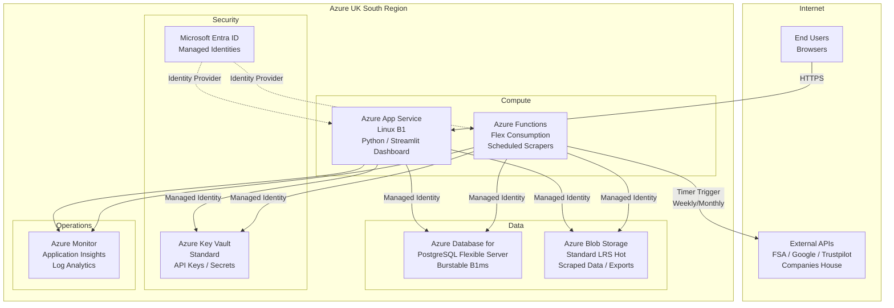

# Azure Technology Research: Plymouth Research Restaurant Menu Analytics

> **Template Status**: Experimental | **Version**: 1.0.0 | **Command**: `/arckit.azure-research`

## Document Control

| Field | Value |
|-------|-------|
| **Document ID** | ARC-001-AZRS-v1.0 |
| **Document Type** | Azure Technology Research |
| **Project** | Plymouth Research Restaurant Menu Analytics (Project 001) |
| **Classification** | PUBLIC |
| **Status** | DRAFT |
| **Version** | 1.0 |
| **Created Date** | 2026-02-03 |
| **Last Modified** | 2026-02-03 |
| **Review Cycle** | Quarterly |
| **Next Review Date** | 2026-05-03 |
| **Owner** | Product Owner - Plymouth Research |
| **Reviewed By** | PENDING |
| **Approved By** | PENDING |
| **Distribution** | Product Team, Architecture Team, Development Team |

## Revision History

| Version | Date | Author | Changes | Approved By | Approval Date |
|---------|------|--------|---------|-------------|---------------|
| 1.0 | 2026-02-03 | AI Agent | Initial creation from `/arckit.azure-research` agent | PENDING | PENDING |

---

## Executive Summary

### Research Scope

This document presents Azure-specific technology research findings for the Plymouth Research Restaurant Menu Analytics platform. The platform is a Python/Streamlit application that scrapes restaurant websites, aggregates data from public APIs (FSA, Google Places, Trustpilot, Companies House), and presents insights through an interactive dashboard. It currently uses SQLite and is deployed locally or on Streamlit Cloud.

**Requirements Analyzed**: 10 functional, 12 non-functional, 6 integration, 3 data requirements

**Azure Services Evaluated**: 8 Azure services across 5 categories

**Research Sources**: Microsoft Learn, Azure Architecture Center, Azure Well-Architected Framework, Azure Security Benchmark v3, Microsoft Learn MCP Server

### Key Recommendations

| Requirement Category | Recommended Azure Service | Tier | Monthly Estimate |
|---------------------|---------------------------|------|------------------|
| Web Dashboard (Compute) | Azure App Service (Linux) | B1 Basic | ~GBP 10 |
| Database | Azure Database for PostgreSQL Flexible Server | Burstable B1ms | ~GBP 12 |
| Scheduled Scraping | Azure Functions (Flex Consumption) | Consumption | ~GBP 2 |
| File/Data Storage | Azure Blob Storage | Hot (Standard LRS) | ~GBP 1 |
| Secrets Management | Azure Key Vault | Standard | ~GBP 0.50 |
| Monitoring | Azure Monitor + Application Insights | Free tier | ~GBP 0 |
| Identity | Microsoft Entra ID (Free) | Free | ~GBP 0 |
| DNS/CDN | Azure Front Door (optional) | Standard | ~GBP 5 (optional) |
| **Total** | | | **~GBP 26-31/month** |

### Architecture Pattern

**Recommended Pattern**: Basic Web Application with Scheduled Background Jobs

**Reference Architecture**: [Basic web application - Azure Architecture Center](https://learn.microsoft.com/en-us/azure/architecture/web-apps/app-service/architectures/basic-web-app)

This pattern is appropriate because the Plymouth Research platform is a small-scale, cost-sensitive web application with batch data processing needs. It does not require microservices, container orchestration, or complex event-driven architectures at current scale.

### UK Government Suitability

| Criteria | Status | Notes |
|----------|--------|-------|
| **UK Region Availability** | Available | Primary: UK South, DR: UK West |
| **G-Cloud Listing** | Available | Azure listed on G-Cloud Digital Marketplace |
| **Data Classification** | PUBLIC | No PII processed; public business data only |
| **NCSC Cloud Security Principles** | 14/14 principles met | Microsoft attestation available |
| **UK GDPR** | Compliant | Data residency in UK South/West; DPA available |

Note: This project is classified as PUBLIC (not a UK Government project). All data processed is publicly available business information. UK region availability is still recommended for data residency best practice and latency optimization for Plymouth-based users.

---

## Azure Services Analysis

### Category 1: Compute - Web Dashboard Hosting

**Requirements Addressed**: FR-001, FR-002, FR-003, FR-004, FR-005, FR-006, FR-007, FR-009, NFR-P-001, NFR-P-002, NFR-S-002, NFR-A-001, BR-007

**Why This Category**: The platform requires a public-facing web dashboard (Streamlit) accessible via browser. The dashboard must load in under 2 seconds (p95), support 100 concurrent users, and achieve 99% uptime. A managed compute service is needed to host the Python/Streamlit application.

---

#### Recommended: Azure App Service (Linux)

**Service Overview**:
- **Full Name**: Azure App Service (Linux)
- **Category**: Compute / Web Hosting
- **Documentation**: https://learn.microsoft.com/en-us/azure/app-service/

**Key Features**:
- **Built-in Python Support**: Native Python 3.9-3.14 runtime on Linux with zero-configuration deployment
- **Streamlit Compatibility**: Demonstrated via AZD templates (Simple Streamlit AZD Template); deploy Streamlit apps using `az webapp up` with custom startup command
- **Auto-scaling**: Standard tier and above supports rule-based autoscaling; Premium tiers support automatic scaling
- **Deployment Slots**: Blue-green deployments for zero-downtime updates (Standard tier and above)
- **Integrated Monitoring**: Built-in Application Insights integration for Python with autoinstrumentation
- **Custom Domains / TLS**: Free managed TLS certificates (Basic tier and above)

**Pricing Tiers**:

| Tier | Monthly Cost (UK South) | Features | Use Case |
|------|------------------------|----------|----------|
| Free (F1) | GBP 0 | 1 GB RAM, 60 min/day CPU, shared | Dev only |
| Basic (B1) | ~GBP 10 | 1.75 GB RAM, 1 core, custom domain, TLS | Small production |
| Standard (S1) | ~GBP 55 | 1.75 GB RAM, autoscale, slots, backups | Production with scaling |
| Premium V3 (P1v3) | ~GBP 80 | 8 GB RAM, 2 cores, enhanced performance | High-traffic production |

**Estimated Cost for This Project**:

| Resource | Configuration | Monthly Cost | Notes |
|----------|---------------|--------------|-------|
| App Service Plan | B1 Linux (1 core, 1.75 GB) | ~GBP 10 | Sufficient for 100 concurrent users with Streamlit |
| Custom Domain | Included in B1 | GBP 0 | Custom domain support included |
| TLS Certificate | App Service Managed Certificate | GBP 0 | Free managed certificate |
| **Total** | | **~GBP 10** | |

**Azure Well-Architected Assessment**:

| Pillar | Rating | Notes |
|--------|--------|-------|
| **Reliability** | 4/5 | 99.95% SLA on Basic+; no zone redundancy on Basic tier |
| **Security** | 4/5 | HTTPS enforced, managed identity support, App Service Environment for isolation (higher tiers) |
| **Cost Optimization** | 5/5 | B1 at ~GBP 10/month well within GBP 100 budget; can scale to Free for dev |
| **Operational Excellence** | 5/5 | Built-in CI/CD, deployment slots, Application Insights integration |
| **Performance Efficiency** | 4/5 | Adequate for 100 concurrent users; upgrade to S1/P1v3 if needed |

**Azure Security Benchmark Alignment**:

| Control | Status | Implementation |
|---------|--------|----------------|
| NS-1: Network Security | Supported | VNet integration available (Standard+); IP restrictions |
| IM-1: Identity Management | Supported | Managed Identity for Azure resource access |
| DP-1: Data Protection | Supported | HTTPS enforced, TLS 1.2 minimum |
| LT-1: Logging and Threat Detection | Supported | Application Insights, diagnostic logs |

**Integration Capabilities**:
- **SDKs**: Python Azure SDK for all Azure service integration
- **Managed Identity**: System-assigned identity for Key Vault, PostgreSQL, Blob Storage access
- **Deployment**: GitHub Actions, Azure DevOps, ZIP deploy, `az webapp up`

**UK Region Availability**:
- UK South: Available
- UK West: Available

**Compliance Certifications**:
- ISO 27001, 27017, 27018
- SOC 1, 2, 3
- UK Cyber Essentials Plus
- UK G-Cloud
- GDPR compliant

---

#### Alternative: Azure Container Apps

Azure Container Apps would provide a containerized deployment option with built-in scaling via KEDA. However, for this project's small scale and budget constraints, App Service offers simpler deployment, lower operational overhead, and native Python support without requiring Docker containerization. Container Apps would be more suitable if the project scales to microservices architecture.

#### Comparison Matrix

| Criteria | App Service (B1) | Container Apps (Consumption) | Winner |
|----------|-----------------|------------------------------|--------|
| Cost (monthly) | ~GBP 10 | ~GBP 5-15 (variable) | Tie |
| Deployment Simplicity | Very Simple (ZIP deploy) | Requires Dockerfile | App Service |
| Python Native Support | Yes | Via container only | App Service |
| Auto-scaling | Standard tier+ | Built-in (KEDA) | Container Apps |
| UK Availability | UK South, UK West | UK South, UK West | Tie |

**Recommendation**: Azure App Service (B1 Linux) - simplest deployment path for a Python/Streamlit application at this scale, with clear upgrade path to Standard/Premium tiers as traffic grows.

---

### Category 2: Database

**Requirements Addressed**: NFR-P-002, NFR-S-001, NFR-Q-001, NFR-Q-002, NFR-Q-003, FR-001, FR-002, FR-005, FR-006, FR-007, FR-008, BR-001, BR-002, BR-005

**Why This Category**: The platform requires a relational database to store 243+ restaurants (52 columns), 2,625+ menu items, 9,410+ reviews, and hygiene ratings. The data model (ARC-001-DATA-v1.0) specifies PostgreSQL 15+ with full-text search, JSONB support, and GIS extensions. The system must scale to 10x (1,500 restaurants, 100,000 menu items) and support sub-500ms query performance.

---

#### Recommended: Azure Database for PostgreSQL Flexible Server

**Service Overview**:
- **Full Name**: Azure Database for PostgreSQL Flexible Server
- **Category**: Database / Relational
- **Documentation**: https://learn.microsoft.com/en-us/azure/postgresql/

**Key Features**:
- **PostgreSQL Compatibility**: Supports PostgreSQL 11-17; full compatibility with existing data model
- **Full-Text Search**: Native PostgreSQL FTS5 equivalent (tsvector/tsquery) for menu item search
- **JSONB Support**: Native JSONB for flexible schema extension
- **Built-in Connection Pooling**: PgBouncer integration for efficient connection management
- **High Availability**: Zone-redundant HA within same availability zone or across zones
- **Flexible Compute**: Stop/start capability for cost savings during development
- **Backup**: Automated backups with 7-35 day retention; geo-redundant backup option

**Pricing Tiers**:

| Tier | Monthly Cost (UK South) | vCores / RAM | Use Case |
|------|------------------------|--------------|----------|
| Burstable B1ms | ~GBP 12 | 1 vCore, 2 GB RAM | Dev/small production |
| Burstable B2s | ~GBP 24 | 2 vCores, 4 GB RAM | Small-medium production |
| General Purpose D2ds_v4 | ~GBP 95 | 2 vCores, 8 GB RAM | Production workloads |
| Memory Optimized E2ds_v4 | ~GBP 115 | 2 vCores, 16 GB RAM | Memory-intensive analytics |

**Estimated Cost for This Project**:

| Resource | Configuration | Monthly Cost | Notes |
|----------|---------------|--------------|-------|
| Flexible Server | Burstable B1ms (1 vCore, 2 GB) | ~GBP 12 | Sufficient for current 20 MB database |
| Storage | 32 GB Premium SSD | Included | Ample for 10x growth (200 MB) |
| Backup | 7-day retention, LRS | Included | Default backup |
| **Total** | | **~GBP 12** | |

**Azure Well-Architected Assessment**:

| Pillar | Rating | Notes |
|--------|--------|-------|
| **Reliability** | 4/5 | 99.9% SLA (single zone); 99.99% with zone-redundant HA |
| **Security** | 5/5 | Encryption at rest (AES-256), TLS in transit, Entra ID auth, private endpoints |
| **Cost Optimization** | 5/5 | Burstable B1ms at ~GBP 12/month; stop/start for dev savings |
| **Operational Excellence** | 5/5 | Automated backups, monitoring, configurable maintenance windows |
| **Performance Efficiency** | 4/5 | Adequate for current scale; upgrade to General Purpose for 10x scale |

**Migration Path from SQLite**:
1. Export SQLite data using Python scripts (pandas `to_sql`)
2. Create PostgreSQL schema from existing `add_*.sql` migration files
3. Use `psycopg2` or `asyncpg` for application connection
4. Update Streamlit `data_loader.py` to use PostgreSQL connection string
5. Create full-text search indexes (GIN indexes on `tsvector` columns)

**UK Region Availability**:
- UK South: Available
- UK West: Available

---

### Category 3: Scheduled Data Processing

**Requirements Addressed**: NFR-P-003, BR-006, FR-005 (weekly FSA refresh), FR-006 (weekly Trustpilot refresh), FR-007 (monthly Google Places refresh)

**Why This Category**: The platform requires automated weekly/monthly data refresh pipelines for web scraping, FSA data fetching, Trustpilot review scraping, and Google Places API calls. These are batch jobs that run on schedules with rate limiting.

---

#### Recommended: Azure Functions (Flex Consumption Plan)

**Service Overview**:
- **Full Name**: Azure Functions
- **Category**: Compute / Serverless
- **Documentation**: https://learn.microsoft.com/en-us/azure/azure-functions/

**Key Features**:
- **Timer Trigger**: CRON-based scheduling for weekly/monthly data refresh jobs
- **Python Support**: Native Python 3.9-3.12 runtime
- **Flex Consumption Plan**: Pay-per-execution with automatic scaling; ideal for batch jobs
- **Durable Functions**: Orchestrate long-running scraping pipelines with retries and monitoring
- **Integration**: Native bindings for Blob Storage, PostgreSQL, Queue Storage

**Estimated Cost for This Project**:

| Resource | Configuration | Monthly Cost | Notes |
|----------|---------------|--------------|-------|
| Azure Functions | Flex Consumption | ~GBP 2 | ~4 weekly runs x 24hr max execution |
| Storage Account | For function state | ~GBP 0.50 | Minimal storage for function app |
| **Total** | | **~GBP 2.50** | |

**Scheduled Jobs Design**:

| Job | Schedule | Estimated Duration | Function |
|-----|----------|-------------------|----------|
| Menu Scraper | Weekly (Sunday 2am) | 10-24 hours | Timer-triggered Durable Function with rate limiting |
| FSA Hygiene Matcher | Monthly (1st of month) | 1-2 hours | Timer-triggered Function |
| Trustpilot Scraper | Weekly (Monday 2am) | 5-10 hours | Timer-triggered Durable Function |
| Google Places Refresh | Monthly (15th of month) | 1-2 hours | Timer-triggered Function |

**Azure Well-Architected Assessment**:

| Pillar | Rating | Notes |
|--------|--------|-------|
| **Reliability** | 4/5 | Automatic retries, dead-letter queues, durable state |
| **Security** | 4/5 | Managed identity for secret-free database/storage access |
| **Cost Optimization** | 5/5 | Pay only for execution time; zero cost when idle |
| **Operational Excellence** | 4/5 | Built-in monitoring via Application Insights |
| **Performance Efficiency** | 4/5 | Auto-scales for parallel scraping workers |

**UK Region Availability**:
- UK South: Available
- UK West: Available

---

### Category 4: Storage

**Requirements Addressed**: NFR-SEC-001 (data encryption), FR-009 (data export), NFR-Q-003 (data freshness tracking)

**Why This Category**: The platform needs storage for scraped HTML snapshots, data exports (CSV), FSA XML data files, and backup copies of the SQLite database during migration.

---

#### Recommended: Azure Blob Storage

**Service Overview**:
- **Full Name**: Azure Blob Storage
- **Category**: Storage / Object Storage
- **Documentation**: https://learn.microsoft.com/en-us/azure/storage/blobs/

**Key Features**:
- **Access Tiers**: Hot (frequently accessed), Cool (infrequently accessed, 30-day minimum), Cold (90-day minimum), Archive (180-day minimum)
- **Encryption**: AES-256 encryption at rest by default; customer-managed keys available
- **Redundancy**: LRS, ZRS, GRS, RA-GRS options
- **Lifecycle Management**: Automatic tier transitions based on age policies

**Estimated Cost for This Project**:

| Resource | Configuration | Monthly Cost | Notes |
|----------|---------------|--------------|-------|
| Blob Storage | Standard LRS, Hot tier | ~GBP 1 | ~5 GB for scraped data, exports, XML files |
| **Total** | | **~GBP 1** | |

**UK Region Availability**:
- UK South: Available
- UK West: Available (GRS replication target)

---

### Category 5: Security

**Requirements Addressed**: NFR-SEC-001, NFR-SEC-002, NFR-SEC-003, NFR-C-002, BR-004

**Why This Category**: The platform must encrypt data at rest and in transit, securely store API keys (Google Places API, Trustpilot), and comply with UK GDPR.

---

#### Recommended: Azure Key Vault + Microsoft Entra ID

**Azure Key Vault**:
- Store API keys (Google Places, Companies House), database connection strings, and scraping credentials
- Standard tier: ~GBP 0.50/month for ~20 secrets
- Software-protected keys (FIPS 140 validated HSMs available for Premium)
- Secret rotation automation via Event Grid integration
- Access control via RBAC and managed identities (no credentials in code)

**Microsoft Entra ID (Free)**:
- Managed identities for App Service and Functions to access Key Vault, PostgreSQL, and Blob Storage
- No credential management required in application code
- Free tier sufficient for this project (no user authentication required for public dashboard)

**Estimated Cost**:

| Resource | Configuration | Monthly Cost | Notes |
|----------|---------------|--------------|-------|
| Key Vault | Standard, ~20 secrets | ~GBP 0.50 | GBP 0.024 per 10,000 operations |
| Entra ID | Free tier | GBP 0 | Managed identities included |
| **Total** | | **~GBP 0.50** | |

---

### Category 6: Monitoring and Operations

**Requirements Addressed**: NFR-P-001, NFR-P-002, NFR-A-001, NFR-A-002, NFR-Q-001

**Why This Category**: The platform requires performance monitoring (page load times, query response times), uptime monitoring, and data quality metrics tracking.

---

#### Recommended: Azure Monitor + Application Insights

**Key Features**:
- **Application Insights for Python**: Autoinstrumentation on App Service (Linux); collects request/response metrics, dependencies, exceptions
- **Log Analytics**: Centralized log storage and KQL querying
- **Alerts**: Configure alerts for page load >3s (p95), query times >500ms, uptime drops
- **Dashboards**: Custom Azure dashboards for data quality metrics

**Estimated Cost**:

| Resource | Configuration | Monthly Cost | Notes |
|----------|---------------|--------------|-------|
| Application Insights | Free tier (5 GB/month) | GBP 0 | Sufficient for low-traffic application |
| Log Analytics | Free tier (500 MB/day) | GBP 0 | Sufficient for logging |
| **Total** | | **~GBP 0** | |

---

## Architecture Pattern

### Recommended Azure Reference Architecture

**Pattern Name**: Basic Web Application with Scheduled Background Processing

**Azure Architecture Center Reference**: https://learn.microsoft.com/en-us/azure/architecture/web-apps/app-service/architectures/basic-web-app

**Pattern Description**:

This architecture deploys a basic web application on Azure App Service with a managed PostgreSQL database and serverless background processing via Azure Functions. It is designed for small-scale, cost-sensitive applications that need a public-facing web dashboard with periodic batch data processing.

The pattern is appropriate for Plymouth Research because: (1) the application is a single monolithic Python/Streamlit app that does not require microservices decomposition; (2) the budget constraint (GBP 100/month) requires cost-efficient managed services; (3) the data processing is batch-oriented (weekly/monthly scraping) rather than real-time event-driven; (4) the expected user load (100 concurrent users) is well within single-instance capacity.

The architecture separates concerns into three layers: the presentation layer (App Service hosting Streamlit), the data layer (PostgreSQL Flexible Server with Blob Storage), and the processing layer (Azure Functions for scheduled scraping jobs). All services communicate via managed identities and private networking where budget allows.

### Architecture Diagram



### Component Mapping

| Component | Azure Service | Purpose | Tier |
|-----------|---------------|---------|------|
| Web Dashboard | App Service (Linux) | Host Streamlit dashboard | B1 Basic |
| Database | PostgreSQL Flexible Server | Restaurant, menu, review data | Burstable B1ms |
| Scheduled Jobs | Azure Functions | Web scraping, data refresh | Flex Consumption |
| File Storage | Blob Storage | Scraped HTML, CSV exports, XML data | Standard LRS Hot |
| Secrets | Key Vault | API keys, connection strings | Standard |
| Identity | Microsoft Entra ID | Managed identities for all services | Free |
| Monitoring | Azure Monitor + App Insights | Performance, availability, logging | Free tier |

---

## Security and Compliance

### Azure Security Benchmark Mapping

| ASB Control Domain | Controls Implemented | Azure Services |
|-------------------|---------------------|----------------|
| **Network Security (NS)** | NS-1, NS-2 | App Service IP restrictions, PostgreSQL firewall rules, TLS 1.2 enforcement |
| **Identity Management (IM)** | IM-1, IM-3 | Entra ID, system-assigned managed identities for all services |
| **Privileged Access (PA)** | PA-1, PA-7 | RBAC on Azure resources, Key Vault access policies |
| **Data Protection (DP)** | DP-1, DP-2, DP-3 | AES-256 encryption at rest (PostgreSQL, Blob Storage), TLS 1.2 in transit, Key Vault for secrets |
| **Asset Management (AM)** | AM-1, AM-2 | Resource tagging, Azure Resource Graph for inventory |
| **Logging and Threat Detection (LT)** | LT-1, LT-2, LT-4 | Application Insights, Log Analytics, diagnostic settings on all services |
| **Incident Response (IR)** | IR-1, IR-2 | Azure Monitor alerts, action groups for notification |
| **Posture and Vulnerability (PV)** | PV-1, PV-6 | Microsoft Defender for Cloud (free tier), dependency scanning in CI/CD |
| **Endpoint Security (ES)** | ES-1 | Not applicable (PaaS services, no VMs) |
| **Backup and Recovery (BR)** | BR-1, BR-2 | PostgreSQL automated backups (7-day retention), Blob Storage versioning |
| **DevOps Security (DS)** | DS-1, DS-6 | GitHub Actions with secret scanning, pip-audit for dependency vulnerabilities |
| **Governance and Strategy (GS)** | GS-1, GS-2 | Azure Policy for resource compliance, resource locks on production resources |

### UK Compliance Alignment

| Framework | Alignment | Notes |
|-----------|-----------|-------|
| **NCSC Cloud Security Principles** | 14/14 | Microsoft Azure has full attestation for all 14 NCSC principles |
| **Cyber Essentials Plus** | Certified | Azure controls map to CE+ requirements |
| **UK GDPR** | Compliant | No PII processed; public business data only; UK data residency |
| **Data Classification** | PUBLIC | All data is publicly available restaurant business information |
| **Computer Misuse Act 1990** | Compliant | Ethical scraping: robots.txt compliance, rate limiting, honest User-Agent |

### Microsoft Defender for Cloud

**Recommendations**:
- Enable Defender for Cloud free tier on subscription
- Enable enhanced security for App Service (optional, ~GBP 12/month)
- Configure Security Policy aligned to Azure Security Benchmark
- Review Secure Score recommendations monthly

---

## Implementation Guidance

### Infrastructure as Code

**Recommended Approach**: Bicep (Azure-native IaC)

#### Bicep Example

```bicep
// main.bicep - Plymouth Research Infrastructure
targetScope = 'resourceGroup'

param location string = 'uksouth'
param environment string = 'prod'

// App Service Plan
resource appServicePlan 'Microsoft.Web/serverfarms@2023-12-01' = {
  name: 'plan-plymouth-research-${environment}'
  location: location
  kind: 'linux'
  sku: {
    name: 'B1'
  }
  properties: {
    reserved: true
  }
}

// App Service (Streamlit Dashboard)
resource appService 'Microsoft.Web/sites@2023-12-01' = {
  name: 'app-plymouth-research-${environment}'
  location: location
  kind: 'app,linux'
  properties: {
    serverFarmId: appServicePlan.id
    httpsOnly: true
    siteConfig: {
      linuxFxVersion: 'PYTHON|3.11'
      alwaysOn: true
      ftpsState: 'Disabled'
      minTlsVersion: '1.2'
      appCommandLine: 'streamlit run dashboard_app.py --server.port 8000 --server.address 0.0.0.0'
    }
  }
  identity: {
    type: 'SystemAssigned'
  }
}

// PostgreSQL Flexible Server
resource postgresServer 'Microsoft.DBforPostgreSQL/flexibleServers@2023-06-01-preview' = {
  name: 'psql-plymouth-research-${environment}'
  location: location
  sku: {
    name: 'Standard_B1ms'
    tier: 'Burstable'
  }
  properties: {
    version: '16'
    storage: {
      storageSizeGB: 32
    }
    backup: {
      backupRetentionDays: 7
      geoRedundantBackup: 'Disabled'
    }
    highAvailability: {
      mode: 'Disabled'
    }
  }
}

// Key Vault
resource keyVault 'Microsoft.KeyVault/vaults@2023-07-01' = {
  name: 'kv-plymouth-${environment}'
  location: location
  properties: {
    sku: {
      family: 'A'
      name: 'standard'
    }
    tenantId: subscription().tenantId
    enableRbacAuthorization: true
    enabledForTemplateDeployment: true
  }
}

// Storage Account (Blob Storage)
resource storageAccount 'Microsoft.Storage/storageAccounts@2023-05-01' = {
  name: 'stplymouthres${environment}'
  location: location
  sku: {
    name: 'Standard_LRS'
  }
  kind: 'StorageV2'
  properties: {
    accessTier: 'Hot'
    allowBlobPublicAccess: false
    minimumTlsVersion: 'TLS1_2'
    supportsHttpsTrafficOnly: true
  }
}
```

### GitHub Actions Pipeline

```yaml
# .github/workflows/deploy.yml
name: Deploy Plymouth Research to Azure

on:
  push:
    branches: [main]

env:
  AZURE_WEBAPP_NAME: app-plymouth-research-prod
  PYTHON_VERSION: '3.11'

jobs:
  build-and-deploy:
    runs-on: ubuntu-latest
    steps:
      - uses: actions/checkout@v4

      - name: Set up Python
        uses: actions/setup-python@v4
        with:
          python-version: ${{ env.PYTHON_VERSION }}

      - name: Install dependencies
        run: |
          python -m pip install --upgrade pip
          pip install -r requirements.txt

      - name: Security scan (pip-audit)
        run: |
          pip install pip-audit
          pip-audit

      - uses: azure/login@v2
        with:
          creds: ${{ secrets.AZURE_CREDENTIALS }}

      - uses: azure/webapps-deploy@v3
        with:
          app-name: ${{ env.AZURE_WEBAPP_NAME }}
          package: .
```

### Code Samples

**Official Microsoft Samples**:

| Sample | Description | Link |
|--------|-------------|------|
| Simple Streamlit AZD Template | Streamlit on App Service (F1/B1) | https://github.com/MiguelElGallo/simple-streamlit-azd |
| Python Flask + PostgreSQL | App Service + PostgreSQL Flexible Server | https://learn.microsoft.com/en-us/azure/app-service/tutorial-python-postgresql-app |
| Azure Functions Python Timer | Timer-triggered scheduled tasks | https://learn.microsoft.com/en-us/azure/azure-functions/scenario-scheduled-tasks |

---

## Cost Estimate

### Monthly Cost Summary

| Category | Azure Service | Configuration | Monthly Cost (GBP) |
|----------|---------------|---------------|-------------------|
| Compute (Dashboard) | App Service | B1 Linux, 1 core, 1.75 GB | ~10 |
| Database | PostgreSQL Flexible Server | Burstable B1ms, 32 GB storage | ~12 |
| Compute (Scraping) | Azure Functions | Flex Consumption, ~4 weekly runs | ~2.50 |
| Storage | Blob Storage | Standard LRS Hot, ~5 GB | ~1 |
| Security | Key Vault | Standard, ~20 secrets | ~0.50 |
| Monitoring | Azure Monitor + App Insights | Free tier (5 GB/month) | ~0 |
| Identity | Microsoft Entra ID | Free tier | ~0 |
| **Total** | | | **~GBP 26** |

### 3-Year TCO

| Year | Monthly | Annual | Cumulative | Notes |
|------|---------|--------|------------|-------|
| Year 1 | GBP 26 | GBP 312 | GBP 312 | Setup + operation |
| Year 2 | GBP 26 | GBP 312 | GBP 624 | Stable operation |
| Year 3 | GBP 26 | GBP 312 | GBP 936 | Stable operation |
| **Total** | | | **GBP 936** | 3-year TCO |

### Cost Optimization Recommendations

1. **Reserved Instances (1-year)**: Save ~30% on App Service and PostgreSQL by committing to 1-year reservations (~GBP 18/month instead of GBP 22)
2. **Stop/Start PostgreSQL**: Stop the database during non-business hours if not serving traffic (saves ~40% for dev/test environments)
3. **Azure Functions Consumption**: Flex Consumption plan charges only for execution time; zero cost when scrapers are not running
4. **Free Tier Maximization**: Application Insights free tier (5 GB/month) and Log Analytics free tier (500 MB/day) sufficient for this scale
5. **Blob Storage Lifecycle**: Move scraped HTML archives to Cool tier after 30 days to reduce storage costs
6. **Right-sizing**: Start with B1 App Service and B1ms PostgreSQL; monitor performance and upgrade only if needed

**Estimated Savings with Optimizations**: ~GBP 4/month (15% reduction) with 1-year reservations

### Budget Compliance

The total estimated monthly cost of **GBP 26** is well within the BR-003 requirement of **GBP 100/month** maximum, leaving GBP 74/month headroom for:
- Geographic expansion (additional scraping compute)
- Upgrade to Standard App Service tier for autoscaling
- Zone-redundant PostgreSQL for higher availability
- Azure Front Door CDN for improved global performance

---

## UK Government Considerations

### G-Cloud Procurement

**Azure on G-Cloud**:
- **Framework**: Digital Marketplace (G-Cloud)
- **Supplier**: Microsoft Limited
- **Services**: Azure IaaS, PaaS, and SaaS services listed

**Note**: This project is not a UK Government project. G-Cloud procurement is not required but is available if the platform expands to serve public sector customers.

### Data Residency

| Data Type | Storage Location | Replication | Notes |
|-----------|------------------|-------------|-------|
| Restaurant Data | UK South (PostgreSQL) | Within UK (LRS) | No cross-border transfer |
| Scraped HTML | UK South (Blob Storage) | Within UK (LRS) | Retained for audit trail |
| Application Logs | UK South (Log Analytics) | Within UK | 30-day retention |
| Secrets/Keys | UK South (Key Vault) | Within UK (LRS) | API keys, connection strings |

All data remains within UK boundaries. No geo-redundant replication configured by default (LRS only) to ensure UK data residency. GRS replication to UK West can be enabled for DR without leaving UK geography.

### NCSC Cloud Security Principles

Microsoft Azure meets all 14 NCSC Cloud Security Principles:
1. Data in transit protection (TLS 1.2+)
2. Asset protection and resilience (UK South/West datacenters)
3. Separation between customers (multi-tenant isolation)
4. Governance framework (Azure Policy, RBAC)
5. Operational security (Microsoft security operations)
6. Personnel security (Microsoft employee vetting)
7. Secure development (Microsoft SDL)
8. Supply chain security (Microsoft vendor management)
9. Secure user management (Entra ID, MFA)
10. Identity and authentication (Entra ID, managed identities)
11. External interface protection (NSGs, firewalls, WAF)
12. Secure service administration (PIM, JIT access)
13. Audit information provision (Azure Monitor, Activity Log)
14. Secure use of the service (customer responsibility with Azure guidance)

---

## References

### Microsoft Learn Documentation

| Topic | Link |
|-------|------|
| Azure App Service Python Quickstart | https://learn.microsoft.com/en-us/azure/app-service/quickstart-python |
| Hosting Python Apps on Azure | https://learn.microsoft.com/en-us/azure/developer/python/quickstarts-app-hosting |
| Azure Database for PostgreSQL Overview | https://learn.microsoft.com/en-us/azure/postgresql/overview |
| PostgreSQL Flexible Server Quickstart | https://learn.microsoft.com/en-us/azure/postgresql/configure-maintain/quickstart-create-server |
| Azure Functions Timer Trigger (Python) | https://learn.microsoft.com/en-us/azure/azure-functions/scenario-scheduled-tasks |
| Azure Key Vault Secrets | https://learn.microsoft.com/en-us/azure/key-vault/secrets/about-secrets |
| Azure Blob Storage Access Tiers | https://learn.microsoft.com/en-us/azure/storage/blobs/access-tiers-overview |
| Application Insights for Python | https://learn.microsoft.com/en-us/azure/azure-monitor/app/codeless-app-service |
| Azure Well-Architected Framework | https://learn.microsoft.com/en-us/azure/well-architected/ |
| Azure Security Benchmark v3 | https://learn.microsoft.com/en-us/security/benchmark/azure/overview-v3 |
| UK G-Cloud Compliance | https://learn.microsoft.com/en-us/azure/compliance/offerings/offering-uk-g-cloud |
| Azure UK Regions Data Residency | https://learn.microsoft.com/en-us/azure/azure-government/documentation-government-overview-wwps |
| App Service Pricing | https://azure.microsoft.com/pricing/details/app-service/linux/ |

### Azure Architecture Center References

| Reference Architecture | Link |
|------------------------|------|
| Basic Web Application | https://learn.microsoft.com/en-us/azure/architecture/web-apps/app-service/architectures/basic-web-app |
| Web-Queue-Worker Architecture | https://learn.microsoft.com/en-us/azure/architecture/guide/architecture-styles/web-queue-worker |
| Azure Application Architecture Fundamentals | https://learn.microsoft.com/en-us/azure/architecture/guide/ |

### Code Samples

| Sample | Repository |
|--------|------------|
| Simple Streamlit AZD Template | https://github.com/MiguelElGallo/simple-streamlit-azd |
| Python Flask + PostgreSQL on App Service | https://github.com/Azure-Samples/msdocs-python-flask-azure-container-apps |
| Azure Functions Python Timer Quickstart | https://github.com/Azure-Samples/functions-quickstart-python-azd-timer |

---

## Next Steps

### Immediate Actions

1. **Review Findings**: Share with Product Owner for alignment on service selections and budget
2. **Validate Costs**: Use [Azure Pricing Calculator](https://azure.microsoft.com/pricing/calculator/) for precise UK South estimates
3. **POC Planning**: Deploy Streamlit on App Service B1 with PostgreSQL B1ms as proof of concept
4. **Migration Planning**: Plan SQLite to PostgreSQL migration strategy with data validation checkpoints

### Integration with Other ArcKit Commands

- Run `/arckit.diagram` to create detailed Azure architecture diagrams (C4 model)
- Run `/arckit.secure` to validate against UK Secure by Design principles
- Run `/arckit.devops` to plan GitHub Actions CI/CD pipelines for Azure deployment
- Run `/arckit.finops` to create Azure cost management and FinOps strategy

---

**Generated by**: ArcKit `/arckit.azure-research` agent
**Generated on**: 2026-02-03
**ArcKit Version**: 1.1.0
**Project**: Plymouth Research Restaurant Menu Analytics (Project 001)
**AI Model**: Claude Opus 4.5 (claude-opus-4-5-20251101)
**MCP Sources**: Microsoft Learn MCP Server (https://learn.microsoft.com/api/mcp)
